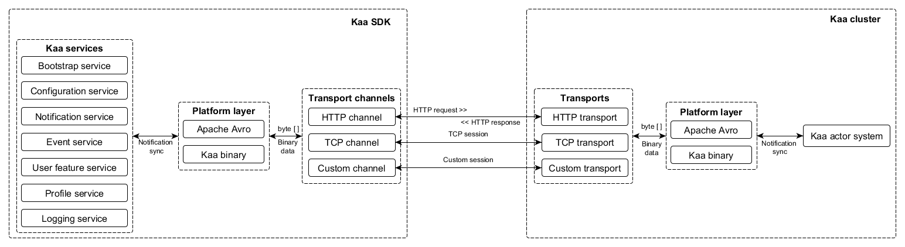

* [Transports](#transports)
  * [Kaa services and data transfer](#kaa-services-and-data-transfer)
  * [Assigning channels to services](#assigning-channels-to-services)
  * [Default transport channels](#default-transport-channels)
  * [Default transports](#default-transports)
* [Creating custom transport](#creating-custom-transport)
  * [Transport configuration schema](#transport-configuration-schema)
  * [Transport descriptor implementation](#transport-descriptor-implementation)
  * [Transport implementation](#transport-implementation)
  * [Transport provisioning](#transport-provisioning)
* [Creating custom transport channel](#creating-custom-transport-channel)
  * [Implement the KaaDataChannel interface (Java client)](#implement-the-kaadatachannel-interface-java-client)
    * [Register your own channel using the Kaa Channel Manager](#register-your-own-channel-using-the-kaa-channel-manager)
    * [Step 1 - Get an instance of KaaDataMultiplexer ](#step-1---get-an-instance-of-kaadatamultiplexer)
    * [Step 2 - Prepare a request collecting information from the services](#step-2---prepare-a-request-collecting-information-from-the-services)
    * [Step 3 - Send the prepared request to the server and receive a response](#step-3---send-the-prepared-request-to-the-server-and-receive-a-response)
    * [Step 4 - Get an instance of KaaDataDemultiplexer ](#step-4---get-an-instance-of-kaadatademultiplexer)
    * [Step 5 - Push a response to the Kaa SDK](#step-5---push-a-response-to-the-kaa-sdk)


## Transports

One size does not fit all. Depending on the project, data transport requirements may vary drastically. The transport protocol reliability, security, data consumption, transport delay, computational complexity, energy budget, and many other criteria have to be factored in when considering how to establish effective communication between the server and endpoints.

This is why Kaa is designed to support virtually any data transport protocols. Moreover, Kaa allows developers to use different transport protocols for different actions performed over the same endpoint. For example, notifications can be delivered as SMS messages, whereas configuration and profile data - as TCP traffic. This ability is achieved by the abstract implementation of transport layer so that the Operations server can use any specific transport method when establishing a transport channel. Each channel supports a specific transport protocol and is responsible for data encoding, compression, and delivery.

Kaa provides default transport channel implementations for all its services. However, developers can create custom implementations of transport channels for any of the Kaa services and thus override the default data channels. Both the endpoint and the Operations server are able to differentiate between the transport channel instances and select an appropriate channel for sending data during a specific session based on predefined rules.



### Kaa services and data transfer

Each of the Kaa services is responsible for specific data exchange functionality, as follows:

* The Bootstrap service supplies endpoint with a list of currently available Operation servers.
* The [Configuration]() service supplies endpoints with the configuration schema and configuration data.
* The [Notifications]() service delivers notifications from the server to endpoints.
* The [Events]() service handles the messages exchanged between endpoints.
* The User Feature service registers a new user and adds new endpoints to the server.
* The [Logging]() service sends recorded data (logs) from endpoints to the server.
* The [Profile]() service updates the endpoint profile on the server side.

### Assigning channels to services

There are two methods of assigning a transport channel to a service. The first is to assign a separate transport channel to each service. The other method is to group all or some of the services and assign them a common transport channel. However, it is important to remember that one channel can maintain only one open session at a time.

Each transport channel is capable of transferring data in one of the following modes.

* From the endpoint to the server (upstream)
* From the server to the endpoint (downstream)
* Both ways (bi-directional)

In case there are several upstream channels created for some service, Kaa uses the most recent channel. For example, let's assume that in addition to a channel that works upstream for three services (configuration, notification, and events), a new channel was created and registered to work upstream for one of those services (let's say, notification). As a result, the notification service will communicate upstream through the second channel only. 

However, Kaa can use multiple transport channels in the downstream mode for the same service. Moreover, if the channel which is currently in use for upstream communication supports the downstream mode for the same service, the server assigns that channel to participate in downstream communication as well.

### Default transport channels

Kaa provides four default transport channels that cover data exchange needs of all the Kaa SDK services. Each channel is characterized by the transport protocol, server type, transfer mode (upstream, downstream, or bi-directional), and one or multiple services. The default channels available together with Kaa are as follows:

| Channel name                | Target server | Services             | Supported modes                                                                                                   | Based on           |
| --------------------------- | ------------- | -------------------- | ----------------------------------------------------------------------------------------------------------------- | ------------------ |
| Default bootstrap           | Bootstrap     | Bootstrap            | Bi-directional                                                                                                    | HTTP 1.1           |
| Default operation long poll | Operations    | All except bootstrap | Bi-directional for profiling, configuration, notifications, and user association. Downstream for events and logs. | HTTP 1.1 long poll |
| Default operation HTTP      | Operations    | Events, logging      | Upstream for events and logs.                                                                                     | HTTP 1.1           |
| Default KaaTCP channel      | Operations    | All except bootstrap | Bi-directional                                                                                                    | MQTT v3.1          |

<br/>If a custom channel was created to work upstream for some service, Kaa will always use the custom channel for that service, because the custom channel is always more recent than the default channel.

### Default transports

Kaa provides 2 default transports that cover data exchange needs of all the Kaa cluster services. The default transports available together with Kaa are as follows:

| Transport name | Default bootstrap port | Default operations port | Supported services | Based on |
| HTTP           | 9889                   | 9999                    | All                | HTTP 1.1 |
| Kaa TCP        | 9888                   | 9997                    | All                | TCP      |

---

## Creating custom transport

To implement a custom transport, you need to complete the following steps.

1. Design and compile a configuration schema.
2. Implement the [TransportConfig](https://github.com/kaaproject/kaa/blob/master/server/common/transport-shared/src/main/java/org/kaaproject/kaa/server/transport/TransportConfig.java) interface.
3. Implement [Transport](https://github.com/kaaproject/kaa/blob/master/server/common/transport-shared/src/main/java/org/kaaproject/kaa/server/transport/Transport.java).
4. Provision the transport in a Bootstrap server and/or an Operations server.

We recommend that you use one of the existing [transport implementations](https://github.com/kaaproject/kaa/tree/master/server/transports) as a reference and also review the [transports design reference](#transports).

Please note that once a new transport is implemented, you will most likely need to [implement a corresponding transport channel](#creating-custom-transport-channel) for one or multiple endpoint SDK platforms. 

### Transport configuration schema

A_transport configuration schema_ is an Avro compatible schema that defines configuration parameters for the transport. The following parameters in the schema affect Kaa Admin UI layout.

* *minRowCount* - specifies a minimum number of rows in a UI table (If you are using arrays in your schema, you can specify a minimum number of elements in an array with this parameter)
* *displayName* - displays the name of the field on UI
* *displayNames* - displays the name of each enumeration symbol on UI (only for enumeration fields in the schema)
* *default* - displays the default value of the field on UI
* *optional* - defines whether the field on UI is optional or mandatory
* *weight* - defines a relative width of the corresponding column on UI (only for arrays in the schema)

The following example illustrates a simple transport configuration schema with two fields (host and port).

```json
{  
    "namespace":"org.kaaproject.kaa.server.transport.custom.config",
    "type":"record",
    "name":"CustomConfig",
    "fields":[  
        {  
            "name":"host",
            "type":"string"
        },
        {  
            "name":"port",
            "type":"int"
        }
    ]
}
```

Once you have prepared your schema, you can compile it using the following command.

```bash
java -jar /path/to/avro-tools-1.7.7.jar compile schema <schema file> <destination>
```

For more information, refer to [Compiling the schema](http://avro.apache.org/docs/current/gettingstartedjava.html#Compiling+the+schema). It is also possible to integrate the schema compilation with [avro-maven-plugin](http://avro.apache.org/docs/current/gettingstartedjava.html).

### Transport descriptor implementation

Once you have defined and compiled a transport configuration schema, you can proceed to the implementation of a transport descriptor.

A transport descriptor should implement the [TransportConfig](https://github.com/kaaproject/kaa/blob/master/server/common/transport-shared/src/main/java/org/kaaproject/kaa/server/transport/TransportConfig.java) interface and be annotated with the [KaaTransportConfig](https://github.com/kaaproject/kaa/blob/master/server/common/transport-shared/src/main/java/org/kaaproject/kaa/server/transport/KaaTransportConfig.java) annotation for the provisioning purposes.

> **Note:** all transport descriptors should be inside the ```org.kaaproject.kaa.server.transport``` package or its subpackages.

The following example illustrates a transport descriptor implementation based on the schema defined in the previous section. 

```java
    package org.kaaproject.kaa.server.transport.custom.config;
    import org.apache.avro.Schema;
    import org.kaaproject.kaa.server.common.zk.ServerNameUtil;
    import org.kaaproject.kaa.server.transport.KaaTransportConfig;
    import org.kaaproject.kaa.server.transport.Transport;
    import org.kaaproject.kaa.server.transport.TransportConfig;
    import org.kaaproject.kaa.server.transport.TransportService;
     
    /**
     * Configuration for the custom transport
     */
    @KaaTransportConfig
    public class CustomTransportConfig implements TransportConfig {
     
        private static final String CUSTOM_TRANSPORT_NAME = "org.kaaproject.kaa.server.transport.tcp";
        private static final int CUSTOM_TRANSPORT_ID = ServerNameUtil.crc32(CUSTOM_TRANSPORT_NAME);
        private static final String CUSTOM_TRANSPORT_CLASS = "org.kaaproject.kaa.server.transports.tcp.transport.TcpTransport";
        private static final String CUSTOM_TRANSPORT_CONFIG = "custom-transport.config";
     
        public CustomTransportConfig() {
            super();
        }
     
        /**
         * Returns the transport id. The transport id must be unique.
         * 
         * @return the transport id
         */
        @Override
        public int getId() {
            return CUSTOM_TRANSPORT_ID;
        }
     
        /**
         * Returns the transport name. There is no strict rule for this
         * name to be unique.
         * 
         * @return the transport name
         */
        @Override
        public String getName() {
            return CUSTOM_TRANSPORT_NAME;
        }
     
        /**
         * Returns the class name of the {@link Transport} implementation.
         * 
         * @return the class name of the {@link Transport} implementation
         */
        @Override
        public String getTransportClass() {
            return CUSTOM_TRANSPORT_CLASS;
        }
     
        /**
         * Returns the avro schema of the {@link Transport} configuration.
         * 
         * @return the avro schema of the {@link Transport} configuration
         */
        @Override
        public Schema getConfigSchema() {
            return CustomConfig.getClassSchema();
        }
     
        /**
         * Returns the configuration file name. This configuration file may
         * be used by {@link TransportService} to initialize and configure
         * the corresponding {@link Transport}.
         * 
         * @return the configuration file name
         */
        @Override
        public String getConfigFileName() {
            return CUSTOM_TRANSPORT_CONFIG;
        }
    }
```

### Transport implementation

All transport implementations should implement the [Transport](https://github.com/kaaproject/kaa/blob/master/server/common/transport-shared/src/main/java/org/kaaproject/kaa/server/transport/Transport.java) interface. We recommend extending [AbstractKaaTransport](https://github.com/kaaproject/kaa/blob/master/server/common/transport-shared/src/main/java/org/kaaproject/kaa/server/transport/AbstractKaaTransport.java) for convenience.

The following example illustrates a transport implementation based on the defined transport configuration schema. 

```java
    package org.kaaproject.kaa.server.transports.tcp.transport;
    import java.nio.ByteBuffer;
    import org.kaaproject.kaa.server.transport.AbstractKaaTransport;
    import org.kaaproject.kaa.server.transport.KaaTransportConfig;
    import org.kaaproject.kaa.server.transport.SpecificTransportContext;
    import org.kaaproject.kaa.server.transport.Transport;
    import org.kaaproject.kaa.server.transport.TransportLifecycleException;
    import org.kaaproject.kaa.server.transport.custom.config.CustomConfig;
     
    public class CustomTransport extends AbstractKaaTransport<CustomConfig>{
     
        /**
         * Initialize a transport instance with a particular configuration and
         * common transport properties that are accessible via the context. The configuration is an Avro
         * object. The serializaion/deserialization is done using the schema specified in
         * {@link KaaTransportConfig}.
         *
         * @param context
         *            the transport initialization context
         * @throws TransportLifecycleException
         */
        @Override
        protected void init(SpecificTransportContext<CustomConfig> context) throws TransportLifecycleException {
            // TODO Auto-generated method stub
        }
     
        /**
         * Retrieves the serialized connection data. This data will be used in an
         * endpoint sdk to set up a connection to this transport instance.
         * Used to provide implementation of {@link Transport#getConnectionInfo()}.
         * 
         * @return the serialized connection data
         */
        @Override
        protected ByteBuffer getSerializedConnectionInfo() {
            // TODO Auto-generated method stub
            return null;
        }
     
        /**
         * Starts a transport instance. This method should block its caller thread
         * until the transport is started. This method should not block its caller
         * thread after the startup sequence is successfully completed.
         */
        @Override
        public void start() {
            // TODO Auto-generated method stub
        }
     
        /**
         * Stops the transport instance. This method should block its current thread
         * until the transport is stopped. The transport may be started again after it is
         * stopped.
         */
        @Override
        public void stop() {
            // TODO Auto-generated method stub
        }
     
        /**
         * Returns a min version of the transport protocol that is supported by this transport.
         * Useful when a single transport instance needs to support multiple versions of the client protocol implementations.
         */
        @Override
        protected int getMinSupportedVersion() {
            // TODO Auto-generated method stub
            return 1;
        }
     
        /**
         * Returns a max version of the transport protocol that is supported by this transport.
         * Useful when a single transport instance needs to support multiple versions of the client protocol implementations.
         */
        @Override
        protected int getMaxSupportedVersion() {
            // TODO Auto-generated method stub
            return 1;
        }
     
        @Override
        public Class<CustomConfig> getConfigurationClass() {
            // TODO Auto-generated method stub
            return CustomConfig.class;
        }
    }
```

### Transport provisioning

To provision the implemented transport, you need to put all the transport related classes into the classpath of the server. Also, you need to make sure that the transport configuration file is present in the classpath and its schema and name match appropriate parameters from your transport descriptor.

The following example illustrates the configuration file contents that match our transport. This file should be named ```custom-transport.config```.

```bash
{
"host":"${transport.bindInterface}",
"port":9997
}
```

> **Note:** you can use transport configuration variables from the ```operations-server.properties``` or ```bootstrap-server.properties``` files; these variables must have the ```transport``` prefix.

---

## Creating custom transport channel

To create your own channel using the Kaa SDK you have to implement the KaaDataChannel interface and register the implementation using the Kaa Channel Manager.

### Implement the KaaDataChannel interface (Java client)

The implementation of the KaaDataChannel interface will contain methods that you will use to transfer data between endpoints and Servers using the protocol of your choice.

For a definition of the KaaDataChannel interface please refer to the [javadoc](http://kaaproject.github.io/kaa/doc/client-java-core/latest/org/kaaproject/kaa/client/channel/KaaDataChannel.html).

You can find examples of the interface implementation in the following java classes for the default transport channels:

1. DefaultOperationsChannel  - implementation of the Operation HTTP Long poll channel;
2. DefaultOperationHttpChannel - implementation of the Operation HTTP channel;
3. DefaultBootstrapChannel - implementation of the Bootstrap HTTP channel;
4. DefaultOperationTcpChannel - implementation of the Operation [Kaatcp]() channel.  
  

### Register your own channel using the Kaa Channel Manager

When the implementation of your channel is ready you should add the channel to Channel Manager by invoking the addChannel() method as follows:

<ul class="nav nav-tabs">
  <li class="active"><a data-toggle="tab" href="#java">Java</a></li>
  <li><a data-toggle="tab" href="#cpp">C++</a></li>
  <li><a data-toggle="tab" href="#pure_c">C</a></li>
  <li><a data-toggle="tab" href="#obj_c">Objective-C</a></li>
</ul>

<div class="tab-content">
<div id="java" class="tab-pane fade in active" markdown="1" ><br/>

```java
    KaaClient kaaClient = ...;
    KaaDataChannel myChannel;
    kaaClient.getChannelManager().addChannel(myChannel);
```

</div><div id="cpp" class="tab-pane fade" markdown="1" ><br/>

```c_cpp
    IDataChannelPtr myChannel;
    Kaa::getKaaClient().getChannelManager().addChannel(myChannel);
```

</div><div id="pure_c" class="tab-pane fade" markdown="1" ><br/>

```c_cpp
    kaa_context_t kaa_context;
    /* Assume Kaa SDK is already initialized */
    kaa_error_t error_code = kaa_channel_manager_add_transport_channel(kaa_context.channel_manager
    			                                                     , channel
    			                                                     , NULL);
    /* Check error code */
```

</div><div id="obj_c" class="tab-pane fade" markdown="1" ><br/>

```c_cpp
    id<KaaClient> kaaClient = ...;
    id<KaaDataChannel> myChannel;
    [[kaaClient getChannelManager] addChannel:myChannel];
```

</div><br/></div>

Now Kaa SDK knows about your channel and will use it to send service data according to the channel settings.

Notice that in java sdk, after adding new data channel multiplexer and demultiplexer will be setted regarding to channel server type.

To send a request to the server and get a response please follow the steps described blow.

### Step 1 - Get an instance of KaaDataMultiplexer 

To prepare a request to the server, you have to use a data multiplexer that combines and serializes requests from different Kaa services.

Kaa provides two data multiplexers. One should be used for communication with the Operations server and the other for communication with the Bootstrap server.

To get an instance of [KaaDataMultiplexer](http://kaaproject.github.io/kaa/doc/client-java-core/latest/org/kaaproject/kaa/client/channel/KaaDataMultiplexer.html) for communication with the Operation server, use the getOperationMultiplexer() method:

<ul class="nav nav-tabs">
  <li class="active"><a data-toggle="tab" href="#cpp1">C++</a></li>
</ul>

<div class="tab-content">
<div id="cpp1" class="tab-pane fade in active" markdown="1" ><br/>

```c_cpp
    Kaa::getKaaClient().getOperationMultiplexer();
```

</div><br/></div>

To get an instance of KaaDataMultiplexer for communication with the Bootstrap server, use the getBootstrapMultiplexer() method:

<ul class="nav nav-tabs">
  <li class="active"><a data-toggle="tab" href="#cpp2">C++</a></li>
</ul>

<div class="tab-content">
<div id="cpp2" class="tab-pane fade in active" markdown="1" ><br/>

```c_cpp
    Kaa::getKaaClient().getBootstrapMultiplexer();
```

</div><br/></div>


### Step 2 - Prepare a request collecting information from the services

In order to create a request to be sent to the server you have to collect data from Kaa services. Collecting data is performed using the KaaDataMultiplexer interface obtained in the previous step.

The KaaDataMultiplexer interface has only one method: compileRequest ()

<ul class="nav nav-tabs">
  <li class="active"><a data-toggle="tab" href="#java3">Java</a></li>
  <li><a data-toggle="tab" href="#cpp3">C++</a></li>
  <li><a data-toggle="tab" href="#obj_c3">Objective-C</a></li>
</ul>

<div class="tab-content">
<div id="java3" class="tab-pane fade in active" markdown="1" ><br/>

```java
    byte [] compileRequest(Map<TransportType, ChannelDirection> types) throws Exception;
```

</div><div id="cpp3" class="tab-pane fade" markdown="1" ><br/>

```c_cpp
    virtual std::vector<boost::uint8_t> compileRequest(const std::map<TransportType, ChannelDirection>& transportTypes) = 0;
```

</div><div id="obj_c3" class="tab-pane fade" markdown="1" ><br/>

```c_cpp
    - (NSData *)compileRequestForTypes:(NSDictionary *)types;
```

</div><br/></div>

where **types** is a map of Kaa services and their data exchange directions that are supported by your channel. 

For example, if you have implemented a channel with the following settings:

* The channel is able to send events, but cannot receive events
* The channel is able to receive notifications, but cannot send notification requests
* The channel supports the Configuration service in both directions.

then your **types** map will look as follows:

<ul class="nav nav-tabs">
  <li class="active"><a data-toggle="tab" href="#java4">Java</a></li>
  <li><a data-toggle="tab" href="#cpp4">C++</a></li>
  <li><a data-toggle="tab" href="#obj_c4">Objective-C</a></li>
</ul>

<div class="tab-content">
<div id="java4" class="tab-pane fade in active" markdown="1" ><br/>

```java
    Map<TransportType, ChannelDirection> types = new HashMap<TransportType, ChannelDirection>();
    types.put(TransportType.CONFIGURATION, ChannelDirection.BIDIRECTIONAL);
    types.put(TransportType.NOTIFICATION, ChannelDirection.DOWN);
    types.put(TransportType.EVENT, ChannelDirection.UP);
```

</div><div id="cpp4" class="tab-pane fade" markdown="1" ><br/>

```c_cpp
    std::map<TransportType, ChannelDirection> types =
    {
        { TransportType::CONFIGURATION, ChannelDirection::BIDIRECTIONAL },
        { TransportType::NOTIFICATION, ChannelDirection::DOWN },
        { TransportType::EVENT, ChannelDirection::UP }
    };
```

</div><div id="obj_c4" class="tab-pane fade" markdown="1" ><br/>

```c_cpp
    NSDictionary *types = @{
    	@(TRANSPORT_TYPE_CONFIGURATION) : @(CHANNEL_DIRECTION_BIDIRECTIONAL),
        @(TRANSPORT_TYPE_NOTIFICATION)  : @(CHANNEL_DIRECTION_DOWN),
        @(TRANSPORT_TYPE_EVENT)         : @(CHANNEL_DIRECTION_UP)
    };
```

</div><br/></div>

The method scans the services and collects data from those that have prepared data to be sent to the server. The method uses the **types** map to filter requests from the services. (For example, if for a Transport Type the "DOWN" direction is indicated in the type map, the request data from the respective service will be filtered out and will not be sent to the server.)

The data collected from the services is combined into the SyncRequest and serialized. As a result, the method returns a byte array with serialized data.

### Step 3 - Send the prepared request to the server and receive a response

Insert the data returned  by compileRequest into your transfer protocol and send it to the server. This step is performed using the methods that are in the implemented KaaDataChannel interface.

The response  is received as a byte array, and it contains serialized responses for all the services from which requests were sent.

### Step 4 - Get an instance of KaaDataDemultiplexer 

To de-serialize the received response and provide a response to each service, you have to use a data demultiplexer.

Kaa provides two data demultiplexers. One should be used for communication with the Operations server and the other for communication with the Bootstrap server.

To get an instance of [KaaDataDemultiplexer](http://kaaproject.github.io/kaa/doc/client-java-core/latest/org/kaaproject/kaa/client/channel/KaaDataDemultiplexer.html) for communication with the Operation server, use the getOperationDemultiplexer() method:

<ul class="nav nav-tabs">
  <li class="active"><a data-toggle="tab" href="#cpp5">C++</a></li>
</ul>

<div class="tab-content">
<div id="cpp5" class="tab-pane fade in active" markdown="1" ><br/>

```c_cpp
    Kaa::getKaaClient().getOperationDemultiplexer();
```

</div><br/></div>

To get an instance of KaaDataDemultiplexer for communication with the Bootstrap server, use the getBootstrapDemultiplexer() method:

<ul class="nav nav-tabs">
  <li class="active"><a data-toggle="tab" href="#cpp5">C++</a></li>
</ul>

<div class="tab-content">
<div id="cpp5" class="tab-pane fade in active" markdown="1" ><br/>

```c_cpp
    Kaa::getKaaClient().getBootstrapDemultiplexer();
```

</div><br/></div>

### Step 5 - Push a response to the Kaa SDK

The data demultiplexer contains only one method

[void processResponse(byte \[\] response)](http://kaaproject.github.io/kaa/doc/client-java-core/latest/org/kaaproject/kaa/client/channel/KaaDataDemultiplexer.html)

The method deserializes the response and decodes the raw data into SyncResponse which consists of subresponses for all services. Then the subresponses are delivered to each service for subsequent processing.

---
