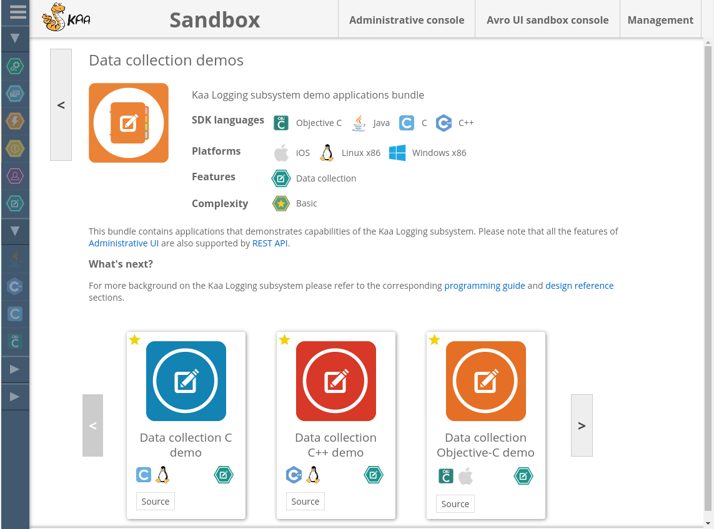


 /{{root_url[1]}}/{{root_url[2]}}/

* TOC
{:toc}

This section provides guidance on how to set up Sandbox and run your first Kaa application that will work with the Kaa platform.

# Kaa Sandbox

Kaa Sandbox is a private Kaa environment which includes demo client applications. 
Sandbox includes all necessary Kaa components in a convenient virtual environment that can be set up in just 5 minutes! 
With the use of Kaa Sandbox, anyone can learn Kaa, build a proof of concept and test their own applications locally.

## Video tutorial

<p align="center">
  <iframe width="800" height="500" src="https://www.youtube.com/embed/ynbxcRdgXFU">
  </iframe>
</p>

## Installation Sandbox

Kaa Sandbox is presented as a stand-alone virtual machine.

### System requirements

To use Kaa Sandbox, your system must meet the following minimum system requirements.

- 64-bit OS
- 4GB RAM
- Virtualization enabled in BIOS

### Installation steps

You can either install Kaa Sandbox or run it on Amazon EC2.

<ul class="nav nav-tabs">
  <li class="active"><a data-toggle="tab" href="#VirtualBox">VirtualBox</a></li>
  <li><a data-toggle="tab" href="#Amazon">Amazon</a></li>
</ul>

<div class="tab-content">

<div id="VirtualBox" class="tab-pane fade in active" markdown="1">

<br>

To install Kaa Sandbox, perform the following steps:

1. Install the virtualization environment. 
The current version of Kaa Sandbox supports [Oracle VirtualBox 4.2+](https://www.virtualbox.org/wiki/Downloads) which is available as a free download.

2. Download the Sandbox image from [Kaa download page](http://www.kaaproject.org/download-kaa/).

3. Import the Sandbox image using this [guide](https://www.virtualbox.org/manual/ch01.html#ovf).

<br>

</div><div id="Amazon" class="tab-pane fade" markdown="1">

<br>

To launch the Kaa sanbox on Amazon Elastic Compute Cloud (Amazon EC2), go through the following steps.

1. Launch the AMI using the links in the following table:

   Amazon EC2 offers a number of [geographic regions](http://docs.aws.amazon.com/AWSEC2/latest/UserGuide/using-regions-availability-zones.html) for launching the AMI. Factors for choosing a region include: reduce latency, cost, or regulatory requirements.

   To launch an AMI for a specific region, please use the [download](http://www.kaaproject.org/download-kaa/) page.

2. On **Choose an Instance Type** step, choose the appropriate instance type. For optimal performance we recommended that you use at least _m3.large_ instance type, or more powerful.

3. On **Configure Instance Details** step, change values in the fields as appropriate or leave default values.

4. On **Add Storage** step, add additional volumes as appropriate.

   The number of instance store devices available on the machine depends on the instance type. EBS volumes are not recommended for the database storage.

5. On **Tag Instance** step, give a name to your instance, for example, `kaa-sandbox-0.10.0`.

6. On **Configure Security Group** step, select one of the following options.

   * Create a new security group with the inbound open ports:

      | Protocol | Port | RangeSource|
      |----------|------|------------|
      | TCP      | 22   | 0.0.0.0/0  |
      | TCP      | 8080 | 0.0.0.0/0  |
      | TCP      | 9999 | 0.0.0.0/0  |
      | TCP      | 9998 | 0.0.0.0/0  |
      | TCP      | 9997 | 0.0.0.0/0  |
      | TCP      | 9889 | 0.0.0.0/0  |
      | TCP      | 9888 | 0.0.0.0/0  |
      | TCP      | 9887 | 0.0.0.0/0  |
      | TCP      | 9080 | 0.0.0.0/0  |

   * Select the created security group.

7. On **Review Instance Launch** step, make any changes as appropriate.

8. Click **Launch** and then in the **Select an existing key pair** or **Create a new key pair** dialog, do one of the following:

   * Select an existing key pair from the **Select a key pair** drop list.

   * If you need to create a new key pair, click **Create a new key pair**. Then create the new key pair as described in [Creating a key pair](http://docs.aws.amazon.com/gettingstarted/latest/wah/getting-started-prereq.html).

9. Click **Launch Instances**. The **Launch Status** page will be displayed.

10. Click **View Instances**.

11. After launching Kaa Sandbox instance, go to **<your\_instance\_public\_dns\>:9080/sandbox** or **<your\_instance\_public\_ip\>:9080/sandbox** URL. Public DNS or IP of your instance are available from your instance description.

<br>

</div></div>


## Kaa Sandbox web UI

Kaa Sandbox web UI provides you with access to Kaa demo projects and some basic Kaa Sandbox configuration capabilities. Once Kaa Sandbox is installed and opened, the web UI is available at the following URL (by default): <http://127.0.0.1:9080/sandbox>.

### Demo projects

You can download both source and binary distributions for each demo project. A downloaded binary already contains Kaa SDK that targets current Kaa Sandbox. 
Thus, if you successfully configure the [networking](#networking) for your SDK, the downloaded application will be able to access it and will work correctly.

<br>

<p align="center">
  
</p>

## Admin UI

You can access Admin UI by clicking **Administrative console** at the top of the window. Refer to the [Admin UI guide]({{root_url}}Administration-guide/Tenants-and-applications-management) for working instructions.

> **NOTE:** Kaa Sandbox provides default credentials for all three types of Kaa users, as follows:
>
> * Kaa admin - kaa/kaa123
> * Tenant admin - admin/admin123
> * Tenant developer - devuser/devuser123

## Avro UI

<!-- TODO: update link on Avro UI guide -->
You can access Avro UI by clicking **Avro UI sandbox console** at the top of the window. 
Refer to the [Avro UI guide](#) for working instructions.

## Configuration

### Outgoing mail settings

Outgoing mail settings are used to send emails to newly created users with the information about their passwords, as well as other notifications. 
By default, outgoing mail settings are not configured for Admin UI. 
To target Admin UI to your SMTP server refer to the [Admin UI guide]({{root_url}}Administration-guide/Tenants-and-applications-management).

### Networking

By default, Kaa Sandbox components are accessible from a host machine only. But if you want to share Kaa Sandbox in the local network you need to reconfigure the network interface for this virtual machine in [Bridge mode](https://www.virtualbox.org/manual/ch06.html#network_bridged). 
Once the virtual box is available to devices on your local/test network, you need to change Sandbox host/IP on [web UI](#kaa-sandbox-web-ui) or execute the script on Sandbox.

<ul class="nav nav-tabs">
  <li class="active"><a data-toggle="tab" href="#Sandbox-web-ui">Sandbox web UI</a></li>
  <li><a data-toggle="tab" href="#Console">Console</a></li>
</ul>

<div class="tab-content">

<div id="Sandbox-web-ui" class="tab-pane fade in active" markdown="1">

<br>

Go to Kaa Sandbox web UI and in a upper right corner select "Management" menu item. Input new host/IP and click the "Update" button in the "Kaa host/IP" section.

<br>

<p align="center">
  
</p>

</div><div id="Console" class="tab-pane fade" markdown="1">

<br>

Paste next line in Sandbox terminal:

```sh
sudo /usr/lib/kaa-sandbox/bin/change_kaa_host.sh <new host/ip>
```

<br>

</div></div>

# Launching your first Kaa application

So let's run your first Kaa aplication. Navigate to Demo projects page and select **Data collection demos** application bundle.

<br>

<p align="center">
  
</p>

<br>

Than select application for your platform, download sources or binaries and follow instructions provided in application description.

<br>

<p align="center">
  
</p>

<br>

# Next steps

After you get acquainted with Kaa Sandbox and its demo applications, you can take one step further: install Kaa into your environment and create your own Kaa applications! 
We will give you [something to start with]({{root_url}}Programming-guide/Your-first-Kaa-application). 
Kaa installation is available in the single node mode or in the distributed mode, as described in the [Installation guide]({{root_url}}Administration-guide/System-installation).

# Troubleshooting

Common issues covered in this [guide]({{root_url}}Administration-guide/Troubleshooting/).

Please take into account the following known issues and limitations of Kaa Sandbox.

* Without the SMTP server configured, you will not be able to create new users. 
See the [Outgoing mail settings section](#outgoing-mail-settings) for more details.

# Further reading

Use the following guides and references to make the most of Kaa.

| Guide | What it is for |
|-------|----------------|
| **[Key platform features]({{root_url}}Programming-guide/Key-platform-features/)** | Use this reference to learn about features and capabilities of Kaa ([Endpoint profiles]({{root_url}}Programming-guide/Key-platform-features/Endpoint-profiles/), [Events]({{root_url}}Programming-guide/Key-platform-features/Events/), [Notifications]({{root_url}}Programming-guide/Key-platform-features/Notifications/), [Logging]({{root_url}}Programming-guide/Key-platform-features/Data-collection/), and other features). |
| **[Installation guide]({{root_url}}Administration-guide/System-installation)** | Use this guide to install and configure Kaa either on a single Linux node or in a cluster environment. |
| **[Contribute To Kaa]({{root_url}}Customization-guide/How-to-contribute/)** | Use this guide to learn how to contribute to Kaa project and which code/documentation style conventions we adhere to. |

---
