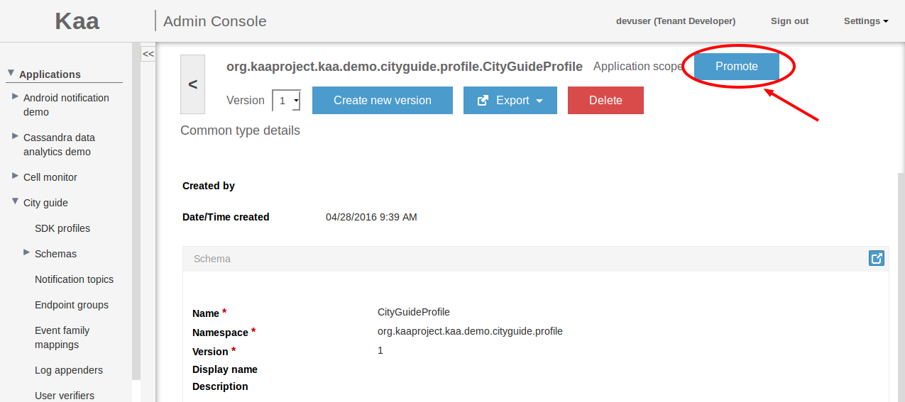
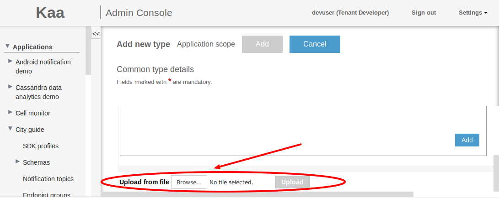



* TOC
{:toc}

The *Common Type Library (CTL)* is a repository of reusable data type schemas that can be referenced and reused as the user creates specific schema definitions for Kaa modules.
The *Common Type (CT)* is a unit of CTL which represents set of *data type schema versions (CT schemas)*.
This capability unifies management of all schemas in a Kaa server instance.

# CT types definitions and FQNs

CT is identified by FQN (Fully Qualified Name).
FQN is combination of namespace and name attributes defined in root avro record of CT schema according to [Names in Avro  Schema Declaration](http://avro.apache.org/docs/current/spec.html#names).
Each CT contains set of CT schemas with the same FQN and different versions.
CT schema is identified by FQN and version which is unique across the CT.
CT schema becomes unmodifiable after creation and only can be deleted.

# CT schema versioning and dependencies

The version must be explicitly defined in the CT schema as shown below. 
An attempt to load a CT schema with no version will result in an error. 
Similarly, an attempt to load CT schema with the already used version will result in an error. 

```json
{
    "type":"record",
    "name":"SampleCT",
    "namespace":"org.kaaproject.sample",
    "version":1,
    "dependencies":[
        {
            "fqn":"org.kaaproject.sample.ReferencedCT",
            "version":2
        }
    ],
    "fields":[
        ...
    ]
}
```

The CTL user interface automatically suggests the next available version (max loaded + 1) for a given FQN when creating a new CT schema.
CT schema can have dependencies on other CT schemas.
CT schema dependencies defined as an array of FQN-version combinations (identifiers of referenced CT schemas, see org.kaaproject.sample.ReferencedCT in the example above).
Deleting CT schema is only permitted if its FQN-version combination is not referenced in any other CT schemas.
Cyclic dependencies are not permitted.
(Thus, CT schemas are nodes in a directed acyclic graph of dependencies.)

# CT scopes and visibility

CTs can be defined within *scopes*: SYSTEM, TENANT, and APPLICATION.
Scopes impact the visibility of CTs: for example, a CT defined with the application scope in App A is not visible for App B.
FQNs cannot conflict in any given scope.
An attempt to create a new CT with a conflicting FQN will result in an error.
Creating different CTs with matching FQNs within different applications of the same tenant is permitted, even though not advised.
Prior to creating such a CT, a warning message will be displayed to the user in the Administration UI.
The expected outcomes of an attempt to create a CT with a non-unique FQN are summarized in the following table.


CT scope | System | Tenant | Application
--- | --- | --- | ---
Matching FQN at System level | error unless the version is unique | error | error
Matching FQN at Tenant level | error | error unless the version is unique | error
Matching FQN in a different Tenant | N/A | OK | OK
Matching FQN at Application level | error | error | error unless the version is unique
Matching FQN in a different Application of the same Tenant | N/A | N/A | warning in web UI; OK at services level

# CT management

CTs can be managed via [REST API]({{root_url}}Programming-guide/Server-REST-APIs/#/Common_Type_Library) or via Administration UI.

## Get CTs list

* As Kaa admin you can get list of available System CTs via [REST API]({{root_url}}Programming-guide/Server-REST-APIs/#!/Common_Type_Library/getSystemLevelCTLSchemas) call or by opening **System CTL** window from Administration UI.
An example of **System CTL** window is shown below.

* As Tenant admin you can get list of available Tenant CTs and System CTs via [REST API]({{root_url}}Programming-guide/Server-REST-APIs/#!/Common_Type_Library/getTenantLevelCTLSchemas) call or by opening **Tenant CTL** window from Administration UI.
The **Tenant CTL** window is similar to the System CTL window except it has ability to display/hide System CTs by checking/unchecking **Display higher scopes** checkbox.
* As Tenant developer you can get list of available Tenant CTs and System CTs in the same way as Tenant admin.
In addition Tenant developer can get list of available Application CTs via [REST API]({{root_url}}Programming-guide/Server-REST-APIs/#!/Common_Type_Library/getApplicationLevelCTLSchemasByAppToken) call or by opening **Application CTL** window from Administration UI. 
The **Application CTL** window is similar to the Tenant CTL window except it has ability to display/hide System and Tenant CTs by checking/unchecking **Display higher scopes** checkbox.

## Create new CT

New CT can be created via [REST API]({{root_url}}Programming-guide/Server-REST-APIs/#!/Common_Type_Library/saveCTLSchemaWithAppToken) call or by clicking **Add new type** in corresponding CTL window from Administration UI.

> **NOTE:** The Kaa admin can add new System CTs.
The Tenant admin can add new Tenant CTs.
The Tenant developer can add new Application CTs. 

In **Add new type** window fill in all the required fields and click **Add** to apply the changes.
Below is shown an example of **Add new type** window for Tenant CT.

There is also ability to create a new version of CT by clicking **Create new version** at the top of **CT details** window which is described in the next chapter.

## Get or view CT details

CT details can be obtained via [REST API]({{root_url}}Programming-guide/Server-REST-APIs/#!/Common_Type_Library/getCTLSchemaById) call or can be viewed in **CT details** window of Administration UI.
To open CT details click the row of the CTs list in corresponding CTL window.
Below is shown an example of **CT details** window for Application CT.

To view another version of the CT, click on the version drop-down and select the appropriate version.

## Delete CT schema

CT schema can be deleted via [REST API]({{root_url}}Programming-guide/Server-REST-APIs/#!/Common_Type_Library/deleteCTLSchemaByFqnVersionTenantIdAndApplicationToken) call or from **CT details** window of Administration UI.
To delete CT schema open **CT details** and click **Delete** button located in the top of the window.

> **NOTE:** The Kaa admin can delete System CT schema.
The Tenant admin can delete Tenant CT schema.
The Tenant developer can delete Application CT schema. 

## CT promotion

Users are able to promote the CT's scope from APPLICATION to TENANT, provided that there is no other CT with the identical FQN within the given tenant, and that they have a permission to do so.
Otherwise an appropriate error will be returned.
Promotion procedure updates scope of CT including all its versions.
Promotion of CT can be performed in two ways: via [REST API]({{root_url}}Programming-guide/Server-REST-APIs/#!/Common_Type_Library/promoteScopeToTenant) call or by clicking **Promote** in the **Application CTL** window of Administration UI as shown below.


## CT schema import and export

The import of CT schema can be done in two ways: 

* Perform [REST API]({{root_url}}Programming-guide/Server-REST-APIs/#!/Common_Type_Library/saveCTLSchemaWithAppToken) call. 
* Add new CT in Administration UI and upload schema json file as shown below.


There are four ways of CT schema export:

* "**shallow**" export simply retrieves the given schema as a file.
* "**deep**" export retrieves the given schema as one file, and all of the referenced CTs as a separate file, recursively.
* "**flat**" export will retrieve the given schema as one file with all referenced CTs inline.
* "**library**" export will retrieve the given schema and all referenced CTs as compiled java classes compressed to a java archive file (jar).
This java library provides all necessary java structures according to CT schema including nested types. 
For instance these java structures can be used in external application to serialize binary log records which was produced as a result of data collection.   
   
To export CT schema either use [REST API]({{root_url}}Programming-guide/Server-REST-APIs/#!/Common_Type_Library/exportCTLSchemaByAppToken) call by providing appropriate export method or use export functionality provided by Administration UI.
In **CT details** window click **Export** drop down and select desired export method as shown below.


# Further reading
* [Apache Avro](http://avro.apache.org)
