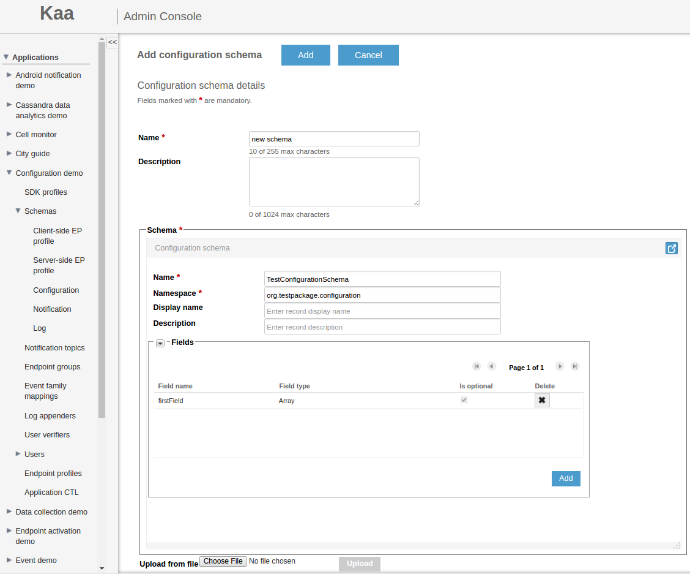


 /{{root_url[1]}}/{{root_url[2]}}/

* TOC
{:toc}

The Kaa Configuration subsystem is responsible for configuring endpoints by supplying them with the structured data of user-defined complexity that is managed
via the Kaa server. The fact that Kaa operates with the uniformly structured data deserves a special emphasis. By knowing the data structure of the
application, Kaa provides a number of very useful features, such as:

* Automatic generation of the data object model in the endpoint SDK
* Automatic generation of the default configuration
* Enforcement of the data integrity
* Endpoint-specific data view that is based on the endpoint membership in endpoint groups

Control service automatically assigns a version number to the schema, once a new configuration schema is loaded into the Kaa application 
generates three corresponding derivative schemas (a [base schema](#base-schema), [override schema](##override-schema), and [protocol schema](#protocol-schema)),
and populates configuration data in the "all" group with the default values.

# Configuration management overview

The structure of the configuration data is determined by the customizable configuration schema, which is created under the application using Administration UI or
[Admin REST API]({{root_url}}Programming-guide/Server-REST-APIs#TODO). It is the responsibility of the Kaa developer to construct the configuration schema
for the application and make the Kaa client interpret the data supplied by the endpoint SDK. The Kaa administrator, in turn, can provision
the configuration schema into the Kaa server and set the configuration data accordingly.


The following image example illustrates how to add configuration schema from Administration UI.



# Configuration schema

A _configuration_ schema is a user-defined specification of the application data model that Kaa Configuration subsystem uses to configure endpoints registered
under the application. In other words, the configuration schema defines in which format the actual configuration data should be entered by the user/developer
and then transferred to the endpoints.

The format of the configuration schema is similar to the [profile schema]({{root_url}}Programming-guide/Key-platform-features/Endpoint-profiles/) and based
on the [Apache Avro schema](http://avro.apache.org/docs/current/spec.html#schemas). The Kaa Configuration subsystem supports all of the Avro primitive types:

* null
* boolean
* int
* long
* float
* double
* bytes
* string

And most of the complex types:

* record
* enum
* array
* union
* fixed

>**NOTE:** <br/>
> The Avro map type (a set of <key, value> pairs) is not currently supported.
It is possible to define an array of unions, but Kaa expects all of the entities to be of the same type.

The following examples illustrate basic constituents of the configuration schema and their usage.

* The root object type in Kaa is always the record.

```json
{
    "name":"rootT",
    "namespace":"org.kaaproject.kaa.schema.sample",
    "type":"record",
    "fields":[
        ...
    ]
}
```

* The **name** and **namespace** attributes are both mandatory for the record type. They are used for the record referencing in derivative schemas.

* The **optional** field attribute (```boolean```, false by default) determines whether or not the field in the record is optional. Internally, Kaa translates
optional fields into union fields with the ```null``` type at the top of the list (which automatically makes them default to ```null``` - see the
[Records auto-generation](#records-auto-generation) section for more details). <br/>
In case of the _optional_ union field, Kaa automatically puts ```null``` at the top of the types list in the union definition.

```json
{
    "name":"rootT",
    "namespace":"org.kaaproject.kaa.schema.sample",
    "type":"record",
    "fields":[
        {
            "name":"optionalBytesField",
            "type":"bytes",
            "optional":true
        },
        {
            "name":"optionalSuit",
            "optional":true,
            "type":{
                "name":"suitT",
                "namespace":"org.kaaproject.kaa.schema.sample",
                "type":"enum",
                "symbols":[
                    "spades",
                    "hearts",
                    "diamonds",
                    "clubs"
                ]
            }
        }
    ]
}
```

* The **by_default** field attribute (the value is interpreted according to the field type; it has no default value) determines the default value for the field
and is used for generation of the default record.

```json
{
    "name":"rootT",
    "namespace":"org.kaaproject.kaa.schema.sample",
    "type":"record",
    "fields":[
        {
            "name":"stringField",
            "type":"string",
            "by_default":"default string value"
        },
        {
            "name":"intField",
            "type":"int",
            "by_default":0
        }
    ]
}
```

The following table specifies the **by_default** attribute format for every supported primitive type.

| Type           | Format                                   |              Example             |
|----------------|:-----------------------------------------|:---------------------------------|
| ```boolean```  | true/false                               | "by_default": true               |
| ```bytes```    | json array of byte values                | "by_default": [1, 2, 55, 254, 4] |
| ```double```   | floating point value                     | "by_default": 1.432              |
| ```float```    | floating point value                     | "by_default": 1.432              |
| ```int```      | numeric value from (-2^31+1) to (2^31-1) | "by_default": 55                 |
| ```long```     | numeric value from (-2^63+1) to (2^63-1) | "by_default": 2147483648         |
| ```string```   | simple string format                     | "by_default": "abcdef"           |

* The [addressable](#addressing) record type field attribute (```boolean```, ```true``` by default) determines whether or not the 
record supports partial updates (override) from different endpoint groups.
If this attribute is ```true```, Kaa automatically adds a UUID field (```__uuid```) to the record when producing
derivative schemas, which is done for the addressing purposes. For this reason, ```__uuid``` is a reserved field name in Kaa.  Note that the root record
 in the configuration schema is always addressable and thus ignores the statement ```_"addressable": false_```.

```json
{
    "name":"rootT",
    "namespace":"org.kaaproject.kaa.schema.sample",
    "type":"record",
    "fields":[
        {
            "name":"nestedRecord",
            "type":{
                "name":"nonAddressableRecordT",
                "namespace":"org.kaaproject.kaa.schema.sample",
                "type":"record",
                "addressable":false,
                "fields":[
                    {
                        "name":"booleanField",
                        "type":"boolean",
                        "by_default":false
                    },
                    {
                        "name":"intField",
                        "type":"int",
                        "by_default":"0"
                    }
                ]
            }
        }
    ]
}
```

* The **overrideStrategy** array type field attribute (```string```, ```"replace"``` by default) determines how to
[merge arrays in the configuration across the endpoint groups](#override-algorithm). Accepted values are ```"replace"``` and ```"append"```.

```json
{
    "name":"rootT",
    "namespace":"org.kaaproject.kaa.schema.sample",
    "type":"record",
    "fields":[
        {
            "name":"nestedRecord",
            "type":{
                "name":"nonAddressableRecordT",
                "namespace":"org.kaaproject.kaa.schema.sample",
                "type":"record",
                "addressable":false,
                "fields":[
                    {
                        "name":"booleanField",
                        "type":"boolean",
                        "by_default":false
                    },
                    {
                        "name":"intField",
                        "type":"int",
                        "by_default":"0"
                    }
                ]
            }
        },
        {
            "name":"arrayAppended",
            "overrideStrategy":"append",
            "type":{
                "type":"array",
                "items":"org.kaaproject.kaa.schema.sample.nonAddressableRecordT"
            }
        },
        {
            "name":"arrayOverride",
            "type":{
                "type":"array",
                "items":"float"
            }
        }
    ]
}
```

# Addressing

A field in Kaa configuration is addressable if the record containing this field is addressable (the **addressable** attribute of the record is ```true```).
Addressable field values can be updated via the group-specific configuration mechanism.

The field address is formed by appending the field name to the containing record address and using the slash (```"/"```) as a separator. The address
of the root record is always ```"/"```.

Consider the following record schema example.

```json
{
    "name":"rootT",
    "namespace":"org.kaaproject.kaa.schema.sample",
    "type":"record",
    "fields":[
        {
            "name":"intField",
            "type":"int",
            "by_default":12345
        },
        {
            "name":"nestedRecord",
            "type":{
                "name":"nestedRecordT",
                "namespace":"org.kaaproject.kaa.schema.sample",
                "type":"record",
                "fields":[
                    {
                        "name":"enumField",
                        "type":{
                            "name":"hashT",
                            "namespace":"org.kaaproject.kaa.schema.sample",
                            "type":"fixed",
                            "size":16
                        }
                    },
                    {
                        "name":"arrayField",
                        "type":{
                            "type":"array",
                            "items":"float"
                        }
                    }
                ]
            }
        },
        {
            "name":"arrayOfRecords",
            "type":{
                "type":"array",
                "items":"org.kaaproject.kaa.schema.sample.nestedRecordT"
            }
        }
    ]
}
```

The following fields are addressable in the provided schema.

* ```/intField```
* ```/nestedRecord```
* ```/nestedRecord/enumField```
* ```/nestedRecord/arrayField```
* ```/arrayOfRecords```

However, the fields within the instances of ```org.kaaproject.kaa.schema.sample.nestedRecordT``` contained in ```/arrayOfRecords``` are not addressable,
because it is not possible to address records within arrays in the current Kaa version.

# Records auto-generation

For every configuration schema, Kaa constructs the default configuration data records. During this process of the default configuration data generation,
each record in the schema is analyzed one-by-one in the depth-first, top-to-bottom order, as follows:

* Union fields assume the first type listed in the union definition. The default value is generated according to the rules specific to the type encountered.
>**NOTE:** <br/>
> Any optional fields (those having attribute ```"optional": true``` in the schema) are in fact unions with the first type being ```null```. Therefore,
optional fields default to the empty value.
* For a field of any primitive type (except for ```null```), Kaa expects the **by_default** attribute to be present and provide the default field value.
A schema missing such an attribute for a mandatory primitive record field generates an exception and gets rejected by Kaa.
* Non-optional record type fields are generated by applying the same record generation algorithm.
* Arrays are generated empty by default.
* Fixed type fields are generated filled in with zeros.
* ```__uuid``` fields of the ```org.kaaproject.configuration.uuidT``` type are generated with a valid UUID assigned to the value sub-field.

Consider the following record schema example.

```json
{
    "name":"rootT",
    "namespace":"org.kaaproject.kaa.schema.sample",
    "type":"record",
    "fields":[
        {
            "name":"unionField",
            "type":[
                "string",
                "int",
                "null"
            ],
            "by_default":"default string value"
        },
        {
            "name":"optionalUnionField",
            "type":[
                "string",
                "int",
                "null"
            ],
            "optional":true
        },
        {
            "name":"optionalBoolean",
            "type":"boolean",
            "optional":true
        },
        {
            "name":"intField",
            "type":"int",
            "by_default":12345
        },
        {
            "name":"mandatoryNestedRecord",
            "type":{
                "name":"nestedRecordT",
                "namespace":"org.kaaproject.kaa.schema.sample",
                "type":"record",
                "fields":[
                    {
                        "name":"enumField",
                        "type":{
                            "name":"suitT",
                            "namespace":"org.kaaproject.kaa.schema.sample",
                            "type":"enum",
                            "symbols":[
                                "spades",
                                "hearts",
                                "diamonds",
                                "clubs"
                            ]
                        }
                    },
                    {
                        "name":"arrayField",
                        "type":{
                            "type":"array",
                            "items":"float"
                        }
                    },
                    {
                        "name":"enumField",
                        "type":{
                            "name":"hashT",
                            "namespace":"org.kaaproject.kaa.schema.sample",
                            "type":"fixed",
                            "size":16
                        }
                    }
                ]
            }
        }
    ]
}
```

This schema would default to the following record.

```json
{
    "unionField":"default string value",
    "optionalUnionField":null,
    "optionalBoolean":null,
    "intField":12345,
    "mandatoryNestedRecord":{
        "enumField":"spades",
        "arrayField":[

        ],
        "enumField":[
            0,
            0,
            0,
            0,
            0,
            0,
            0,
            0,
            0,
            0,
            0,
            0,
            0,
            0,
            0,
            0
        ]
    }
}
```

The Kaa server stores the auto-generated default records in a cache and re-uses them in further operation.

# Schema-specific configuration management

Kaa allows simultaneously updating configuration data for all endpoints under the application which use the same configuration schema. For this purpose,
Kaa uses a _base schema_ which is derived from the configuration schema. The base schema assigns an address to each addressable record from the configuration
schema and in this way enables updating the record values.

For each Kaa application, there is a default "all" endpoint group to which all endpoints registered under the application belong. The "all" group contains
base schemas for all configuration schemas under the application as well as the corresponding default configuration data sets. The "all" group has weight 0.
When a new configuration schema version is loaded into the application, the server automatically creates the corresponding base schema and
default configuration data for the "all" group (by applying the default records generation algorithm described in the previous section to the root record in
the base schema). This configuration data may be changed either via the Web UI or through the integration interface as follows:

* the user retrieves the corresponding base schema
* specifies new configuration data that corresponds to the base schema format
* submits this data to the server.

After the new configuration is submitted, the server overwrites the current configuration data which is stored in the "all" group for the base schema
in question. Finally, Kaa delivers the up-to-date configuration data to all endpoints that support the corresponding configuration schema.

The fact that the "all" group has weight 0 results in the following: if apart from the schema-specific update the user introduces the
[group-specific update](#group-specific-configuration-management) too, any conflicts in values between these two updates will be resolved by giving preference
to the group-specific update (because 0 is the lowest priority value).

## Base schema

The base schema is obtained by transforming the configuration schema, as follows:

* Optional fields are transformed into unions with the ```null``` type at the top of the type list.
* The ```__uuid``` field of the union type ```["org.kaaproject.configuration.uuidT", "null"]``` is added to every record having ```addressable = true```.
In the following example, the ```org.kaaproject.configuration.uuidT``` type is declared in the ```nestedRecordT``` record type, and reused in ```rootT```.

```json
{
    "name": "rootT",
    "namespace": "org.kaaproject.kaa.schema.sample",
    "type": "record",
    "fields": [
        {
            "name": "mandatoryNestedRecord",
            "type": {
                "name": "nestedRecordT",
                "namespace": "org.kaaproject.kaa.schema.sample",
                "type": "record",
                "addressable": false,
                "fields": [
                    {
                        "name": "booleanField",
                        "type": "boolean",
                        "by_default": false
                    },
                    {
                        "name": "__uuid",
                        "type": [
                            {
                                "name": "uuidT",
                                "type": "fixed",
                                "size": 16,
                                "namespace": "org.kaaproject.configuration"
                            },
                            "null"
                        ]
                    }
                ]
            }
        },
        {
            "name": "__uuid",
            "type": [
                "org.kaaproject.configuration.uuidT",
                "null"
            ]
        }
    ]
}
```

## Updating configuration data

The Kaa Control service exposes API for loading configuration data into the "all" group. To introduce the configuration update, the new data set must be
supplied in the Avro binary or Avro JSON format and correspond to the base schema version specified in the API call. As a result, all the endpoints under
the application will assume the new configuration.

The following rules apply during the update:

* When loading the new data set, Kaa persists the existing UUIDs for all [addressable](#addressing) records, thus ignoring the corresponding values supplied
with the new configuration.
* In case of unions that assumes that the record types in the old configuration and in the new configuration match.
If they don't, Kaa generates a new UUID value for the replacement record.
* In case of non-addressable records (those directly or indirectly contained in the arrays), Kaa performs record instances matching by comparing
the UUID values in the old and the new configuration.

## UUID validation

Kaa performs UUID validation to prevent corruption of configuration data when the API user or Kaa administrator loads a new version of the configuration data
to the server. In this case, Kaa inspects the UUIDs of the newly introduced configuration data and validates them against the UUIDs in the previous version
of the configuration data.

UUID validation is performed in the following two cases: updating an existing object or creating a new object.

### Updating an existing object (there is a UUID in the previous version of the configuration)

The following rules apply for the object update.

* If the resolved UUID remains the same, the new configuration is stored with the existing UUID.
* If the resolved UUID is null or unknown and the object is a record, Kaa does a search throughout the existing base schema to find the object in question and
obtain its existing UUID; after the search is complete, the new configuration is stored with the existing UUID.
* If the resolved UUID is null or unknown and the object is an array, Kaa generates a new UUID for the new configuration.

### Creating a new object (there is no UUID in previous version of the configuration)

The following rules apply for object creation.

* If the resolved UUID is null, Kaa generates a new UUID for the object and stores it in the database.
* If the resolved UUID is equal to some other UUID which is already in use or to unknown value, Kaa generates a new UUID for the object and stores it in the
database.

# Group-specific configuration management

Kaa allows updating configuration data for a specific endpoint group under the application, which is a more targeted approach than that described in
[Schema-specific configuration management](#schema-specific-configuration-management) for the "all" group. To implement such a modification, Kaa distributes
_configuration override data_ to the endpoint group. The structure of the _configuration override data_ is specified by the _override schema_, which is
derived from the configuration schema used by the target endpoint group. As different from the base schema, the override schema allows
updating fields selectively, leaving some of them without any change if necessary (using the ```org.kaaproject.configuration.unchangedT``` type).

## Override schema

The override schema is obtained by transforming the configuration schema and looks very similar to the base schema. The difference is that when constructing
an override schema, Kaa adds ```org.kaaproject.configuration.unchangedT``` to every field type definition (converting them into union types, if necessary).
Thus, all mandatory fields become union types with either their original type (if there is any data change) or the ```org.kaaproject.configuration.unchangedT```
 type (if there is no data change). When org.kaaproject.configuration.unchangedT appears in the data, it indicates that the corresponding field value remains
without the change during the update.

As an example, consider how mandatory and optional fields are converted from the configuration schema to the override schema.

Mandatory field in the **configuration schema**:

```json
{
    "name":"stringField",
    "type":"string",
    "by_default":"default string value"
}
```

Mandatory field in the **override schema**:

```json
{
    "name":"stringField",
    "type":[
        "string",
        {
            "name":"unchangedT",
            "namespace":"org.kaaproject.configuration",
            "type":"enum",
            "symbols":[
                "unchanged"
            ]
        }
    ],
    "by_default":"default string value"
}
```

Optional field in the **configuration schema**:

```json
{
    "name":"optionalBytesField",
    "type":[
        "null",
        "bytes"
    ],
    "optional":true
}
```

Optional field in the **override schema**:

```json
{
    "name":"optionalBytesField",
    "type":[
        "null",
        "bytes",
        "org.kaaproject.configuration.unchangedT"
    ],
    "optional":true
}
```

Loading the override data into the endpoint groups is similar to [loading base data into group "all"](#updating-configuration-data).
Among other parameters, the group ID must be passed to the API call to indicate the group to which the new data should be applied. The loading
algorithm processes the record UUID values identically to how it is done for the "all" group, persisting the UUID values that already existed in the
previous version of the data in the processed group. Loading is done for the group in question independently of any other groups and without any
cross-group data lookups.

## Override algorithm

To define and apply the resulting configuration update for the endpoint, the Operations service proceeds as follows:

1. Evaluates the endpoint group membership according to the endpoint profile.
2. Merges all configuration data sets assigned to the groups the endpoint belongs to, starting with the one that has the lowest weight
(which is always group "all" with the 0 weight). <br/>
In case of the conflicting field alues, the field is set with the value from the group with the highest weight.

>**NOTE:**
> In case of the arrays, the ```overrideStrategy``` field in the configuration schema defines the way in which the arrays are merged. <br/>
Record UUID fields never change from the values in the lowest weight group they were first encountered in. <br/>
Both profile schema and configuration schema versions the endpoint supports are taken into account during the merge. <br/>

# User-specific configuration management

The user-specific configuration management with using [Admin REST API]({{root_url}}Programming-guide/Server-REST-APIs#TODO) allows 
updating configuration data for the specific user under the application. The user-specific
configuration management implements the same approach as in [Group-specific configuration](#group-specific-configuration-management) management,
based on the override schema and override algorithm.

>**NOTE:**
> Since each endpoint belongs to only one user at a time, the override algorithm does not support data set merges as in the group-specific
configuration management. <br/>
The override algorithm applies user-specific overrides only after all group-specific overrides have been applied.

# Endpoint data synchronization

After calculating the up-to-date configuration for the endpoint, the Operations service constructs a update complete endpoint configuration. 

Having received the update, the endpoint merges it with the existing configuration data, notifies the client application about the update, and
persists the resulting configuration. The data storage location is set as an abstraction in the endpoint, therefore the concrete location for
persisting the data is defined in the client implementation.

Data consistency is ensured by the hash comparison between the endpoint and the server.

# Schema versioning

In the current Kaa version, any configuration schema updates require updates of the [client application]({{root_url}}Programming-guide/Using-Kaa-endpoint-SDKs/#configuration-kaa-sdk).

Therefore, to enable the server compatibility with the older clients as the configuration schema evolves, Kaa servers are capable of maintaining more than one
configuration schema version. For this purpose, a new, sequentially incremented version number is automatically assigned to every new configuration schema
loaded into the Kaa server. Configuration data is managed independently for every schema version.

The endpoints report their supported configuration data schema version in the service profile. The Kaa server, in response, supplies them with the data updates
that correspond to the reported version.
