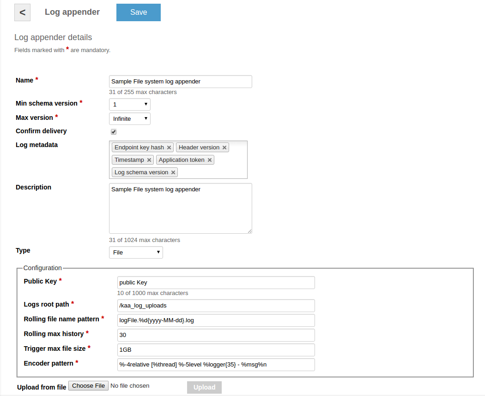
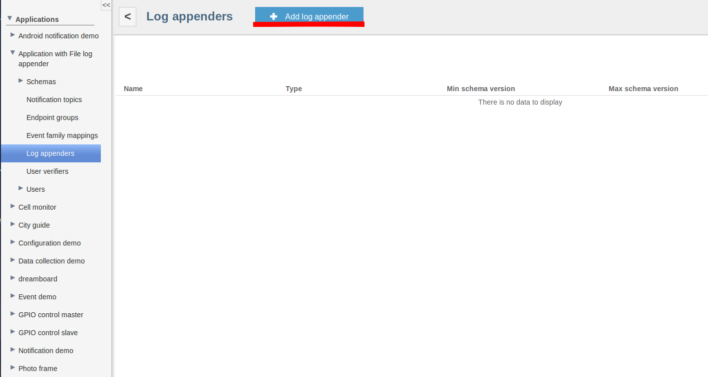
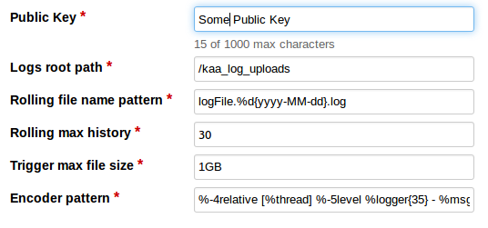
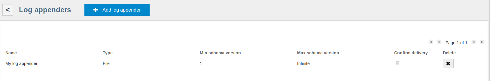
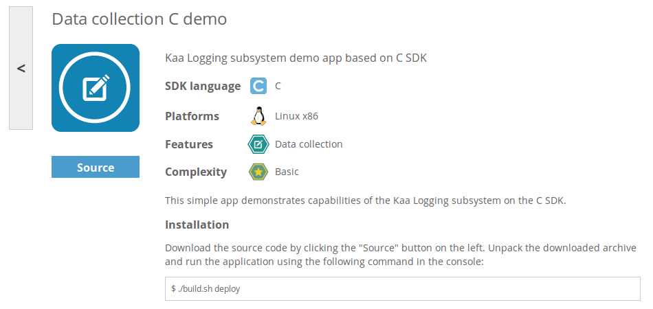
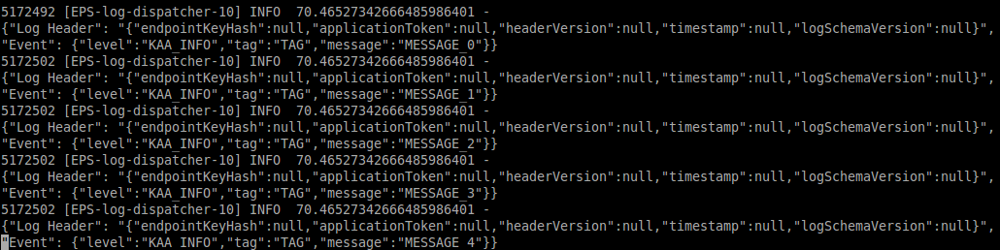


 /{{root_url[1]}}/{{root_url[2]}}/

* TOC
{:toc}

The file system log appender stores received logs into the local file system of the Operations server. This log appender may be used for test purposes 
or in pair with tools like Flume and others. Logs are stored in files under the ```/$logsRootPath/tenant_$tenantId/application_$applicationId``` folder, 
where <i>logsRootPath</i> is a configuration parameter, <i>tenantId</i> and <i>applicationId</i> are ids of the current tenant and 
the application respectively. Access to the logs is controlled via Linux file system permissions.

You can log in to the Operations server host and browse logs using the ```kaa_log_user_$applicationToken``` user name and the pubic key which is created as 
a part of the configuration.

# Creating file system log appender in Admin UI

The easiest way to create a file system log appender for your application is by using Admin UI.
To create a log appender of the file system storage type, do the following:

1. In the <b>Log appenders</b> window, click <b>Add log appender</b>.
2. Enter the log appender name and description, select the minimum and maximum supported log schema version, and select necessary log metadata fields.
3. Set the log appender type to <i>File.</i>
4. Fill in other fields as required.
5. Click <b>Add</b>.



# Creating file system log appender with Admin REST API

It is also possible to create a file system log appender for your application by using [Admin REST API]({{root_url}}Programming-guide/Server-REST-APIs #TODO).
The following example illustrates how to provision the file system log appender via Admin REST API.

## Configuration

The file system log appender configuration should match to
[this](https://github.com/kaaproject/kaa/blob/master/server/appenders/file-appender/src/main/avro/file-appender-config.avsc) Avro schema.

```json
{ 
    "namespace":"org.kaaproject.kaa.server.appenders.file.config.gen",
    "type":"record",
    "name":"FileConfig",
    "fields":[ 
        { 
            "name":"publicKey",
            "displayName":"Public Key",
            "maxLength":1000,
            "default":"",
            "type":"string"
        },
        { 
            "name":"logsRootPath",
            "displayName":"Logs root path",
            "default":"/kaa_log_uploads",
            "type":"string"
        },
        { 
            "name":"rollingFileNamePatern",
            "displayName":"Rolling file name pattern",
            "default":"logFile.%d{yyyy-MM-dd}.log",
            "type":"string"
        },
        { 
            "name":"rollingMaxHistory",
            "displayName":"Rolling max history",
            "default":30,
            "type":"int"
        },
        { 
            "name":"triggerMaxFileSize",
            "displayName":"Trigger max file size",
            "default":"1GB",
            "type":"string"
        },
        { 
            "name":"encoderPattern",
            "displayName":"Encoder pattern",
            "default":"%-4relative [%thread] %-5level %logger{35} - %msg%n",
            "type":"string"
        }
    ]
}
```

|Name|Description|
|---|---|
|publicKey|Name of public key|
|logsRootPath|Root path for logs|
|rollingFileNamePatern|Pattern for creating file name|
|rollingMaxHistory|Max number for records in file|
|triggerMaxFileSize|Max size of file|
|encoderPattern|Pattern for encoder|
<br/>

The following configuration example matches the previous schema.

```json
{
    "publicKey":"XXXXXXXXXXXXXXXXXXXXXXXXXX",
    "logsRootPath":"/kaa_log_uploads",
    "rollingFileNamePatern":"logFile.%d{yyyy-MM-dd}.log",
    "rollingMaxHistory":30,
    "triggerMaxFileSize":"1GB",
    "encoderPattern":"%-4relative [%thread] %-5level %logger{35} - %msg%n"
}
```

## Administration

The following Admin REST API call example illustrates how to create a new file system log appender.

```bash
curl -v -S -u devuser:devuser123 -X POST -H 'Content-Type: application/json' -d'{"pluginClassName": "org.kaaproject.kaa.server.appenders.file.appender.FileSystemLogAppender", "applicationId": 119, "applicationToken": "91786338058670361194", "jsonConfiguration": "{\"publicKey\":\"XXXXXXXXXXXXXXXXXXXXXXXXXX\",\"logsRootPath\":\"/kaa_log_uploads\",\"rollingFileNamePatern\":\"logFile.%d{yyyy-MM-dd}.log\",\"rollingMaxHistory\":30,\"triggerMaxFileSize\":\"1GB\",\"encoderPattern\":\"%-4relative [%thread] %-5level %logger{35} - %msg%n\" }", "description": "New sample file system log appender", "headerStructure": [ "KEYHASH","TIMESTAMP" ], "name": "New file system appender", "maxLogSchemaVersion": 2147483647, "minLogSchemaVersion": 1, "tenantId": "70"}' "http://localhost:8080/kaaAdmin/rest/api/logAppender" | python -mjson.tool
```

Example result:

```json
{
    "appenderClassName":"org.kaaproject.kaa.server.appenders.file.appender.FileSystemLogAppender",
    "applicationId":"70",
    "applicationToken":"946558468095768",
    "configuration":"{\"publicKey\":\"XXXXXXXXXXXXXXXXXXXXXXXXXX\",\"logsRootPath\":\"/kaa_log_uploads_new\",\"rollingFileNamePatern\":\"logFile.%d{yyyy-MM-dd}.log\",\"rollingMaxHistory\":30,\"triggerMaxFileSize\":\"1GB\",\"encoderPattern\":\"%-4relative [%thread] %-5level %logger{35} - %msg%n\"}",
    "createdTime":1417006362287,
    "createdUsername":"devuser",
    "description":"New sample file system log appender",
    "headerStructure":[
        "KEYHASH",
        "TIMESTAMP"
    ],
    "id":"161",
    "name":"New file system appender",
    "maxLogSchemaVersion":2147483647,
    "minLogSchemaVersion":1,
    "status":"REGISTERED",
    "tenantId":"10",
    "typeName":"File"
}
```

# Using with File system log appender

You can create your application where you will use file system log appender

For this you should create application in Admin UI


After that add new appender to your application



Enter name of the new appender 

Select <b>File</b> appender type.


Add new parameters of configuration or replace old.



Now click <b>Add</b> button on the top of the screen to create and deploy appender.


Verify that newly created appender has appeared in list.



After that you can go to Data collection demo in Sandbox.



Run the application using the following command in the console:

```bash
$ java -jar DataCollectionDemo.jar
```


This logs you can fined in ```/kaa_log_uploads/tenant_'number of tenant'/application_'your_application_token'/application.log```

In this example: ```/kaa_log_uploads/tenant_70/application_46527342666485986401/application.log```


