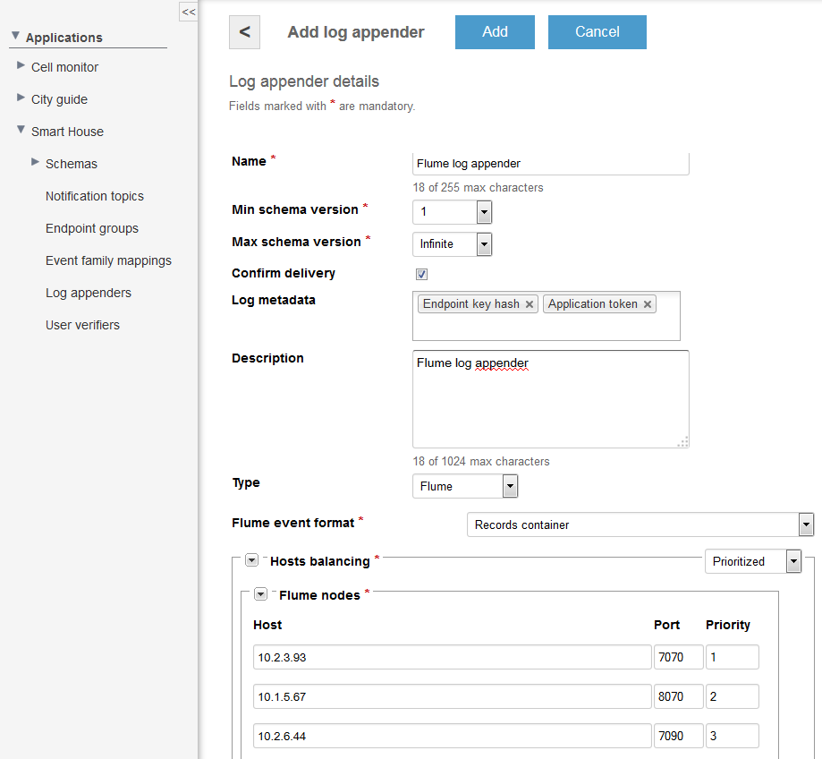
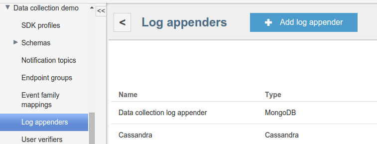
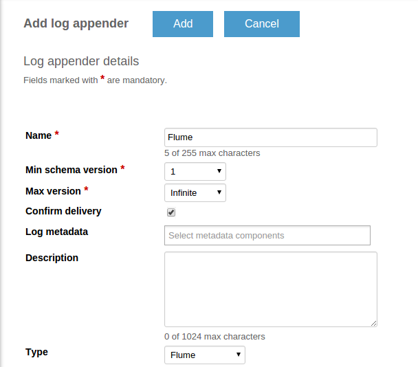
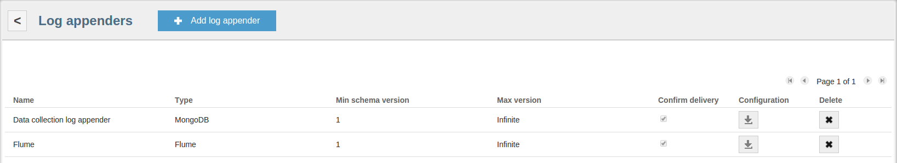
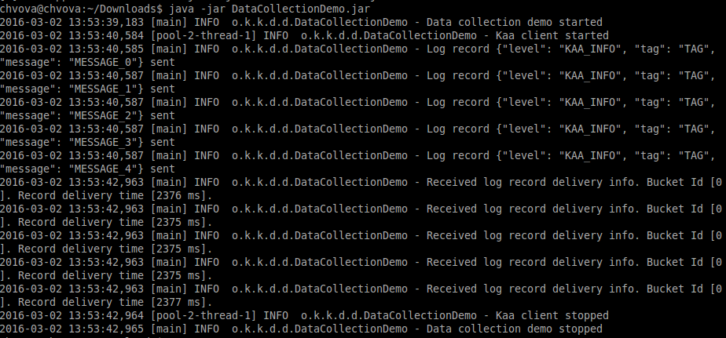


 /{{root_url[1]}}/{{root_url[2]}}/

* [Creating Flume log appender in Admin UI](#creating-flume-log-appender-in-admin-ui)
* [Creating Flume log appender with REST API](#creating-flume-log-appender-with-rest-api)
  * [Formats](#formats)
    * [Records container](#records-container)
    * [Generic](#records-container)
  * [Configuration](#configuration)
  * [Administration](#administration)
* [Setting up Flume log appender](#setting-up-flume-log-appender)

The Flume log appender encapsulates received logs into Flume events and sends these events to external Flume sources via Avro RPC.

### Creating Flume log appender in Admin UI

The easiest way to create a Flume log appender for your application is by using Admin UI.

To create a log appender which will be integrated with Hadoop or Spark, do the following:

1. In the <b>Log appenders</b> window, click <b>Add log appender</b>.
2. Enter the log appender name and description, select the minimum and maximum supported log schema version, and select necessary log metadata fields.
3. Set the log appender type to <i>Flume</i>.
4. Fill in the Flume log appender configuration form. <br/>
NOTE:
Flume log appenders can have either prioritized or round robin host balancing.
5. For the prioritized host balancing, add the number of hosts which is equal to the number of Flume nodes. For every host, enter the host address, 
port and priority. The highest priority is 1. When choosing a server to which to save logs, an endpoint will send requests to the servers starting from 
the server with the highest priority. <br/>

6. For round robin host balancing, add the number of hosts which is equal to the number of Flume nodes. For every host, enter the host address and port. 
When choosing a server to which to save logs, an endpoint will send requests to the servers according to the round robin algorithm. <br/>

7. Click <b>Add</b>.

### Creating Flume log appender with REST API

It is also possible to create a Flume log appender for your application by using REST API. The following example illustrates how to provision 
the Flume log appender via REST API.

### Formats

The Flume log appender can be configured to produce flume events using either <i>Records container</i> or <i>Generic</i> format.

### Records container

In case of the Records container format, log records are serialized by the following RecordData schema as a binary Avro file and stored in a Flume event raw body.

The RecordData schema has the following four fields.

* recordHeader
* schemaVersion
* applicationToken
* eventRecords

The <b>recordHeader</b> field stores a set of log metadata fields.

The <b>eventRecords</b> field stores an array of raw records. Each element of the array is a log record in the Avro binary format serialized by the log schema.

The <b>schemaVersion</b> and <b>applicationToken</b> fields should be used as parameters of a [REST API]({{root_url}}Programming-guide/Server-REST-APIs) call to 
Kaa in order to obtain the logs Avro schema for <b>eventRecords</b> and enable parsing of the binary data.

```json
{
    "type":"record",
    "name":"RecordData",
    "namespace":"org.kaaproject.kaa.server.common.log.shared.avro.gen",
    "fields":[
        {
            "name":"recordHeader",
            "type":[
                {
                    "type":"record",
                    "name":"RecordHeader",
                    "namespace":"org.kaaproject.kaa.server.common.log.shared.avro.gen",
                    "fields":[
                        {
                            "name":"endpointKeyHash",
                            "type":[
                                {
                                    "type":"string"
                                },
                                "null"
                            ]
                        },
                        {
                            "name":"applicationToken",
                            "type":[
                                {
                                    "type":"string"
                                },
                                "null"
                            ]
                        },
                        {
                            "name":"headerVersion",
                            "type":[
                                {
                                    "type":"int"
                                },
                                "null"
                            ]
                        },
                        {
                            "name":"timestamp",
                            "type":[
                                {
                                    "type":"long"
                                },
                                "null"
                            ]
                        },
                        {
                            "name":"logSchemaVersion",
                            "type":[
                                {
                                    "type":"int"
                                },
                                "null"
                            ]
                        }
                    ]
                },
                "null"
            ]
        },
        {
            "name":"schemaVersion",
            "type":"int"
        },
        {
            "name":"applicationToken",
            "type":"string"
        },
        {
            "name":"eventRecords",
            "type":{
                "type":"array",
                "items":{
                    "name":"RecordEvent",
                    "namespace":"org.kaaproject.kaa.server.common.log.shared.avro.gen",
                    "type":"bytes"
                }
            }
        },
        {
            "name":"clientProfileBody",
            "type":[
                {
                    "type":"string"
                },
                "null"
            ]
        },
        {
            "name":"clientSchemaId",
            "type":[
                {
                    "type":"string"
                },
                "null"
            ]
        },
        {
            "name":"serverProfileBody",
            "type":[
                {
                    "type":"string"
                },
                "null"
            ]
        },
        {
            "name":"serverSchemaId",
            "type":[
                {
                    "type":"string"
                },
                "null"
            ]
        }
    ]
}
```

### Generic

In case of the Generic format, every log record is represented as a separate Flume event. The Flume event body contains a log record serialized by 
the log schema in the Avro binary format. The Flume event header contains the log schema definition mapped by the <b>flume.avro.schema.literal</b> key.

In addition, Kaa provides the following two extended Flume agents which can be used together with the Flume log appender.

* Kaa flume source
* Kaa flume sink

The Kaa flume source is a Flume agent with the extension to the standard Flume NG Avro Sink that includes additional features and performance improvements. 
The Kaa flume source receives data from the Flume log appender and delivers it to an external Avro Source located in a Hadoop cluster.

The Kaa flume sink is a Flume agent with the extension to the standard Flume NG HDFS Sink that includes additional features. The Kaa flume sink is aware 
of the log records data schema and stores log data into HDFS as Avro Sequence files using the following Avro schema.

```json
{
    "type":"record",
    "name":"RecordWrapper",
    "namespace":"org.kaaproject.kaa.log",
    "fields":[
        {
            "name":"recordHeader",
            "type":[
                {
                    "type":"record",
                    "name":"RecordHeader",
                    "namespace":"org.kaaproject.kaa.server.common.log.shared.avro.gen",
                    "fields":[
                        {
                            "name":"endpointKeyHash",
                            "type":[
                                {
                                    "type":"string"
                                },
                                "null"
                            ]
                        },
                        {
                            "name":"applicationToken",
                            "type":[
                                {
                                    "type":"string"
                                },
                                "null"
                            ]
                        },
                        {
                            "name":"headerVersion",
                            "type":[
                                {
                                    "type":"int"
                                },
                                "null"
                            ]
                        },
                        {
                            "name":"timestamp",
                            "type":[
                                {
                                    "type":"long"
                                },
                                "null"
                            ]
                        }
                    ]
                },
                "null"
            ]
        },
        {
            "name":"recordData",
            "type":[
                $                {
                    record_data_schema
                },
                "null"
            ]
        }
    ]
}
```

```${record_data_schema}``` - is a variable which is substituted at run time by Kaa HDFS Sink with the Avro schema of the actual logs. 
This Avro schema is obtained via a [REST API]({{root_url}}Programming-guide/Server-REST-APIs) call to Kaa.

### Configuration

The Flume log appender configuration should match to
[this](https://github.com/kaaproject/kaa/blob/master/server/appenders/flume-appender/src/main/avro/flume-appender-config.avsc) Avro schema.

|name|description|
|---|---|
|executorThreadPoolSize|Executor thread pool size|
|callbackThreadPoolSize|Callback thread pool size|
|clientsThreadPoolSize|RPC client max thread pool| 
|includeClientProfile|Client profile data(boolean value)|
|includeServerProfile|Server profile data(boolean value)|
|flumeEventFormat|Records container or Generic|
|hostsBalancing|Prioritized or Round Robin|
|FlumeNodes|Flume nodes|

<br/>

```json
{
    "executorThreadPoolSize":1,
    "callbackThreadPoolSize":2,
    "clientsThreadPoolSize":2,
    "includeClientProfile":{
        "boolean":true
    },
    "includeServerProfile":{
        "boolean":true
    },
    "flumeEventFormat":"RECORDS_CONTAINER",
    "hostsBalancing":{
        "org.kaaproject.kaa.server.appenders.flume.config.gen.FlumeNodes":{
            "flumeNodes":[
                {
                    "host":"localhost",
                    "port":7070
                },
                {
                    "host":"notlocalhost",
                    "port":7070
                }
            ]
        }
    }
}
```

The following configuration example matches the previous schema.

>**NOTE:**  
> Flume log appenders can have either prioritized or round robin host balancing.
* For the prioritized host balancing, every flume node record should have a host address, port and priority. The highest priority is 1. When choosing a server to which to save logs, an endpoint will send requests to the servers starting from the server with the highest priority.
* For the round robin host balancing, every flume node record should have a host address and port. When choosing a server to which to save logs, an endpoint will send requests to the servers according to the round robin algorithm.
* You can include client/server profile into persisted data via corresponding check-boxes.

### Administration

The following REST API call example illustrates how to create a new Flume log appender. 

```bash 
curl -v -S -u devuser:devuser123 -X POST -H 'Content-Type: application/json' -d'{"pluginClassName": "org.kaaproject.kaa.server.appenders.flume.appender.FlumeLogAppender", "applicationId": 119, "applicationToken": "91786338058670361194", "jsonConfiguration": "{   \"executorThreadPoolSize\" : 1,   \"callbackThreadPoolSize\" : 2,   \"clientsThreadPoolSize\" : 2,   \"includeClientProfile\" : { \"boolean\" : true   },   \"includeServerProfile\" : { \"boolean\" : true   },   \"flumeEventFormat\" : \"RECORDS_CONTAINER\",   \"hostsBalancing\" : { \"org.kaaproject.kaa.server.appenders.flume.config.gen.FlumeNodes\" : {   \"flumeNodes\" : [ { \"host\" : \"localhost\", \"port\" : 7070   }, { \"host\" : \"notlocalhost\", \"port\" : 7070   } ] }   } }", "description": "Sample Flume log appender", "headerStructure": [ "KEYHASH","TIMESTAMP" ], "name": "Flume appender", "maxLogSchemaVersion": 2147483647, "minLogSchemaVersion": 1, "tenantId": "70"}' "http://localhost:8080/kaaAdmin/rest/api/logAppender" | python -mjson.tool
```

Example result:

```json
{
    "appenderClassName":"org.kaaproject.kaa.server.appenders.flume.appender.FlumeLogAppender",
    "applicationId":"70",
    "applicationToken":"517279666821995",
    "configuration":"{   \"executorThreadPoolSize\" : 1,   \"callbackThreadPoolSize\" : 2,   \"clientsThreadPoolSize\" : 2,   \"includeClientProfile\" : { \"boolean\" : true   },   \"includeServerProfile\" : { \"boolean\" : true   },   \"flumeEventFormat\" : \"RECORDS_CONTAINER\",   \"hostsBalancing\" : { \"org.kaaproject.kaa.server.appenders.flume.config.gen.FlumeNodes\" : {   \"flumeNodes\" : [ { \"host\" : \"localhost\", \"port\" : 7070   }, { \"host\" : \"notlocalhost\", \"port\" : 7070   } ] }   } }",
    "createdTime":1418318046577,
    "createdUsername":"devuser",
    "description":"Sample Flume log appender",
    "headerStructure":[
        "KEYHASH",
        "TIMESTAMP"
    ],
    "id":"163",
    "maxLogSchemaVersion":2147483647,
    "minLogSchemaVersion":1,
    "name":"Flume appender",
    "status":"REGISTERED",
    "tenantId":"10",
    "typeName":"Flume"
}
```

If you want to use Flume agents together with the Flume log appender, create necessary Kaa Flume agents as described in Installing Kaa flume agents.

### Setting up Flume log appender

1. As a tenant admin, go to your application >> Log appenders, then click <b>Add log appender</b>.  

2. In the <b>Add log appender</b> window that opens, fill in the required fields  
In our example, we use <i>Flume</i> as Name.  
In the <b>Type</b> drop-down list, select Flume.
Then, specify the fields <b>Flume event format</b> (we selected <i>Records container</i>), and <b>Hosts balancing</b> (we selected <i>prioritized<i>).
Finally, specify the cluster parameters: host, port and priority. We use localhost:7070. (in our case localhost = 10.2.3.93)  
  

3. To finish, click <b>Add</b> at the top of the window.  
In case of success, you will see your new log appender in the log appenders list.



After that you can go to Data collection demos in Sandbox.


Run the application using the following command in the console:

```bash
$ java -jar DataCollectionDemo.jar
```

After this command you will see



This logs you can find in HDFS path which you indicate when set up kaa-flume sink
