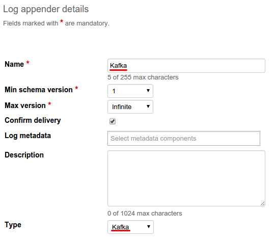


 /{{root_url[1]}}/{{root_url[2]}}/

* TOC
{:toc}

The Kafka log appender is responsible for transferring logs from the Operations server to the Apache Kafka service. The logs are stored in the specified topic.

# Creating Kafka log appender in Admin UI

The easiest way to create a Kafka log appender for your application is by using Admin UI.

To create a log appender of the Kafka storage type, do the following:

1. In the <b>Log appenders</b> window, click <b>Add log appender<b>.
2. Enter the log appender name and description, select the minimum and maximum supported schema version, select necessary log metadata fields.
3. Set the log appender type to <i>Kafka</i>.
4. Fill in the Kafka log appender configuration form.
5. Click <b>Add</b>.


# Creating Kafka log appender with Admin REST API

It is also possible to create a Kafka log appender for your application by using [Admin REST API]({{root_url}}Programming-guide/Server-REST-APIs #TODO).
The following example illustrates how to provision the Kafka log appender for the Cell Monitor demo application available in Kaa Sandbox.

## Configuration

The Kafka log appender configuration should match to
[this](https://github.com/kaaproject/kaa/blob/master/server/appenders/kafka-appender/src/main/avro/kafka-appender-config.avsc) Avro schema.

## Fields description

|Name|Description|
|---|---|
|bufferMemorySize|message buffer size in bytes|
|executorThreadPoolSize|number of threads that can simultaneously perform operation with your Kafka|
|kafkaAcknowledgement|the number of acknowledgments the producer requires the leader to have received before considering a request complete|
|kafkaCompression|type of built-in message compression types|
|kafkaKeyType|type of generated message key|
|kafkaServers|list of kafka bootstrap servers (hostname and port pairs)|
|partitionCount|amount of event partitions|
|retries|failover property. Amount of connection retries on failed message delivery|
|topic|logs destination topic|
|useDefaultPartitioner|if false, appender will calculate partition independently|

<br/>

The following configuration taken from the Cell Monitor demo matches the previous schema.

```json
{
    "kafkaServers":[
        {
            "host":"localhost",
            "port":9092
        }
    ],
    "topic":"kaa",
    "useDefaultPartitioner":{
        "boolean":true
    },
    "partitionCount":{
        "int":1
    },
    "kafkaKeyType":{
        "org.kaaproject.kaa.server.appenders.kafka.config.gen.KafkaKeyType":"NULL"
    },
    "executorThreadPoolSize":{
        "int":1
    },
    "bufferMemorySize":{
        "long":33554432
    },
    "kafkaCompression":{
        "org.kaaproject.kaa.server.appenders.kafka.config.gen.KafkaCompression":"NONE"
    },
    "kafkaAcknowledgement":{
        "org.kaaproject.kaa.server.appenders.kafka.config.gen.KafkaAcknowledgement":"ONE"
    },
    "retries":{
        "int":0
    }
}
```

## Administration

The following Admin REST API call example illustrates how to create a new Kafka log appender.

```bash
curl -v -S -u devuser:devuser123 -X POST -H 'Content-Type: application/json' -d'{"pluginClassName": "org.kaaproject.kaa.server.appenders.kafka.appender.KafkaLogAppender", "applicationId": 119, "applicationToken": "91786338058670361194", "jsonConfiguration": "{\"kafkaServers\":[{\"host\":\"localhost\",\"port\":9092}],\"topic\":\"kaa\",\"useDefaultPartitioner\":{\"boolean\":true},\"partitionCount\":{\"int\":1},\"kafkaKeyType\":{\"org.kaaproject.kaa.server.appenders.kafka.config.gen.KafkaKeyType\":\"NULL\"},\"executorThreadPoolSize\":{\"int\":1},\"bufferMemorySize\":{\"long\":33554432},\"kafkaCompression\":{\"org.kaaproject.kaa.server.appenders.kafka.config.gen.KafkaCompression\":\"NONE\"},\"kafkaAcknowledgement\":{\"org.kaaproject.kaa.server.appenders.kafka.config.gen.KafkaAcknowledgement\":\"ONE\"},\"retries\":{\"int\":0}}", "description": "New sample Kafka log appender", "headerStructure": [ "KEYHASH","TIMESTAMP" ], "name": "New Kafka appender", "maxLogSchemaVersion": 2147483647, "minLogSchemaVersion": 1, "tenantId": "70"}' "http://localhost:8080/kaaAdmin/rest/api/logAppender" | python -mjson.tool
```

Example result:

```json
{
    "appenderClassName":"org.kaaproject.kaa.server.appenders.kafka.appender.KafkaLogAppender",
    "applicationId":70,
    "applicationToken":"946558468095768",
    "configuration":"{\"kafkaServers\":[{\"host\":\"localhost\",\"port\":9092}],\"topic\":\"kaa\",\"useDefaultPartitioner\":{\"boolean\":true},\"partitionCount\":{\"int\":1},\"kafkaKeyType\":{\"org.kaaproject.kaa.server.appenders.kafka.config.gen.KafkaKeyType\":\"NULL\"},\"executorThreadPoolSize\":{\"int\":1},\"bufferMemorySize\":{\"long\":33554432},\"kafkaCompression\":{\"org.kaaproject.kaa.server.appenders.kafka.config.gen.KafkaCompression\":\"NONE\"},\"kafkaAcknowledgement\":{\"org.kaaproject.kaa.server.appenders.kafka.config.gen.KafkaAcknowledgement\":\"ONE\"},\"retries\":{\"int\":0}}",
    "createdTime":1417105170741,
    "createdUsername":"devuser",
    "description":"New sample Kafka log appender",
    "headerStructure":[
        "KEYHASH",
        "TIMESTAMP"
    ],
    "id":"164",
    "name":"New Kafka appender",
    "maxLogSchemaVersion":2147483647,
    "minLogSchemaVersion":1,
    "tenantId":"10",
    "typeName":"Kafka"
}
```

# Playing with Kafka log appender

To check out Kafka log appender you can play with [Data collection demo](https://github.com/kaaproject/sample-apps/tree/master/datacollectiondemo/source).
Download [Kaa Sandbox](http://www.kaaproject.org/download-kaa/) then set up it and go to Data collection demo application.

>**NOTE:**
> Kafka must be installed, running and reachable from Kaa to complete this example. For details about Kafka installation refer to
[official Apache documentation](https://kafka.apache.org/07/quickstart.html).

We have next log schema:

```json
{
    "type":"record",
    "name":"LogData",
    "namespace":"org.kaaproject.kaa.schema.sample.logging",
    "fields":[
        {
            "name":"level",
            "type":{
                "type":"enum",
                "name":"Level",
                "symbols":[
                    "KAA_DEBUG",
                    "KAA_ERROR",
                    "KAA_FATAL",
                    "KAA_INFO",
                    "KAA_TRACE",
                    "KAA_WARN"
                ]
            }
        },
        {
            "name":"tag",
            "type":"string"
        },
        {
            "name":"message",
            "type":"string"
        }
    ]
}
```

The following JSON example matches the previous schema.

```json
{
"level" : "KAA_INFO",
"tag" : "TEST_TAG",
"message" : "My simple message"
}
```

Go to the Data collection demos in Sandbox.


Follow <b>Installation</b> instructions.

Next, in the Admin UI follow to <b>Data collection demo</b> application


Go to application's <b>Log appenders</b> configuration and add a new one.


Enter name of the new appender (in this example it is "Kafka")

Select <b>Kafka</b> appender type.



Set up appender <b>Configuration</b> similar to screenshot


In this example, Kafka server installed in the Sandbox VM.

Now click <b>Add<b> button on the top of the screen to create and deploy appender.


Verify that newly created appender has appeared in list.


From Kafka installation directory run next command:

```bash
bin/kafka-console-consumer.sh --zookeeper localhost:2181 --topic kaa
```

This will bring up Kafka consumer, so we can see logs transferred from Kaa.

Now run Data collection demo application. Verify that logs have been successfully sent to Kaa


Make sure, that Kafka consumer receive logs:


