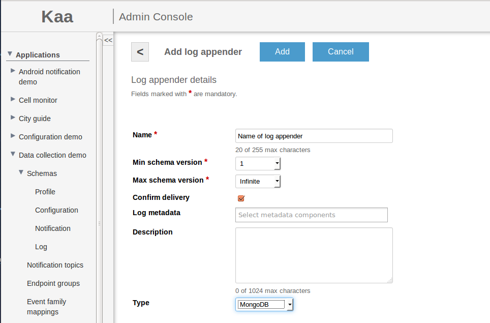
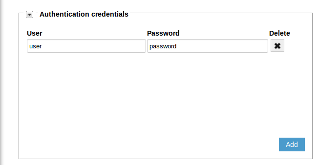
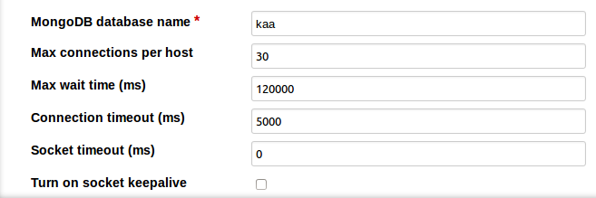
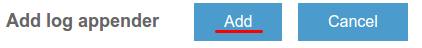
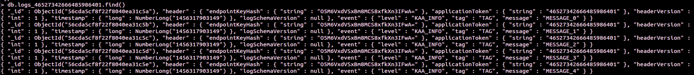


 /{{root_url[1]}}/{{root_url[2]}}/

* TOC
{:toc}

The MongoDB log appender is responsible for transferring logs from the Operations server to the MongoDB database. The logs are stored in the table named
<i>logs_$applicationToken</i>, where <i>$applicationToken<i> matches the token of the current application.

# Creating MongoDB log appender in Admin UI

The easiest way to create a MongoDB log appender for your application is by using Admin UI.

To create a log appender of the MongoDB storage type, do the following:

1. In the <b>Log appenders</b> window, click <b>Add log appender</b>.
2. Enter the log appender name and description, select the minimum and maximum supported log schema version, and select necessary log metadata fields.
3. Set the log appender type to <i>Mongo</i>.
4. Fill in the Mongo log appender configuration form.
5. Click <b>Add</b>.


# Creating MongoDB log appender with Admin REST API

It is also possible to create a MongoDB log appender for your application by using [Admin REST API]({{root_url}}Programming-guide/Server-REST-APIs #TODO).
The following example illustrates how to provision the MongoDB log appender for the Cell Monitor demo application available in Kaa Sandbox.

## Configuration

The MongoDB log appender configuration should match to
 [this](https://github.com/kaaproject/kaa/blob/master/server/appenders/mongo-appender/src/main/avro/mongodb-appender-config.avsc) Avro schema.

Fields of avro schema:

* MongoDB nodes - list of MongoDB hosts.
* Authentication credentials - credentials used to authenticate on MongoDB cluster
* Other fields which configure of connection to MongoDB

|name|description|
|---|---|
|dbName|name of database|
|connectionsPerHost|Max number of connections on per host|
|maxWaitTime|Max wait time for connection(ms)|
|connectionTimeout|Connection timeout (ms)|
|socketTimeout|Socket timeout (ms)|
|socketKeepalive|Turn on socket keep alive (boolean value)|
|includeClientProfile|Include or not client profile data (boolean value)|
|includeServerProfile|Include or not server profile data (boolean value)|

<br/>

The following configuration taken from the Cell Monitor demo matches the previous schema.

```json
{
    "mongoServers":[
        {
            "host":"127.0.0.1",
            "port":27017
        }
    ],
    "mongoCredentials":[
        {
            "user":"user",
            "password":"password"
        }
    ],
    "dbName":"kaa",
    "connectionsPerHost":{
        "int":30
    },
    "maxWaitTime":{
        "int":120000
    },
    "connectionTimeout":{
        "int":5000
    },
    "socketTimeout":{
        "int":0
    },
    "socketKeepalive":{
        "boolean":false
    },
    "includeClientProfile":{
        "boolean":false
    },
    "includeServerProfile":{
        "boolean":false
    }
}
```

## Administration

The following Admin REST API call example illustrates how to create a new MongoDB log appender.

```bash
curl -v -S -u devuser:devuser123 -X POST -H 'Content-Type: application/json' -d'{"pluginClassName": "org.kaaproject.kaa.server.appenders.mongo.appender.MongoDbLogAppender", "applicationId": 119, "applicationToken": "91786338058670361194", "jsonConfiguration": "{   \"mongoServers\" : [ { \"host\" : \"127.0.0.1\", \"port\" : 27017   } ],   \"mongoCredentials\" : [ { \"user\" : \"user\", \"password\" : \"password\"   } ],   \"dbName\" : \"kaa\",   \"connectionsPerHost\" : { \"int\" : 30   },   \"maxWaitTime\" : { \"int\" : 120000   },   \"connectionTimeout\" : { \"int\" : 5000   },   \"socketTimeout\" : { \"int\" : 0   },   \"socketKeepalive\" : { \"boolean\" : false   },   \"includeClientProfile\" : { \"boolean\" : false   },   \"includeServerProfile\" : { \"boolean\" : false   } }", "description": "New sample Mongo db log appender", "headerStructure": [ "KEYHASH","TIMESTAMP" ], "name": "New Mongo DB appender", "maxLogSchemaVersion": 2147483647, "minLogSchemaVersion": 1, "tenantId": "70"}' "http://localhost:8080/kaaAdmin/rest/api/logAppender" | python -mjson.tool
```

Example result:

```json
{
    "appenderClassName":"org.kaaproject.kaa.server.appenders.mongo.appender.MongoDbLogAppender",
    "applicationId":"70",
    "applicationToken":"946558468095768",
    "configuration":"{   \"mongoServers\" : [ { \"host\" : \"127.0.0.1\", \"port\" : 27017   } ],   \"mongoCredentials\" : [ { \"user\" : \"user\", \"password\" : \"password\"   } ],   \"dbName\" : \"kaa\",   \"connectionsPerHost\" : { \"int\" : 30   },   \"maxWaitTime\" : { \"int\" : 120000   },   \"connectionTimeout\" : { \"int\" : 5000   },   \"socketTimeout\" : { \"int\" : 0   },   \"socketKeepalive\" : { \"boolean\" : false   },   \"includeClientProfile\" : { \"boolean\" : false   },   \"includeServerProfile\" : { \"boolean\" : false   } }",
    "createdTime":1417105170741,
    "createdUsername":"devuser",
    "description":"Sample MongoDB log appender",
    "headerStructure":[
        "KEYHASH",
        "TOKEN"
    ],
    "id":"164",
    "name":"MongoDB appender",
    "maxLogSchemaVersion":2147483647,
    "minLogSchemaVersion":1,
    "status":"REGISTERED",
    "tenantId":"10",
    "typeName":"Mongo"
}
```

# Using with MongoDB log appender

We'll use [Data collection demo](https://github.com/kaaproject/sample-apps/tree/master/datacollectiondemo/source) from Kaa Sendbox. Our example will send data
to Kaa and then persist it to MongoDB. Also, we'll do selection queries on persisted data.

We have next log schema:

```json
{
    "type":"record",
    "name":"LogData",
    "namespace":"org.kaaproject.kaa.schema.sample.logging",
    "fields":[
        {
            "name":"level",
            "type":{
                "type":"enum",
                "name":"Level",
                "symbols":[
                    "KAA_DEBUG",
                    "KAA_ERROR",
                    "KAA_FATAL",
                    "KAA_INFO",
                    "KAA_TRACE",
                    "KAA_WARN"
                ]
            }
        },
        {
            "name":"tag",
            "type":"string"
        },
        {
            "name":"message",
            "type":"string"
        }
    ]
}
```

Display string

```json
"Schema": { "Name": ""LogData"", "Namespace": ""org.kaaproject.kaa.schema.sample.logging"", "Display name": "null", "Fields": Field (3 rows) }
```

The following JSON example matches the previous schema.

```json
{
    "level":"KAA_INFO",
    "tag":"TEST_TAG",
    "message":"My simple message"
}
```

Go to Data collection demos in Sandbox.


Next, in the Admin UI follow to <b>Data collection demo</b> application


<br/>


There can be was same one. You can add new with your parameters

Enter name of the new appender

Select <b>MongoDB</b> appender type.



Add new node in the <b>Configuration</b> section (localhost:27017)


Also you can add some <b>Authentication credentials<b>



And other important parameters of configuration. You can change them or use default.



Now click <b>Add</b> button on the top of the screen to create and deploy appender.



Verify that newly created appender has appeared in list.


Now run Data collection demo application. Verify that logs have been successfully sent to Kaa


Run the application using the following command in the console:

```bash
$ java -jar DataCollectionDemo.jar
```

Let's verify that our logs have been persisted in MongoDB. Go to Sandbox VM and run next command to connect MongoDB:

```bash
$ mongo kaa
db.logs_$your_application_token$.find()
```

You should observe similar output:


