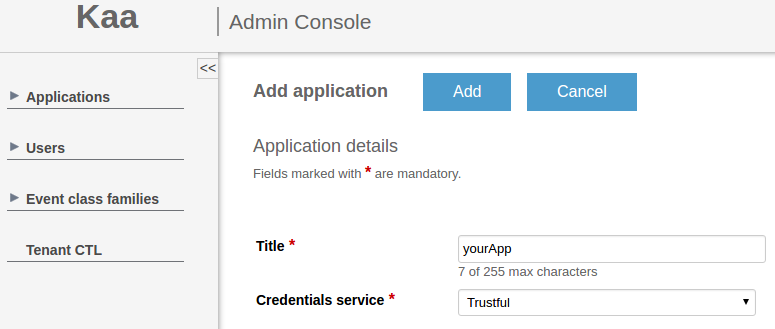
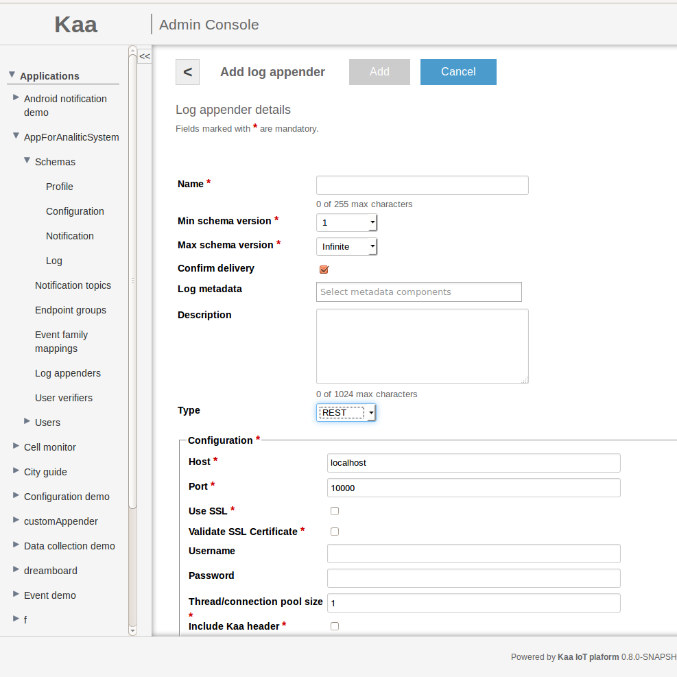


 /{{root_url[1]}}/{{root_url[2]}}/


* TOC
{:toc}

The REST log appender is responsible for transferring logs from Operation server to your custom service.

# Creating REST log appender with Admin UI

The easiest way to create a Cassandra log appender for your application is by using Admin UI.

To create a log appender for access via REST, do the following:

1. In the **Log appenders** window, click **Add log appender**.
2. Enter the log appender name and description, select the minimum and maximum supported log schema version, and select necessary log metadata fields.
3. Set the log appender type to _REST_.
4. Fill in other fields as required.
5. Click **Add** button. Log appender is ready and operational at this point.


It's also possible to create REST appender using [Admin REST API]({{root_url}}Programming-guide/Server-REST-APIs #TODO).

# Configuration

The Admin REST log appender configuration must match to
[this](https://github.com/kaaproject/kaa/blob/master/server/appenders/rest-appender/src/main/avro/rest-appender-config.avsc) Avro schema.

Parameters for defining REST log appender

|parameter|description|
|---|---|
|connectionPoolSize|number of threads that can simultaneously perform operation with your service|
|header|boolean value that define whether or not use a Kaa header|
|host|a host of your custom service that will receive logs|
|method|define a HTTP method that will be using for sending data|
|mimeType|mime type which appender use for sending data|
|password|password for user of service (if authentication required)|
|path|define a path that will be able to receive logs from REST appender|
|port|port of service|
|ssl|boolean value that define whether or not use a SSL communication.|
|username|name of user of your service (if authentication required)|
|verifySslCert|boolean value that define whether or not use a verification of SSL Certificate|

<br/>

The following configuration schema matches to previously introduced Avro schema:

```json
{
    "host":"10.2.2.65",
    "port":9000,
    "ssl":false,
    "verifySslCert":false,
    "username":{
        "string":""
    },
    "password":{
        "string":""
    },
    "connectionPoolSize":1,
    "header":false,
    "path":"/encrypt",
    "method":"POST",
    "mimeType":"JSON"
}
```

Based on this configuration, you'd be able to perform "POST" request to 10.2.2.65:9000/encrypt url. Let's look at more definitive example.

# Playing with REST log appender

Log in Admin UI like admin and create an application.
To create a new application, do the following: <br/>
Open the Applications window by clicking the corresponding link on the navigation panel. <br/>
 <br/>
Click **Add application** at the top of the window.
Enter the title of your application, select Trustful credentials service type and then click **Add**. <br/>
 <br/>

> **NOTE:**
> If you open the Application details window of the newly created application (by clicking this application on either the Applications menu on the
navigation panel or the Applications window), you will notice that the [Application Token]({{root_url}}Glossary) field has been filled in automatically.

Log in as a tenant developer and create log schema in your previously created application: yourApp->Schemas->Log->Add schema <br/>
 <br/>
Upload the following configuration schema:

```json
{
    "name":"recordData",
    "type":[
        {
            "type":"record",
            "name":"Data",
            "namespace":"org.kaaproject.kaa.example.mobile.log",
            "fields":[
                {
                    "name":"timestamp",
                    "type":[
                        "long",
                        "null"
                    ]
                },
                {
                    "name":"data",
                    "type":[
                        "bytes",
                        "null"
                    ]
                },
                {
                    "name":"endpointKeyHash",
                    "type":[
                        {
                            "type":"string",
                            "avro.java.string":"String"
                        },
                        "null"
                    ]
                },
                {
                    "name":"hashFunction",
                    "type":[
                        {
                            "type":"string",
                            "avro.java.string":"String"
                        },
                        "null"
                    ]
                }
            ]
        },
        "null"
    ]
}
```

Go to **Log appenders** menu and add **REST log appender** to your app using your custom configuration:
your app-> Log appenders -> Add log appender


Write appropriate configuration for your appender and save results.

Then **generate SDK** appropriate to your platform. Add downloaded sdk to your project directory.

The following code snippet illustrates handling POST request from Kaa server:

```
@Controller
@RequestMapping("/")
public class  SampleController {

    final static Logger LOGGER = LoggerFactory.getLogger(SampleController.class);

    @ResponseBody
    @RequestMapping(method = RequestMethod.POST, value = "encrypt")
    public void encryptFile(@RequestBody String json) throws Exception {
        LOGGER.info(json);
    }
}
```

The client code that sends logs to server might look like that:

```
...
private KaaClient client;
client = ... ;

Data data = new Data(...);
client.addLogRecord(data);
...
```

After sending logs from client, Kaa server will use previoisly created REST log apppender which will send data to your custon service based on above code
you will see something like that:

```
INFO 19797 --- [nio-9000-exec-1] o.k.k.e.controller.SampleController   : {"timestamp":{"long":1456165449702},"data":{"bytes":"hello world!\n"},"endpointKeyHash":{"string":"7xVRbtqcs6EySlgzqVr34SujpeY=\n"},"hashFunction":{"string":"SHA1"}}
```

If your output doesn't match above one, please follow our [troubleshooting guide]({{root_url}}Administration-guide/Troubleshooting).
