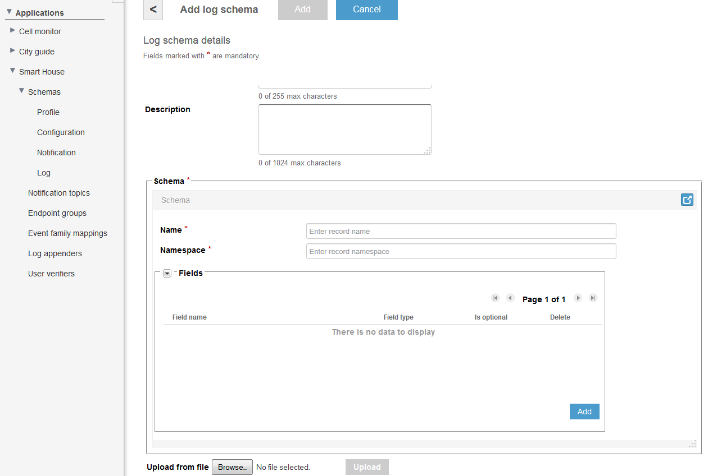
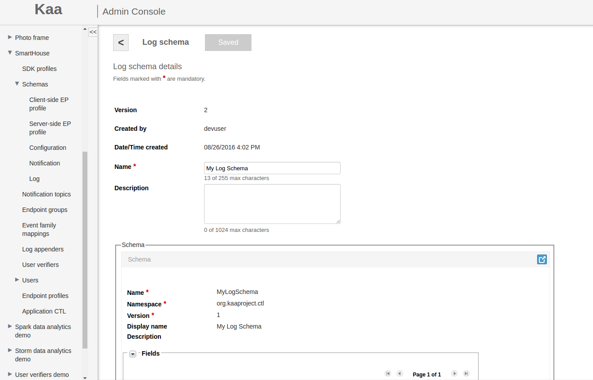
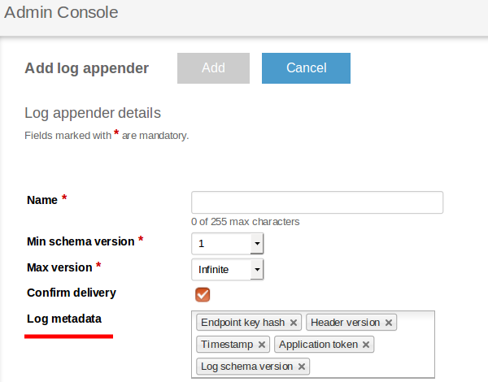



* TOC
{:toc}

The Kaa data collection subsystem is designed to collect records (logs) of pre-configured structure on the endpoints, periodically transferring these records
from endpoints to Operations service, and, finally, either persisting them on the server for further processing or submitting them to immediate stream
analysis. The log structure in Kaa is determined for each application by a configurable log schema. On the Operations service side, there are log appenders
which are responsible for writing logs received by the Operations service into the specific storage. It is possible to add several log appenders to work
simultaneously.

From this guide you will learn how to use the Kaa data collection subsystem.

# Basic architecture

The following diagram illustrates basic entities and data flows in scope of the data collection management:

* The data from the endpoints (logs) is collected and transferred to the server in the format as defined by the [log schema](#log-schema) 
created by the developer for the application
* Log appenders submit the logs received by the server to a particular storage or analytics system


The Kaa Data collection subsystem provides the following features:

* Generation of the logging model and related API calls in the endpoint SDK
* Enforcement of data integrity and validity
* Efficient delivery of logs to Operations services
* Storing log contents by means of the log appenders configured for the application

The application developer is responsible for designing the log schema and invoking the endpoint logging API from the client application.

# Log record

Log record consists of:

* Log events
* Log record header
* Client/server-side endpoint profile.

Log events and record header data match to the corresponding [log schema](#log-schema) and [log record header schema](#log-record-header-schema) respectively.
To add client/server-side endpoint profile data to the log record follow to the corresponding
[log appender documentation](#existing-log-appender-implementations).

# Log schema

The log schema is fully compatible with the [Apache Avro schema](http://avro.apache.org/docs/current/spec.html#schemas). There is one log schema defined 
by default for each Kaa application. This schema supports versioning, therefore, whenever a new log schema is configured on the Kaa service for the application,
this new schema gets a new sequence version assigned. The Kaa service maintains compatibility with the older versions of the log schema to ensure proper
functioning of the clients that for some reason are not yet upgraded to the latest schema version.

The following examples illustrate basic log schemas.

* The simplest definition of a log record with no data fields (mostly useless):

```json
{  
    "name":"EmptyLog",  
    "namespace":"org.kaaproject.sample",  
    "type":"record",  
    "fields":[
    ]
}
```

* A simple log schema with the log level, tag, and message:

```json
{
    "name":"LogData",
    "namespace":"org.kaaproject.sample",
    "type":"record",
    "fields":[
        {
            "name":"level",
            "type":{
                "type":"enum",
                "name":"Level",
                "symbols":[
                    "DEBUG",
                    "ERROR",
                    "FATAL",
                    "INFO",
                    "TRACE",
                    "WARN"
                ]
            }
        },
        {
            "name":"tag",
            "type":"string"
        },
        {
            "name":"message",
            "type":"string"
        }
    ]
}
```

## Adding log schema

The default log schema installed for Kaa applications is empty. You can configure your own log schema using the Admin UI or
[Admin REST API]({{root_url}}Programming-guide/Server-REST-APIs/#!/Logging/saveLogSchema).
For the purpose of this guide, we will use schema that is very close to the common log structure:

* log level
* tag
* message

```json
{
    "type":"record",
    "name":"LogData",
    "namespace":"org.kaaproject.kaa.schema.sample.logging",
    "fields":[
        {
            "name":"level",
            "type":{
                "type":"enum",
                "name":"Level",
                "symbols":[
                    "DEBUG",
                    "ERROR",
                    "FATAL",
                    "INFO",
                    "TRACE",
                    "WARN"
                ]
            }
        },
        {
            "name":"tag",
            "type":"string"
        },
        {
            "name":"message",
            "type":"string"
        }
    ]
}
```

In Admin UI as a tenant developer, you can create new log schemas for the application as follows:

1. In the Log schemas window for the application, click **Add schema**.
2. In the Add log schema window, create a log schema either by using the
[schema form]({{root_url}}Administration-guide/Tenants-and-applications-management/#schema-form) or by uploading a schema in the
[Avro](http://avro.apache.org/docs/current/spec.html) format from a file.

3. Click **Add** to save the schema.

If you want to review the added Avro schema, open the **Log schema details** window by clicking the schema in the **Log schemas** window.



# Log record header schema

The log record header schema is fully compatible with the [Apache Avro schema](http://avro.apache.org/docs/current/spec.html#schemas). The log record header
schema defines structure of the log record header that will be automatically added to the [log record](#log-record) in Kaa.

The log record header schema described below:

```json
{
    "name":"recordHeader",
    "type":[
        {
            "type":"record",
            "name":"RecordHeader",
            "namespace":"org.kaaproject.kaa.server.common.log.shared.avro.gen",
            "fields":[
                {
                    "name":"endpointKeyHash",
                    "type":[
                        {
                            "type":"string",
                            "avro.java.string":"String"
                        },
                        "null"
                    ]
                },
                {
                    "name":"applicationToken",
                    "type":[
                        {
                            "type":"string",
                            "avro.java.string":"String"
                        },
                        "null"
                    ]
                },
                {
                    "name":"headerVersion",
                    "type":[
                        "int",
                        "null"
                    ]
                },
                {
                    "name":"timestamp",
                    "type":[
                        "long",
                        "null"
                    ]
                },
                {
                    "name":"logSchemaVersion",
                    "type":[
                        "int",
                        "null"
                    ]
                }
            ]
        },
        "null"
    ]
}
```

## Adding log record header

It is possible to configure the log record header data in the log appender:

  * In the Admin UI by selecting necessary **Log metadata** fields.

  * By the [Admin REST API]({{root_url}}Programming-guide/Server-REST-APIs/#!/Logging/editLogAppender) call to create log appender. Here you need to add
  corresponding fields to the **headerStructure** list.

Available record header fields described below:

|Name       |Description                                                            |
|-----------|-----------------------------------------------------------------------|
|KEYHASH    |A key hash identifying the endpoint which produced the log record      |
|VERSION    |The header version                                                     |
|TIMESTAMP  |The timestamp in milliseconds when logs were uploaded to the Kaa server|
|TOKEN      |The [application token]({{root_url}}Glossary)                          |
|LSVERSION  |The log schema version                                                 |

# Log appenders

A log appender is a service utility which reside on the Operations service side. This utility is responsible for writing logs (received by the Operations
service from endpoints) to a single specific storage, as defined by the log appender's type. It is possible to have several log appenders which can work
simultaneously. Kaa provides several default implementations of log appenders but it is also possible to develop and integrate
[custom log appenders]({{root_url}}Customization-guide/Customizable-system-components/Log-appenders).

## Confirm delivery option

By design every Kaa client stores logs in a log storage before sending them to the Kaa node. By default, upon receiving the logs, the corresponding
log appender on the Kaa node sends the delivery confirmation back to the Kaa client. If the delivery was successful, the Kaa client deletes the log copies
from its local storage, otherwise - it receives an appropriate error code and either restarts the operation of log delivery or attempts to deliver
the same data to a different Kaa node.

The confirm delivery option adds to a log appender the capability to verify whether received logs have been written into actual storage
before sending the confirmation to the Kaa client.

To illustrate, let’s consider the following scenarios:

1. Log appender A has been configured with the confirm delivery option enabled. The Kaa client will receive a message about successful logs delivery
only after the Kaa node successfully receives and writes the logs into an external storage. If the Kaa node fails to write the logs into the storage,
the Kaa client will send the logs again. If there are more than one log appender with the enabled confirm delivery option then the Kaa client will receive
a message about successful logs delivery only after each log appender successfully writes its logs into the storage.
2. Log appender A has been configured with the confirm delivery option disabled. The Kaa client will receive a message about successful logs delivery
to the Kaa node but if the Kaa node fails to write the logs into an external storage system, the Kaa client will not be informed about the failure and
will not attempt sending the logs again. As a result, the logs will be lost.
3. Log appender A has been configured with the confirm delivery option enabled and log appender B with the disabled one. The Kaa client will receive
a message about successful logs delivery as soon as log appender A confirms delivery. Any errors that might happen when log appender B writes its logs into
the storage will not be taken into account.

To summarize, the confirm delivery option allows you to have the guaranteed delivery of every log record to the external storage.

Also, it is worth noting that by default an inmemory log storage is used on the Kaa client. This means that you can lose your undelivered data in case of
an endpoint reset. To avoid this, use a persistent log storage to store all the data that was not yet confirmed as delivered.

## Existing log appender implementations

There are several default log appender implementations that are available out of the box for each Kaa installation. A Kaa developer is able to add, update
and delete log appenders using Admin UI or Admin REST API. After adding log appender ensure the data collection feature is
[configured appropriately](#data-collection-sdk-api). For sample purposes [data collection demo](#data-collection-demo) application can be used as well.
For more information about architecture, configuration and administration refer to the corresponding log appender:

* ### [Cassandra log appender]({{root_url}}Programming-guide/Key-platform-features/Data-collection/Cassandra-log-appender)

The Cassandra log appender is responsible for transferring logs from the Operations service to the [Cassandra](http://cassandra.apache.org/) database.
You can flexibly configure Cassandra storage (Cassandra nodes, authentication credentials, keyspace name, table name, column mapping, clustering, see
[configuration]({{root_url}}Programming-guide/Key-platform-features/Data-collection/Cassandra-log-appender/#configuration) section).

* ### [Couchbase log appender]({{root_url}}Programming-guide/Key-platform-features/Data-collection/Couchbase-log-appender)

The Couchbase log appender is responsible for transferring logs from the Operations service to the [Couchbase](http://www.couchbase.com/) database. You can
configure Couchbase servers list, bucket name and password.

* ### [File system log appender]({{root_url}}Programming-guide/Key-platform-features/Data-collection/File-system-log-appender)

The file system log appender stores received logs into the local file system of the Operations service. This log appender may be used for test purposes
or in pair with tools like Flume and others. You can configure logs root path, rolling file name pattern, rolling max history, trigger max file size and
[other]({{root_url}}Programming-guide/Key-platform-features/Data-collection/File-system-log-appender/#configuration) parameters for this log appender.

* ### [Flume log appender]({{root_url}}Programming-guide/Key-platform-features/Data-collection/Flume-log-appender)

The Flume log appender encapsulates received logs into Flume events and sends these events to external Flume sources via Avro RPC. You can configure
flume event format, hosts balancing type, include client-side and/or server-side profile data and
[other]({{root_url}}Programming-guide/Key-platform-features/Data-collection/Flume-log-appender/#configuration) parameters for this log appender.

* ### [Kafka log appender]({{root_url}}Programming-guide/Key-platform-features/Data-collection/Kafka-log-appender)

The Kafka log appender is responsible for transferring logs from the Operations service to the [Apache Kafka](http://kafka.apache.org/) service. The logs are
stored in the specified topic. You can configure Kafka bootstrap servers list, topic name, compression type and
[other]({{root_url}}Programming-guide/Key-platform-features/Data-collection/Kafka-log-appender/#configuration) parameters for this log appender.

* ### [MongoDB log appender]({{root_url}}Programming-guide/Key-platform-features/Data-collection/MongoDB-log-appender)

The MongoDB log appender is responsible for transferring logs from the Operations service to the [MongoDB](https://www.mongodb.com/) database. You can
configure MongoDB nodes list, authentication credentials, MongoDB database name and
[other]({{root_url}}Programming-guide/Key-platform-features/Data-collection/MongoDB-log-appender/#configuration) parameters for this log appender.
The logs are stored in the table named __logs_$[applicationToken]({{root_url}}Glossary)_, where _$[applicationToken]({{root_url}}Glossary)_ matches the token
of the current application.

* ### [Oracle NoSQL log appender]({{root_url}}Programming-guide/Key-platform-features/Data-collection/Oracle-NoSQL-log-appender)

The Oracle NoSQL log appender is responsible for transferring logs from the Operations service to the
[Oracle NoSQL](http://www.oracle.com/technetwork/database/database-technologies/nosqldb/overview/index.html) key/value storage. You can configure KVStore name,
KVStore nodes and [other]({{root_url}}Programming-guide/Key-platform-features/Data-collection/Oracle-NoSQL-log-appender/#configuration) parameters for this
log appender.

* ### [Rest log appender]({{root_url}}Programming-guide/Key-platform-features/Data-collection/Rest-log-appender)

The REST log appender is responsible for transferring logs from Operations service to your custom service. You can configure host, port, relative URI path,
method type and [other]({{root_url}}Programming-guide/Key-platform-features/Data-collection/Rest-log-appender/#configuration) parameters for this log appender.

## Custom log appender implementations

Refer to the [Custom log appender]({{root_url}}Customization-guide/Customizable-system-components/Log-appenders) page to learn how to develop and integrate
custom log appender.

# Data Collection SDK API

## Log delivery

The logging subsystem API varies depending on the target SDK platform. However, the general approach is the same.

To transfer logs to the Kaa Operations service, the Kaa client application should use the following code.

<ul class="nav nav-tabs">
  <li class="active"><a data-toggle="tab" href="#Java">Java</a></li>
  <li><a data-toggle="tab" href="#Cpp">C++</a></li>
  <li><a data-toggle="tab" href="#C">C</a></li>
  <li><a data-toggle="tab" href="#Objective-C">Objective-C</a></li>
</ul>

<div class="tab-content">
<div id="Java" class="tab-pane fade in active" markdown="1" >

```
// Configure the log delivery listener
kaaClient.setLogDeliveryListener(new LogDeliveryListener() {
    @Override
    public void onLogDeliverySuccess(BucketInfo bucketInfo) { /* Called on success */ }
    @Override
    public void onLogDeliveryFailure(BucketInfo bucketInfo) { /* Called on failure */ }
    @Override
    public void onLogDeliveryTimeout(BucketInfo bucketInfo) { /* Called on timeout */ }
});
// Create a log entity according to the (org.kaaproject.sample.LogData) sample schema above
LogData logRecord = new LogData(Level.INFO, "tag", "message");
// Push the record to the collector
RecordFuture logDeliveryStatus = kaaClient.addLogRecord(logRecord);
// Get log delivery information
RecordInfo logDeliveryReport = logDeliveryStatus.get();
```

</div>
<div id="Cpp" class="tab-pane fade" markdown="1" >

```
#include <iostream>
#include <exception>
 
include <kaa/Kaa.hpp>
 
using namespace kaa;
 
// Create an endpoint instance
auto kaaClient = Kaa::newClient();
  
// Start an endpoint
kaaClient->start();
 
// Create a log entity (according to the org.kaaproject.sample.LogData sample schema above) 
KaaUserLogRecord logRecord;
logRecord.level = Level::INFO;
logRecord.tag = "tag";
logRecord.message = "message";
 
// Push the record to the collector
auto recordDeliveryCallback = kaaClient->addLogRecord(logRecord);
 
try {
    auto recordInfo = recordDeliveryCallback.get();
    auto bucketInfo = recordInfo.getBucketInfo();
    std::cout << "Received log record delivery info. Bucket Id [" <<  bucketInfo.getBucketId() << "]. "
              << "Record delivery time [" << recordInfo.getRecordDeliveryTimeMs() << " ms]." << std::endl;
} catch (std::exception& e) {
    std::cout << "Exception was caught while waiting for callback result: " << e.what() << std::endl;
}
```

</div>
<div id="C" class="tab-pane fade" markdown="1" >

```
#include <stdint.h>
#include <kaa/kaa_logging.h>
#include <kaa/gen/kaa_logging_gen.h>
#include <kaa/platform/kaa_client.h>
 
kaa_client_t *kaa_client = /* ... */;
void *log_storage_context         = NULL;
void *log_upload_strategy_context = NULL;
 
/* Optional context that passed to log delivery callbacks */
void *log_delivery_context = NULL;
 
/* Assume Kaa SDK is already initialized */
 
/* Set of routines that handles log delivery events */

static void success_log_delivery_callback(void *context, const kaa_log_bucket_info_t *bucket)
{
    /* ... */
}
 
static void failed_log_delivery_callback(void *context, const kaa_log_bucket_info_t *bucket)
{
    /* ... */
}
 
static void timeout_log_delivery_callback(void *context, const kaa_log_bucket_info_t *bucket)
{
    /* ... */
}
 
/* Log delivery listener callbacks. Each callback called whenever something happen with a log bucket. */
kaa_log_delivery_listener_t log_listener = {
     .on_success = success_log_delivery_callback,   /* Called if log delivered successfully */
     .on_failed  = failed_log_delivery_callback,    /* Called if delivery failed */
     .on_timeout = timeout_log_delivery_callback,   /* Called if timeout occurs */
     .ctx        = log_delivery_context,            /* Optional context */
};
 
/* The internal memory log storage distributed with Kaa SDK */
kaa_error_t error_code = ext_unlimited_log_storage_create(&log_storage_context, kaa_client_get_context(kaa_client)->logger);
 
/* Check error code */
 
/* Specify log bucket size constraints */
kaa_log_bucket_constraints_t bucket_sizes = {
     .max_bucket_size       = 512,  /* Bucket size in bytes */
     .max_bucket_log_count  = 5,    /* Maximum log count in one bucket */
};
 
/* Initialize the log storage and strategy (by default it is not set) */
error_code = kaa_logging_init(kaa_client_get_context(kaa_client)->log_collector
                              , log_storage_context
                              , log_upload_strategy_context
                              , &bucket_sizes);
 
/* Check error code */
 
/* Add listeners to a log collector */
kaa_logging_set_listeners(kaa_client_get_context(kaa_client)->log_collector, &log_listener);
 
/* Create and add a log record */
 
kaa_user_log_record_t *log_record = kaa_logging_log_data_create();
 
log_record->level = ENUM_LEVEL_KAA_TRACE;
log_record->tag = kaa_string_copy_create("SOME_TAG");
log_record->message = kaa_string_copy_create("SOME_MESSAGE");
 
/* Log information. Populated when log is added via kaa_logging_add_record() */
kaa_log_record_info_t log_info;
 
/* Add log record */
error_code = kaa_logging_add_record(kaa_client_get_context(kaa_client)->log_collector, log_record, &log_info);
 
/* Check error code */
 
log_record->destroy(log_record);
```

</div>
<div id="Objective-C" class="tab-pane fade" markdown="1" >

```
// Create a log entity (according to the org.kaaproject.sample.LogData sample schema above)
LogData *logRecord = [[LogData alloc] initWithLevel:LEVEL_INFO tag:@"tag" message:@"message"];
 
// Push the record to the collector
BucketRunner *runner = [kaaClient addLogRecord:logRecord];
 
// Add callback for log delivery
@try {
    [[[NSOperationQueue alloc] init] addOperationWithBlock:^{
        BucketInfo *bucketInfo = [runner getValue];
        NSLog(@"Received log record delivery info. Bucket Id [%d]. Record delivery time [%f ms]", bucketInfo.bucketId, bucketInfo.bucketDeliveryDuration);
    }];
}
@catch (NSException *exception) {
    NSLog(@"Exception was caught while waiting for callback");
}
```

</div>
</div>

## Log storage

By default, the Kaa SDK uses an in-memory log storage. Normally, this storage does not persist data when the client is restarted. If this is a concern, 
Java/Objective-C/C++ SDKs provide a persistent log storage based on SQLite database.

Here is an example how to use SQLite log storage for Java/Objective-C/C++ SDKs and a custom implementation for C SDK:

<ul class="nav nav-tabs">
  <li class="active"><a data-toggle="tab" href="#Java2">Java</a></li>
  <li><a data-toggle="tab" href="#Cpp2">C++</a></li>
  <li><a data-toggle="tab" href="#Android2">Android</a></li>
  <li><a data-toggle="tab" href="#C2">C</a></li>
  <li><a data-toggle="tab" href="#Objective-C2">Objective-C</a></li>
</ul>

<div class="tab-content">
<div id="Java2" class="tab-pane fade in active" markdown="1" >

```
// Default SQLite database name
String databaseName = "kaa_logs";
// Default maximum bucket size in bytes
int maxBucketSize = 16 * 1024;
// Default maximum amount of log records in a bucket
int maxRecordCount = 256;
// Setting SQLite log storage implementation
kaaClient.setLogStorage(new DesktopSQLiteDBLogStorage(databaseName, maxBucketSize, maxRecordCount));
```

</div>
<div id="Android2" class="tab-pane fade in active" markdown="1" >

```
// Setting SQLite log storage implementation
kaaClient.setLogStorage(new AndroidSQLiteDBLogStorage(/*Android context*/, "kaa_logs"/* default value */, 16 * 1024/* default value */, 256/* default value */)));
```

</div>
<div id="Cpp2" class="tab-pane fade" markdown="1" >

```
#include <memory>
 
#include <kaa/log/SQLiteDBLogStorage.hpp>
 
using namespace kaa;
 
...
 
auto persistentStorage = std::make_shared<SQLiteDBLogStorage>(kaaClient->getKaaClientContext());
// Setting SQLite log storage implementation
kaaClient->setStorage(persistentStorage);
```

</div>
<div id="C2" class="tab-pane fade" markdown="1" >

```
#include <stdint.h>
#include <kaa/kaa_logging.h>
#include <kaa/platform/kaa_client.h>
 
kaa_client_t *kaa_client = NULL /* ... */;
 
/*
 * Log storage described in "kaa/platform/ext_log_storage.h"
 */
 
void *persistent_log_storage_context = NULL;
 
 
/*
 * Log upload strategy described in "kaa/platform/ext_log_upload_strategy.h"
 */
void *persistent_log_upload_strategy_context = NULL;
 
/*
 * Assume Kaa SDK is already initialized.
 * Create persistent_log_storage_context and persistent_log_upload_strategy_context instances.
 */
 
/* Specify log bucket size constraints */
kaa_log_bucket_constraints_t bucket_sizes = {
     .max_bucket_size       = 512,  /* Bucket size in bytes */
     .max_bucket_log_count  = 5,    /* Maximum log count in one bucket */
};
 
/* Initialize the log storage and strategy (by default it is not set) */
kaa_error_t error_code;
error_code = kaa_logging_init(kaa_client_get_context(kaa_client)->log_collector
                            , persistent_log_storage_context
                            , persistent_log_upload_strategy_context
                            , &bucket_sizes);
 
/* Check error code */
```

</div>
<div id="Objective-C2" class="tab-pane fade" markdown="1" >

```
// Default maximum bucket size in bytes
int maxBucketSize = 16 * 1024;
// Default maximum amount of log records in a bucket
int maxRecordCount = 256;
// Setting log storage implementation.
[kaaClient setLogStorage:[[SQLiteLogStorage alloc] initWithBucketSize:maxBucketSize bucketRecordCount:maxRecordCount]];
```

</div>
</div>

## Log upload strategies

A log upload strategy determines under what conditions Kaa endpoints must send log data to the server. Kaa provides several built-in strategies, namely:

* **Periodic strategy** to upload logs after at least the given amount of time passes since the last upload:

<ul class="nav nav-tabs">
  <li class="active"><a data-toggle="tab" href="#Java3">Java</a></li>
  <li><a data-toggle="tab" href="#Cpp3">C++</a></li>
  <li><a data-toggle="tab" href="#C3">C</a></li>
  <li><a data-toggle="tab" href="#Objective-C3">Objective-C</a></li>
</ul>

<div class="tab-content">
<div id="Java3" class="tab-pane fade in active" markdown="1" >

```
// Configure the strategy to upload no less than a hour worth of logs
kaaClient.setLogUploadStrategy(new PeriodicLogUploadStrategy(60, TimeUnit.MINUTES));
```

</div>
<div id="Cpp3" class="tab-pane fade" markdown="1" >

```
// Configure the strategy to upload logs each 60 seconds
kaaClient->setLogUploadStrategy(std::make_shared<kaa::PeriodicLogUploadStrategy>(60, kaaClient->getKaaClientContext()));
```

</div>
<div id="C3" class="tab-pane fade" markdown="1" >

```
#include <stdint.h>
#include <kaa/kaa_logging.h>
#include <kaa/platform/kaa_client.h>
#include <kaa/platform-impl/common/ext_log_upload_strategies.h>
 
kaa_client_t *kaa_client = NULL;
 
/*
 * The log storage.
 */
void *log_storage_context = NULL;
 
/*
 * Log upload strategy.
 */
void *log_upload_strategy_context = NULL;
 
/*
 * Assume Kaa SDK and log storage are already initialized.
 */
 
kaa_log_bucket_constraints_t bucket_sizes = { /* Specify bucket size constraints */ };
 
/* Create a strategy based on timeout. */
kaa_error_t error_code = ext_log_upload_strategy_create(kaa_client_get_context(kaa_client), &log_upload_strategy_context, KAA_LOG_UPLOAD_BY_TIMEOUT_STRATEGY);
 
/* Check error code */
 
/* Strategy will upload logs every 5 seconds. */
error_code = ext_log_upload_strategy_set_upload_timeout(log_upload_strategy_context, 5);
 
 
/* Check error code */
 
/* Initialize the log storage and strategy (by default it is not set) */
error_code = kaa_logging_init(kaa_client_get_context(kaa_client)->log_collector
                            , log_storage_contex
                            , log_upload_strategy_context
                            , &bucket_sizes);
```

</div>
<div id="Objective-C3" class="tab-pane fade" markdown="1" >

```
// Create log upload strategy, which will upload logs every 20 seconds
PeriodicLogUploadStrategy *uploadStrategy = [[PeriodicLogUploadStrategy alloc] initWithTimeLimit:20 timeUnit:TIME_UNIT_SECONDS];
// Configure client to use our newly created strategy
[kaaClient setLogUploadStrategy:uploadStrategy];
```

</div>
</div>

>**NOTE:**  
> The decision of whether to upload the logs collected is taken each time a new log record is added. That being said, the next log record added after 
the time specified passes will trigger a log upload.

* **Log count strategy** to upload logs after the threshold of log records generated is reached:

<ul class="nav nav-tabs">
  <li class="active"><a data-toggle="tab" href="#Java4">Java</a></li>
  <li><a data-toggle="tab" href="#Cpp4">C++</a></li>
  <li><a data-toggle="tab" href="#C4">C</a></li>
  <li><a data-toggle="tab" href="#Objective-C4">Objective-C</a></li>
</ul>

<div class="tab-content">
<div id="Java4" class="tab-pane fade in active" markdown="1" >

```
// Configure the strategy to upload logs every fifth log record added
kaaClient.setLogUploadStrategy(new RecordCountLogUploadStrategy(5));
// Configure the strategy to upload logs immediately
kaaClient.setLogUploadStrategy(new RecordCountLogUploadStrategy(1));
```

</div>
<div id="Cpp4" class="tab-pane fade" markdown="1" >

```
// Configure the strategy to upload logs immediately after the 5th log record is added
kaaClient->setLogUploadStrategy(std::make_shared<kaa::RecordCountLogUploadStrategy>(5, kaaClient->getKaaClientContext()));
```

</div>
<div id="C4" class="tab-pane fade" markdown="1" >

```
#include <stdint.h>
#include <kaa/kaa_logging.h>
#include <kaa/platform/kaa_client.h>
#include <kaa/platform-impl/common/ext_log_upload_strategies.h>
 
kaa_client_t *kaa_client = NULL;
 
/*
 * The log storage.
 */
void *log_storage_context = NULL;
 
/*
 * Log upload strategy.
 */
void *log_upload_strategy_context = NULL;
 
/*
 * Assume Kaa SDK and log storage are already initialized.
 */
 
kaa_log_bucket_constraints_t bucket_sizes = { /* Specify bucket size constraints */ };
 
/* Create a strategy based on log count. */
kaa_error_t error_code = ext_log_upload_strategy_create(kaa_client_get_context(kaa_client), &log_upload_strategy_context, THRESHOLD_COUNT_FLAG);
  
/* Check error code */
 
/* After 50th log in storage, upload will be initiated. */
error_code = ext_log_upload_strategy_set_threshold_count(log_upload_strategy_context, 50);
 
/* Check error code */
 
/* Initialize the log storage and strategy (by default it is not set) */
error_code = kaa_logging_init(kaa_client_get_context(kaa_client)->log_collector
                            , log_storage_contex
                            , log_upload_strategy_context
                            , &bucket_sizes);
```

</div>
<div id="Objective-C4" class="tab-pane fade" markdown="1" >

```
// Create log upload strategy based on number of log records
RecordCountLogUploadStrategy *uploadStrategy = [[RecordCountLogUploadStrategy alloc] initWithCountThreshold:10];
// Configure client to use our newly created strategy
[kaaClient setLogUploadStrategy:uploadStrategy];
```

</div>
</div>

* **Storage size strategy** to upload logs after the threshold of local log storage space occupied is reached:

<ul class="nav nav-tabs">
  <li class="active"><a data-toggle="tab" href="#Java5">Java</a></li>
  <li><a data-toggle="tab" href="#Cpp5">C++</a></li>
  <li><a data-toggle="tab" href="#C5">C</a></li>
  <li><a data-toggle="tab" href="#Objective-C5">Objective-C</a></li>
</ul>

<div class="tab-content">
<div id="Java5" class="tab-pane fade in active" markdown="1" >

```
// Configure the strategy to upload logs every 64 KB of data collected
kaaClient.setLogUploadStrategy(new StorageSizeLogUploadStrategy(64 * 1024));
```

</div>
<div id="Cpp5" class="tab-pane fade" markdown="1" >

```
// Configure the strategy to upload logs immediately after the volume of collected logs exceeds 100 bytes
kaaClient->setLogUploadStrategy(std::make_shared<kaa::StorageSizeLogUploadStrategy>(100, kaaClient->getKaaClientContext()));
```

</div>
<div id="C5" class="tab-pane fade" markdown="1" >

```
#include <stdint.h>
#include <kaa/kaa_logging.h>
#include <kaa/platform/kaa_client.h>
#include <kaa/platform-impl/common/ext_log_upload_strategies.h>
 
kaa_client_t *kaa_client = NULL;
 
/*
 * The log storage.
 */
void *log_storage_context = NULL;
 
/*
 * Log upload strategy.
 */
void *log_upload_strategy_context = NULL;
 
/*
 * Assume Kaa SDK and log storage are already initialized.
 */
 
kaa_log_bucket_constraints_t bucket_sizes = { /* Specify bucket size constraints */ };
 
/* Create a strategy based on log storage volume. */
kaa_error_t error_code = ext_log_upload_strategy_create(kaa_client_get_context(kaa_client), &log_upload_strategy_context, THRESHOLD_VOLUME_FLAG);
 
/* Check error code */
 
/* Set log upload strategy based on log records size (in bytes). In this case threshold will be set to 1 KB. */
error_code = ext_log_upload_strategy_set_threshold_volume(log_upload_strategy_context, 1024);
 
 
/* Check error code */
 
/* Initialize the log storage and strategy (by default it is not set) */
error_code = kaa_logging_init(kaa_client_get_context(kaa_client)->log_collector
                            , log_storage_contex
                            , log_upload_strategy_context
                            , &bucket_sizes);
```

</div>
<div id="Objective-C5" class="tab-pane fade" markdown="1" >

```
// Create log upload strategy based on log records size (in bytes). In this case threshold will be set to 1 KB.
StorageSizeLogUploadStrategy *uploadStrategy = [[StorageSizeLogUploadStrategy alloc] initWithVolumeThreshold:1024];
// Configure client to use our newly created strategy
[kaaClient setLogUploadStrategy:uploadStrategy];
```

</div>
</div>

* Combined **periodic and log count strategy**:

<ul class="nav nav-tabs">
  <li class="active"><a data-toggle="tab" href="#Java6">Java</a></li>
  <li><a data-toggle="tab" href="#Cpp6">C++</a></li>
  <li><a data-toggle="tab" href="#C6">C</a></li>
  <li><a data-toggle="tab" href="#Objective-C6">Objective-C</a></li>
</ul>

<div class="tab-content">
<div id="Java6" class="tab-pane fade in active" markdown="1" >

```
// Configure the strategy to upload logs every fifth log record added ...
// .. OR the next log record added after 60 seconds pass since the last upload
kaaClient.setLogUploadStrategy(new RecordCountWithTimeLimitLogUploadStrategy(5, 60, TimeUnit.SECONDS));
```

</div>
<div id="Cpp6" class="tab-pane fade" markdown="1" >

```
// Configure the strategy to upload logs immediately after the 5th log record is added or each 60 seconds
kaaClient->setLogUploadStrategy(std::make_shared<kaa::RecordCountWithTimeLimitLogUploadStrategy>(5, 60, kaaClient->getKaaClientContext()));
```

</div>
<div id="C6" class="tab-pane fade" markdown="1" >

```
#include <stdint.h>
#include <kaa/kaa_logging.h>
#include <kaa/platform/kaa_client.h>
#include <kaa/platform-impl/common/ext_log_upload_strategies.h>
 
kaa_client_t *kaa_client = NULL;
 
/*
 * The log storage.
 */
void *log_storage_context = NULL;
 
/*
 * Log upload strategy.
 */
void *log_upload_strategy_context = NULL;
 
/*
 * Assume Kaa SDK and log storage are already initialized.
 */
 
kaa_log_bucket_constraints_t bucket_sizes = { /* Specify bucket size constraints */ };
 
/* Create a strategy based on log count and timeout. */
kaa_error_t error_code = ext_log_upload_strategy_create(kaa_client_get_context(kaa_client), &log_upload_strategy_context, KAA_LOG_UPLOAD_BY_RECORD_COUNT_AND_TIMELIMIT);
 
/* Check error code */
 
/* After 50th log in storage, upload will be initiated. */
error_code = ext_log_upload_strategy_set_threshold_count(log_upload_strategy_context, 50);
 
/* Check error code */
 
/* Strategy will upload logs every 5 seconds. */
error_code = ext_log_upload_strategy_set_upload_timeout(log_upload_strategy_context, 5);
 
/* Check error code */
 
/* Initialize the log storage and strategy (by default it is not set) */
error_code = kaa_logging_init(kaa_client_get_context(kaa_client)->log_collector
                            , log_storage_contex
                            , log_upload_strategy_context
                            , &bucket_sizes);
```

</div>
<div id="Objective-C6" class="tab-pane fade" markdown="1" >

```
// Create log upload strategy, which will upload logs when either log count threshold or time limit is reached
RecordCountWithTimeLimitLogUploadStrategy *uploadStrategy = [[RecordCountWithTimeLimitLogUploadStrategy alloc] initWithCountThreshold:10 timeLimit:20 timeUnit:TIME_UNIT_SECONDS];
// Configure client to use our newly created strategy
[kaaClient setLogUploadStrategy:uploadStrategy];
```

</div>
</div>

* Combined **periodic and storage size strategy**:

<ul class="nav nav-tabs">
  <li class="active"><a data-toggle="tab" href="#Java7">Java</a></li>
  <li><a data-toggle="tab" href="#Cpp7">C++</a></li>
  <li><a data-toggle="tab" href="#C7">C</a></li>
  <li><a data-toggle="tab" href="#Objective-C7">Objective-C</a></li>
</ul>

<div class="tab-content">
<div id="Java7" class="tab-pane fade in active" markdown="1" >

```
// Configure the strategy to upload logs every 8 KB of data collected ...
// .. OR the next log record added after 10 seconds pass since the last upload
kaaClient.setLogUploadStrategy(new StorageSizeWithTimeLimitLogUploadStrategy(8 * 1024, 10, TimeUnit.SECONDS));
```

</div>
<div id="Cpp7" class="tab-pane fade" markdown="1" >

```
// Configure the strategy to upload logs immediately after the volume of collected logs exceeds 100 bytes or each 60 seconds
kaaClient->setLogUploadStrategy(std::make_shared<kaa::StorageSizeWithTimeLimitLogUploadStrategy>(100, 60, kaaClient->getKaaClientContext()));
```

</div>
<div id="C7" class="tab-pane fade" markdown="1" >

```
#include <stdint.h>
#include <kaa/kaa_logging.h>
#include <kaa/platform/kaa_client.h>
#include <kaa/platform-impl/common/ext_log_upload_strategies.h>
 
kaa_client_t *kaa_client = NULL;
 
/*
 * The log storage.
 */
void *log_storage_context = NULL;
 
/*
 * Log upload strategy.
 */
void *log_upload_strategy_context = NULL;
 
/*
 * Assume Kaa SDK and log storage are already initialized.
 */
 
kaa_log_bucket_constraints_t bucket_sizes = { /* Specify bucket size constraints */ };
 
/* Create a strategy based on log storage volume and timeout. */
kaa_error_t error_code = ext_log_upload_strategy_create(kaa_client_get_context(kaa_client), &log_upload_strategy_context, KAA_LOG_UPLOAD_BY_STORAGE_SIZE_AND_TIMELIMIT);
 
/* Check error code */
 
/* Set log upload strategy based on log records size (in bytes). In this case threshold will be set to 1 KB. */
error_code = ext_log_upload_strategy_set_threshold_volume(log_upload_strategy_context, 1024);
 
/* Check error code */
 
/* Strategy will upload logs every 5 seconds. */
error_code = ext_log_upload_strategy_set_upload_timeout(log_upload_strategy_context, 5);
 
 
/* Check error code */
 
/* Initialize the log storage and strategy (by default it is not set) */
error_code = kaa_logging_init(kaa_client_get_context(kaa_client)->log_collector
                            , log_storage_contex
                            , log_upload_strategy_context
                            , &bucket_sizes);
```

</div>
<div id="Objective-C7" class="tab-pane fade" markdown="1" >

```
// Create log upload strategy, which will upload log records when either volume threshold (in bytes) or time limit is reached.
StorageSizeWithTimeLimitLogUploadStrategy *uploadStrategy = [[StorageSizeWithTimeLimitLogUploadStrategy alloc] initWithThresholdVolume:1024 timeLimit:20 timeUnit:TIME_UNIT_SECONDS];
// Configure client to use our newly created strategy
[kaaClient setLogUploadStrategy:uploadStrategy];
```

</div>
</div>

* Combined **log count and storage size strategy**:


<ul class="nav nav-tabs">
  <li class="active"><a data-toggle="tab" href="#Java8">Java</a></li>
  <li><a data-toggle="tab" href="#Cpp8">C++</a></li>
  <li><a data-toggle="tab" href="#C8">C</a></li>
  <li><a data-toggle="tab" href="#Objective-C8">Objective-C</a></li>
</ul>

<div class="tab-content">
<div id="Java8" class="tab-pane fade in active" markdown="1" >

```
// Create an instance of the default log upload strategy
DefaultLogUploadStrategy customizedStrategy = new DefaultLogUploadStrategy();
// Configure it to upload logs every fifteen log records ...
strategy.setCountThreshold(15);
// ... OR every 32 KB of data collected
strategy.setVolumeThreshold(32 * 1024);
kaaClient.setLogUploadStrategy(customizedStrategy);
```

</div>
<div id="Cpp8" class="tab-pane fade" markdown="1" >

```
// Configure the strategy to upload logs immediately after the 5th log record is added or the volume of collected logs exceeds 100 bytes
auto logUploadStrategy = std::make_shared<kaa::DefaultLogUploadStrategy>(kaaClient->getKaaClientContext());
logUploadStrategy->setCountThreshold(5);
logUploadStrategy->setVolumeThreshold(100);
kaaClient->setLogUploadStrategy(logUploadStrategy);
```

</div>
<div id="C8" class="tab-pane fade" markdown="1" >

```
#include <stdint.h>
#include <kaa/kaa_logging.h>
#include <kaa/platform/kaa_client.h>
#include <kaa/platform-impl/common/ext_log_upload_strategies.h>
 
kaa_client_t *kaa_client = NULL;
 
/*
 * The log storage.
 */
void *log_storage_context = NULL;
 
/*
 * Log upload strategy.
 */
void *log_upload_strategy_context = NULL;
 
/*
 * Assume Kaa SDK and log storage are already initialized.
 */
 
kaa_log_bucket_constraints_t bucket_sizes = { /* Specify bucket size constraints */ };
 
/* Create a strategy based on log storage volume and count. */
kaa_error_t error_code = ext_log_upload_strategy_create(kaa_client_get_context(kaa_client), &log_upload_strategy_context, KAA_LOG_UPLOAD_VOLUME_STRATEGY);
 
/* Check error code */
 
/* After 50th log in storage, upload will be initiated. */
error_code = ext_log_upload_strategy_set_threshold_count(log_upload_strategy_context, 50);
 
/* Check error code */
 
/* Set log upload strategy based on log records size (in bytes). In this case threshold will be set to 1 KB. */
error_code = ext_log_upload_strategy_set_threshold_volume(log_upload_strategy_context, 1024);
 
/* Check error code */
 
/* Initialize the log storage and strategy (by default it is not set) */
error_code = kaa_logging_init(kaa_client_get_context(kaa_client)->log_collector
                            , log_storage_contex
                            , log_upload_strategy_context
                            , &bucket_sizes);
```

</div>
<div id="Objective-C8" class="tab-pane fade" markdown="1" >

```
// Create log upload strategy, which will upload log records when either volume threshold or log count threshold is reached.
DefaultLogUploadStrategy *uploadStrategy = [[DefaultLogUploadStrategy alloc] initWithDefaults];
// Set volume threshold (in bytes) for our strategy
uploadStrategy.volumeThreshold = 1024;
// Set log count threshold of our strategy
uploadStrategy.countThreshold = 10;
// Configure client to use our newly created strategy
[kaaClient setLogUploadStrategy:uploadStrategy];
```

</div>
</div>

>**NOTE:**  
> This is the default behavior with log record count threshold of 64 and local storage threshold of 8 KB.

* **Max parallel upload strategy** to limit the number of log batches sent without receiving a response from the server:

<ul class="nav nav-tabs">
  <li class="active"><a data-toggle="tab" href="#Java9">Java</a></li>
  <li><a data-toggle="tab" href="#Cpp9">C++</a></li>
  <li><a data-toggle="tab" href="#C9">C</a></li>
  <li><a data-toggle="tab" href="#Objective-C9">Objective-C</a></li>
</ul>

<div class="tab-content">
<div id="Java9" class="tab-pane fade in active" markdown="1" >

```
// Configure the strategy to preserve the exact order of log uploads
DefaultLogUploadStrategy customizedStrategy = new DefaultLogUploadStrategy();
strategy.setMaxParallelUploads(1);
kaaClient.setLogUploadStrategy(customizedStrategy);
```

</div>
<div id="Cpp9" class="tab-pane fade" markdown="1" >

```
// Configure the strategy not to upload logs until a previous upload is successfully performed
auto logUploadStrategy = std::make_shared<kaa::DefaultLogUploadStrategy>(kaaClient->getKaaClientContext());
logUploadStrategy->setMaxParallelUploads(1);
kaaClient->setLogUploadStrategy(logUploadStrategy);
```

</div>
<div id="C9" class="tab-pane fade" markdown="1" >

```
#include <stdint.h>
#include <kaa/kaa_logging.h>
#include <kaa/platform/kaa_client.h>
#include <kaa/platform-impl/common/ext_log_upload_strategies.h>
 
kaa_client_t *kaa_client = NULL;
 
/*
 * The log storage.
 */
void *log_storage_context = NULL;
 
/*
 * Log upload strategy.
 */
void *log_upload_strategy_context = NULL;
 
/*
 * Assume Kaa SDK and log storage are already initialized.
 */
 
kaa_log_bucket_constraints_t bucket_sizes = { /* Specify bucket size constraints */ };
 
/* Create a strategy based on log storage volume. */
kaa_error_t error_code = ext_log_upload_strategy_create(kaa_client_get_context(kaa_client), &log_upload_strategy_context, KAA_LOG_UPLOAD_VOLUME_STRATEGY);
 
/* Check error code */
 
/* After 50th log in storage, upload will be initiated. */
error_code = ext_log_upload_strategy_set_threshold_count(log_upload_strategy_context, 50);
 
/* Check error code */
 
/* Configure the strategy not to upload logs until a previous upload is successfully performed */
error_code = ext_log_upload_strategy_set_max_parallel_uploads(log_upload_strategy_context, 1)
 
/* Initialize the log storage and strategy (by default it is not set) */
error_code = kaa_logging_init(kaa_client_get_context(kaa_client)->log_collector
                            , log_storage_contex
                            , log_upload_strategy_context
                            , &bucket_sizes);
```

</div>
<div id="Objective-C9" class="tab-pane fade" markdown="1" >

```
// Create default log upload strategy
DefaultLogUploadStrategy *uploadStrategy = [[DefaultLogUploadStrategy alloc] initWithDefaults];
// Limit the maximum number of parallel log uploads
uploadStrategy.maxParallelUploads = 1;
// Configure client to use our newly created strategy
[kaaClient setLogUploadStrategy:uploadStrategy];
```

</div>
</div>

## Data collection demo

An [example application](https://github.com/kaaproject/sample-apps/tree/master/datacollectiondemo/source) for collecting log data from endpoints can be found
in the official Kaa repository.
