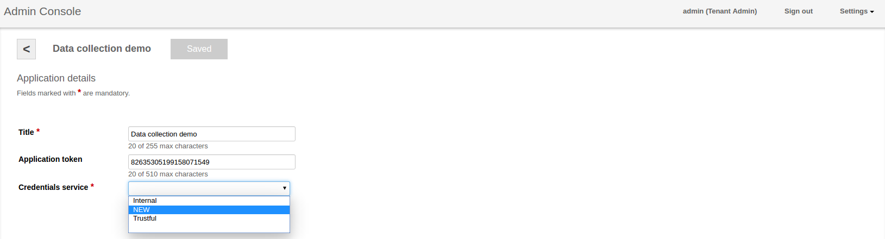

* TOC
{:toc}


 
Kaa establishes a mechanism to uniquely identify each endpoint and associated endpoint credentials. 
This article contains brief description of endpoint authentication mechanism and also process of provisioning and validation of endpoint credentials and registration information.

## Endpoint Authentication

Kaa uses hybrid encryption system that is based on RSA with 2048-bit keypair and AES with 256(512)-bit key. 
During the start of new session, endpoint delivers encrypted session key and the digital signature of this key.
Session key is a randomly generated AES key that is also encrypted with public key of the kaa node which serves this session or request. 
Session key signature is based on the private key of the endpoint.
In order to authenticate endpoint and validate integrity of the request, kaa node validates signature of the session key.

Although other authentication strategies are possible they are out of scope of this article.

## Endpoint Registration

The endpoint registration is the process of initial communication setup that ensures that the endpoint is registered within the Kaa cluster 
along with the corresponding security credentials and the endpoint profile. 
It is not until the endpoint registers on the server that the Kaa framework services become available to the client application. 
During the process of registration, the Kaa endpoint at first communicates with one or multiple Bootstrap services to obtain a list of available Operations services, 
and then with the Operations service to submit the endpoint data and complete the registration.


### Operations service list resolution

Initially, the Kaa endpoint SDK does not include any information about Operations services for security and load-balancing reasons. 
Instead, during the SDK generation, a Control service embeds a list of available Bootstrap services into the SDK 
(using a properties file for Java implementation, a header file for C++, etc.). 
The endpoint selects a random Bootstrap service from the list and sends a resolution request to the selected Bootstrap service. 
The resolution request contains the application token that can be used by the Bootstrap service in specific load-balancing strategies. 
The resolution response from the Bootstrap service contains a prioritized list of Operations services with their connectivity details and 
is signed with the Bootstrap service private key. 
The endpoint verifies the signature of the response by using the Bootstrap public key available from the build time parameters and retains the received information.

### Endpoint Authorization

Endpoint authorization is done by validating endpoint credentials using corresponding credentials service. 
Credentials service may be configured separately for each application use either Admin UI or 
[Admin REST API]({{root_url}}Programming-guide/Server-REST-APIs/#!/Application/editApplication). 


At the moment of writing Kaa endpoint credentials is identifier is based on hash of endpoint RSA Key Pair.
During the start of new session, operations service lookup credentials service based on application identifier 
and uses this credentials service to lookup status of provided credentials object. 
If Credentials object is not found or this credentials are in use by other endpoint, new session is rejected by Kaa node.

### Endpoint Registration information

Kaa platform user is able to provision server-side profile for new endpoints using information about endpoint credentials 
(See following [Admin REST API]({{root_url}}Programming-guide/Server-REST-APIs/#!/Device_management/provisionCredentials) call for more details). 
This server-side profile will be used during endpoint registration. 
Registration service is responsible for storage and queries of this information based on credentials or endpoint identifier.
This feature may be useful in multiple use-cases. 
For example, endpoint manufacturer may provision some secure information to the server-side endpoint profile based on security keys that are available only during manufacturing process.


## Credentials service

Kaa provides two credentials service implementations out-of-the box:

1. Trustful credentials service -  default implementation that allows any endpoint to register and connect to Kaa cluster. (like the previous version of Kaa)
2. Internal credentials service -  allows connecting with Kaa for specified list of endpoints whose credentials was previously provisioned with Kaa 
[Admin REST API]({{root_url}}Programming-guide/Server-REST-APIs/#!/Device_management/provisionCredentials).

### Custom credentials service implementation

1. Create class which implements all method of 
[CredentialsService interface](https://github.com/kaaproject/kaa/blob/1d429a30bb4b5206376b740bb21483929a881ace/server/node/src/main/java/org/kaaproject/kaa/server/node/service/credentials/CredentialsService.java)

```java

package org.myproject;

@Service
public class CustomCredentialsService implements CredentialsService {

    /**
     * Provide credentials information to the external system.
     */
    @Override
    public CredentialsDto provideCredentials(String applicationId, CredentialsDto credentials) throws CredentialsServiceException {
        // implementation
    }

    /**
     * Returns the credentials by ID.
     */
    @Override
    public Optional<CredentialsDto> lookupCredentials(String applicationId, String credentialsId) throws CredentialsServiceException {
        // implementation
    }

    /**
     * Sets the status of the given credentials to CredentialsStatus.IN_USE
     */
    @Override
    public void markCredentialsInUse(String applicationId, String credentialsId) throws CredentialsServiceException {
        // implementation
    }

    /**
     * Revokes the given credentials by setting their status to CredentialsStatus.REVOKED
     */
    @Override
    public void markCredentialsRevoked(String applicationId, String credentialsId) throws CredentialsServiceException {
        // implementation
    }
}

```

2. In /usr/lib/kaa-node/conf/kaaNodeContext.xml register CredentialsServiceLocator for your new credential service 

```xml

<bean id="customCredentialsServiceLocator" class="org.kaaproject.kaa.server.node.service.credentials.InternalCredentialsServiceLocator">
    <constructor-arg ref="org.myproject.customCredentialsService"/>
</bean>
    
<util:map id="credentialsServiceLocatorMap">
    <entry key="Trustful" value-ref="trustfulCredentialsServiceLocator"/>
    <entry key="Internal" value-ref="internalCredentialsServiceLocator"/>
    <entry key="NEW" value-ref="customCredentialsServiceLocator"/>                          
</util:map>

```

Value of key which was added you will see in Admin UI.



3. In /usr/lib/kaa-node/conf/common-dao-context.xml

```xml

<bean id="customCredentialsService" class="org.myproject.CustomCredentialsService"/>

```

### Custom credentials service provisioning

To provision your credentials service, do the following:

1. Build your application using next command: 

   ```bash
      $ mvn clean install
   ```

2. Place ```*.jar``` of your application from ```/target``` folder into the ```/usr/lib/kaa-node/lib``` folder.
3. If you using different package than ```org.kaaproject.kaa.*```, you need to specify it to scan in ```kaa-node.properties``` file in ```/usr/lib/kaa-node/conf``` folder.

    For example provided in this article:
    
   ```additional_plugins_scan_package=org.myproject```.

4. Restart kaa-node service: 

   ```bash
      $ sudo service kaa-node restart
   ```
