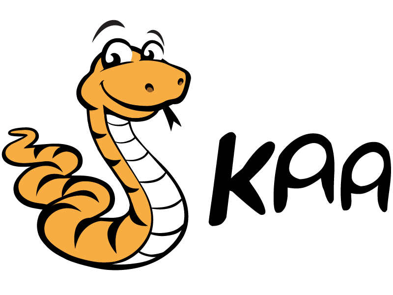

  

Kaa open-source IoT platform 
============================

Kaa is a production-ready, multi-purpose middleware platform for building complete end-to-end IoT solutions, connected applications, and smart products. The Kaa platform provides an open, feature-rich toolkit for the IoT product development and thus dramatically reduces associated cost, risks, and time-to-market. For a quick start, Kaa offers a set of out-of-the-box enterprise-grade IoT features that can be easily plugged in and used to implement a large majority of the IoT use cases.

# Getting started

For the quick start with Kaa IoT platform checkout [Getting started](http://www.kaaproject.org/getting-started/) guide. 
Alternatively, you can [deploy Kaa into your own environment](http://kaaproject.github.io/kaa/docs/v0.10.0/Administration-guide/System-installation/Single-node-installation/).

# Getting help

If you face some troubles with Kaa platform check out [Troubleshooting guide](http://kaaproject.github.io/kaa/docs/v0.10.0/Administration-guide/Troubleshooting/) and [Frequently asked questions](http://docs.kaaproject.org/display/KAA/Frequently+asked+questions) first and if you can't find the solution we welcome you to post your questions at the Kaa project [Google group](http://www.kaaproject.org/forum/).

# Documentation

Kaa documentation is a part of Kaa source code and is located in the [`doc/`](http://github.com/kaaproject/kaa/tree/master/doc) folder. You can find the web version [here](http://kaaproject.github.io/kaa/).

# How to contribute

To contribute to Kaa IoT platform please visit [How to contribute](http://kaaproject.github.io/kaa/docs/Customization-guide/How-to-contribute/) guide.

# Where to report issues

You can report an issue by creating a corresponding ticket in [Kaa task tracker](http://jira.kaaproject.org/browse/KAA/), check out [Jira guide](http://kaaproject.github.io/kaa/docs/Customization-guide/How-to-contribute/Jira-guide/) before submitting one.

# License

Kaa IoT platform is licensed under [Apache Software License 2.0](http://www.apache.org/licenses/LICENSE-2.0).

See [`LICENSE`](https://github.com/kaaproject/kaa/blob/master/LICENSE) and [`copyright.txt`](https://github.com/kaaproject/kaa/blob/master/copyright.txt) for details.