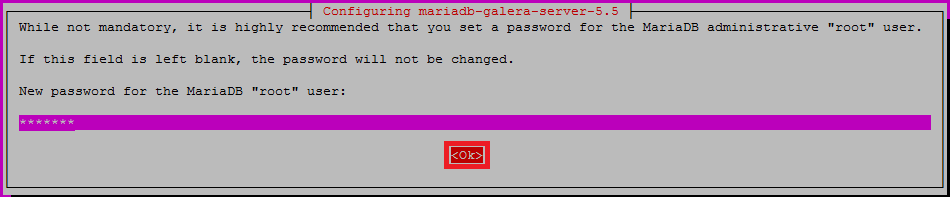



* TOC
{:toc}

This section describes how to set up a [MariaDB](https://mariadb.org/) cluster.

>**NOTE:** This guide is verified against Ubuntu 14.04 LTS Desktop 64-bit.
{:.note}

You need at least 3 hosts running together on Ubuntu 14.04 to form a reliable cluster.
Below is the list of hosts used in this guide to deploy the MariaDB Galera cluster.

```bash
ubuntu-node1 172.1.1.1 
ubuntu-node2 172.2.2.2 
ubuntu-node3 172.3.3.3
```

Before proceeding, install the required packages `rsync`, `galera` and `mariadb-galera-server` on all the three nodes.

## Add MariaDB repositories

The MariaDB and Galera packages are not available in the default Ubuntu repositories.
However, MariaDB project maintains its own repositories for Ubuntu that contain all the packages you need.

To add MariaDB repositories on each of the three servers that will be configured for your cluster:

1. Install the `python-software-properties` package.

   ```bash
   sudo apt-get update
   sudo apt-get install python-software-properties
   ```

2. Add the key files for the MariaDB repository.

   ```bash
   sudo apt-key adv --recv-keys --keyserver hkp://keyserver.ubuntu.com:80 0xcbcb082a1bb943db
   ```

3. Add the repository.

   ```bash
   sudo add-apt-repository 'deb http://mirror.jmu.edu/pub/mariadb/repo/5.5/ubuntu precise main'
   ```

## Install MariaDB with Galera patches

You can install Galera patches using the `apt` interface.

```bash
sudo apt-get update
sudo apt-get install mariadb-galera-server galera
```



>**IMPORTANT:** During the installation process, you will be asked to configure the root password for MariaDB.
>Make sure that you configured the same root password on all the three nodes.
{:.important}

Upon successful installation of the above packages, you will have MariaDB server installed on each one of your three nodes.

If, for some reason, you do not have the `rsync` package installed on your machines, you should install it now.

```bash
sudo apt-get install rsync
```

## Configure MariaDB cluster

Configure MySQL settings:

1. Open the `/etc/mysql/my.cnf` file and comment the following lines on all the three nodes.

   ```bash
   root@ubuntu-nodeX:~# nano /etc/mysql/my.cnf
   #bind-address           = 127.0.0.1
   #default_storage_engine = InnoDB
   #query_cache_limit              = 128K
   #query_cache_size               = 64M
   ```

2. Change the `max_allowed_packet` variable.

   ```bash
   max_allowed_packet=20M
   ```

3. Add the following lines under `[mysqld]`.

   ```bash
   [mysqld]
   binlog_format=ROW
   default_storage_engine=innodb
   innodb_autoinc_lock_mode=2
   innodb_locks_unsafe_for_binlog=1
   innodb_doublewrite=1
   lower_case_table_names=1
   ```

4. Configure WSRep provider settings.
To do this, set the `wsrep` configurations on each node under the `[mysqld]`, using the specific hostname, root password and IP address of each node.

	Configurations for `ubuntu-node1`.

   ```bash
   [mysqld]
   wsrep_provider=/usr/lib/galera/libgalera_smm.so
   wsrep_provider_options="gcache.size=256M; gcache.page_size=128M"
   wsrep_cluster_address=gcomm://172.1.1.1,172.2.2.2,172.3.3.3
   wsrep_cluster_name="MariaDB_Cluster"
   wsrep_node_address="ubuntu-node1"
   wsrep_node_name="ubuntu-node1"
   wsrep_node_incoming_address=172.1.1.1
   wsrep_sst_receive_address=172.1.1.1
   wsrep_slave_threads=16
   ```

    Configurations for `ubuntu-node2`.

   ```bash
   [mysqld]
   wsrep_provider=/usr/lib/galera/libgalera_smm.so
   wsrep_provider_options="gcache.size=256M; gcache.page_size=128M"
   wsrep_cluster_address=gcomm://172.1.1.1,172.2.2.2,172.3.3.3
   wsrep_cluster_name="MariaDB_Cluster"
   wsrep_node_address="ubuntu-node2"
   wsrep_node_name="ubuntu-node2"
   wsrep_node_incoming_address=172.2.2.2
   wsrep_sst_receive_address=172.2.2.2
   wsrep_slave_threads=16
   ```

   Configurations for `ubuntu-node3`.

   ```bash
   [mysqld]
   wsrep_provider=/usr/lib/galera/libgalera_smm.so
   wsrep_provider_options="gcache.size=256M; gcache.page_size=128M"
   wsrep_cluster_address=gcomm://172.1.1.1,172.2.2.2,172.3.3.3
   wsrep_cluster_name="MariaDB_Cluster"
   wsrep_node_address="ubuntu-node3"
   wsrep_node_name="ubuntu-node3"
   wsrep_node_incoming_address=172.3.3.3
   wsrep_sst_receive_address=172.3.3.3
   wsrep_slave_threads=16
   ```

5. Save and close the `"/etc/mysql/my.cnf"` file on all the three nodes.

## Copy Debian maintenance configuration

Currently, MariaDB servers on Ubuntu and Debian use a special maintenance user for routine maintenance.
This user executes other important tasks, such as stopping MySQL.

If cluster environment is shared between individual nodes, the maintenance user that randomly generates login credentials on each node cannot execute its commands correctly.
As a result, the initial server will have the correct maintenance credentials, and the others will attempt to use their local settings to access the shared cluster environment.

To fix this, open the Debian maintenance configuration file on one of your servers.

```bash
sudo nano /etc/mysql/debian.cnf
```

Below is an example of the file contents.

```bash
[client]
host     = localhost
user     = debian-sys-maint
password = 03P8rdlknkXr1upf
socket   = /var/run/mysqld/mysqld.sock
[mysql_upgrade]
host     = localhost
user     = debian-sys-maint
password = 03P8rdlknkXr1upf
socket   = /var/run/mysqld/mysqld.sock
basedir  = /usr
```

Copy it and paste to the same file on the other two nodes, replacing their original contents, to have the same configuration for all the three nodes.

## Start MariaDB cluster

To start MariaDB cluster:

1. Check ports 4444 and 4567.
These ports must be free and open for connections from hosts to the other nodes.
This is important for `wsrep` communication.

2. Stop the running MariaDB service by running this command on each node.

   ```bash
   sudo service mysql stop
   ```

3. Start up your first node with a special parameter.

   ```bash
   sudo service mysql start --wsrep-new-cluster
   ```

    In the cluster configuration, each node that goes online tries to connect to at least one other node specified in its configuration file to get its initial state.
    Without the `--wsrep-new-cluster` parameter, this command will fail because the first node is unable to connect to any other nodes.

4. On each of the other nodes, start MariaDB as you normally would.

   ```bash
   sudo service mysql start
   ```

    Your cluster should now be online and communicating.

    You can verify the status of your running cluster and its replication by running the following command on each node.
    The command output will also display the cluster size.

   ```bash
   root@ubuntu-node1:~# mysql -u root -pmariadb_admin_password -e 'SHOW STATUS LIKE "wsrep_cluster_size"'
   root@ubuntu-node2:~# mysql -u root -pmariadb_admin_password -e 'SHOW STATUS LIKE "wsrep_cluster_size"'
   root@ubuntu-node3:~# mysql -u root -pmariadb_admin_password -e 'SHOW STATUS LIKE "wsrep_cluster_size"'
   ```

## Create new user

To create a new user, run the commands below.

```bash
root@ubuntu-any_node:~# mysql -u root -p
Enter password:
 
MariaDB>CREATE USER 'user_name'@'(host or '%')' IDENTIFIED BY 'some_password';
MariaDB>GRANT ALL PRIVILEGES ON *.* TO 'user_name'@'(host or '%')' WITH GRANT OPTION;
MariaDB>FLUSH PRIVILEGES;
```

>**IMPORTANT:** Do not use **ALL PRIVILEGES** when you create a user for your database.
>[More information about MySQL privileges](http://dev.mysql.com/doc/refman/5.7/en/privileges-provided.html).
{:.important}