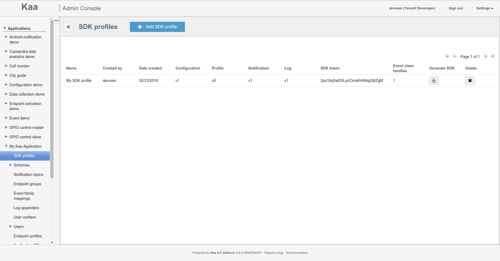
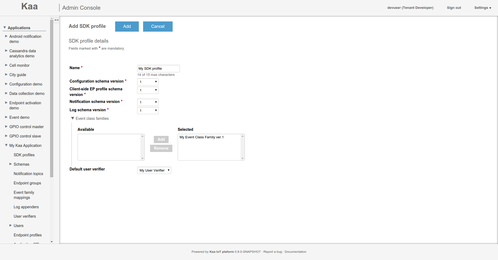
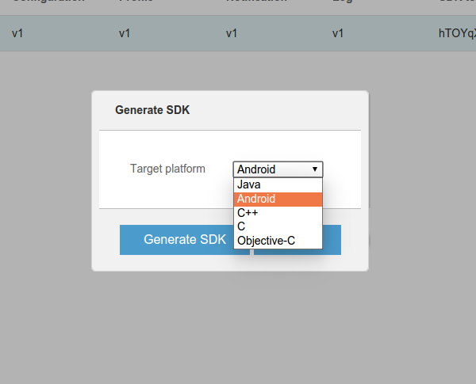
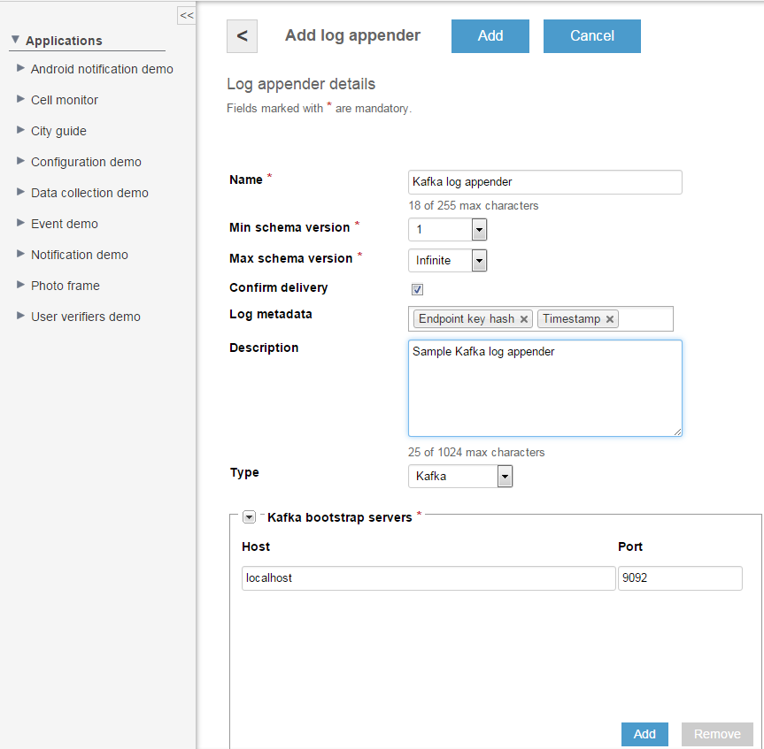
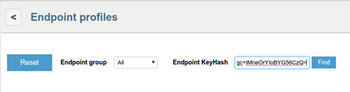



**Table of Contents**

- [First registration](#first-registration)
- [Kaa user types](#kaa-user-types)
- [Kaa admin](#kaa-admin)
  - [Configuring general settings](#configuring-general-settings)
  - [Configuring outgoing mail settings](#configuring-outgoing-mail-settings)
  - [Managing System CTL](#managing-system-ctl)
- [Tenant admin](#tenant-admin)
  - [Managing applications](#managing-applications)
  - [Managing event class families](#managing-event-class-families)
  - [Managing Tenant CTL](#managing-tenant-ctl)
- [Tenant developer](#tenant-developer)
  - [SDK profiles](#sdk-profiles)
    - [Viewing SDK profiles](#viewing-sdk-profiles)
    - [Creating SDK profiles](#creating-sdk-profiles)
    - [SDK token](#sdk-token)
    - [Generating endpoint SDK](#generating-endpoint-sdk)
  - [Adding shemas](#adding-shemas)
    - [Client-side endpoint profile schema](#client-side-endpoint-profile-schema)
    - [Server-side endpoint profile schema](#server-side-endpoint-profile-schema)
    - [Configuration schema](#configuration-schema)
    - [Notification schema](#notification-schema)
    - [Log schema](#log-schema)
  - [Adding notification topics](#adding-notification-topics)
  - [Sending notifications](#sending-notifications)
  - [Adding endpoint groups](#adding-endpoint-groups)
    - [Add profile filter to endpoint group](#add-profile-filter-to-endpoint-group)
    - [Add configuration to endpoint group](#add-configuration-to-endpoint-group)
    - [Add notification topic to endpoint group](#add-notification-topic-to-endpoint-group)
  - [Adding event family mappings](#adding-event-family-mappings)
  - [Updating configuration for specific user](#updating-configuration-for-specific-user)
  - [Adding log appenders](#adding-log-appenders)
    - [File log appender](#file-log-appender)
    - [REST log appender](#rest-log-appender)
    - [MongoDB log appender](#mongodb-log-appender)
    - [Flume log appender](#flume-log-appender)
    - [CDAP log appender](#cdap-log-appender)
    - [Oracle NoSQL log appender](#oracle-nosql-log-appender)
    - [Cassandra log appender](#cassandra-log-appender)
    - [Kafka log appender](#kafka-log-appender)
    - [Couchbase log appender](#couchbase-log-appender)
  - [Adding user verifiers](#adding-user-verifiers)
    - [Trustful verifier](#trustful-verifier)
    - [Facebook verifier](#facebook-verifier)
    - [Google+ verifier](#google-verifier)
    - [Twitter verifier](#twitter-verifier)
  - [Managing endpoint profiles](#managing-endpoint-profiles)
  - [Managing Application CTL](#managing-application-ctl)
  - [Managing Tenant CTL](#managing-tenant-ctl-1)
- [Avro UI forms](#avro-ui-forms)
  - [Avro UI form types](#avro-ui-form-types)
    - [Schema form](#schema-form)
    - [Record form](#record-form)
  - [Working with schema form](#working-with-schema-form)
  - [Working with record form](#working-with-record-form)
  - [Avro UI forms GWT Sandbox](#avro-ui-forms-gwt-sandbox)
  - [Avro schema parameters](#avro-schema-parameters)

This guide explains how to manage develop applications in Kaa Admin UI and how to work with Avro UI forms.

This guide also explains how to use _Avro UI forms GWT Sandbox_, which is a testing environment for Avro UI forms.

This guide assumes that Kaa has already been installed and Admin UI is available from the web. If it's not the case, look at the [Installation guide]({{root_url}}Programming-guide/Getting-started/#installation) for more info.

# First registration

The first time you log in to Kaa Admin UI, it is required that you register as a [Kaa admin](#kaa-admin).


# Kaa user types

The following three user types are available in Kaa :

- Kaa admin
- Tenant admin
- Tenant developer

**NOTE**
In Kaa Sandbox, [default credentials]({{root_url}}/Programming-guide/Getting-started/#admin-ui) are provided for all three types of Kaa users.

# Kaa admin

The _Kaa admin_ is the highest level administrator of Kaa. He is able to create, edit, and delete tenant admins.
To log into the Kaa UI as a Kaa admin, use the previously created username/password for the Kaa admin.


To customize the account, click **Settings => Profile** in the upper right corner of the window and change the first/last name and e-mail to the private ones. Click **Save** to apply the changes.
Note that **Email** is a mandatory field.


To set a private password, click **Settings => Change password** and fill in the fields as required.


## Configuring general settings

The **General settings** window allows you to configure the application title and application base URL parameters. These parameters are used for sending email notifications to registered users.
To customize the general settings, click **Settings => General** settings and fill in the fields as required.


## Configuring outgoing mail settings

Outgoing mail settings are used to send emails to newly created users with the information about their passwords, as well as for sending other notifications.
To customize the outgoing mail settings, click **Settings => Outgoing mail settings** and fill in the fields according to your SMTP mail server configuration.


## Managing System CTL

The **System CTL** window displays a list of CTs with system scope. A Kaa admin can add new system CTs and delete system CTs from the system.


To create a new system CT, click **Add new type** and then fill in all the required fields. Click **Add** to apply the changes.


To view a system CT, open the CT details window by clicking the row in the list in the **System CTL** window.


To view another version of the system CT, click on the version drop-down and select the appropriate version.

To create a new version of the system CT of the same FQN, click **Create new version** on the top of CT details.

To export the system CT, click **Export** and select export method from drop-down. See [CT schema export support999](999) for available export methods details.

To delete the system CT version, click **Delete** on the top of the CT details.

# Tenant admin

The _tenant admin_ is a Kaa user who is responsible for managing applications, users and event class families.
To log into the Admin UI as a tenant admin, use the previously generated username/password for the tenant admin.
To customize the account, click **Settings => Profile** and change the first/last name and e-mail to private ones.
To set a private password, click **Settings => Change password** and fill in the fields as required.

## Managing applications

As a tenant admin, you can add and edit applications.

To create a new application, do the following:

1. Open the **Applications** window by clicking the corresponding link on the navigation panel.

    

2. Click **Add application** at the top of the window.
3. Enter the title of your application and then click **Add**.

    

**NOTE:** If you open the **Application details** window of the newly created application (by clicking this application on either the **Applications** menu on the navigation panel or the **Applications** window), you will notice that the **Application Token** field has been filled in automatically. This is a unique auto-generated application ID.

To edit the application, open the **Application details** window by clicking the application name either on the navigation panel or in the list in the **Applications** window.

## Managing event class families

To use the Kaa [events feature999](999) for one or more applications, the tenant admin should create an event class family (ECF). Each ECF should be described using the [Avro](http://avro.apache.org/docs/current/spec.html) format.

To create a new ECF, do the following:

1. Open the **Event class families** window by clicking the corresponding link on the navigation panel.
2. In the **Event class families** window, click **Add ECF**.

   

3. In the **Add ECF** window, fill in all the required fields and then click **Add**.
**NOTE:** the namespace and class name values should be unique.

   

4. In the **Event class families** window, add (optionally) an ECF schema by clicking **Add schema** under the **Schemas** table.

   

5. In the **Add event class family schema** window, create an ECF schema either by using the **Event class family schema** [schema form](#schema-form) or by uploading the schema from a file, then click Add.
**NOTE:** More than one schema can be added to an ECF.
**NOTE:** If uploaded from a file, a schema(s) should be written in the [Avro](http://avro.apache.org/docs/current/spec.html) format and describe how event classes should be grouped depending on subject areas.

   

A unique version number is assigned to a schema after its creation and then the schema appears as a clickable line in the **Schemas** table. To review the ECF schema details, click the appropriate schema line in the **Schemas** table. Each schema automatically splits into event classes. A full qualifier name, schema and type are shown for each event class in the table with the same name.


## Managing Tenant CTL

The **Tenant CTL** window displays a list of CTs with tenant and system scope. The tenant admin can add new tenant CTs and delete tenant CTs from the system. It has read-only access to the system CTs.


To display/hide higher scopes of CTs, check/uncheck **Display higher scopes** checkbox.
To create a new tenant CT, click **Add new type** and then fill in all the required fields. Click **Add** to apply the changes.


To view a CT, open the CT details window by clicking the row in the list in the **Tenant CTL** window.


To view another version of the CT, click on the version drop-down and select the appropriate version.
To create a new version of the tenant CT of the same FQN, click **Create new version** on the top of CT details.
To export the CT, click Export and select export method from drop-down. See [CT schema export support999](999) for available export methods details.
To delete the tenant CT version, click Delete on the top of the CT details.

# Tenant developer

The tenant developer is a user that creates SDKs based on customer requirements. Tenant developers set the Kaa schemas, group endpoints, and control notification processes.

To log into the Kaa UI as a tenant developer, use the previously generated credentials for the tenant developer.

To customize this account, click **Settings => Profile** and change the first/last name and e-mail to private ones.

To set a private password, click **Settings => Change password**.

**NOTE:** A tenant developer is able to work only with those applications which have been created by his tenant admin. The list of available applications is displayed in the **Applications** window, as well as on the navigation panel under the **Applications** menu.

## SDK profiles

Each SDK instance in Kaa is based on the SDK profile – a template which is used to generate SDK instances for different target platforms. This template must be created by the tenant developer as the first step of the application development process.

### Viewing SDK profiles

To view a list of the SDK profiles already created for the application, open the **SDK profiles** window either from the navigation panel or by clicking **Generate SDK** in the application view.



To view some SDK profile in detail, open the **SDK profile** window by clicking on the profile from the list.


### Creating SDK profiles

To create an SDK profile for the application, do the following:

1. Select the application under the **Applications** menu on the navigation panel.
2. In the **Application details** window, click **Generate SDK**.
3. In the **SDK profiles** window, click **Add SDK profile**.
4. In the **Add SDK profile** window, provide a name and select schema versions for the SDK profile.
5. To use the Kaa event feature, add one or more event class families and specify a user verifier.
6. Click **Add** at the top of the window to finish creating the SDK profile.

   

Once created, the SDK profile cannot be changed. However, unused or erroneous SDK profiles can be deleted by clicking on the **Delete** icon.

**NOTE**
The SDK profile in use cannot be deleted. An attempt to delete the SDK profile that has endpoint profiles associated with it will fail and result in an error.

### SDK token

Each SDK profile has a unique _SDK token_ associated with it. These tokens are generated from the SDK profile's raw data using [SHA-1](https://en.wikipedia.org/wiki/SHA-1) algorithm and then encoded in URL-safe [Base64](https://en.wikipedia.org/wiki/Base64).

### Generating endpoint SDK

To generate the SDK instance from the **SDK profile**, open the SDK profiles window, then click on the **Generate SDK** icon next to the selected SDK profile, select the target platform, and click **Generate SDK**.



The resulting file will contain the appropriate SDK token as a part of its name.

## Adding shemas

In Kaa, an SDK for an application is generated based on the following five schemas: client-side endpoint profile, server-side endpoint profile, configuration, notification, and log. Every application has default schemas, which can be accessed from the **Schema** submenu in the corresponding application menu on the navigation panel.

### Client-side endpoint profile schema

The list of client-side endpoint profile schemas created by a tenant developer for the application is shown in the **Client-side EP profile schemas** window, which can be opened from the application menu on the navigation panel as illustrated by the following screenshot.


To export the client-side EP profile schema, click **Export** in the last column of desired schema row and select export method from drop-down. See [CT schema export support999](999) for available export methods details.

As a tenant developer, you can create new client-side EP schemas for the application as follows:

1. In the **Client-side EP profile schemas** window for the application, click **Add schema**.
2. In the **Add profile schema** window enter the name of the schema.
3. Then create a schema using one of the two options:
  - Using the existing CT by clicking **Select existing type** and selecting exiting CT version from FQN and version drop-downs.

        
  - Create new CT by clicking **Create new type**. In this case you will be redirected to **Add new type** window. Here you can create a schema either by using the [schema form](#schema-form) or by uploading a schema in the [Avro](http://avro.apache.org/docs/current/spec.html) format from a file.

        
4. Click **Add** at the top of the window to save the schema.

If you want to review the added Avro schema, open the corresponding **Client-side EP profile schema** window by clicking the schema in the **Client-side EP profile schemas** window.


### Server-side endpoint profile schema

The list of server-side endpoint profile schemas created by a tenant developer for the application is shown in the **Server-side EP profile schemas** window, which can be opened from the application menu on the navigation panel as illustrated by the following screenshot.


To export the server-side EP profile schema, click **Export** in the last column of desired schema row and select export method from drop-down. See [CT schema export support999](999) for available export methods details.

As a tenant developer, you can create new server-side EP schemas for the application as follows:

1. In the **Server-side EP profile schemas** window for the application, click **Add schema**.
2. In the **Add profile schema** window enter the name of the schema.
3. Then create a schema using one of the two options:
  - Using the existing CT by clicking **Select existing type** and selecting exiting CT version from FQN and version drop-downs.

        
  - Create new CT by clicking **Create new type**. In this case you will be redirected to **Add new type** window. Here you can create a schema either by using the [schema form](#schema-form) or by uploading a schema in the [Avro](http://avro.apache.org/docs/current/spec.html) format from a file.

        
4. Click **Add** at the top of the window to save the schema.

If you want to review the added Avro schema, open the corresponding **Server-side EP profile schema** window by clicking the schema in the **Server-side EP profile schemas** window.


### Configuration schema

The list of configuration schemas created by a tenant developer for the application is shown in the **Configuration schemas** window.


As a tenant developer, you can create new configuration schemas for the application as follows:

1. In the **Configuration schemas** window for the application, click **Add schema**.
2. In the **Add configuration schema** window, create a configuration schema either by using the [schema form](#schema-form) or by uploading a schema in the [Avro](http://avro.apache.org/docs/current/spec.html) format from a file.

    
3. Click **Add** to save the schema.

If you want to review the added Avro schema, open the corresponding **Configuration schema** window by clicking the schema in the **Configuration schemas** window.


### Notification schema

The list of notification schemas created by a tenant developer for the application is shown in the **Notification schemas** window.


As a tenant developer, you can create new notification schemas for the application as follows:

1. In the **Notification schemas** window for the application, click **Add schema**.
2. In the **Add notification schema** window, create a notification schema either by using the [schema form](#schema-form) or by uploading a schema in the [Avro](http://avro.apache.org/docs/current/spec.html) format from a file.

    
3. Click **Add** to save the schema.

If you want to review the added Avro schema, open the corresponding **Notification schema** window by clicking the schema in the **Notification schemas** window.


### Log schema

The list of log schemas created by a tenant developer for the application is shown in the **Log schemas** window.


As a tenant developer, you can create new log schemas for the application as follows:

1. In the **Log schemas** window for the application, click **Add schema**.
2. In the **Add log schema** window, create a log schema either by using the [schema form](#schema-form) or by uploading a schema in the [Avro](http://avro.apache.org/docs/current/spec.html) format from a file.

   
3. Click **Add** to save the schema.

If you want to review the added Avro schema, open the **Log schema details** window by clicking the schema in the **Log schemas** window.


## Adding notification topics

Notification topics are used for grouping notifications by subject. An endpoint group will receive only those notifications which correspond to the notification topics this endpoint group is subscribed to.

To add a new notification topic to the application, do the following:

1. Open the **Notification topics** window by clicking **Notification topics** under the application menu on the navigation panel and then click **Add notification topic**.

    
2. Fill in all necessary fields and then click **Add**.

    

    The newly created topic will appear in the **Notification topics** window.

    

## Sending notifications

To send a notification for the application, do the following:

1. In the **Notification topics**, click the mail icon next to the appropriate notification topic.
2. In the **Send notification** window, create a notification either by using the **Notification body** [record form](#record-form) or by uploading the data in the JSON format from a file.
**NOTE:** The contents of the file should match the corresponding notification schema.
**NOTE:** If **Endpoint KeyHash** field is empty will be sent a broadcast notification.

    
3. Click **Send** to send the notification.

For example, the default sandbox notification schema structure is the following:

```json
{
    "type": "record",
    "name": "Notification",
    "namespace": "org.kaa.config",
    "fields": [
        {
            "name": "message",
            "type": "string"
        }
    ]
}
```

The file with the following contents will match the default sandbox notification schema.

```
{"message": "Hello from Kaa!"}
```

## Adding endpoint groups

Endpoint groups are created based on the profile filter and configuration.

To add a new endpoint group, do the following:

1. Open the **Endpoint groups** window by clicking **Endpoint groups** under the application menu on the navigation panel and then click **Add endpoint group**.

    
2. In the **Add endpoint group** window, fill in the required fields and then click **Add**.

    
3. In the **Endpoint group** window, add profile filters, configurations, and notifications topics to the group, if necessary (see the following paragraphs for instructions).

    

### Add profile filter to endpoint group

To add a profile filter to the endpoint group, do the following:

1. In the **Endpoint group** window, click **Add profile filter**.
2. In the **Profile filter** window, select the schema version.
3. On the **Draft** tab, enter the description and [filter body999](999).

    

    **NOTE:** In order to test profile filter click **Test filter**. Afterwards the **Test profile filter** window will be displayed. Complete the endpoint and/or server profile forms and then click **Test filter**.

    
4. Click **Save** to save the profile filter.
**NOTE:** You can save the data on the **Draft** tab and return to update it later as many times as needed until you click **Activate**.
5. Click **Activate** to activate the profile filter.
All the specified information will be displayed on the **Active** tab.

### Add configuration to endpoint group

To add a configuration to the endpoint group, do the following:

1. In the **Endpoint group** window, click **Add configuration**.
2. In the **Configuration** window, select the schema version.
3. On the **Draft** tab, enter the description, create the configuration using the **Configuration body** [record form](#record-form), and then click **Save**.
**NOTE:** You can save the data on the **Draft** tab and return to update it later as many times as needed until you click **Activate**.

    
4. Click **Activate** to activate the configuration.
All the specified information will be displayed on the **Active** tab.

### Add notification topic to endpoint group

To add a notification topic to the endpoint group, do the following:

1. In the **Endpoint group** window, click **Add notification topic**.
2. In the **Add topic to endpoint group** dialog, select the topic(s) and click **Add**.
Now all the endpoints belonging to the current group will be subscribed to notifications on these topics.

    

## Adding event family mappings

[Event family mappings999](999) are used by tenant developers to set event class families for the application and determine the actions for each class family - whether an application should be a source, a sink, or both.

To view the list of ECFs which are mapped to the application, open the **Event family mappings** window by clicking **Event family mappings** under the application on the navigation panel.


To add a new mapping, do the following:

1. In the **Event family mappings** window, click **Add family event mapping**.
2. Select an appropriate ECF from the drop-down list and then set appropriate actions for each class of the family.


## Updating configuration for specific user

To update configuration data for the specific user under the application, do the following:

1. Click **Users >> Update configuration** under the application menu on the navigation panel.
2. In the **Update configuration** window, specify the user id, select a configuration schema and specify a new configuration body.
3. Click **Update** to apply changes.

    

## Adding log appenders
A tenant developer can set a log appender for a log schema depending on the data storage type. All created log appenders are displayed in the **Log appenders** window.

**NOTE:** It is possible to add several log appenders for one log schema.

### File log appender

To create a log appender of the [file system storage type999](999), do the following:

1. In the **Log appenders** window, click **Add log appender**.
2. Enter the log appender name and description, select the minimum and maximum supported log schema version, and select necessary log metadata fields.
3. Set the log appender type to File.
4. Fill in other fields as required.
5. Click **Add**.

    

### REST log appender

To create a log appender for access via REST, do the following:

1. In the Log appenders window, click Add log appender.
2. Enter the log appender name and description, select the minimum and maximum supported log schema version, and select necessary log metadata fields.
3. Set the log appender type to REST.
4. Fill in other fields as required.
5. Click Add.

    

### MongoDB log appender

To create a log appender of the [MongoDB storage type999](999), do the following:

1. In the **Log appenders** window, click **Add log appender**.
2. Enter the log appender name and description, select the minimum and maximum supported log schema version, and select necessary log metadata fields.
3. Set the log appender type to _Mongo_.
4. Fill in the Mongo log appender configuration form.
5. Click **Add**.

    

### Flume log appender

To create a log appender which will be integrated with Hadoop or Spark, do the following:

1. In the Log appenders window, click Add log appender.
2. Enter the log appender name and description, select the minimum and maximum supported log schema version, and select necessary log metadata fields.
3. Set the log appender type to _Flume_.
4. Fill in the Flume log appender configuration form.
**NOTE:** Flume log appenders can have either _prioritized_ or _round robin_ host balancing.
5. For the prioritized host balancing, add the number of hosts which is equal to the number of Flume nodes. For every host, enter the host address, port and priority. The highest priority is 1. When choosing a server to which to save logs, an endpoint will send requests to the servers starting from the server with the highest priority.

    
6. For round robin host balancing, add the number of hosts which is equal to the number of Flume nodes. For every host, enter the host address and port. When choosing a server to which to save logs, an endpoint will send requests to the servers according to the round robin algorithm.

    
7. Click Add.

### CDAP log appender

To create a log appender which will be integrated with [CDAP999](999), do the following:

1. In the **Log appenders** window, click **Add log appender**.
2. Enter the log appender name and description, select the minimum and maximum supported log schema version, and select necessary log metadata fields.
3. Set the log appender type to _Cdap_.
4. Fill in the CDAP log appender configuration form.
5. Click **Add**.

    

### Oracle NoSQL log appender
To create a log appender of the [Oracle NoSQL key/value storage type999](999), do the following:

1. In the Log appenders window, click Add log appender.
2. Enter the log appender name and description, select the minimum and maximum supported schema version, select necessary log metadata fields.
3. Set the log appender type to _Oracle NoSQL_.
4. Fill in the Oracle NoSQL log appender configuration form.
5. Click **Add**.

    

### Cassandra log appender
To create a log appender of the [Cassandra storage type999](999), do the following:

1. In the **Log appenders** window, click **Add log appender**.
2. Enter the log appender name and description, select the minimum and maximum supported schema version, select necessary log metadata fields.
3. Set the log appender type to Cassandra.
4. Fill in the Cassandra log appender configuration form.
5. Click **Add**.

    

### Kafka log appender
To create a log appender of the [Kafka storage type999](999), do the following:

1. In the **Log appenders** window, click **Add log appender**.
2. Enter the log appender name and description, select the minimum and maximum supported schema version, select necessary log metadata fields.
3. Set the log appender type to _Kafka_.
4. Fill in the Kafka log appender configuration form.
5. Click **Add**.

    

### Couchbase log appender

To create a log appender of the [Couchbase storage type999](999), do the following:

1. In the **Log appenders** window, click **Add log appender**.
2. Enter the log appender name and description, select the minimum and maximum supported schema version, select necessary log metadata fields.
3. Set the log appender type to _Couchbase_.
4. Fill in the Couchbase server list and other fields.
5. Click **Add**.

    

## Adding user verifiers

Each SDK can be configured to use a default user verifier. All created user verifiers are displayed in the **User verifiers** window.

### Trustful verifier

To create a trustful user verifier, do the following:

1. In the **User verifiers** window, click **Add user verifier**.
2. Enter the user verifier name and description.
3. Set the user verifier type to _Trustful verifier_.
4. Click **Add**.

    

### Facebook verifier

To create a Facebook user verifier, do the following:

1. In the **User verifiers** window, click **Add user verifier**.
2. Enter the user verifier name and description.
3. Set the user verifier type to _Facebook verifier_.
4. Fill in the Facebook verifier form, specifying the Facebook application id, application secret and maximum number of allowed connections per verifier.
5. Click **Add**.

    

### Google+ verifier

To create a Google+ user verifier, do the following:

1. In the **User verifiers** window, click **Add user verifier**.
2. Enter the user verifier name and description.
3. Set the user verifier type to _Google+ verifier_.
4. Fill in the Google+ verifier form, specifying the minimum and maximum number of allowed connections per verifier, and the time in milliseconds to keep a connection alive.
5. Click **Add**.

    

### Twitter verifier

To create a Twitter user verifier, do the following:

1. In the **User verifiers** window, click **Add user verifier**.
2. Enter the user verifier name and description.
3. Set the user verifier type to _Twitter verifier_.
4. Fill in the Twitter verifier form, specifying the Twitter application consumer key, consumer secret, and the maximum number of allowed connections per verifier.
5. Click **Add**.

    

## Managing endpoint profiles

To retrieve information on a specific client-side and server-side endpoint profiles, do the following:

1. Under the target application on the navigation panel, click **Endpoint profiles**.

    

2. In the **Endpoint profiles** window, use the **Endpoint** group and the **Endpoint KeyHash** filters to limit the scope of endpoint profiles to display.

    

    
3. To view a detailed information for a specific client-side and server-side endpoint profile, open the corresponding **Endpoint profile** window by clicking on a profile from the list.

    
4. To download client-side or server-side endpoint profiles JSONs click corresponding "Download JSON" button.

## Managing Application CTL

The **Application CTL** window displays a list of CTs of the current application, of the current tenant and all CTs with system scope. The tenant developer can add new application CTs and delete application CTs from the system. It has read-only access to the system CTs and to the tenant CTs within **Application CTL** window. Tenant developer is still able to manage tenant CTs within **Tenant CTL** window.


To display/hide higher scopes of CTs, check/uncheck **Display higher scopes** checkbox.

To create a new application CT, click **Add new type** and then fill in all the required fields. Click **Add** to apply the changes.


To view a CT, open the CT details window by clicking the row in the list in the **Application CTL** window.


To view another version of the CT, click on the version drop-down and select the appropriate version.

To create a new version of the application CT of the same FQN, click **Create new version** on the top of CT details.
To export the CT, click **Export** and select export method from drop-down. See [CT schema export support999](999) for available export methods details.
To delete the application CT version, click **Delete** on the top of the CT details.

To promote the application CT from application to tenant scope, click **Promote**.

## Managing Tenant CTL
The **Tenant CTL** window displays a list of CTs with tenant and system scope. The tenant developer can add new tenant CTs and delete tenant CTs from the system. It has read-only access to the system CTs.
The tenant developer has the same Tenant CTL management capabilities as the tenant admin. See [Managing Tenant CTL](#managing-tenant-ctl) in the Tenant admin section.

# Avro UI Forms

Avro UI forms are GUI components in the Admin UI that allow you to create Kaa schemas and enter corresponding data records without using the [Avro/JSON](http://avro.apache.org/docs/current/spec.html) syntax.

## Avro UI form types

There are two Avro UI form types: a _schema form_ and a _record form_.

### Schema form

A schema form allows the user (tenant developer) to create Kaa schemas (profile, configuration, notification, and log schemas) for applications in Admin UI.

It consists of a header with the general schema info, such as the name, namespace, and display name, and the **Fields** section where you can add fields to your schema.

**NOTE**  
You can also upload a schema from a file using the **Upload from file** option. In this case, the schema must be provided in the JSON format.


### Record form

A record form allows the user (tenant developer) to enter data records according to corresponding Kaa schemas (configuration and notification schemas) for applications in Admin UI.

A record form contains the fields according to the corresponding schema.

**NOTE**  
You can also upload data from a file using the **Upload from file** option. In this case, the data must be provided in the JSON format.


## Working with schema form

An example of a schema form usage is creating a new configuration schema.

1.  Open the **Configuration schemas** window for some application in Admin UI and then click **Add schema**.
2.  In the **Configuration schema** schema form, specify the name, namespace, and display name of the record.  

    

3.  To add a new field, click **Add** in the **Fields** section in the form.
4.  On the **Add new Field** page of the form, specify the field parameters as required and select the field type.  

    

5.  Depending on the selected field type, specify additional parameters for the field.  

    

6.  Click **Add** to finish adding the field.  

    

7.  In a similar way, add as many fields as necessary and then save the schema (see [Adding schemas section](#adding-shemas) for details).

## Working with record form

An example of a record form usage is adding new configuration data to an endpoint group.

1.  Open the **Endpoint groups** window for some application in Admin UI and click on some endpoint group.  

    

2.  Scroll down to the **Configurations** form and then click **Add configuration**.  

    

3.  Specify the field values in the **Configuration body** record form and then click **Save** to save the configuration.  

    

4.  To apply the new configuration, click **Activate**.

## Avro UI forms GWT Sandbox

_Avro UI forms GWT Sandbox_ is a tool for testing Avro UI forms. It allows you to create an Avro schema using the schema form (or adding a schema in the Avro format) and see what the corresponding record form will look like.

To start using this tool, [install and run Kaa Sandbox](http://docs.kaaproject.org/display/KAA/Kaa+Sandbox#KaaSandbox-InstallingSandbox) at first and then go to the following URL (by default): [http://127.0.0.1:9080/avroUiSandbox/](http://127.0.0.1:9080/avroUiSandbox/).


To generate an Avro UI record form, proceed as follows:

1.  Create an Avro schema in the schema form or, alternatively, click **Upload from JSON** and paste your schema into the text field.
2.  Click **Generate form**.  

    

3.  (Optional) To view the generated schema in the JSON format, click **Show JSON** under the schema form.

    

To view the JSON record for the data from the record form, enter some data into the field(s) and click **Show JSON**.


To upload data from the JSON record into the record form, click **Upload from JSON**, then enter the data into the text field in the JSON format and click **Upload**.


## Avro schema parameters

If the Avro schema is added in the JSON format rather than via GUI, the following parameters of the schema determine the layout and values displayed on the Avro UI record form.

*   displayName - displays the name of the field on UI
*   displayNames - displays the name of each enumeration symbol on UI (only for enumeration fields in the schema)
*   displayPrompt - displays the text prompt for the field on UI
*   by_default - displays the default value of the field on UI
*   minRowCount - defines a minimum number of rows in a UI table (only for arrays in the schema)
*   optional - defines whether the field on UI is optional or mandatory
*   weight - defines a relative width of the corresponding column on UI (only for arrays in the schema)
*   keyIndex - defines the order in which the fields of a record are displayed in a row (only for arrays of records in the schema; integer; if this parameter is defined selectively for specific fields of the record, the other fields of the record will not be displayed)
*   overrideStrategy - defines [how to merge arrays in the configuration across the endpoint groups999](999) (only for arrays in the schema; accepted values are "replace" and "append"; "replace" by default)
*   fieldAccess - defines the viewing and editing restrictions for the field (accepted values are "read_only", "editable" and "hidden"; "editable" by default)
*   inputType - defines whether the characters will be masked or not when the user enters the field value (accepted values are "password" and "plain"; "plain" by default)
