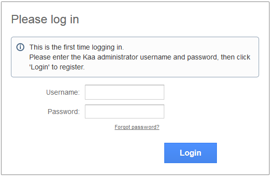
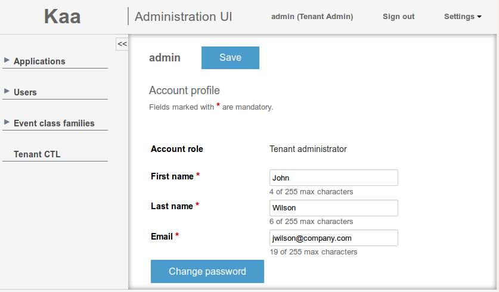



* TOC
{:toc}

To follow this guide, you need to have your [Kaa platform installed]({{root_url}}Administration-guide/System-installation/) and the [Administration UI]({{root_url}}Glossary/#administration-ui) available from the web.

## Kaa users

The first time you log in to Administration UI, it is required that you register as a Kaa administrator user.

The following three user types are available in Kaa:

- [Kaa administrator]({{root_url}}Glossary/#kaa-administrator)
- [Tenant administrator]({{root_url}}Glossary/#tenant-administrator)
- [Tenant developer]({{root_url}}Glossary/#tenant-developer)

>**NOTE:** For all the above users, [Kaa Sandbox]({{root_url}}Glossary/#kaa-sandbox) provides [default credentials]({{root_url}}Getting-started/#administration-ui).
{:.note}

## Kaa administrator

Kaa administrator is the highest level administrator of Kaa.
This user can create, edit, and delete tenant administrators.
To log in to the Administration UI as a Kaa administrator, use the username and password previously created for the Kaa administrator or [default credentials]({{root_url}}Getting-started/#administration-ui).

To customize the account:

1. Click **Settings** > **Profile**.

2. On the **Account profile** page, enter your first name, last name and email address.
	

3. If you want to change password, click the **Change password** button.
	

4. Click **Save** to save the account profile changes.

Kaa platform supports multi-tenant architecture.
It allows Kaa administrator to create separate scopes for each instance of a tenant.
Unlike Kaa administrator, tenant administrator and tenant developer are only visible in the scope of a single tenant.
For more information about multitenancy, see [Wikipedia](https://en.wikipedia.org/wiki/Multitenancy).

## Tenant administrator

Tenant administrator is a Kaa user that manages applications, users, and [event class families]({{root_url}}Programming-guide/Key-platform-features/Events/#event-class-families).

To log in to the Administration UI as a tenant administrator, use the previously generated username and password or [default credentials]({{root_url}}Getting-started/#administration-ui).
To customize the account, follow the same procedure as described in the [Kaa administrator](#kaa-administrator) section.

As a tenant administrator, you can create new applications.

To create an application:

1. Log in to the Administration UI and open the **Applications** page.
	

2. Click the **Add application** button.

3. On the **Application details** page, enter the title of your application and click **Add**.
	

If you open the **Application details** page of the newly created application, it will display the [application token]({{root_url}}Glossary/#application-token) generated for that application.

## Tenant developer

Tenant developer can create SDKs based on customer requirements, set the Kaa schemas, create [endpoint groups]({{root_url}}Programming-guide/Key-platform-features/Endpoint-groups/), control the [notification]({{root_url}}Programming-guide/Key-platform-features/Notifications/) processes, etc.

To log in to the Administration UI as a tenant developer, use the previously generated credentials or [default credentials]({{root_url}}Getting-started/#administration-ui).

To customize the account, follow the same procedure as described in the [Kaa administrator](#kaa-administrator) section.

Tenant developer can only work with the applications created by the respective tenant administrator.