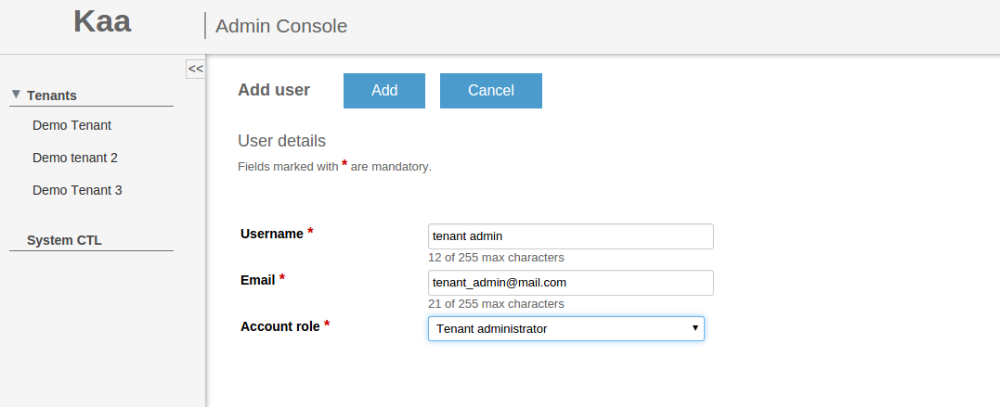



* TOC:
{:toc}

This section explains how to manage users in Kaa [Administration UI]({{root_url}}Glossary/#administration-ui).

To follow the guidelines, you need to have Kaa already installed with the Administration UI available from the web.
For installation instructions, see [Getting started]({{root_url}}Getting-started/).

## Managing tenants

To manage tenants, log in to the Administration UI as [Kaa administrator]({{root_url}}Glossary/#kaa-administrator).
Click **Tenants** to unfold the list of tenants.

To view tenant details, select the tenant either from the list or from the navigation panel on the left side.

As a Kaa administrator, you can add, edit, and delete tenants, as well as create [tenant administrators]({{root_url}}Glossary/#tenant-administrator).
To create a new tenant administrator, click **Add user**, fill in all the required fields and click **Add** to apply the changes.

The newly created tenant administrator will receive an e-mail with their credentials to log in to the Kaa Administration UI.

## Managing users

Tenant administrators can add, edit, and delete users.

To add a user:

1. Log in to the Administration UI as tenant administrator.

2. Open the **Users** page and click **Add user**.

	

3. On the **Add user** page, enter the username and email.

4. In the **Account role** field, select **Tenant developer**.
Click **Add** to apply the changes.

To edit a user profile, open the **User details** page by selecting the user on the **Users** page.

To delete a user, open the **Users** page and click the corresponding **Delete** icon.