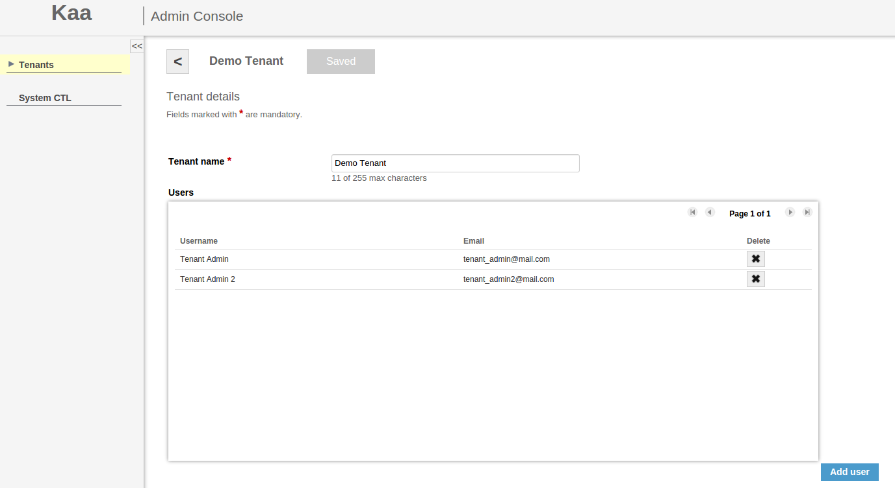



**Table of Contents**

- [Managing tenants](#managing-tenants)
- [Managing tenant admins](#managing-tenant-admins)
- [Managing users](#managing-users)

This guide explains how to manage users in Kaa Admin UI.

This guide assumes that Kaa has already been installed and Admin UI is available from the web. If it's not the case, look at the
[Installation guide]({{root_url}}Programming-guide/Getting-started/#installation) for more info.

## Managing tenants

The **Tenants** window, which is the starting window for a Kaa admin, displays a list of tenants. The Kaa admin can add/edit/delete a tenant and add a tenant admin to it.

## Managing tenant admins

To view a tenant details, select the tenant either from the list or from the navigation panel on the left side.

To create a new tenant admin, click **Add user** and then fill in all the required fields. Click **Add** to apply the changes.

The newly created tenant admin will receive an e-mail with his or her login to Kaa web UI credentials window.

## Managing users

The tenant admin can add, edit and delete users.

To add a user, do the following:

1. Open to the **Users** window and click **Add user**.

    

2. In the **Add user** window, enter the username and email.
3. In the **Account role** field, select _Tenant developer_.

   

To edit a user's profile, open the **User details** window by clicking the user's name either on the navigation panel or in the list in the **Users** window.

To delete a user, open the **Users** window and click **Delete** next to the user's name.

