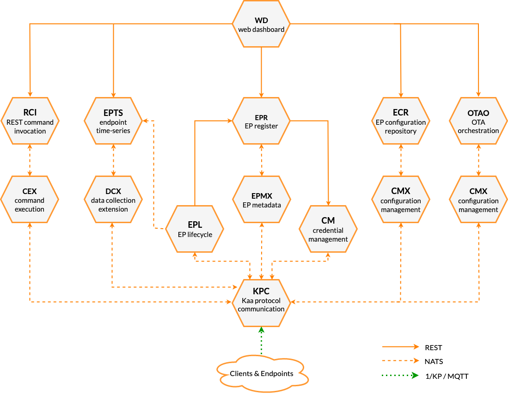
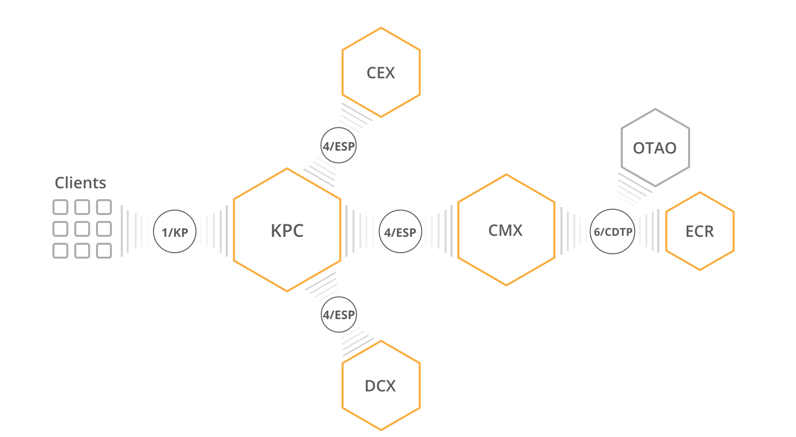
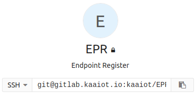
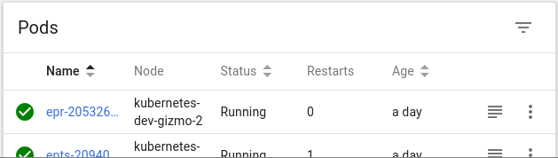
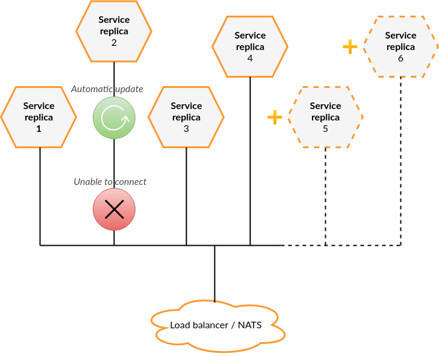




* TOC
{:toc}

The Kaa platform **architecture overview in 2.5 minutes**.

<div align="center">
  <iframe width="640" height="385" src="https://www.youtube.com/embed/bTp7aL4WiUE?rel=0" frameborder="0" 
    allow="accelerometer; autoplay; encrypted-media; gyroscope; picture-in-picture" allowfullscreen></iframe>
</div>


# Microservice abstraction

The Kaa platform is a cloud-native Internet of Things platform.

The architecture of the platform rests upon the **microservice approach** and uses it to the fullest.
Each Kaa microservice is an independent building block.
You can mix and match these blocks to create coherent solutions.

On the scale of the whole platform, Kaa microservices are just a bunch of black boxes doing their job.
This means that the architecture of any individual microservice is not significant to the architecture of the whole Kaa platform.

To achieve this kind of microservice abstraction, Kaa engineers use a number of techniques.

First, **all inter-service communication protocols use HTTP and [NATS][nats] to transport messages**, and **[JSON][json] and [Avro][avro] to encode them**.
All these technologies are well-defined and have multiple implementations for all mainstream programming languages, so **we're not tied to any implementation language**.
At present, most Kaa microservices are written in **Java, Go, and TypeScript (NodeJS)**, but the platform users implement their compatible and integrated microservices also in **Python, Rust, Scala, etc**.

Second, all Kaa microservices are **distributed as Docker images**.
Docker effectively abstracts away all the microservice setup and runtime dependencies---running a Docker container with Java is no different from running a Go-powered Docker container.
This helps operations team deploy Kaa solutions without having to set up the dependencies.

Third, on top of Docker we use container orchestration systems, [Kubernetes][k8s] being the preferred one.
Numerous ecosystem projects, such as [Helm][helm], [NGINX][nginx], [NATS][nats], [Prometheus][prometheus], [Fluentd][fluentd], [Grafana][grafana], and many others improve the Kaa user experience and help operating Kaa-based solutions at any scale and complexity.

Below is a diagram of how **Kaa microservices are typically composed:**



Combined with well-defined and documented interfaces, these techniques allow us to **swap the whole microservice implementation without anyone ever noticing**.


# Service composition and inter-service communication

To make microservices composable, **the Kaa platform uses well-defined NATS-based protocols**.
We use a ligthweight change management procedure to develop these protocols, and track them separately from the microservice implementations.
This allows multiple implementations of a single protocol to co-exist and cooperate within a single solution.

Main inter-service communication guidelines are defined in [3/ISM (Inter-Service Messaging)][3/ISM] RFC.
All other inter-service protocols build on 3/ISM and usually define one or two roles.
For example, [4/ESP (Extension Service Protocol)][4/ESP] defines "communication service" and "extension service" roles, and [6/CDTP (Configuration Data Transport Protocol)][6/CDTP] defines "configuration data provider" and "configuration data consumer" roles.

That's extremely useful as it allows each role to have multiple diverse implementations.



For example, **we can have multiple "communication service" implementations, each implementing a different client-facing protocol: MQTT, CoAP, HTTP, proprietary UDP-based protocol**---the only requirement for the service is implementing "communication service" side of the 4/ESP.
This allows swapping client communication layer easily without affecting any other service---it's completely transparent.
Furthermore, you can deploy multiple communication service implementations to handle clients which communicate over different protocols within a single solution.

Another example is [ECR (Endpoint Configuration Repository)][ECR] and [OTAO (Over-the-Air Orchestration)][OTAO] services both implementing "configuration data provider" side of 6/CDTP.
Thus, all the microservices down the line---CMX, KPC---work with any implementation.


# Scalability

Before we describe the scalability features of the Kaa platform, let's define some terms first.

**Kaa service** is a microservice packed in a Docker image.

**Service instance** is a Kaa service plus its configuration.

To make a service do something useful, you need to deploy at least one **service instance replica** (or simply **replica**)---a running Docker container.

<table>
<tr>
<th style="text-align:center;">Service</th>
<th style="text-align:center;">Service instance</th>
<th style="text-align:center;">Service instance replica</th>
</tr>
<tr><td markdown="1" style="width:33.3%;vertical-align:top;background-color:white;">

- Source code / assembly
- Packaged as a container
- Configurable
- Generic, versatile, reusable



</td>
<td markdown="1" style="width:33.3%;vertical-align:top;background-color:white;">

- Service + configuration
- Defined specific behavior
- Zero or more instances of the same service per solution cluster


</td>
<td markdown="1" style="width:33.3%;vertical-align:top;background-color:white;">

- Running service instance process
- Unit of scaling
- One or more replica per service instance



</td>
</tr>
</table>

**Each service instance may have as many replicas as needed to handle the load.**
Most service replicas are independent and do not communicate with each other.
They have neither master-slave nor master-master relationship.

Instance replicas leverage NATS queue groups, so any request directed to a service instance can be handled by any replica.
**There is no single point of failure.**



**All Kaa services can be scaled horizontally.**
Many services do not share any data between the replicas at all; others share the state using Redis or other data storage.
In all cases, handling horizontal scalability is internal to each service, so you need to check service-specific documentation for scaling details.
In most cases, it boils down to scaling data stores; and we have paid attention to select data stores that scale well.


# Deployment

**The Kaa platform leverages [Kubernetes][k8s] as an enterprise-grade orchestrator platform** for all the solutions.
It lets you abstract from managing containers lifecycle, mitigation of node failures, networking, and much more, keeping the focus on the business domain only.

Kubernetes is built around declarative descriptors, meaning that you define *what* you need and Kubernetes figures out *how* to get it on its own.
**The declarative approach gives you the flexibility of where you can run the cluster without changing a single line of code** in your application.

This allows you to run Kaa almost anywhere: on a **private bare-metal cluster, in a public cloud like Amazon AWS or Google's GCP, or even on your laptop.**
You only need a Kubernetes installation and a Kaa Cluster [blueprint][blueprint].

Cluster blueprint, in terms of Kaa, is a collection of both Kubernetes resources definitions and configs of Kaa microservices.
Both are text-based and are expected to be versioned with a VCS (e.g., Git).

Blueprint fully defines the cluster state, except for the data stored.
In other words, **you can restore a cluster or duplicate it (e.g., for testing or development purposes) with minimal effort**.
Furthermore, configs for services can be served directly from the VCS, letting you change the behavior of a running cluster by merely pushing a commit!

# Configuration

All components of the Kaa platform are able to read configuration from the filesystem. Default path of the configuration file is `/srv/<service-name>/service-config.yml` (e.g. `/srv/kpc/service-config.yml`).

Reading files from filesystem lets us easily manage configuration when running on Kubernetes cluster.
We recommend storing configuration of each service inside a separate Kubernetes `ConfigMap` object and mounting it to container's filesystem.
A sample definition of a [KPC][KPC] `Pod` and its `ConfigMap` can be found below:
```yaml
apiVersion: v1
kind: ConfigMap
metadata:
  name: kpc-config
data:
  service-config.yml: |
    kaa:
      applications:
        demo_application:
          versions:
            demo_application_v1:
              allowed-extension-instances:
                - dcx
                - tsx
      extension-instances:
        dcx:
          endpoint-aware: true
        tsx:
---
apiVersion: v1
kind: Pod
metadata:
  name: kpc-example-pod
spec:
  containers:
    - name: kpc
      image: hub.kaaiot.net/releases/kpc:1.0.0
      volumeMounts:
      - name: config-volume
        mountPath: /srv/kpc
  volumes:
    - name: config-volume
      configMap:
        name: kpc-config
```

> List of configurable properties and examples of Kubernetes definitions can be found in the documentation for every Kaa microservice in the *Configuration* and *Deployment* sections respectively.
{:.note}

## Automatic configuration rollout

In order to automatically apply configuration updates we suggest using a third-party tool called [Reloader](https://github.com/stakater/Reloader).
When it detects an update of a `ConfigMap` or a `Secret`,  Reloader utilizes Kubernetes native functionality to perform a rolling update of affected services.
That gives you an ability to safely rollout configuration changes without worrying about breaking your cluster.

# Next steps

- [Kaa concepts][kaa concepts] - find out about general concepts used in the Kaa documentation.
- [Kaa features][kaa features] - read about the Kaa platform features.
