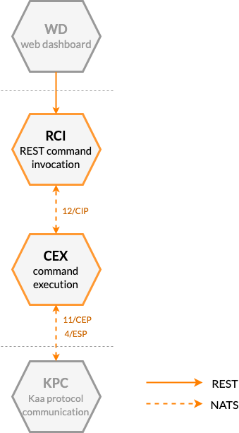




* TOC
{:toc}

## Prerequisites

- You understand the Kaa platform [microservice-based architecture][architecture overview].

## Basic concept

Kaa command invocation feature helps controlling devices remotely.
Using it, you can send short lived messages to connected devices (commands), make them react as necessary, and receive responses.
For example, you can toggle light, pop up car trunk, or request an immediate device status report.
<!-- - Remotely invoke execution of commands, synchronously or asynchronously. -->
<!-- - Scheduling commands delivery (e.g., for offline devices). -->

The command invocation feature is implemented in Kaa primarily with Command Execution Extension service (CEX).

<!-- TODO: redraw -->

[**Command Execution Extension service (CEX)**][CEX] extends the communication capability of Kaa Protocol ([1/KP][1/KP]) by implementing Command Execution Protocol ([11/CEP][11/CEP]).
CEX supports this extension protocol to deliver commands to endpoints and consume endpoint command execution result.
As with other Kaa extension services, CEX uses Extension Service Protocol ([4/ESP][4/ESP]) for integration with a communication service.

CEX implements a proactive command push---commands are sent to an endpoint as soon as possible, and an explicit endpoint subscription is not required.
CEX exposes [REST API][CEX REST API] for invoking commands against endpoints.

## Components

The table below summarizes the list of Kaa platform components that contribute to this feature:

| Service                                  | Version         |
| ---------------------------------------- | --------------- |
| [Command Execution Extension (CEX)][CEX] | {{cex_version}} |
