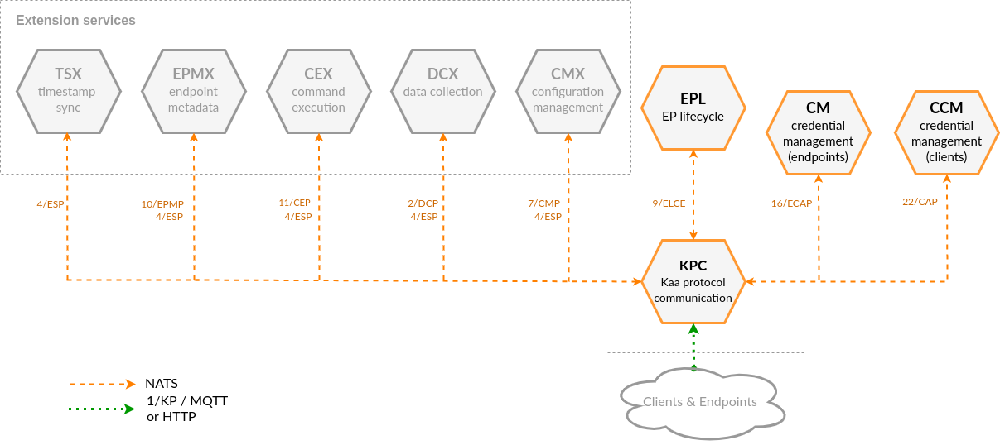




* TOC
{:toc}

## Prerequisites

* You understand the Kaa platform [microservice-based architecture][architecture overview].

## Basic concept

Device communication is an important aspect of an IoT platform.
The main objectives of this Kaa function are:

* Handling the data exchange among connected devices and the Kaa platform components.
* Authenticating connecting devices (both [clients][client] and [endpoints][endpoint]).
* Identification of the device capabilities (see [application and application version][application]).
* Securing the device communication with encryption and tamper protection.
* Handling device connectivity state (connected / disconnected).

The device communication in Kaa is enabled by a combination of microservices: Kaa Protocol Communication (KPC), Client Credentials Management (CCM), and Endpoint Lifecycle (EPL) services being the most important ones.

<!-- Source at https://app.diagrams.net/#G0By_Hs1drp5AfWkpXT1k5cDhVUWM -->

[**Kaa Protocol Communication service (KPC)**][KPC] implements Kaa Protocol-based communication with clients and endpoints.
KPC currently supports:

* plain MQTT
* MQTT/TLS
* MQTT/Websocket
* and plain HTTP transport implementations.

Additionally, MQTT over secure websocket (MQTT/Websocket/TLS) and HTTPS (HTTP/TLS) transports can be configured at the Kaa cluster ingress to point to KPC MQTT/Websocket and HTTP transport ports, respectively.
Read more about the Kaa Protocol (1/KP) [below][1/KP structure].

When it comes to the MQTT protocol support, KPC acts as an MQTT-compliant server for clients to connect and exchange endpoint data with the Kaa platform.
From the client standpoint, talking to KPC is no different from talking to any other MQTT broker.
All you need in a client is an MQTT library.

You should not expect MQTT broker behavior from KPC, though.
Its primary purpose is to enable device interoperation with the various Kaa platform features: [identity management][identity], [data collection][data collection], [configuration management][configuration] and others.
This is achieved by relaying client originated messages to [extension services][extension] and vice versa.
KPC is unaware of the specifics of the extension protocols that are multiplexed on top of 1/KP ([2/DCP][2/DCP], [7/CMP][7/CMP], [10/EPMP][10/EPMP], etc.).
Rather, it uses information available in 1/KP to (de-)multiplex extension protocols and route messages from clients to appropriate extension service instances and vice versa.

> This separation of concerns between the way in which devices are connected and the platform intrinsic features makes Kaa highly adaptable and extensible.
When you need a new IoT feature, you can build a new extension service for that without affecting the communication layer.
When you want to connect devices that support a new, previously unsupported protocol, you can do that by replacing KPC with your own implementation, without affecting anything else.
{:.tip}

KPC performs client authentication using the [Client Credentials Management service][CCM] and endpoint identification via the [Credential Management service][CM].
You can configure client authentication using username/password combination (plain auth, supported by all MQTT transports) or client SSL/TLS certificate (X.509 auth, supported by MQTT/TLS transport).
Endpoints are identified using [endpoint tokens][endpoint-token].

When endpoints connect or disconnect from KPC, it broadcasts [9/ELCE][9/ELCE] connectivity events to NATS.
Interested services may subscribe to such events to perform certain actions.
Notable examples of such services are [CMX][CMX] and EPL.

[**Endpoint Lifecycle service (EPL)**][EPL] monitors endpoint connectivity state events broadcasted by KPC.
You can configure EPL to update endpoint metadata attributes in [EPR][EPR] with the current connectivity state and the last transition timestamp.

EPL can also convert connectivity events into [14/TSTP][14/TSTP] time series data points and transmit them over NATS.
[EPTS][EPTS] can be configured to receive such data points and store them.
This is useful if you want to track the endpoint connectivity history---not just the current state.

## Kaa Protocol v1 structure

The [Kaa Protocol (1/KP)][1/KP] is a set of data exchange conventions designed to meet various real-life requirements, such as:

* extensibility
* asynchronous communication (when applicable)
* multiplexing
* gateway compatibility
* multi-level auth
* operation status reporting
* version control
* capability discovery
* and others.

1/KP binds to various transport protocol stacks, including MQTT, CoAP, HTTP, and others.
This requires some generalization and transport-specific adaptations.

You can learn about the Kaa Protocol design in details from the [1/KP RFC][1/KP], however, that may be a dull reading (we warned you :).
In this section we explain the basic structure of 1/KP-based communication.
Understanding it is essential for integrating your devices and/or gateways with Kaa.

### 1/KP resource path

1/KP introduces a concept of a **resource path**, which is a generalization of the MQTT topic, HTTP and CoAP URL.
According to the 1/KP, the general resource path structure for endpoint-originated requests is as follows:

`kp1/{application_version}/{extension_instance_name}/{endpoint_token}/{resource_path}[/{request_id}]`

where:

* `kp1` is the reserved prefix for the Kaa Protocol version 1.
  Future versions of Kaa Protocol will have prefixes such as `kp2`, `kp3`, and so on.
* `{application_version}` is a unique name that identifies [application version][application] that the request originating endpoint operates in, e.g. `demo_application_v1`, `smart_kettle_v1`, etc.
* `{extension_instance_name}` is a name that uniquely identifies an [extension service][extension] instance the message is destined to.
  It can be `dcx` that stands for [Data collection extension][DCX], `epmx` that stands for [Endpoint metadata extension][EPMX], etc.
* `{endpoint_token}` is an [endpoint token][endpoint-token] that uniquely identifies the endpoint, e.g. `JTjdbENzHh`.
  Note that we deliberately designed 1/KP so that your connected endpoints (devices) do not need the knowledge of their unique [endpoint IDs][endpoint-id] assigned in the platform server.
  Decoupling endpoint tokens from IDs makes tokens disposable.
  You can revoke a lost or leaked endpoint token at any moment and issue a new one, retaining the same digital twin of your device with the same endpoint ID.
* `{resource_path}` is an extension-specific resource path that exposes some IoT functionality to endpoints.
  For example, [Data collection extension][DCX] has `/json` resource path that allows endpoints to push telemetry data into the platform; [Endpoint metadata extension][EPMX] has `/update/keys` for updating endpoint metadata attributes, etc.
* `{request_id}` is an optional, positive integer identifier of a request that is used for matching extension responses to endpoint requests.
  Request ID is only relevant for the MQTT-based bindings, since there is no built-in concept of request-response in MQTT (unlike in HTTP and CoAP).
  When using an MQTT-based transport, you must set a request ID in the request whenever you want to receive an operation confirmation from the extension service.
  Naturally, request IDs must be unique for outstanding requests between any given endpoint and any extension service at any moment in time.
  Find out more about the MQTT-based request-response communication pattern from [the section below](#requestresponse-pattern).

Let's take an example.
Imagine that you have an endpoint with the `JTjdbENzHh` token that belongs to the `demo_application_v1` application version of the `demo_application` application.
When you want to push telemetry data into the Kaa platform on behalf of this endpoint using an MQTT transport, you should use the following MQTT topic: `kp1/demo_application_v1/dcx/JTjdbENzHh/json`.
Here `/json` is the [DCX][DCX] extension resource.

Note that there is no request ID specified in the MQTT topic above.
Such request will yield no response from DCX, even after the endpoint telemetry data is successfully stored by Kaa.
(There may still be an error response in case of message processing issues.)
If you want to receive a confirmation on a successful message processing, you should include the request ID in the request topic.
Read on to learn more about this.

### 1/KP payload format

Kaa Protocol explicitly applies no restrictions on the message payload format.
Thus, KPC makes no assumptions about the structure of payloads and relays them between connected endpoints and Kaa platform extension services with no modifications.
It is the responsibility of extension services to define their payload formats.
It is possible to implement and deploy an extension service that would use any payload format and encoding.
However, based on practical considerations, the default data format supported by Kaa extensions is JSON.

### MQTT transport binding for 1/KP

All MQTT transports support asynchronous communication.
A single client (gateway) may represent multiple endpoints (connected devices) by using just one MQTT connection and sending / receiving messages with different endpoint tokens.

In MQTT-based transports, MQTT topics match the [1/KP resource path](#1kp-resource-path).
To enable matching server responses to client requests, a special additional convention is used.

#### Request/response pattern

Many IoT functions (implemented by [extension services][extension] in the Kaa platform) require request/response style communication, which is not natively supported by MQTT.
For that reason 1/KP introduces the request ID in the request MQTT topic.
Whenever endpoint wants to use request/response pattern, it must append request ID to the end of the MQTT topic.

Successful responses to requests with the request ID arrive back to your client on the request topic with the `/status` suffix in the end.
Error responses arrive on the request topic with the `/error` suffix.

Imagine that [in the previous example](#1kp-resource-path) you don't just want to fire-and-forget telemetry data to the Kaa platform, but also receive confirmation messages when the submitted data is successfully processed.
Then the MQTT topic you should use to publish telemetry data is `kp1/demo_application_v1/dcx/JTjdbENzHh/json/42`, where `42` is the request ID.
Request IDs you use for outstanding requests from that endpoint to `dcx` service instance must be unique at any point in time so that you can properly match received responses.

> `42` is not a constant but just an example, and, coincidentally, the ["Answer to the Ultimate Question of Life, the Universe, and Everything"][42].
{:.note}

The response on **successful** data processing will arrive to the `kp1/demo_application_v1/dcx/myToken/json/42/status` MQTT topic.
The response on **unsuccessful** data processing will arrive to the `kp1/demo_application_v1/dcx/myToken/json/42/error` MQTT topic.

### HTTP transport binding for 1/KP

HTTP transport is very similar to MQTT, except:

* communication is synchronous and follows a standard HTTP request-response pattern
* there is no support for asynchronous server push
* the supported HTTP request method is `POST`
* the request URL following the initial `/` must match the appropriate [1/KP resource path](#1kp-resource-path)
* there is no need in a [request ID at the end of the resource path or special response topics](#requestresponse-pattern) due to the native request-response support in HTTP

Now, if we take the MQTT example above and translate that to the HTTP binding, an HTTP `POST /kp1/demo_application_v1/dcx/JTjdbENzHh/json` request will result in a reliable delivery request to the DCX.
The request payload is identical for MQTT and HTTP transports.

To get started with the Kaa HTTP transport, try <a href="{{1kp_over_http_postman_collection}}" download>this Postman collection</a> with environments preconfigured for [the Kaa Cloud][Kaa cloud] HTTP and HTTPS interfaces.
Remember to fill in variables such as your application version and the endpoint token.

## Components

The table below summarizes the list of Kaa platform components that contribute to this feature:

| Service                                    | Version         |
| ------------------------------------------ | --------------- |
| [Kaa Protocol Communication (KPC)][KPC]    | {{kpc_version}} |
| [Client Credentials Management (CCM)][CCM] | {{ccm_version}} |
| [Endpoint Lifecycle (EPL)][EPL]            | {{epl_version}} |
| [Request Status Extension (RSX)][RSX]      | {{rsx_version}}  |

## Next steps

* [How to connect a device tutorial][connecting your first device]---find out how to connect your device to the Kaa platform.
