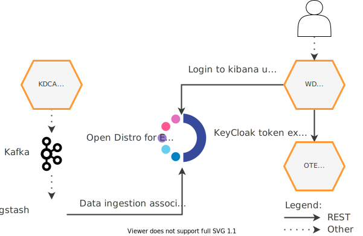




* TOC
{:toc}

## Basic concept

Kaa data analytics feature helps to collect, query, analyze, and visualize device data, configure custom alerts driven by triggers and send notifications to preferred destinations.
All of this functionality is supported via the integration of [Open Distro for Elasticsearch][open distro] with the Kaa platform.

Data analytics in Kaa is enabled via the collaboration of several services.

[**Kafka Data Collection Adapter (KDCA)**][KDCA] receives endpoint-originating data samples, enriches them with extra metadata, such as tenant ID, application name and application version, and submits to Kafka.
Logstash receives data samples from Kafka, parses them, and feeds into the Open Distro using the relevant tenant indices.

[**Open Distro for Elasticsearch**][open distro] is a third-party, open-source data analytics platform that includes the following components:

* [security][open distro security] for authentication and access control;
* [Kibana][open distro kibana] for querying and visualizing of data;
* [alerting][open distro alerting] for condition triggering, notifications, etc.

[**Kaa Web Dashboard (WD)**][WD] is used to seamlessly redirect Kaa users to the Kibana UI.
To do so, WD performes a logged in user token exchange via the **Open Distro Token Exchange service (OTE)**.
OTE receives a request from WD with a user OAuth 2.0 access token that belongs to a specific tenant, and returns a token suitable for Open Distro.
Then WD redirects the user browser session to the Kibana UI using the Open Distro token.

## Components

The table below summarizes the list of Kaa platform components that contribute to this feature:

| Service                                      | Version                    |
| -------------------------------------------- | -------------------------- |
| [Open Distro for Elasticsearch][open distro] | 1.6.0                      |
| Open Distro Token Exchange service           | {{ote_version}}            |
| [Tenant Manager (TM)][Tenant Manager]        | {{tenant-manager_version}} |
