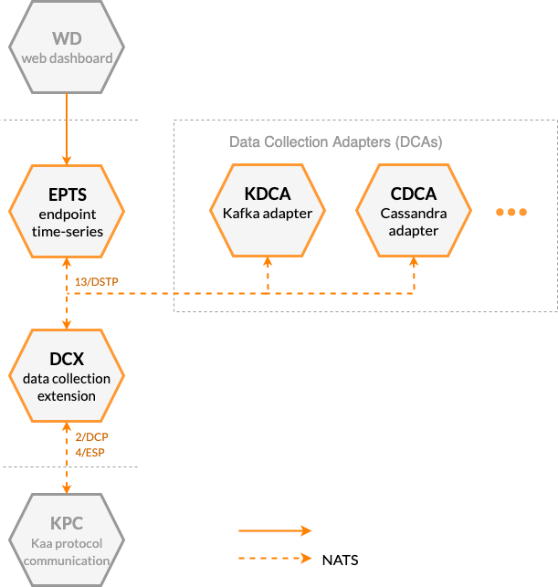




* TOC
{:toc}


## Prerequisites

* You understand the Kaa platform [microservice-based architecture][architecture overview].


## Basic concept

Kaa data collection feature is designed to obtain data from connected devices and send it to various storage and processing systems.
Typical use cases include time-series data, telemetry, firmware or software logs, alerts (traps), etc.
This feature is designed to help you:

* Reliably collect data at large scale.
* Notify clients on successful data delivery or a processing error.
* Enable ordered data samples delivery.
* Collect structured and unstructured data.
* Optimize network use via data samples batching.

Data collection in Kaa is enabled via the collaboration of several services' functionality.
<!-- TODO: redraw -->



[**Data Collection Extension service (DCX)**][DCX] extends the communication capability of the Kaa Protocol ([1/KP][1/KP]) by implementing the Data Collection Protocol ([2/DCP][2/DCP]).
DCX supports this extension protocol to receive endpoint data from a communication service (KPC) and send it to data receiver services for storage and/or processing.

**Data Collection Adapters (DCAs)** are various services that implement the [13/DSTP][13/DSTP] protocol to receive the endpoint-originated data samples from DCX.
DCAs typicaly serve the purpose of feeding collected from devices data to different data storage and data processing systems.
For example, see [KDCA][KDCA] and [MDCA][MDCA].

[**Endpoint Time Series service (EPTS)**][EPTS] is another example of a service that is often used in conjunction with DCX.
It receives endpoint data samples and transforms them into time series.
EPTS broadcasts the new data points through the [time series transmission][14/TSTP] interface and provides [REST API][EPTS REST API] for historical time series retrieval.


## Client integration

[**Data Collection Extension**][DCX] implements the `json` [resource path][1/KP structure] that allows [endpoints][endpoint] to push telemetry data into the platform in the [JSON][json] format.


### Unreliable data collection

If an endpoint needs to upload telemetry data into the platform in the **"fire-and-forget"** fashion it can use the **unreliable data collection** feature.
It works by just NOT specifying [request ID][1/KP structure] at the end of the MQTT topic.

Let's take an example.
Imagine that you have an endpoint with the `JTjdbENzHh` [endpoint token][endpoint-token] that works in the `demo_application_v1` [application version][application].
In the **"fire-and-forget"** scenario, endpoint should use the next MQTT topic: `kp1/demo_application_v1/dcx/JTjdbENzHh/json`.
The platform will accept and process request message without sending a confirmation back to the endpoint.


### Reliable data collection

If an endpoint wants to **reliably** deliver data, it must append [request ID][1/KP structure] at the end of the MQTT topic.
This may be useful when endpoint wants to know whether the submitted data should be resent or not.

Let's take an example.
Imagine that you have an endpoint with the `JTjdbENzHh` [endpoint token][endpoint-token] that works in the `demo_application_v1` [application version][application].
In the **reliable** data collection scenario endpoint should use the next MQTT topic: `kp1/demo_application_v1/dcx/JTjdbENzHh/json/42` where `42` is an example of a request ID.


### Message payload structure

There are **no requirements to the JSON structure** of the message payload, except that **if you use [data batching](#batching), data samples must be enclosed in a JSON array**.
Array elements (data samples) can be of any valid JSON type of any complexity.

Each element of the array represents a single **data sample**.

Examples:

Individual data samples:

**1**. Message payload that contains a **single data sample** that is the JSON object with three fields `timestamp`, `temperature`, and `log`.

```json
{
    "timestamp": 1566987657005,
    "temperature": 23,
    "log": "Some information"
}
```

**2**. Message payload that contains a **single data sample** that is a JSON number.

```json
23
```

**3**. Message payload that contains a **single data sample** that is a JSON boolean.

```json
true
```

[Data sample batches](#batching):

**1**. Message payload that contains **one data sample** that is the JSON object with three fields `timestamp`, `temperature` and `log`.

```json
[
    {
        "timestamp": 1566987697005,
        "temperature": 27,
        "log": "Some information"
    }
]
```

**2**. Message payload that contains **two data samples**: `15` and `23`.

```json
[
    15,
    23
]
```

**3**. Message payload that contains **one data sample** that is the JSON array.

```json
[
    [
        "Some information",
        23
    ]
]
```

**4**. You can even combine different JSON types in one message.
Message payload that contains **four data samples**: JSON object, number, array, and boolean.

```json
[
    {
        "temperature": 27
    },
    15,
    [
        "Some information",
        23
    ],
    true
]
```

>**NOTE:** A payload structured as a JSON array is always treated as a batch of data samples.
Therefore, a `[85,34]` JSON record is split into separate `85` and `34` data samples.
In case you need to collect data samples structured as JSON arrays, the workaround is to send them batched, e.g. `[[85,34]]` is treated as a batch with one data sample---`[85,34]`.
{:.note}
It means that the [85,34] JSON record will be divided into separate 85 and 34 data samples.
The workaround is to send a JSON array inside a batch, e.g. `[[85,34]]`---will be treated as a batch with one data sample---`[85,34]`.
{:.note}


#### Batching

An endpoint may use **data batching** by sending **several data samples at once**.

Next example contains **three data samples** that represents three separate device readings.

```json
[
    {
        "timestamp": 1566987697005,
        "temperature": 23,
        "log": "Some information 1"
    },
    {
        "timestamp": 1566988116155,
        "temperature": 25,
        "log": "Some information 2"
    },
    {
        "timestamp": 1566988157463,
        "temperature": 22,
        "log": "Some information 3"
    }
]
```

It may help to **preserve the device battery life** and **optimize the network efficiency**.


## Components

The table below summarizes the list of Kaa platform components that contribute to this feature:

| Service                                       | Version          |
| --------------------------------------------- | ---------------- |
| [Data Collection Extension (DCX)][DCX]        | {{dcx_version}}  |
| [Binary Data Collection Extension (BCX)][BCX] | {{bcx_version}}  |
| [Endpoint Time-Series (EPTS)][EPTS]           | {{epts_version}} |
| [Kafka Data Collection Adapter (KDCA)][KDCA]  | {{kdca_version}} |


## Next steps

* [Kaa Protocol structure][1/KP structure]---learn more about the Kaa Protocol with MQTT and HTTP.
* [Data collection tutorial][collecting data from a device]---collect and display telemetry data from your device.
