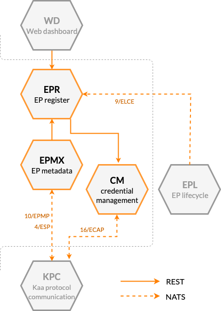




* TOC
{:toc}

## Prerequisites

* You understand the Kaa platform [microservice-based architecture][architecture overview].

## Basic concept

Device identity management is one of the core features of the Kaa IoT platform.
With its help, you can:

* Keep record of device [digital twins][digital twin] (aka "[endpoints][endpoint]" in Kaa terminology).
* Manage access credentials that devices use to connect to Kaa.
* Manage endpoint metadata attributes.
* Group devices by filtering against their metadata attributes.

The device identity management in Kaa is enabled with a combination of several microservices' functionality: Endpoint Register service (EPR), Credential Management service (CM), and Endpoint Metadata Extension service (EPMX).

[**Endpoint Register service (EPR)**][EPR] maintains a database of all endpoints registered within a solution, as well as their associated key/value attributes (metadata).
You can use [EPR REST API][EPR REST API] to:

* Provision new endpoints in one of the Kaa [applications][application] defined in your [solution cluster][solution].
* Retrieve endpoint information and metadata attributes.
* Update endpoint metadata attributes.
* Configure [**endpoint filters**][endpoint-filter]: queries against the endpoint data and metadata attributes that allow you to flexibly segment the devices in your Kaa platform instance.
* Retrieve endpoints that match previously provisioned filters.

EPR service is also a source of various important state update events.
You can subscribe to these using the [NATS][nats] broker:

* Endpoint (de-)registration events and endpoint application version updates conform to the [9/ELCE][9/ELCE] protocol.
* Endpoint metadata update events are sent according to [15/EME][15/EME].
* Endpoint filter events, delivered with [18/EFE][18/EFE], can be used to monitor endpoint filter (de-)activations, as well as endpoints (un-)matching such filters.

[**Credential Management service (CM)**][CM] manages [endpoint tokens][endpoint-token].
You can use [CM REST API][CM REST API] to:

* Provision new tokens
* Transition token states
* Delete tokens

CM supports NATS-based [16/ECAP][16/ECAP] interface for [communication][communication] services to authenticate connecting devices.

[**Endpoint Metadata Extension service (EPMX)**][EPMX] allows connected devices to retrieve and update the endpoint metadata attributes stored in the EPR.
This is useful when you want your devices to report some descriptive information about themselves: such as serial number, MAC address, installed software version, location, and so on.
You can further use these attributes for endpoint search in EPR, filtering, display, etc.

EPMX implements [10/EPMP][10/EPMP] extension protocol to allow endpoints to retrieve and manage their metadata.
Additionally to implementing 10/EPMP, EPMX supports metadata whitelisting.
This feature allows specifying a list of metadata fields that endpoints are allowed to access.
It also allows to forbid updating specific fields, rendering them read-only.

EPMX itself does not persist metadata and integrates with [Endpoint Register service (EPR)][EPR] for that purpose.

## Components

The table below summarizes the list of Kaa platform components that contribute to this feature:

| Service                                    | Version          |
| ------------------------------------------ | ---------------- |
| [Endpoint Register (EPR)][EPR]             | {{epr_version}}  |
| [Endpoint Metadata Extension (EPMX)][EPMX] | {{epmx_version}} |
| [Credential Management (CM)][CM]           | {{cm_version}}   |

## Next steps

* [How to connect a device tutorial][identity management tutorial]---find out how to connect your device to the Kaa platform.
