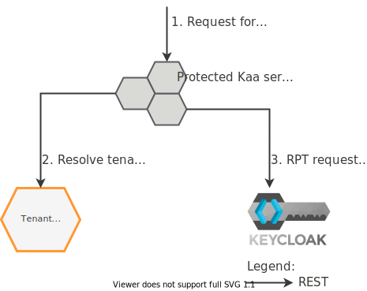




## Basic concept

The Kaa platform supports multi-tenancy where a single Kaa instance installation serves multiple independent tenants.
Each tenant has a fully isolated space and can manage own users, their permissions, applications, endpoints, dashboards, etc.

By default, the platform installation has one **system tenant** `kaa` that is used to restrict platform-wide operations, such as creating, updating, or deleting other tenants, managing platform-wide configuration, etc.
Tenant `kaa` also has all resources, scopes, and user roles available to regular Kaa tenants, so you can use it as a regular tenant.
It is the only tenant available in single-tenant installations.

Multi-tenancy in Kaa is implemented by leveraging isolated [authentication and authorization realms in KeyCloak](https://www.keycloak.org/docs/latest/server_admin/#core-concepts-and-terms).
Further, to improve performance, it also is possible to use multiple KeyCloak servers for different tenants in Kaa.
Management of the KeyCloak servers and realms is performed by a dedicated Kaa platform component: the [**Tenant Manager**][TM].

A typical authorization flow is illustrated in the following diagram.

<!-- Source at https://www.draw.io/#G0BwrJcji1aw38RVpzWmx3alRXT1E -->

Whenever a Kaa service receives a request for an operation on a protected resource, it determines the tenant, within which the caller is authenticated, by inspecting the OAuth 2.0 access token claims.
Then the service resolves the tenant security context against the Tenant Manager.
The security context includes authentication and authorization details, such as the OAuth 2.0 issuer, which is determined by the KeyCloak server and realm of a given tenant.
Finally, using the security context from the Tenant Manager, the service performs access authorization against the appropriate KeyCloak server and realm.

In addition to assisting in tenant authorization, Tenant Manager provides the following functionality:

- creating, reading, updating, and deleting tenants and their related entities
- managing secure scopes within tenants
- managing access right for admin users within tenants
- managing tenant platform use limits
- provisioning IDPs for tenant federated authentication
- NATS-based [Tenant Lifecycle Events interface][21/TLE] to notify platform services about changes in the tenant states.

Tenant Manager operates with the following important entities:

- **Tenant users** are users that can be assigned as tenant administrators.
- **Resources**, **scopes**, and **roles** that are provisioned in the tenant KeyCloak realm at the time of the tenant creation.
- **Identity providers (IDPs)** describe external single sign-on (SSO) servers to be used for the tenant users authentication.
- **Keycloak servers** represent the available KeyCloak servers to host tenant realms.

Refer to the [Tenant Manager REST API][Tenant Manager REST API] for more details.

## Components

| Service                               | Version                    |
| ------------------------------------- | -------------------------- |
| [Tenant Manager (TM)][Tenant Manager] | {{tenant-manager_version}} |
