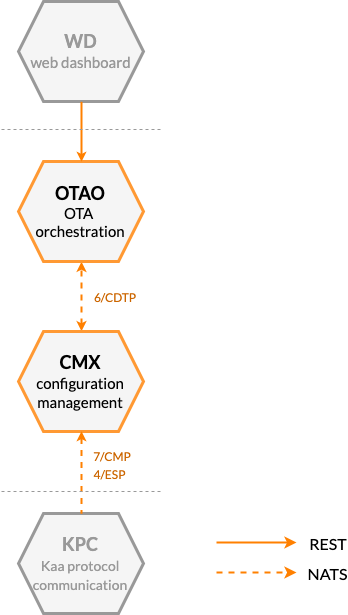




* TOC
{:toc}

## Prerequisites

- You understand the Kaa platform [microservice-based architecture][architecture overview].

## Basic concept

Kaa software updates feature helps distributing [over-the-air software updates][over-the-air] to connected devices.

Since the software update is specific to the device model, operating system, or firmware, Kaa does not perform the actual installation.
Instead, it manages and delivers to the eligible endpoints **software specifications**: arbitrarily structured JSON documents that contain all the necessary information for a software update installation (e.g. the download URL, image checksum, access credentials, prerequisites, etc.).
You can thus design software specifications to match your unique project requirements.

Using the software updates feature, you can:
- Provide devices with updated software / firmware specifications.
- Track current device software versions.
- Manage software upgrade compatibility matrix.
<!-- - Roll back upgrades. TODO: Not supported yet: see https://jira.kaaproject.org/browse/AGILE-1491 -->

The software updates are implemented in Kaa mainly by the Over-the-air Orchestrator service (OTAO) and Configuration Management Extension service (CMX).

[**Over-the-air Orchestrator service (OTAO)**][OTAO] is responsible for endpoint over-the-air updates.
OTAO does not persist software itself, but rather its definition, which includes:
 - semantic version
 - upgrade compatibility from other software versions
 - specification (free-form JSON format as required by the device)
 - roll-out configuration: target endpoint groups and schedule
 - descriptive fields, comments, etc.

A software definition may apply to any software including firmware, device drivers, operating system images, etc.
Software definitions are defined per [application][application].
Each software definition in a Kaa application must have a unique semantic version.

OTAO provides [REST API][OTAO REST API] that can you can use to manage software definitions.

[**Configuration Management Extension service (CMX)**][CMX] is used to deliver software specifications to eligible endpoints.
In its nature, such delivery is very similar to a configuration update, which is why CMX is reused.
You should use [7/CMP][7/CMP] to integrate the software updates feature with your client application.

> In Kaa clusters that support both configuration and software updates, there is normally a separate CMX [service instance][scalability] for each feature.
{:.note}

## Components

The table below summarizes the list of Kaa platform components that contribute to this feature:

| Service                                         | Version          |
| ----------------------------------------------- | ---------------- |
| [Over-the-air Orchestrator (OTAO)][OTAO]        | {{otao_version}} |
| [Configuration Management Extension (CMX)][CMX] | {{cmx_version}}  |
