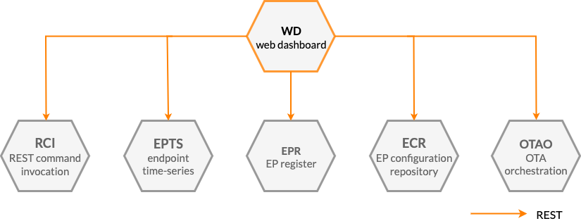




* TOC
{:toc}

## Prerequisites

- You understand the Kaa platform [microservice-based architecture][architecture overview].

## Basic concept

Kaa visualization feature is implemented by the Kaa [Web Dashboard][WD] microservice.
WD implements a web interface for:
- the dashboarding and data visualization
- device management, endpoint configuration management, commands invocation, etc.
- Kaa platform administration.

Being a front-end component, WD integrates with many of the Kaa platform microservices via REST API.

## Components

The table below summarizes the list of Kaa platform components that contribute to this feature:

| Service                  | Version                |
| ------------------------ | ---------------------- |
| [Web Dashboard (WD)][WD] | {{service_wd_version}} |
