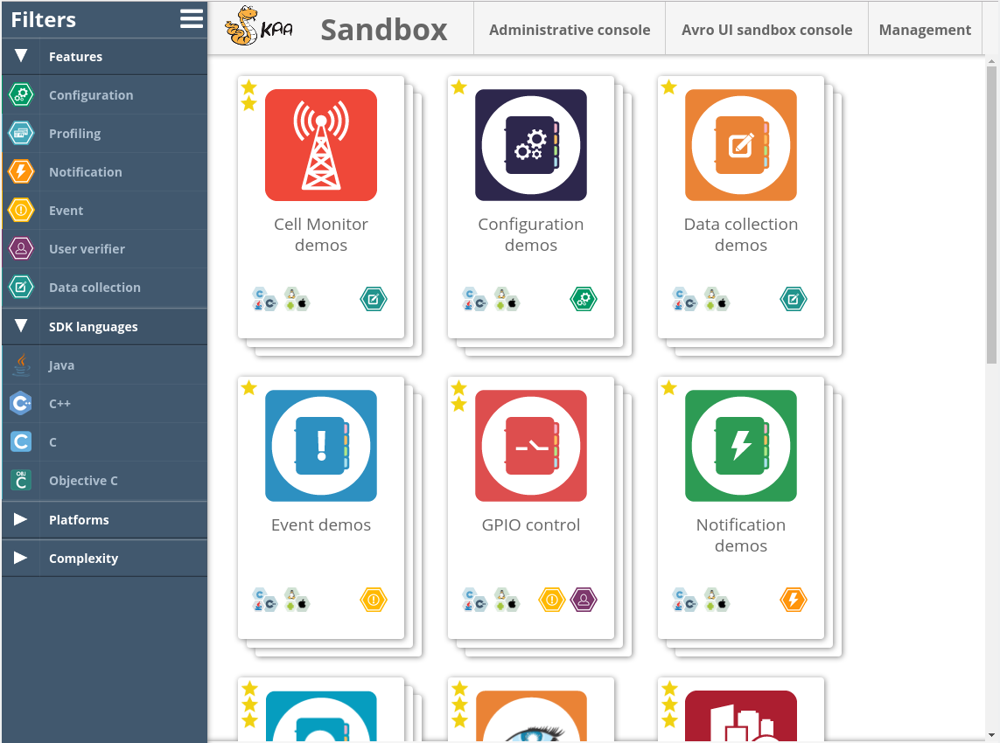
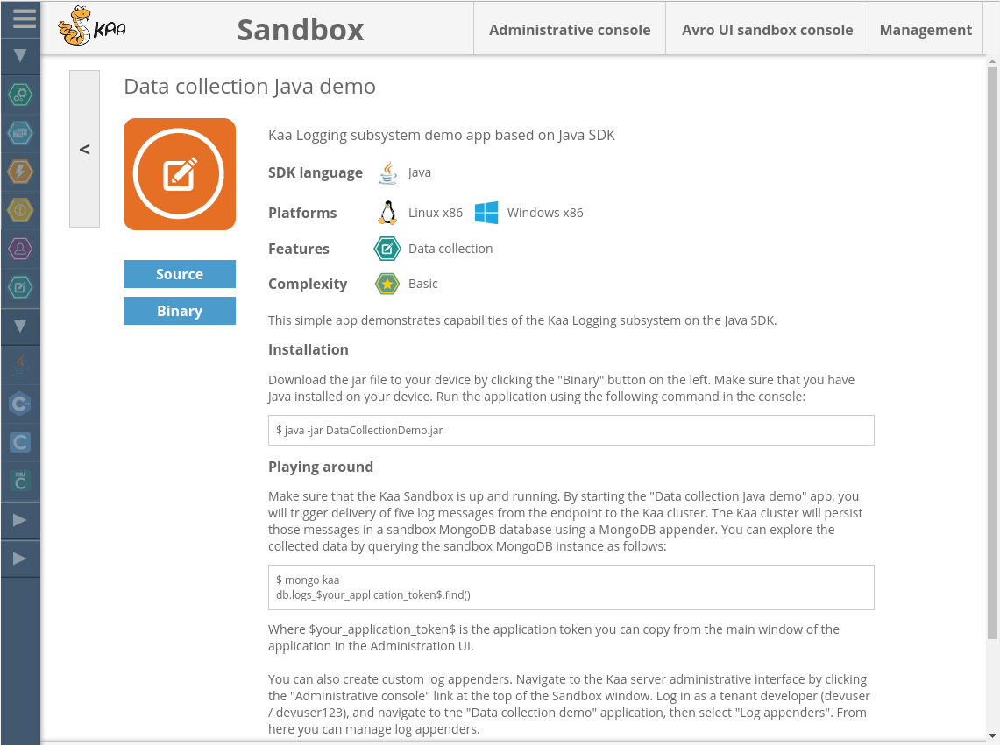
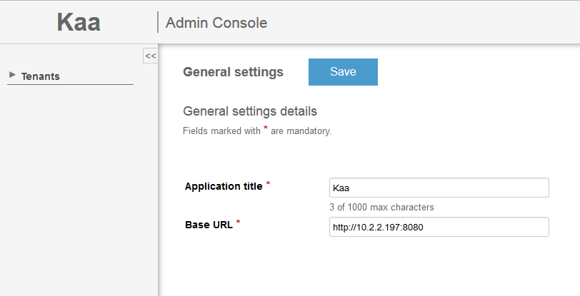



* TOC
{:toc}

[Kaa Sandbox]({{root_url}}Glossary/#kaa-sandbox) is a preconfigured virtual environment designed for the users who want to use their private [instance of Kaa platform]({{root_url}}Glossary/#kaa-instance-kaa-deployment) for educational, development, and proof-of-concept purposes.
The Sandbox also includes a selection of demo applications that illustrate various aspects of the platform functionality.

This page provides guidance on how to set up the Sandbox and run your first [Kaa application]({{root_url}}Glossary/#kaa-application) that will work with the Kaa platform.
The setup instructions are also available as a video tutorial below.

<p align="center">
  <iframe width="800" height="500" src="https://www.youtube.com/embed/AM-4qaAuCoY">
  </iframe>
</p>


## Sandbox installation

To run your Kaa Sandbox, you can use the VirtualBox environment or AWS Elastic Compute Cloud (EC2).
Click the appropriate tab and follow the instructions.

<ul class="nav nav-tabs">
  <li class="active"><a data-toggle="tab" href="#VirtualBox">VirtualBox</a></li>
  <li><a data-toggle="tab" href="#EC2">AWS EC2</a></li>
</ul>

<div class="tab-content"><div id="VirtualBox" class="tab-pane fade in active" markdown="1">

<br>

To run the Kaa Sandbox, your system must meet the following minimum requirements:

- 64-bit OS
- 4 GB RAM
- Virtualization enabled in BIOS

To install Kaa Sandbox:

1. Install a virtualization environment.
The current version of Kaa Sandbox supports Oracle VirtualBox version 5.1.2 and higher which is available as a [free download](https://www.virtualbox.org/wiki/Downloads).

2. Download the Sandbox .ova image from the [Kaa download page](http://www.kaaproject.org/download-kaa/).

3. Import the Sandbox image using [this guide](https://www.virtualbox.org/manual/ch01.html#ovf).

4. After you loaded the image, open the **Oracle VM VirtualBox Manager**, click **Settings** > **System** and adjust the amount of RAM and processors available to the VM.
For optimal performance, we recommend at least 4 GB of RAM and at least 2 CPUs.
Apply your settings and start the virtual machine.

	>**NOTE:** Your instance of Kaa Sandbox works out of the box with the default VM networking configuration set to NAT.
	>This enables connection between your machine and [Kaa server]({{root_url}}Glossary/#kaa-server).
	>However, you may want to switch to the **Bridged Adapter** mode.
	>To do that, open the **Oracle VM VirtualBox Manager**, click **Settings** > **Network** and change the **Attached to** option to **Bridged Adapter**.
	>The advantage of using this mode is that your Kaa Sandbox will work correctly even if you change your local machine IP.
	{:.note}
5. Wait until the VirtualBox starts up and open [127.0.0.1:9080/sandbox](http://127.0.0.1:9080/sandbox) URL in your browser.

6. Open the Sandbox **Management** page and specify the real IP of your machine in the <b>Kaahost/IP</b> block.

<br>

</div><div id="EC2" class="tab-pane fade" markdown="1">

<br>

>**IMPORTANT:** You may incur charges for running your Kaa Sandbox on AWS EC2.
>Before proceeding with the deployment, make sure you have reviewed and understood the current EC2 charge rates.
{: .important}

To launch the Kaa Sandbox on AWS EC2:

1. Go to [Kaa download page](http://www.kaaproject.org/download-kaa/), choose your region in the **Deploy Sandbox to AWS** section and click the section bar.
For more information, see [geographic regions](http://docs.aws.amazon.com/AWSEC2/latest/UserGuide/using-regions-availability-zones.html) EC2 offers for launching the [Amazon Machine Images (AMIs)](http://docs.aws.amazon.com/AWSEC2/latest/UserGuide/AMIs.html).

2. At the **Choose an Instance Type** step, choose the appropriate instance type.
For optimal performance, we recommended that you use at least **m3.large** or more powerful.

3. At the **Configure Instance Details** step, you can customize the settings or leave the default values.

4. At the **Add Storage** step, add additional volumes as required.
The number of instance storage devices available on the machine depends on the instance type.
EBS volumes are not recommended for database storage.

5. At the **Tag Instance** step, give a name to your instance, for example, **kaa-sandbox-0.10.0**.

6. At the **Configure Security Group** step, select one of the following options:

   - Create a new security group with the following ports open for inbound connections:

      | Protocol | Port | RangeSource|
      |----------|------|------------|
      | TCP      | 22   | 0.0.0.0/0  |
      | TCP      | 8080 | 0.0.0.0/0  |
      | TCP      | 9999 | 0.0.0.0/0  |
      | TCP      | 9998 | 0.0.0.0/0  |
      | TCP      | 9997 | 0.0.0.0/0  |
      | TCP      | 9889 | 0.0.0.0/0  |
      | TCP      | 9888 | 0.0.0.0/0  |
      | TCP      | 9887 | 0.0.0.0/0  |
      | TCP      | 9080 | 0.0.0.0/0  |

   - Select the previously created security group, configured as explained above.

7. At the **Review Instance Launch** step, make any changes as required.

8. Click **Launch**.
   
   - If you need to create a new key pair, click **Create a new key pair** and follow the instructions in [Creating a key pair](http://docs.aws.amazon.com/gettingstarted/latest/wah/getting-started-prereq.html) Click **Select an existing key pair** or **Create a new key pair** dialog, do one of the following:
   - If you already have a key pair, click **Select an existing key pair** and choose an option from the **Select a key pair** drop list.

9. Click **Launch Instances**.
The **Launch Status** page will open.

10. Click **View Instances**.

11. After launching Kaa Sandbox instance, go to _public domain name of your instance_:9080/sandbox or _public IP of your instance_:9080/sandbox URL.
Public DNS and IP of your instance are available from your instance description.

If your Kaa Sandbox interface does not start due to an error, you can see the error details in the Sandbox log records.

The log records are stored in the `var/log/kaa` directory.

The log writing system is as follows:

1. Kaa Sandbox Frame project writes its logs to the `kaa-sandbox.log` file.
2. Kaa Avro UI form writes its logs to the `avro-ui-sandbox.log` file.
3. Kaa node writes its logs to the `kaa-node.log` file.
This is the most important log file as it contains the most of the information required for an analysis.

Also, one log file generated per each initialization and each shutdown of a Kaa node and Kaa Sandbox.

</div></div>

## Launching your first Kaa application

After you installed a Kaa Sandbox, you can test its features by using the [sample applications](https://github.com/kaaproject/sample-apps).
By default, your Kaa Sandbox will listen to port 9080 to access the sample applications and some basic configuration data.
Using the Sandbox, you can download the source codes of any sample applications.
For sample applications based on Java or Android SDK, you can also download the binary files.

To work with your specific Kaa instance, use the Sandbox to download an [SDK library]({{root_url}}Programming-guide/Using-Kaa-endpoint-SDKs/) and deploy it to your [endpoint]({{root_url}}Glossary/#endpoint-ep).



To download and run your first Kaa sample application, we recommend that you open the **Data collection demos** bundle description from your Sandbox and select your [SDK type]({{root_url}}Glossary/#kaa-sdk-type).

>**TIP:** For quickest possible setup, choose the Java SDK type.
>For Java SDK, you can download an executable `.jar` archive containing binary files.
>For other SDK types, you need to download and build from the source files.
{: .tip}

Follow the instructions in the Sandbox to download, run, and test the sample application.



## What's next?

Use the Sandbox to create your own Kaa applications.
To do this, follow the instructions in [Your first Kaa application]({{root_url}}Programming-guide/Your-first-Kaa-application).

>**NOTE:** Please note that Kaa Sandbox is not intended for production or commercial use.
>To run your applications online, you need to deploy the Kaa platform into your environment.
>To do this, follow the instructions in [System installation]({{root_url}}Administration-guide/System-installation).
{: .note}

If you have problems during installation, see [Troubleshooting guide]({{root_url}}Administration-guide/Troubleshooting/).

### Administration UI

The [Administration UI]({{root_url}}Glossary/#administration-ui) of the Sandbox is intended for managing Kaa applications, endpoints, schemas, etc.
To access the Administration UI, click the **Administration** button on the Sandbox main page.
You can log in using the default pre-configured accounts as listed below:

| Account type          | Username | Default password |
|-----------------------|----------|------------------|
| Kaa admininstrator    | kaa      | kaa123           |
| Tenant admininstrator | admin    | admin123         |
| Tenant developer      | devuser  | devuser123       |


### Avro UI form

The [Avro UI form]({{root_url}}Glossary/#avro-ui-form) is an online service that you can use to create schema structure templates.
This is helpful when you want to reuse and modify your schemas used within the Kaa platform.
To access Avro UI form, click the **Avro UI form** button on the Sandbox main page.

### Advanced Sandbox configuration

#### Configuring general settings

The **General settings** window allows you to configure the application title and application base URL parameters. These parameters are used for sending email notifications to registered users.
To customize the general settings, click **Settings => General** settings and fill in the fields as required.



#### Configuring outgoing mail settings

Outgoing mail settings are used to send emails to newly created users with the information about their passwords, as well as for sending other notifications.
To customize the outgoing mail settings, click **Settings => Outgoing mail settings** and fill in the fields according to your SMTP mail server configuration.


#### Networking

You can choose a host/IP that your endpoints will use to connect to the Sandbox.
The specified host/IP will be used by Kaa endpoint SDK libraries to enable connection from the Kaa clients to your Sandbox.
To set up this parameter, you can either use the Sandbox management page or the Sandbox VM terminal.
Click the appropriate tab and follow the instructions.

<ul class="nav nav-tabs">
  <li class="active"><a data-toggle="tab" href="#Sandbox-web-ui">Management page</a></li>
  <li><a data-toggle="tab" href="#Console">VM terminal</a></li>
</ul>

<div class="tab-content">

<div id="Sandbox-web-ui" class="tab-pane fade in active" markdown="1">

<br>

Click the **Management** button on the Sandbox main page.
Input the desired address in the **Kaa host/IP** section and click **Update**.

<br>


</div><div id="Console" class="tab-pane fade" markdown="1">

<br>

Log in to the Sandbox VM terminal and run the following script.

```sh
/usr/lib/kaa-sandbox/bin/change_kaa_host.sh <new host name/ip>
```

<br>

</div></div>

## Further reading

Use the following guides and references to learn more about Kaa features.

| Guide | What it is for |
|-------|----------------|
| **[Key platform features]({{root_url}}Programming-guide/Key-platform-features/)** | Learn about Kaa key features, such as [endpoint profiles]({{root_url}}Programming-guide/Key-platform-features/Endpoint-profiles/), [events]({{root_url}}Programming-guide/Key-platform-features/Events/), [notifications]({{root_url}}Programming-guide/Key-platform-features/Notifications/), [logging]({{root_url}}Programming-guide/Key-platform-features/Data-collection/), and others. |
| **[Installation guide]({{root_url}}Administration-guide/System-installation)** | Install and configure Kaa platform on a single Linux node or in a cluster environment. |
| **[Contribute to Kaa]({{root_url}}How-to-contribute/)** | Learn how to contribute to Kaa project and which code/documentation style conventions we adhere to. |

---
