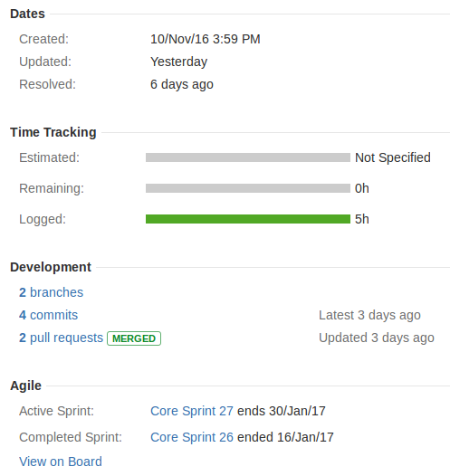

* TOC
{:toc}



The Kaa project team uses [Atlassian Jira](https://www.atlassian.com/software/jira) for issue tracking in the development process.
This section assumes you already have a Jira account and describes how you can create issues at [http://jira.kaaproject.org/](http://jira.kaaproject.org/) if you decided to contribute to Kaa project.
See also [Contribution guide]({{root_url}}How-to-contribute/).

## Creating issues

When you want to report a bug, request a feature, improve code/documentation -- search Jira in case there are similar issues reported.
If the search did not return needed results, go to [http://jira.kaaproject.org/](http://jira.kaaproject.org/), click the **Create** button.
In the **Create Issue** pop-up, provide the following information about the issue:

| Field | Description |
|-------|-------------|
| Project | Select the project from the drop-down list depending on which [Kaa project repository](https://github.com/kaaproject) the issue is related to. When in doubt, select **Kaa**. |
| Issue Type | See [Issue types](#issue-types) to make the right choice. When in doubt, select **Task**. |
| Summary | Provide a one-line summary of the issue in clear and concise language. |
| Component/s | The drop-down list of this field depends on the project you selected in the **Project** field. |
| Affects Version/s | Select the version affected by the issue. |
| Description | Provide a meaningful description of the issue with all the details you find relevant. Describe the steps to reproduce the issue, and the environment in which you found it. In general, feel free to share any information you think is related to the issue. See also [Issue types](#issue-types) for specific information to be provided depending on the issue type. |
| Attachment | Feel free to attach images, documents and other files you think can help understand the issue-related information. |

>**NOTES:** Please do not fill any other fields, they will be managed by the Kaa team members.
{:.note}

### Issue types

#### Epic

Epics typically target large implementations that may span across several sprints.
Epic descriptions must contain a brief summary of the requested functionality and link(s) to the gh-pages documentation where more details would be added along the path of implementing the Epic.
Features break down to Stories and Tasks.
No code check-ins are allowed directly under Epics.

#### Story

A Story is a well scoped-out, independent, and finished improvement to the codebase that must not take more than one sprint to implement and validate.
A Story description must contain the design decisions taken, as well as the rationale.
It must also contain links to the gh-pages documentation that must be updated in the course of the implementation.

#### Task

Tasks are for product improvements that do not affect the actual code behavior.
Good examples of tasks are: creating or updating a documentation page; adding more details to the user prompts in a script; setting up a special type of a code build.

#### Bug

Bugs are usually code or documentation deficiencies.
As a minimum, a Bug must contain the description of the problem encountered, steps to reproduce, version of the code tested, and provide the corresponding logs.
Useful additions may include a reference to the test scenario, links to the documentation that show the expected system behavior, etc.
It is allowed to check-in code directly in the Bug type issues.
A Bug may be filed under an Epic if the affected functionality was related to the scope of that Epic.

## Sending error logs

You may want to send some Kaa error logs to help resolve an issue.
To do this:

1. [Change the log level for the Kaa service to “TRACE”]({{root_url}}Administration-guide/Troubleshooting/#change-service-logging-level).

2. [Clear the Kaa logs]({{root_url}}Administration-guide/Troubleshooting/#clear-kaa-logs).

3. Reproduce your issue.

4. [Download the Kaa logs from the Sandbox]({{root_url}}Administration-guide/Troubleshooting/#download-kaa-logs-from-sandbox).

5. Create an archive file with your logs and attach it to your Jira issue.

## Working on issues

After you submitted an issue, it will appear in the selected project space for the Kaa team members to spot.
Now you can start contributing on [GitHub](https://github.com/kaaproject/).

When you make a pull request (PR), make sure you follow these two rules:

1. Every PR must have one or more Jira issues to it.
Do not make a PR if there is no corresponding Jira issue(s) yet.
Create the issue(s) first.

2. Follow this convention when entering description for your PRs and commits: _Jira issue number_(, _issue n number_)*: _brief change summary_

    Good examples:

   ```
   KAA-1123: Migration instructions from Kaa 0.9.0 to 0.10.0
   APP-144: [Android] Notification Sample Sdk Bug
   KAA-1, KAA-2: [Documentation] Create pages for log appender instructions
   ```

   Bad examples:

   ```
   Kaa 123 fix
   KAA234 - update
   whatevs KAA-345
```

If you named your PR as per above, the relevant information will appear under the **Development** section of the issue. See also [Git flow]({{root_url}}How-to-contribute/Git-flow/).



You can track the issue from Jira, review the fix code, post your comments, and check your email for the issue-related notifications.