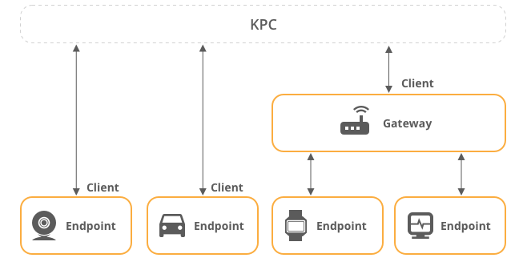
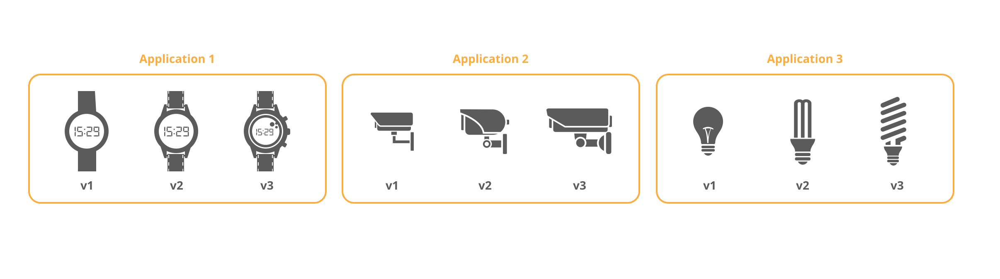
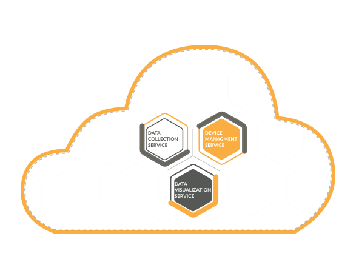




* TOC
{:toc}

This page is for new Kaa users.
It describes main Kaa entities and concepts.

If you don't feel like reading, here is a 3 minutes video that covers the key terms such as Kaa endpoint, client, application and application version.

  <iframe width="640" height="385" src="https://www.youtube.com/embed/m5AXU3RZ2ww?rel=0" frameborder="0"
          allow="accelerometer; autoplay; encrypted-media; gyroscope; picture-in-picture" allowfullscreen></iframe>

# Endpoints

In Kaa lingo, endpoints (EP) represent the *things* element of the IoT equation.
An endpoint is any terminal device that you want to manage with the Kaa platform.
An endpoint can either be a physical device or a software emulation thereof.

All data coming to the platform is associated with endpoints.

"Endpoint" is a cross-cutting concept---all Kaa services from the communication layer to representation one are aware of endpoints.

To be precise, endpoint can be lesser unit than a device which means that a physical device can include multiple endpoints.
For example, you want to manage a thermostat with the Kaa platform, so that the air conditioning will automatically turn on and off at certain temperature.

You can manage your thermostat in one of the following ways:

- Whole thermostat unit acts as a single endpoint exchanging data (readings of temperature, etc.) with Kaa server.
- Thermostat components (temperature and humidity sensors, on/off switch, etc.) act as individual endpoints.

> Note that we do not use terms like "device" or "thing."
  This is because an individual physical device can be represented as multiple independent endpoints; or you could open multiple connections from a single device, representing multiple clients.
{:.note}

# Endpoint ID

Endpoint ID is used to uniquely identify an endpoint within a Kaa platform instance.
An endpoint ID is a [UUID](https://en.wikipedia.org/wiki/Universally_unique_identifier) that is automatically generated by the Kaa at the moment of creating a new endpoint (e.g. `b1857120-9e72-4886-b3c2-b1bddccbf475`).
Endpoint ID cannot be changed once created.

All endpoint data, such as metadata attributes, collected time series data points, commands, etc., is associated with a specific endpoint ID.
Whenever you retrieve or manage endpoint-related data in Kaa (mainly via REST API or NATS), you will see endpoint IDs.

# Endpoint token

Endpoint tokens are used for endpoint identification during the endpoint communication with the Kaa platform.
Tokens are unique in scope of [application][application] and assigned to exactly one endpoint.
When a message arrives to the Kaa platform, endpoint token is resolved into an [endpoint ID][endpoint-id].

Each message sent to the platform must have an endpoint token so that the platform could identify the endpoint, on behalf of which the message was sent.
In the case of the [Kaa Protocol][1/KP] over MQTT, endpoint token goes inside the [MQTT topic][1/KP over MQTT topic structure].

Endpoint tokens are any non-empty strings that do not contain the following reserved characters: `+`, `#`, `/`, and `.`.
Typically, tokens are pseudo-random strings automatically generated by Kaa (e.g. `JTjdbENzHh`), but for convenience you can also provision your endpoint tokens (e.g. device serial number, MAC address, etc.).

Decoupling of endpoint tokens and endpoint IDs allows you to suspend, revoke, reactivate, and re-issue endpoint tokens without impacting the endpoint ID.
To communicate with the Kaa platform, your devices or gateways do not need to know endpoint IDs,---just tokens.

# Endpoint metadata

Endpoint metadata are key-value attributes associated with an endpoint. It can be endpoint's location, description, serial number, hardware version, etc.
Metadata is stored on [Endpoint Registered service][EPR] and can be read or updated in two ways: either via the [communication layer][communication] or [EPR REST API][EPR REST API].

Simply put, endpoint metadata is a JSON document of a free structure that is associated with a specific endpoint.

# Kaa client

To have your devices (endpoints) exchange data with the Kaa servers, you need a *client*.

>**Kaa client** is a piece of software that recognizes your endpoints and sends their data to Kaa servers, as well as receives data from Kaa servers.
>You can use your client to represent as many endpoints to your Kaa platform as you need.

Your Kaa client can be any software application that supports an IoT protocol ([MQTT][mqtt], [CoAP][coap], etc.) to exchange data with Kaa servers.

# Applications and application versions

The Kaa platform is designed to handle different types of devices simultaneously and allow them to co-exist in the scope of a single solution.
To do that, we use the concept of **Kaa application**.

Think of Kaa application as of container where you put your system configuration that depends on the device type.

For example, you want to manage a smart house containing fridges and coffee machines.
In this case you can set up two different applications: one for your fridges and the other one for your coffee machines.
This means that all your fridges will be represented as a set of endpoints in one application while all the coffee machines will live in the other application.

Applications can have **versions**.
Use versions to evolve your devices by adding or retiring features while keeping your old versions up and running.

Kaa supports running multiple versions simultaneously.
This means that you can develop new functionality for your endpoints without disturbing your existing ones.

> Due to the various compatibility reasons the application and application version names must be limited to lowercase latin letters (`a-z`), digits (`0-9`), dashes (`-`) and underscores (`_`).
{:.important}

# Kaa services

The Kaa platform design is based on [microservices](https://en.wikipedia.org/wiki/Microservices).
In Kaa context, the microservices comprising the Kaa platform are simply called *Kaa services*, or even simpler---services.

>**Kaa service** is a set of server software functionality packaged in a [Docker][docker] image.
>To use a stack of services as one integrated platform, you need to deploy them in a cluster.
>The same service can run in a cluster with different configurations---service instances.

In other words, a service is a software module offering some piece of functionality for a practical purpose like security, data collection, data transport and storage, device communication and management, etc.
Think of the services as the building blocks that you stack up together to form your Kaa solution.
You don't need all types of blocks at once, but only the right ones to do the job.

For example, you want to start off with simply collecting data from your device and visualizing it on a dashboard---then you will only need to install Kaa services for data collection and vizualization.
Say, you then realized that you also want to store your data and have some access management functionality---no problem, just add the respective Kaa services to your deployment.
Think of software plug-ins that you simply download and install as needed---same with Kaa services, you download and install them in your platform for additional functionality.

You can include different number of services of different types in the platform, depending on the use case and your expectations.
This means that the scale, complexity, and functionality of your Kaa platform deployment is variable upon your needs and case specifics.

The Kaa team is continuously developing an extensive number of services for you to choose from.
Also, you can develop your own services and integrate them in the platform.

For detailed documentation on each Kaa service, use the **Components** dropdown list at the top of the page.

# Extension services

Extensions (extension services) are special Kaa platform services that implement various IoT functionality offered by the platform to the endpoints, e.g. [data collection][data collection], [configuration management][configuration], [metadata attributes synchronization][identity], etc.
As a rule of thumb, when you see a service short name that ends with an "X"---that is likely an extension service.
Examples of the Kaa platform extensions are [Data Collection extension (DCX)][DCX], [Endpoint Metadata extension (EPMX)][EPMX], [Configuration Management extension (CMX)][CMX], etc.

All extensions sit behind the platform [communication layer][communication] and interoperate with the communication service (see [KPC][KPC]).
Such architecture allows you to easily expand the Kaa platform with a new IoT functionality by just dropping a new extension behind the communication layer:

Read about the [Kaa Protocol MQTT topic structure][1/KP over MQTT topic structure] to understand how endpoint messages are routed to the extensions.  

# Service interface protocols

Different services are designed to handle data differently.
Structures and formats of data that different services work with are documented in the interface protocols filed as a list of [Kaa RFCs][RFCs].
Apart from regulating the data exchange between Kaa services, Kaa RFCs define rules for almost all the platform entities.

# Solution cluster

Given the microservice nature of the platform, your Kaa-based IoT solution will be deployed as a cluster of microservices.

>**Kaa solution** is a managed set of interrelated Kaa applications that work together to cover an IoT use case.

Within a Kaa solution cluster, some of the services perform business logic functions, while the others fulfill infrastructure responsibilities necessary for the cluster operation (load balancing, fault tolerance, etc.).

# Blueprint

>**Kaa blueprint** is a detailed declarative description of a certain Kaa solution deployment, all its setup and configuration parameters.

Once you defined a blueprint for your Kaa solution, you can have the solution working while continuing to develop the blueprint: you can store it, scale it, tweak it, test it, deploy it elsewhere, etc.

Blueprint contains information about the names, versions, and all configuration parameters of services used in the applications of your Kaa solution.
It also contains information about the environment and deployment parameters used to set up the solution cluster.

# Communication protocols

## 1/KP (Kaa Protocol)

The main communication protocol of Kaa is [1/KP][1/KP], which is based on MQTT.
The protocol is very general and does not impose any additional format constraints on the clients.

It is designed to allow multiple endpoints to communicate via a single connection and traverse through MQTT gateways and brokers.

It is also well-thought to enable future [CoAP][coap] bindings implementation.

1/KP does not define all server features that are available to clients.
Instead, it defined the MQTT topic format and general guidelines and relies on the protocol extensions to handle the rest.

1/KP extensions include [2/DCP][2/DCP], [7/CMP][7/CMP], and [10/EPMP][10/EPMP].
Extensions define specific payload formats and how a server should process messages.

### 4/ESP (Extension Service Protocol)

While 1/KP with its extensions seems to be overarching as it defines all communication with clients, in reality, its effect on the platform architecture is very limited.
There is only one microservice that knows or cares about 1/KP---KPC (Kaa Protocol Communication service).

This microservices handles client connections and translates messages to and from 4/ESP (Extension Service Protocol)---the protocol the rest of the platform uses to speak to endpoints.

This approach allows isolating all device communications into a separate layer that can easily be extended or replaced.

# Next steps

- [Architecture overview][architecture overview] - get acquainted with the Kaa platform architecture.
- [Kaa features][kaa features] - read about the Kaa platform features.
