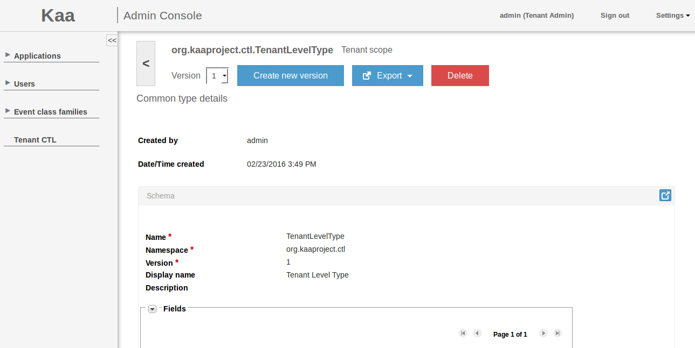


 /{{root_url[1]}}/{{root_url[2]}}/

Common Type Library

* [CT types definitions and FQNs](#ct-types-definitions-and-fqns)
* [CT schema versioning and dependencies](#ct-schema-versioning-and-dependencies)
* [CT scopes](#ct-scopes)
* [CT management](#ct-management)
 * [Managing System CTL](#managing-system-ctl) 
 * [Managing Tenant CTL](#managing-tenant-ctl)
 * [Managing Application CTL](#managing-application-ctl)
* [CT promotion](#ct-promotion)
* [CT schema import and export](#ct-schema-import-and-export)


The Common Type Library (**CTL**) is a repository of reusable data type schemas that could be referenced and reused as the user creates specific schema definitions for Kaa modules.
This capability unifies management of all schemas in a Kaa server instance.

## CT types definitions and FQNs ##

CT schema instance is identified by fully qualified name (FQN) and version. FQN is combination of namespace and name attributes defined in root avro record of CT schema according to [Names in Avro  Schema Declaration](http://avro.apache.org/docs/current/spec.html#names). After creation CT becomes unmodifiable, only new version of CT with same FQN can be created afterwards.


## CT schema versioning and dependencies ##

The CT schema version must be explicitly defined in the type schema as shown below. An attempt to load a CT with no schema version will result in an error. Similarly, an attempt to load a schema with the already used version will result in an error. Deleting a schema version is only permitted if the FQN-version combination is not used in any schemas.

```json
{
  "type" : "record",
  "name" : "SampleCT",
  "namespace" : "org.kaaproject.sample",
  "version" : 1,
  "dependencies" : [{ "fqn": "org.kaaproject.sample.ReferencedCT", "version" : 2}]
  "fields" : [
    ...
  ]
}
```

The CTL user interface automatically suggests the next available version (max loaded + 1) for a given FQN when creating a new schema.
When referencing CTs, the user must specify both the FQN and the version. CTs may reference each other (see org.kaaproject.sample.ReferencedCT in the example above). Cyclic dependencies are not permitted. (Thus, CTs are nodes in a directed acyclic graph of dependencies.)

## CT scopes ##


Common Types (**CT**) can be defined within **scopes**: SYSTEM, TENANT, and APPLICATION. Scopes impact the visibility of CTs: for example, a CT defined with the application scope in App A is not visible for App B.
Each CT is identified by its unique Fully Qualified Name (**FQN**) and is subject to versioning. FQNs cannot conflict in any given scope. An attempt to create a new CT with a conflicting FQN will result in an error. Creating different CTs with matching FQNs within different applications of the same tenant is permitted, even though not advised. Prior to creating such a CT, a warning message will be displayed to the user in the admin UI.
The expected outcomes of an attempt to create a CT with a non-unique FQN are summarized in the following table.


CT scope | System | Tenant | Application
--- | --- | --- | ---
Matching FQN at System level | error unless the version is unique | error | error
Matching FQN at Tenant level | error | error unless the version is unique | error
Matching FQN in a different Tenant | N/A | OK | OK
Matching FQN at Application level | error | error | error unless the version is unique
Matching FQN in a different Application of the same Tenant | N/A | N/A | warning in web UI; OK at services level

## CT management ##

CTs can be managed via [REST API]({{root_url}}Programming-guide/Server-REST-APIs#TODO) calls or via Administration UI. Management of CTs in Administration UI is separated according to CT scope.

### Managing System CTL ###

The **System CTL** window displays a list of CTs with the system scope. The Kaa admin can add new system CTs and delete system CTs.


To create a new system CT, click **Add new type** and then fill in all the required fields. Click **Add** to apply the changes.


To view a system CT, open the CT details window by clicking the row in the list in the **System CTL** window.


To view another version of the system CT, click on the version drop-down and select the appropriate version. To create a new version of the system CT of the same FQN, click **Create new version** at the top of CT details window. To export the system CT, click **Export** and select export method from drop-down. See [CT schema import and export](#ct-schema-import-and-export) for export details. To delete the system CT version, click **Delete** at the top of the CT details window.

### Managing Tenant CTL ###

The **Tenant** CTL window displays a list of CTs with the tenant and system scopes. The tenant admin can add new tenant CTs and delete tenant CTs from the system. It has read-only access to the system CTs.


To display/hide higher scopes of CTs, check/uncheck **Display higher scopes**.

To create a new tenant CT, click **Add new type** and then fill in all the required fields. Click **Add** to apply the changes.


To view a CT, open the CT details window by clicking the row in the list in the **Tenant** CTL window.



To view another version of the CT, click on the version drop-down and select the appropriate version. To create a new version of the tenant CT of the same FQN, click **Create new version** at the top of the CT details window. To export the CT, click **Export** and select an export method from the drop-down. See [CT schema import and export](#ct-schema-import-and-export) for export details. To delete the tenant CT version, click Delete at the top of the CT details window.

### Managing Application CTL ###

The **Application CTL** window displays a list of CTs of the current application, of the current tenant and all CTs with system scope. The tenant developer can add new application CTs and delete application CTs from the system. It has read-only access to the system CTs and to the tenant CTs within **Application CTL** window. Tenant developer is still able to manage tenant CTs within **Tenant CTL** window.


To display/hide higher scopes of CTs, check/uncheck **Display higher scopes** checkbox.

To create a new application CT, click **Add new type** and then fill in all the required fields. Click **Add** to apply the changes.


To view a CT, open the CT details window by clicking the row in the list in the **Application CTL** window.


To view another version of the CT, click on the version drop-down and select the appropriate version. To create a new version of the application CT of the same FQN, click **Create new version** on the top of CT details. To export the CT, click **Export** and select export method from drop-down. See [CT schema import and export](#ct-schema-import-and-export) for export details. To delete the application CT version, click **Delete** on the top of the CT details. To promote the application CT from application to tenant scope, click **Promote**.

## CT promotion ##

Users are able to promote the CT's scope from APPLICATION to TENANT, provided that there is no other CT with the identical FQN within the given tenant, and that they have a permission to do so. Otherwise an appropriate error will be displayed. Promotion procedure updates scope of CT including all its versions. Promotion of CT can be performed in two ways: via [REST API]({{root_url}}Programming-guide/Server-REST-APIs#TODO) call or by clicking **Promote** in the **Application CTL** window of Administration UI as shown below.


## CT schema import and export ##

The import of CT schema can be done in two ways: 

* perform [REST API]({{root_url}}Programming-guide/Server-REST-APIs#TODO) call. 
* add new CT in Administration UI and upload schema json file as shown below.


There are four ways of CT schema export:

1.	"**shallow**" export simply retrieves the given schema as a file.
2.	"**deep**" export retrieves the given schema as one file, and all of the referenced CTs as a separate file, recursively.
3.	"**flat**" export will retrieve the given schema as one file with all referenced CTs inline.
4.	"**library**" export will retrieve the given schema and all referenced CTs as compiled java classes compressed to a java archive file.

To export CT schema either use [REST API]({{root_url}}Programming-guide/Server-REST-APIs#TODO) call by providing appropriate export method or use export functionality provided by Administration UI. In CT window  click "Export" drop down and select desired export method as shown below.


