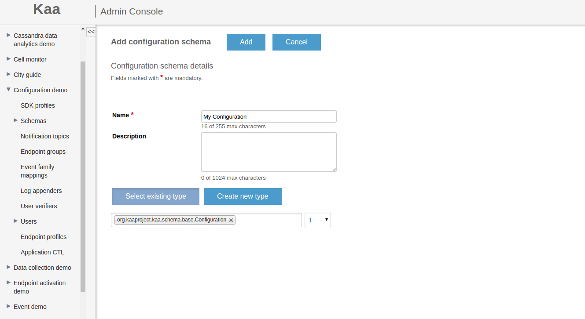



* TOC
{:toc}

To configure an [endpoint]({{root_url}}Glossary/#endpoint-ep), the Kaa **Configuration subsystem** sends structured data from [Kaa server]({{root_url}}Glossary/#kaa-server) to that endpoint.
The data structure is defined in the schema selected by the user.
For more information about schemas in Kaa, see [Common type library]({{root_url}}Programming-guide/Key-platform-features/Common-Type-Library).

Since Kaa operates on uniformly structured data, you can:

* Automatically generate a configuration object model in the endpoint SDK.
* Automatically generate default configuration.
* Enforce configuration integrity.
* View endpoint-specific configuration based on the endpoint group membership.

## Updating configuration data

To provision a configuration schema, use the [server REST API]({{root_url}}Programming-guide/Server-REST-APIs/#!/Configuration/saveConfigurationSchema) or open the **Configuration** page of the application and follow the same steps as described in [Setting client-side EP profile schema]({{root_url}}Programming-guide/Key-platform-features/Endpoint-profiles/#setting-client-side-ep-profile-schema).



Once a new configuration schema is provisioned, Kaa generates corresponding derivative schemas (a [base schema](#base-schema) and an [override schema](#override-schema)) and populates the group [all]({{root_url}}Glossary/#group-all) with the default configuration data using the [auto-generation algorithm](#automatic-generation-of-records).

If you update your configuration schema, you need to update the [client application]({{root_url}}Glossary/#kaa-client).
Therefore, to enable the server compatibility with the older clients as the configuration schema evolves, Kaa servers maintain multiple versions of the configuration schema.
See [CT schema versioning and dependencies]({{root_url}}Programming-guide/Key-platform-features/Common-Type-Library/#ct-schema-versioning-and-dependencies).
Configuration data is managed independently for every schema version.

The Kaa [Control service]({{root_url}}Glossary/#control-service) exposes API for loading configuration data into the "all" group.
To make an update, you need to submit the new data set in the Avro binary or Avro JSON format that corresponds to the base schema version specified in the API call.
As a result, all the configuration data for all endpoints of the application will be updated.

The following rules apply during the update:

* When loading the new data set, Kaa persists the existing UUIDs for all [addressable](#addressing) records, thus ignoring the corresponding values submitted in the new configuration.
* If the record types in the old configuration and in the new configuration do not match, Kaa generates a new UUID value for the replacement record.
* If non-addressable records are found (those directly or indirectly contained in the arrays), Kaa performs matching of the record instances by comparing the UUID values in the old and the new configuration.

### Application-specific configuration management

Since all the endpoints of an application use the same configuration schema, you can update the configuration data for all endpoints at the same time.
For this purpose, Kaa uses a [base schema](#base-schema) derived from the configuration schema.
The base schema assigns an address to each addressable record from the configuration schema and uses it to update the record values.

You can change the configuration data using the REST API or Administration UI as follows:

1. Retrieve the corresponding base schema.

2. Specify new configuration data that corresponds to the base schema format.

3. Submit this data to the server.

After the new configuration is submitted, the server overwrites the current configuration data stored in the group [all]({{root_url}}Glossary/#group-all) for the base schema in question.
Then Kaa delivers the up-to-date configuration data to all endpoints that support the corresponding configuration schema.

The fact that the group "all" has weight 0 results in the following: if the user introduces both application-specific update and [group-specific update](#group-specific-configuration-management) at the same time, any conflicts in values between these two updates will be resolved by giving preference to the group-specific update (because 0 is the lowest priority value).

### Group-specific configuration management

You can update configuration data for a specific endpoint group of an application, which is a more targeted approach than that described in [Application-specific configuration management](#application-specific-configuration-management) for the group "all".
To do this, you need to send the **configuration override data** to the endpoint group.
The structure of the configuration override data is specified by the [override schema](#override-schema) that is derived from the configuration schema used by the target endpoint group.
The override schema allows updating fields selectively, leaving some of them without any change if necessary.

### User-specific configuration management

Use the [server REST API]({{root_url}}Programming-guide/Server-REST-APIs/#!/Configuration/editUserConfiguration) to update the configuration data for a specific application user.
The user-specific configuration management uses the same approach as the [Group-specific configuration management](#group-specific-configuration-management), based on the override schema and override algorithm.

>**NOTE:** Since each endpoint is assigned to only one user at a time, the override algorithm does not support merging data sets as in the group-specific configuration management.
>The override algorithm applies user-specific overrides only after all group-specific overrides have been applied.
{:.note}

## Configuration schemas

A configuration schema is a user-defined specification of the application data model that Kaa Configuration subsystem uses to configure endpoints registered under the application.

The format of the configuration schema is similar to the [profile schema]({{root_url}}Programming-guide/Key-platform-features/Endpoint-profiles/) and is based on the [Apache Avro schema](http://avro.apache.org/docs/current/spec.html#schemas).
The Kaa Configuration subsystem supports all of the Avro primitive types:

* null
* boolean
* int
* long
* float
* double
* bytes
* string

And most of the complex types:

* record
* enum
* array
* union
* fixed

>**NOTE:** The Avro map type (a set of _key_ and _value_ pairs) is currently not supported.
>You can define an array of unions, but Kaa expects all of the entities to be of the same type.
{:.note}

The following examples illustrate basic constituents of the configuration schema and their usage.

<ul>
<li markdown="1">
The root object type in Kaa is always a record.

```json
{
    "name":"rootT",
    "namespace":"org.kaaproject.kaa.schema.sample",
    "type":"record",
    "fields":[
        ...
    ]
}
```
</li>
</ul>

* The `name` and `namespace` attributes are both required for this record type.
They are used for record referencing in derivative schemas.

<ul>
<li markdown="1">
The **optional** field attribute (`boolean`, **false** by default) determines whether or not the field in the record is optional.
Internally, Kaa translates optional fields into union fields with the `null` type at the top of the list.
For more information, see [Automatic generation of records](#automatic-generation-of-records).
If there is an **optional** union field, Kaa automatically puts `null` at the top of the types list in the union definition.

```json
{
    "name":"rootT",
    "namespace":"org.kaaproject.kaa.schema.sample",
    "type":"record",
    "fields":[
        {
            "name":"optionalBytesField",
            "type":"bytes",
            "optional":true
        },
        {
            "name":"optionalSuit",
            "optional":true,
            "type":{
                "name":"suitT",
                "namespace":"org.kaaproject.kaa.schema.sample",
                "type":"enum",
                "symbols":[
                    "spades",
                    "hearts",
                    "diamonds",
                    "clubs"
                ]
            }
        }
    ]
}
```
</li>
</ul>

<ul>
<li markdown="1">
The `by_default` field attribute determines the default value for the field depending on the field type, and is used to generate the default record.

```json
{
    "name":"rootT",
    "namespace":"org.kaaproject.kaa.schema.sample",
    "type":"record",
    "fields":[
        {
            "name":"stringField",
            "type":"string",
            "by_default":"default string value"
        },
        {
            "name":"intField",
            "type":"int",
            "by_default":0
        }
    ]
}
```
</li>
</ul>

<ul>
<li markdown="1">
The following table specifies the `by_default` attribute format for every supported primitive type.

| Type           | Format                                   |              Example             |
|----------------|:-----------------------------------------|:---------------------------------|
| `boolean`      | true/false                               | "by_default": true               |
| `bytes`        | json array of byte values                | "by_default": [1, 2, 55, 254, 4] |
| `double`       | floating point value                     | "by_default": 1.432              |
| `float`        | floating point value                     | "by_default": 1.432              |
| `int`          | numeric value from (-2^31+1) to (2^31-1) | "by_default": 55                 |
| `long`         | numeric value from (-2^63+1) to (2^63-1) | "by_default": 2147483648         |
| `string`       | simple string format                     | "by_default": "abcdef"           |

</li>
</ul>

<ul>
<li markdown="1">
The [addressable](#addressing) record type field attribute (`boolean`, **true** by default) determines whether or not the record supports partial updates (overrides) from different endpoint groups.
If this attribute is **true**, Kaa automatically adds a UUID field (`__uuid`) to the record when producing derivative schemas, which is done for the addressing purposes.
For this reason, `__uuid` is a reserved field name in Kaa.
Note that the root record in the configuration schema is always addressable and thus ignores the statement `_"addressable": false_`.

```json
{
    "name":"rootT",
    "namespace":"org.kaaproject.kaa.schema.sample",
    "type":"record",
    "fields":[
        {
            "name":"nestedRecord",
            "type":{
                "name":"nonAddressableRecordT",
                "namespace":"org.kaaproject.kaa.schema.sample",
                "type":"record",
                "addressable":false,
                "fields":[
                    {
                        "name":"booleanField",
                        "type":"boolean",
                        "by_default":false
                    },
                    {
                        "name":"intField",
                        "type":"int",
                        "by_default":"0"
                    }
                ]
            }
        }
    ]
}
```
</li>
</ul>

<ul>
<li markdown="1">
The `overrideStrategy` array type field attribute (`string`, **replace** by default) defines how [arrays are merged in the configuration across the endpoint groups](#override-algorithm).
Accepted values are **replace** and **append**.

```json
{
    "name":"rootT",
    "namespace":"org.kaaproject.kaa.schema.sample",
    "type":"record",
    "fields":[
        {
            "name":"nestedRecord",
            "type":{
                "name":"nonAddressableRecordT",
                "namespace":"org.kaaproject.kaa.schema.sample",
                "type":"record",
                "addressable":false,
                "fields":[
                    {
                        "name":"booleanField",
                        "type":"boolean",
                        "by_default":false
                    },
                    {
                        "name":"intField",
                        "type":"int",
                        "by_default":"0"
                    }
                ]
            }
        },
        {
            "name":"arrayAppended",
            "overrideStrategy":"append",
            "type":{
                "type":"array",
                "items":"org.kaaproject.kaa.schema.sample.nonAddressableRecordT"
            }
        },
        {
            "name":"arrayOverride",
            "type":{
                "type":"array",
                "items":"float"
            }
        }
    ]
}
```
</li>
</ul>

### Addressing

A field in Kaa configuration is addressable if the record containing this field is addressable (the `addressable` attribute of the record is **true**).
Addressable field values can be updated using the group-specific configuration update mechanism.

The field address is formed by appending the field name to the containing record address and using the slash symbol (`/`) as a separator.
The address of the root record is always `/`.

Consider the following record schema example.

```json
{
    "name":"rootT",
    "namespace":"org.kaaproject.kaa.schema.sample",
    "type":"record",
    "fields":[
        {
            "name":"intField",
            "type":"int",
            "by_default":12345
        },
        {
            "name":"nestedRecord",
            "type":{
                "name":"nestedRecordT",
                "namespace":"org.kaaproject.kaa.schema.sample",
                "type":"record",
                "fields":[
                    {
                        "name":"enumField",
                        "type":{
                            "name":"hashT",
                            "namespace":"org.kaaproject.kaa.schema.sample",
                            "type":"fixed",
                            "size":16
                        }
                    },
                    {
                        "name":"arrayField",
                        "type":{
                            "type":"array",
                            "items":"float"
                        }
                    }
                ]
            }
        },
        {
            "name":"arrayOfRecords",
            "type":{
                "type":"array",
                "items":"org.kaaproject.kaa.schema.sample.nestedRecordT"
            }
        }
    ]
}
```

In this schema example, the following fields are addressable:

* `/intField`
* `/nestedRecord`
* `/nestedRecord/enumField`
* `/nestedRecord/arrayField`
* `/arrayOfRecords`

However, the fields within the instances of `org.kaaproject.kaa.schema.sample.nestedRecordT` contained in `/arrayOfRecords` are not addressable, because it is not possible to address records within arrays in the current Kaa version.

### Automatic generation of records

For every configuration schema, Kaa generates the default configuration data records.
During this process, each record in the schema is analyzed one-by-one in the depth-first, top-to-bottom order, as follows:

* Union fields assume the first type listed in the union definition.
The default value is generated according to the type-specific rules.
>**NOTE:** Any optional fields (`"optional": true` in the schema) are in fact unions with the first type being `null`.
>Therefore, optional fields default to the empty value.
{:.note}
* For a field of any primitive type (except for `null`), Kaa expects the `by_default` attribute to be present and have a default field value.
If the schema does not contain this attribute for a required primitive record field, Kaa generates an exception and rejects the schema.
* Non-optional record type fields are generated by applying the same record generation algorithm.
* Arrays are generated empty by default.
* Fixed type fields are generated filled in with zeros.
* `__uuid` fields of the `org.kaaproject.configuration.uuidT` type are generated with a valid UUID assigned to the value sub-field.

Consider the following record schema example.

```json
{
    "name":"rootT",
    "namespace":"org.kaaproject.kaa.schema.sample",
    "type":"record",
    "fields":[
        {
            "name":"unionField",
            "type":[
                "string",
                "int",
                "null"
            ],
            "by_default":"default string value"
        },
        {
            "name":"optionalUnionField",
            "type":[
                "string",
                "int",
                "null"
            ],
            "optional":true
        },
        {
            "name":"optionalBoolean",
            "type":"boolean",
            "optional":true
        },
        {
            "name":"intField",
            "type":"int",
            "by_default":12345
        },
        {
            "name":"mandatoryNestedRecord",
            "type":{
                "name":"nestedRecordT",
                "namespace":"org.kaaproject.kaa.schema.sample",
                "type":"record",
                "fields":[
                    {
                        "name":"enumField",
                        "type":{
                            "name":"suitT",
                            "namespace":"org.kaaproject.kaa.schema.sample",
                            "type":"enum",
                            "symbols":[
                                "spades",
                                "hearts",
                                "diamonds",
                                "clubs"
                            ]
                        }
                    },
                    {
                        "name":"arrayField",
                        "type":{
                            "type":"array",
                            "items":"float"
                        }
                    },
                    {
                        "name":"enumField",
                        "type":{
                            "name":"hashT",
                            "namespace":"org.kaaproject.kaa.schema.sample",
                            "type":"fixed",
                            "size":16
                        }
                    }
                ]
            }
        }
    ]
}
```

This schema defaults to the following record.

```json
{
    "unionField":"default string value",
    "optionalUnionField":null,
    "optionalBoolean":null,
    "intField":12345,
    "mandatoryNestedRecord":{
        "enumField":"spades",
        "arrayField":[

        ],
        "enumField":[
            0,
            0,
            0,
            0,
            0,
            0,
            0,
            0,
            0,
            0,
            0,
            0,
            0,
            0,
            0,
            0
        ]
    }
}
```

The Kaa server stores the auto-generated default records in a cache and re-uses them in further operation.

### Base schema

The base schema is obtained by transforming the configuration schema as follows:

1. Optional fields are transformed into unions with the `null` type at the top of the type list.

2. The `__uuid` field of the union type `["org.kaaproject.configuration.uuidT", "null"]` is added to every record having `addressable = true`.

In the following example, the `org.kaaproject.configuration.uuidT` type is declared in the `nestedRecordT` record type, and re-used in `rootT`.

```json
{
    "name": "rootT",
    "namespace": "org.kaaproject.kaa.schema.sample",
    "type": "record",
    "fields": [
        {
            "name": "mandatoryNestedRecord",
            "type": {
                "name": "nestedRecordT",
                "namespace": "org.kaaproject.kaa.schema.sample",
                "type": "record",
                "addressable": false,
                "fields": [
                    {
                        "name": "booleanField",
                        "type": "boolean",
                        "by_default": false
                    },
                    {
                        "name": "__uuid",
                        "type": [
                            {
                                "name": "uuidT",
                                "type": "fixed",
                                "size": 16,
                                "namespace": "org.kaaproject.configuration"
                            },
                            "null"
                        ]
                    }
                ]
            }
        },
        {
            "name": "__uuid",
            "type": [
                "org.kaaproject.configuration.uuidT",
                "null"
            ]
        }
    ]
}
```

### UUID validation

Kaa performs UUID validation to prevent corruption of configuration data when the API user or Kaa administrator loads a new version of the configuration data to the server.
In this case, Kaa inspects the UUIDs of the newly introduced configuration data and validates them against the UUIDs in the previous version of the configuration data.

UUID validation is performed in two cases: when an existing object is updated and when a new object is created.

The following rules apply when an existing object is updated:

* If the resolved UUID remains the same, the new configuration is stored with the existing UUID.
* If the resolved UUID is null or unknown and the object is a record, Kaa searches throughout the existing base schema to find the object in question and obtain its existing UUID.
After the search is complete, the new configuration is stored with the existing UUID.
* If the resolved UUID is null or unknown and the object is an array, Kaa generates a new UUID for the new configuration.

The following rules apply when a new object is created:

* If the resolved UUID is null, Kaa generates a new UUID for the object and stores it in the database.
* If the resolved UUID is equal to some other UUID which is already in use, or to an unknown value, Kaa generates a new UUID for the object and stores it in the database.

### Override schema

The override schema is obtained by transforming the configuration schema and looks very similar to the base schema.
The difference is that when generating an override schema, Kaa adds `org.kaaproject.configuration.unchangedT` to every field type definition (converting them into union types, if necessary).
Thus, all required fields become union types with either their original type (if there is any data change) or the `org.kaaproject.configuration.unchangedT` type (if there is no data change).
When `org.kaaproject.configuration.unchangedT` appears in the data, it indicates that the corresponding field value remains without the change during the update.

Below is an example of how mandatory and optional fields are converted from the configuration schema to the override schema.

Required field in a **configuration schema**:

```json
{
    "name":"stringField",
    "type":"string",
    "by_default":"default string value"
}
```

Required field in an **override schema**:

```json
{
    "name":"stringField",
    "type":[
        "string",
        {
            "name":"unchangedT",
            "namespace":"org.kaaproject.configuration",
            "type":"enum",
            "symbols":[
                "unchanged"
            ]
        }
    ],
    "by_default":"default string value"
}
```

Optional field in a **configuration schema**:

```json
{
    "name":"optionalBytesField",
    "type":[
        "null",
        "bytes"
    ],
    "optional":true
}
```

Optional field in an **override schema**:

```json
{
    "name":"optionalBytesField",
    "type":[
        "null",
        "bytes",
        "org.kaaproject.configuration.unchangedT"
    ],
    "optional":true
}
```

Loading the override data into the endpoint groups is similar to [loading base data into group "all"](#updating-configuration-data).
Among other parameters, the group ID must be specified in the API call to indicate the group to which the new data should be applied.
The loading algorithm processes the record UUID values identically to how it is done for the "all" group, persisting the UUID values that already existed in the previous version of the data in the processed group.
Loading is done for the group in question independently of any other groups and without any cross-group data lookups.

### Override algorithm

To define and apply the resulting configuration update for the endpoint, the [Operations service]({{root_url}}Glossary/#operations-service) proceeds as follows:

1. Evaluates the [endpoint group]({{root_url}}Glossary/#endpoint-group) membership according to the [endpoint profile]({{root_url}}Glossary/#endpoint-profile-client-side-server-side).

2. Merges all configuration data sets assigned to the groups the endpoint belongs to, starting with the one that has the lowest weight (group "all").
If conflicting field values are found, the field is assigned the value from the group with the highest weight.

>**NOTE:** The `overrideStrategy` field in the configuration schema defines the way in which the arrays are merged.
>Record UUID fields never change from the values in the lowest weight group they were first found in.
>Both profile schema and configuration schema versions the endpoint supports are taken into account during the merge.
{:.note}

## Endpoint data synchronization

After receiving a configuration update for the endpoint group, the Operations service calculates and delivers the up-to-date configuration for all affected endpoints.

When the endpoint received the update, it notifies the [Kaa client]({{root_url}}Glossary/#kaa-client) about the update and persists the resulting configuration.
The data storage location is set as an abstraction in the endpoint, therefore the specific location for persisting the data is defined in the client implementation.

To ensure data consistency, Kaa compares the configuration hash on the endpoint and on the server to check if they match.


## Configuration management API

The configuration management API varies depending on the target SDK platform.
However, the general approach is the same.

Below are examples for different [SDK types]({{root_url}}Glossary/#kaa-sdk-type) of Kaa client application.

<ul class="nav nav-tabs">
  <li class="active"><a data-toggle="tab" href="#Java-1">Java</a></li>
  <li><a data-toggle="tab" href="#C_plus_plus-1">C++</a></li>
  <li><a data-toggle="tab" href="#C-1">C</a></li>
  <li><a data-toggle="tab" href="#Objective-C-1">Objective-C</a></li>
</ul>

<div class="tab-content">
<div id="Java-1" class="tab-pane fade in active" markdown="1" >

```java
import org.kaaproject.kaa.client.DesktopKaaPlatformContext;
import org.kaaproject.kaa.client.Kaa;
import org.kaaproject.kaa.client.KaaClient;
import org.kaaproject.kaa.client.SimpleKaaClientStateListener;
import org.kaaproject.kaa.client.configuration.base.ConfigurationListener;
import org.kaaproject.kaa.client.configuration.base.SimpleConfigurationStorage;
 
public class KaaConfigurationDemo {
 
    public static void main(String[] args) {
     
        // Create the Kaa desktop context for the application.
        DesktopKaaPlatformContext desktopKaaPlatformContext = new DesktopKaaPlatformContext();
        
        // Create a Kaa client and add a listener which displays the Kaa client configuration 
        // as soon as the Kaa client is started. 
        KaaClient kaaClient = Kaa.newClient(desktopKaaPlatformContext, new SimpleKaaClientStateListener() {
            @Override
            public void onStarted() {
                super.onStarted();
                printConfiguration(kaaClient.getConfiguration());
            }
        }, true);
        
        // Persist configuration in a local storage to avoid downloading it each time the Kaa client is started.
        kaaClient.setConfigurationStorage(new SimpleConfigurationStorage(desktopKaaPlatformContext, "saved_config.cfg"));
        
        // Add a listener which displays the Kaa client configuration each time it is updated.
        kaaClient.addConfigurationListener(new ConfigurationListener() {
            @Override
            public void onConfigurationUpdate(SampleConfiguration sampleConfiguration) {
                printConfiguration(sampleConfiguration);
            }
        });
            
        // Start the Kaa client and connect it to the Kaa server.
        kaaClient.start();
        ...
    }
    
    private static void printConfiguration(SampleConfiguration sampleConfiguration) {
        LOG.info("Current configuration: {}", sampleConfiguration);
    }

}
```

</div>
<div id="C_plus_plus-1" class="tab-pane fade" markdown="1" >

```c++
#include <iostream>
#include <cstdlib>
#include <kaa/Kaa.hpp>
#include <kaa/IKaaClient.hpp>
#include <kaa/configuration/manager/IConfigurationReceiver.hpp>
#include <kaa/configuration/storage/FileConfigurationStorage.hpp>
 
const char savedConfig[] = "saved_config.cfg";

class UserConfigurationReceiver : public kaa::IConfigurationReceiver {
public:
    virtual void onConfigurationUpdated(const kaa::KaaRootConfiguration &configuration)
    {
        // Add your code here.
    }
};
 
int main()
{
    // Initialize the Kaa endpoint.
    auto kaaClient = kaa::Kaa::newClient();
    // Set up a configuration subsystem.
    kaa::IConfigurationStoragePtr storage(std::make_shared<kaa::FileConfigurationStorage>(savedConfig));
    kaaClient->setConfigurationStorage(storage);
    // Set configuration update receiver.
    UserConfigurationReceiver receiver;
    kaaClient->addConfigurationListener(receiver);
    // Run the Kaa endpoint.
    kaaClient->start();
    std::cout << "Press Enter to stop" << std::endl;
    // Wait for the Enter key before exiting.
    std::cin.get();
    return EXIT_SUCCESS;
}

```

</div>
<div id="C-1" class="tab-pane fade" markdown="1" >


```c
#include <stdlib.h>
#include <stdio.h>

#include <kaa/kaa_error.h>
#include <kaa/kaa_context.h>
#include <kaa/platform/kaa_client.h>
#include <kaa_configuration_manager.h>
 
static kaa_client_t *kaa_client = NULL;

kaa_error_t kaa_demo_configuration_receiver(void *context,
                                            const kaa_root_configuration_t *configuration) {
    (void) context;
    printf("Received configuration data\n");

    // Add your code here.

    kaa_client_stop(kaa_client);
    return KAA_ERR_NONE;
}

int main(void) {

    // Initialize Kaa client.
    kaa_error_t error_code = kaa_client_create(&kaa_client, NULL);
    if (error_code) {
        printf("Failed create Kaa client\n");
        return EXIT_FAILURE;
    }

    kaa_configuration_root_receiver_t receiver = {
            .context = NULL,
            .on_configuration_updated = &kaa_demo_configuration_receiver
    };

    // Set the handler for configuration updates
    error_code = kaa_configuration_manager_set_root_receiver(
            kaa_client_get_context(kaa_client)->configuration_manager,
            &receiver);

    if (error_code) {
        printf("Failed to add configuration receiver\n");
        return EXIT_FAILURE;
    }

    // Start Kaa client main loop.
    error_code = kaa_client_start(kaa_client, NULL, NULL, 0);
    if (error_code) {
        printf("Failed to start Kaa main loop\n");
        return EXIT_FAILURE;
    }

    // Cleanup.
    kaa_client_destroy(kaa_client);

    return EXIT_SUCCESS;
}

```

</div>
<div id="Objective-C-1" class="tab-pane fade" markdown="1" >

```objc
#import "ViewController.h"

@import Kaa;
 
@interface ViewController () <KaaClientStateDelegate, ConfigurationDelegate, ProfileContainer>
 
@property (nonatomic, weak) IBOutlet UITextView *logTextView;
 
@property (nonatomic, strong) id<KaaClient> kaaClient;
 
@end
 
@implementation ViewController
 
- (void)viewDidLoad {
    [super viewDidLoad];

    // Create a Kaa client and add a listener which displays the Kaa client configuration
    // as soon as the Kaa client is started.
    self.kaaClient = [KaaClientFactory clientWithStateDelegate:self];
    
    NSArray *paths = NSSearchPathForDirectoriesInDomains(NSDocumentDirectory, NSUserDomainMask, YES);
    NSString *configurationPath = [[paths objectAtIndex:0] stringByAppendingPathComponent:@"savedconfig.cfg"];

    // Persist configuration in a local storage to avoid downloading it each time the Kaa client is started.
    [self.kaaClient setConfigurationStorage:[SimpleConfigurationStorage storageWithPath:configurationPath]];
    
    // Add a listener which displays the Kaa client configuration each time it is updated.
    [self.kaaClient addConfigurationDelegate:self];
    
    [self.kaaClient setProfileContainer:self];
    
    // Start the Kaa client and connect it to the Kaa server.
    [self.kaaClient start];
}
 
- (void)onConfigurationUpdate:(KAASampleConfiguration *)configuration {
    NSLog(@"Configuration was updated");
    [self printConfiguration];
}
 
- (void)printConfiguration {
    KAASampleConfiguration *configuration = [self.kaaClient getConfiguration];
    NSArray *links = [configuration AddressList].data;
    NSMutableString *confBody = [NSMutableString stringWithFormat:@"Configuration body :\n"];
    for (KAALink *link in links) {
        [confBody appendString:[NSString stringWithFormat:@"%@ - %@\n", link.label, link.url]];
    }
    NSLog(@"Current configuration: %@", confBody);
}

```

</div>
</div>
