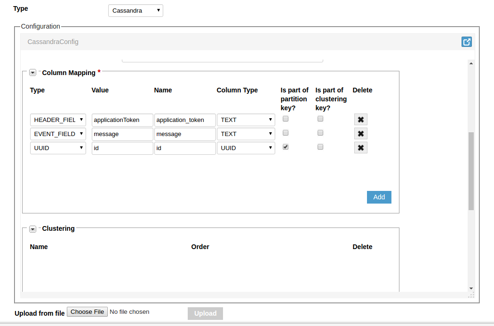
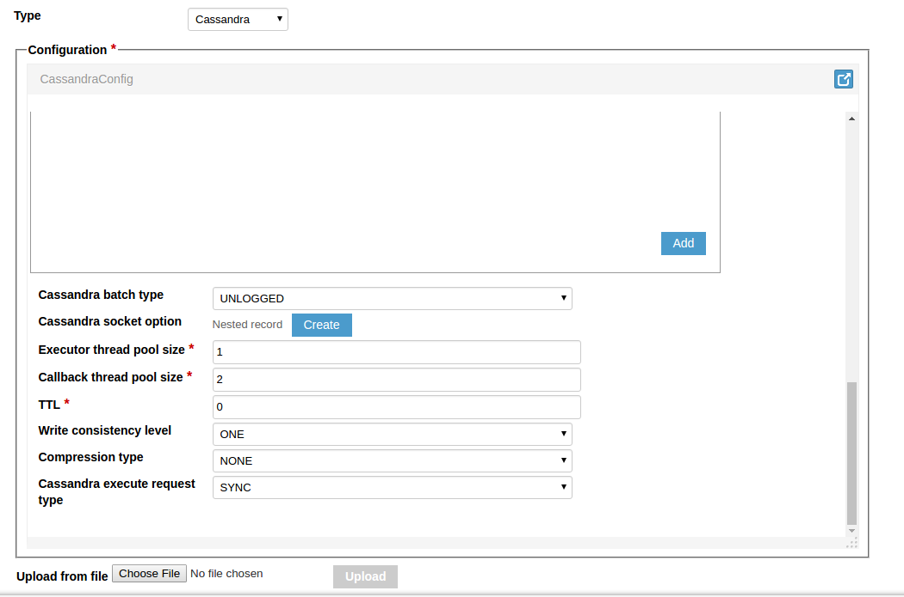
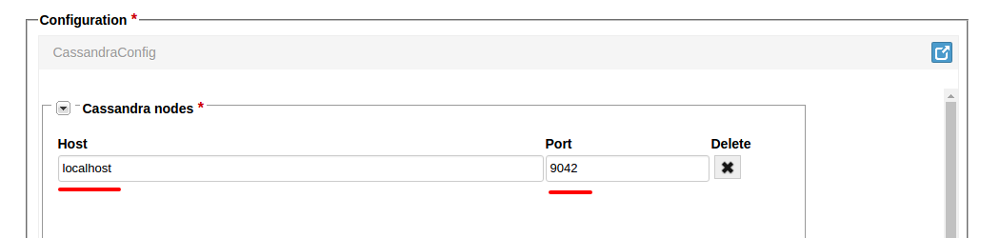
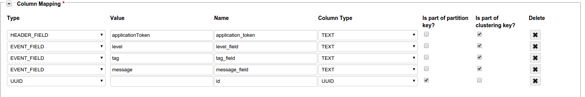
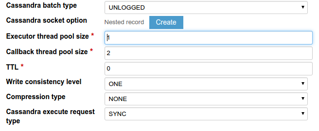
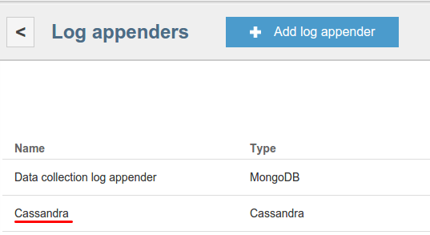



* TOC
{:toc}

The Cassandra log appender is responsible for transferring logs from the Operations service to the Cassandra database.

# Creating Cassandra log appender with Admin UI

The easiest way to create a Cassandra log appender for your application is by using Admin UI.

To create a log appender do the following:

1. In the **Log appenders** window, click **Add log appender**.
2. Enter the log appender name and description, select the minimum and maximum supported schema version, select necessary log metadata fields.
3. Set the log appender type to _Cassandra_. <br/>

4. Fill in the Cassandra log appender [Configuration](#configuration) form. <br/>
 <br/>
 <br/>
 <br/>
5. Click **Add** button. Log appender is ready and operational at this point.


# Creating Cassandra log appender with Admin REST API

It is also possible to create a Cassandra log appender instance by using
[Admin REST API]({{root_url}}Programming-guide/Server-REST-APIs/#!/Logging/editLogAppender).
The following example illustrates how to create the Cassandra log appender via Admin REST API.

## Configuration

The Cassandra log appender configuration must match to
[this](https://github.com/kaaproject/kaa/blob/master/server/appenders/cassandra-appender/src/main/avro/cassandra-appender-config.avsc) Avro schema.

* **Cassandra nodes** - list of Cassandra hosts.
* **Authentication credentials** - credentials used to authenticate on Cassandra cluster.
* **Keyspace name** – Cassandra keyspace used to prefix the data table.
* **Table name pattern** – pattern used to create table name (for example: **logs_$app_token** adds the application token at the end of the table name).
* **Column Mapping** - section that handles data mapping configuration. It can map specific log data to appropriate columns.
* **Clustering** - section that handles clustering key configuration.

|Type           |Example value                                                                  |Example column type|Description                                                                                                            |
|---------------|-------------------------------------------------------------------------------|-------------------|-----------------------------------------------------------------------------------------------------------------------|
|HEADER_FIELD   |endpointKeyHash, applicationToken, headerVersion,timestamp, logSchemaVersion   |TEXT               |Maps a header variable to the specified column                                                                         |
|EVENT_FIELD    |telemetry                                                                      |DOUBLE             |Maps a log schema field to the specified column                                                                        |
|CLIENT_FIELD   |clientField                                                                    |TEXT               |Maps a client-side endpoint profile field to the specified column                                                      |
|SERVER_FIELD   |serverField                                                                    |TEXT               |Maps a server-side endpoint profile field to the specified column                                                      |
|${TYPE}_JSON   |                                                                               |TEXT               |Maps one of the fields listed above as a corresponding JSON                                                            |
|${TYPE}_BINARY |                                                                               |BLOB               |Maps one of the fields listed above in binary format                                                                   |
|UUID           |                                                                               |UUID               |Maps a UUID generated by Kaa to the specified field                                                                    |
|TS             |yyyy-MM-dd-'Time:'HH:mm:ss.SS                                                  |TEXT               |Maps a timestamp generated by Kaa to the specified field. Timestamp pattern is handled by java.text.SimpleDateFormat   |

Any field can be made a partition and/or clustering key with using corresponding checkboxes.

Key clustering is configured by **Clustering** section, by adding column names and setting their order (**DESC** or **ASC**).

>**NOTE:**  
> Cassandra driver settings can be specified in log appender configuration. Consult the official 
[documentation](http://docs.datastax.com/en/developer/java-driver/3.0/java-driver/whatsNew2.html?local=true&nav=toc) for reference.

An example configuration that matches to previously introduced Avro schema is as below:

```json
{
    "cassandraServers":[
        {
            "host":"localhost",
            "port ":9042
        }
    ],
    "cassandraCredential":{
        "org.kaaproject.kaa.server.appenders.cassandra.config.gen.CassandraCredential ":{
            "user":"user",
            "password":"password"
        }
    },
    "keySpace":"kaa",
    "tableNamePattern":"logs_$app_token_$config_hash",
    "columnMapping":[
        {
            "type ":"HEADER_FIELD",
            "value ":{
                "string ":"applicationToken"
            },
            "columnName":"application_token",
            "columnType":"TEXT ",
            "partitionKey ":false,
            "clusteringKey ":false
        },
        {
            "type":"EVENT_FIELD",
            "value ":{
                "string ":"message"
            },
            "columnName":"message",
            "columnType ":"TEXT ",
            "partitionKey ":false,
            "clusteringKey ":false
        },
        {
            "type":"UUID",
            "value ":{
                "string ":"id "
            },
            "columnName":"id",
            "columnType":"UUID",
            "partitionKey":true,
            "clusteringKey":false
        }
    ],
    "clusteringMapping":[

    ],
    "cassandraBatchType":{
        "org.kaaproject.kaa.server.appenders.cassandra.config.gen.CassandraBatchType":"UNLOGGED"
    },
    "cassandraSocketOption":null,
    "executorThreadPoolSize ":1,
    "callbackThreadPoolSize ":2,
    "dataTTL ":0,
    "cassandraWriteConsistencyLevel ":{
        "org.kaaproject.kaa.server.appenders.cassandra.config.gen.CassandraWriteConsistencyLevel ":"ONE "
    },
    "cassandraCompression":{
        "org.kaaproject.kaa.server.appenders.cassandra.config.gen.CassandraCompression ":"NONE "
    },
    "cassandraExecuteRequestType":{
        "org.kaaproject.kaa.server.appenders.cassandra.config.gen.CassandraExecuteRequestType ":"SYNC "
    }
}
```


## Administration

The following Admin REST API call example illustrates how to create an instance of the Cassandra log appender.

```bash
curl -v -S -u devuser:devuser123 -X POST -H 'Content-Type: application/json' -d @cassandraLogAppender.json "http://localhost:8080/kaaAdmin/rest/api/logAppender" | python -mjson.tool
```

where file ```cassandraLogAppender.json``` contains following data:

```json
{
    "pluginClassName":"org.kaaproject.kaa.server.appenders.cassandra.appender.CassandraLogAppender",
    "pluginTypeName":"Cassandra",
    "applicationId":"5",
    "applicationToken":"82635305199158071549",
    "name":"Cassandra log appender",
    "description":"Sample Cassandra log appender",
    "headerStructure":[
        "KEYHASH",
        "VERSION",
        "TIMESTAMP",
        "TOKEN",
        "LSVERSION"
    ],
    "maxLogSchemaVersion":2147483647,
    "minLogSchemaVersion":1,
    "tenantId":"1",
    "jsonConfiguration":"{\"cassandraServers\":[{\"host\":\"localhost\",\"port\":9042}],\"cassandraCredential\":{\"org.kaaproject.kaa.server.appenders.cassandra.config.gen.CassandraCredential\":{\"user\":\"user\",\"password\":\"password\"}},\"keySpace\":\"kaa\",\"tableNamePattern\":\"logs_$app_token_$config_hash\",\"columnMapping\":[{\"type\":\"HEADER_FIELD\",\"value\":{\"string\":\"applicationToken\"},\"columnName\":\"application_token\",\"columnType\":\"TEXT\",\"partitionKey\":false,\"clusteringKey\":false},{\"type\":\"EVENT_FIELD\",\"value\":{\"string\":\"message\"},\"columnName\":\"message\",\"columnType\":\"TEXT\",\"partitionKey\":false,\"clusteringKey\":false},{\"type\":\"UUID\",\"value\":{\"string\":\"id\"},\"columnName\":\"id\",\"columnType\":\"UUID\",\"partitionKey\":true,\"clusteringKey\":false}],\"clusteringMapping\":[],\"cassandraBatchType\":{\"org.kaaproject.kaa.server.appenders.cassandra.config.gen.CassandraBatchType\":\"UNLOGGED\"},\"cassandraSocketOption\":null,\"executorThreadPoolSize\":1,\"callbackThreadPoolSize\":2,\"dataTTL\":0,\"cassandraWriteConsistencyLevel\":{\"org.kaaproject.kaa.server.appenders.cassandra.config.gen.CassandraWriteConsistencyLevel\":\"ONE\"},\"cassandraCompression\":{\"org.kaaproject.kaa.server.appenders.cassandra.config.gen.CassandraCompression\":\"NONE\"},\"cassandraExecuteRequestType\":{\"org.kaaproject.kaa.server.appenders.cassandra.config.gen.CassandraExecuteRequestType\":\"SYNC\"}}"
}
```

Example result:

```json
{
    "applicationId":"5",
    "applicationToken":"82635305199158071549",
    "confirmDelivery":true,
    "createdTime":1466055406507,
    "createdUsername":"devuser",
    "description":"Sample Cassandra log appender",
    "headerStructure":[
        "KEYHASH",
        "VERSION",
        "TIMESTAMP",
        "TOKEN",
        "LSVERSION"
    ],
    "id":"65548",
    "jsonConfiguration":"{\"cassandraServers\":[{\"host\":\"localhost\",\"port\":9042}],\"cassandraCredential\":{\"org.kaaproject.kaa.server.appenders.cassandra.config.gen.CassandraCredential\":{\"user\":\"user\",\"password\":\"password\"}},\"keySpace\":\"kaa\",\"tableNamePattern\":\"logs_$app_token_$config_hash\",\"columnMapping\":[{\"type\":\"HEADER_FIELD\",\"value\":{\"string\":\"applicationToken\"},\"columnName\":\"application_token\",\"columnType\":\"TEXT\",\"partitionKey\":false,\"clusteringKey\":false},{\"type\":\"EVENT_FIELD\",\"value\":{\"string\":\"message\"},\"columnName\":\"message\",\"columnType\":\"TEXT\",\"partitionKey\":false,\"clusteringKey\":false},{\"type\":\"UUID\",\"value\":{\"string\":\"id\"},\"columnName\":\"id\",\"columnType\":\"UUID\",\"partitionKey\":true,\"clusteringKey\":false}],\"clusteringMapping\":[],\"cassandraBatchType\":{\"org.kaaproject.kaa.server.appenders.cassandra.config.gen.CassandraBatchType\":\"UNLOGGED\"},\"cassandraSocketOption\":null,\"executorThreadPoolSize\":1,\"callbackThreadPoolSize\":2,\"dataTTL\":0,\"cassandraWriteConsistencyLevel\":{\"org.kaaproject.kaa.server.appenders.cassandra.config.gen.CassandraWriteConsistencyLevel\":\"ONE\"},\"cassandraCompression\":{\"org.kaaproject.kaa.server.appenders.cassandra.config.gen.CassandraCompression\":\"NONE\"},\"cassandraExecuteRequestType\":{\"org.kaaproject.kaa.server.appenders.cassandra.config.gen.CassandraExecuteRequestType\":\"SYNC\"}}",
    "maxLogSchemaVersion":2147483647,
    "minLogSchemaVersion":1,
    "name":"Cassandra log appender",
    "pluginClassName":"org.kaaproject.kaa.server.appenders.cassandra.appender.CassandraLogAppender",
    "pluginTypeName":"Cassandra",
    "tenantId":"1"
}
```

# Playing with Cassandra log appender

We'll use [Data collection demo](https://github.com/kaaproject/sample-apps/tree/master/datacollectiondemo/source) from Kaa Sandbox. Our example will send data
to Kaa and then persist it to Cassandra. Also, we'll do selection queries on persisted data.

We have next log schema:

```json
{
    "type":"record",
    "name":"LogData",
    "namespace":"org.kaaproject.kaa.schema.sample.logging",
    "fields":[
        {
            "name":"level",
            "type":{
                "type":"enum",
                "name":"Level",
                "symbols":[
                    "KAA_DEBUG",
                    "KAA_ERROR",
                    "KAA_FATAL",
                    "KAA_INFO",
                    "KAA_TRACE",
                    "KAA_WARN"
                ]
            }
        },
        {
            "name":"tag",
            "type":"string"
        },
        {
            "name":"message",
            "type":"string"
        },
        {
            "name":"timeStamp",
            "type":"long"
        }
    ]
}
```

The following JSON example matches the previous schema.

```json
{
    "level":"KAA_INFO",
    "tag":"TEST_TAG",
    "message":"My simple message",
    "timeStamp":"1466075369795"
}
```

1. Go to Data collection demos in Sandbox.

2. Follow **Installation** instructions.
3. In the Admin UI follow to **Data collection demo** application.
4. Go to application's **Log appenders** configuration and add a new one.

5. Enter name of the new appender (we'll use "Cassandra")
6. Add application token and Timestamp as Log metadata.
7. Select **Cassandra** appender type.

8. Add new node in the **Configuration** section (localhost:9042)

9. Add auth details if needed (for Sandbox it's empty)
10. Fill keyspace name. "kaa" is used in this example, because it's already created on a Sandbox machine.
11. "logs_example" is used as the **Table name pattern**.

12. The important part of configuration is **Column Mapping**:

13. Other configuration:

14. Click **Add** button on the top of the screen to create and deploy appender.

15. Verify that newly created appender has appeared in list.

16. Use instructions from Sandbox to run Data collection demo application and verify that logs have been successfully sent to Kaa.
17. After this you should see something like below:

    ```bash
    2016-06-16 14:09:28,483 [main] INFO  o.k.k.d.d.DataCollectionDemo - Data collection demo started
    2016-06-16 14:09:29,795 [pool-2-thread-1] INFO  o.k.k.d.d.DataCollectionDemo - Kaa client started
    2016-06-16 14:09:29,798 [main] INFO  o.k.k.d.d.DataCollectionDemo - Log record {"level": "KAA_INFO", "tag": "TAG", "message": "MESSAGE_0", "timeStamp": 1466075369795} sent
    2016-06-16 14:09:29,807 [main] INFO  o.k.k.d.d.DataCollectionDemo - Log record {"level": "KAA_INFO", "tag": "TAG", "message": "MESSAGE_1", "timeStamp": 1466075369795} sent
    2016-06-16 14:09:29,807 [main] INFO  o.k.k.d.d.DataCollectionDemo - Log record {"level": "KAA_INFO", "tag": "TAG", "message": "MESSAGE_2", "timeStamp": 1466075369795} sent
    2016-06-16 14:09:29,807 [main] INFO  o.k.k.d.d.DataCollectionDemo - Log record {"level": "KAA_INFO", "tag": "TAG", "message": "MESSAGE_3", "timeStamp": 1466075369795} sent
    2016-06-16 14:09:29,807 [main] INFO  o.k.k.d.d.DataCollectionDemo - Log record {"level": "KAA_INFO", "tag": "TAG", "message": "MESSAGE_4", "timeStamp": 1466075369795} sent
    2016-06-16 14:09:29,999 [main] INFO  o.k.k.d.d.DataCollectionDemo - Received log record delivery info. Bucket Id [0]. Record delivery time [204 ms].
    2016-06-16 14:09:30,000 [main] INFO  o.k.k.d.d.DataCollectionDemo - Received log record delivery info. Bucket Id [0]. Record delivery time [205 ms].
    2016-06-16 14:09:30,000 [main] INFO  o.k.k.d.d.DataCollectionDemo - Received log record delivery info. Bucket Id [0]. Record delivery time [205 ms].
    2016-06-16 14:09:30,000 [main] INFO  o.k.k.d.d.DataCollectionDemo - Received log record delivery info. Bucket Id [0]. Record delivery time [205 ms].
    2016-06-16 14:09:30,000 [main] INFO  o.k.k.d.d.DataCollectionDemo - Received log record delivery info. Bucket Id [0]. Record delivery time [204 ms].
    2016-06-16 14:09:30,001 [pool-2-thread-1] INFO  o.k.k.d.d.DataCollectionDemo - Kaa client stopped
    2016-06-16 14:09:30,006 [main] INFO  o.k.k.d.d.DataCollectionDemo - Data collection demo stopped
    ```

18. Let's verify that our logs have been persisted in Cassandra. Go to Sandbox VM and run next command to connect Cassandra:

    ```bash
    cqlsh
    ```

19. Then:

    ```bash
    SELECT * FROM kaa.logs_example;
    ```

20. You should observe similar output:

    ```bash
      level_field | date                         | application_token    | tag_field | message_field | timestamp_field | id
     -------------+------------------------------+----------------------+-----------+---------------+-----------------+--------------------------------------
         KAA_INFO | 2016-06-16-Time:01:08:03.301 | 82635305199158071549 |       TAG |     MESSAGE_0 |   1466075369795 | 92f326db-831f-419a-9fd0-142404ed1c4c
         KAA_INFO | 2016-06-16-Time:01:08:03.301 | 82635305199158071549 |       TAG |     MESSAGE_1 |   1466075369795 | 6a5506bb-509d-4446-b667-75e256732f2d
         KAA_INFO | 2016-06-16-Time:01:08:03.301 | 82635305199158071549 |       TAG |     MESSAGE_2 |   1466075369795 | a33e4693-d17f-4a9e-b85c-068d7e53ad5c
         KAA_INFO | 2016-06-16-Time:01:08:03.301 | 82635305199158071549 |       TAG |     MESSAGE_3 |   1466075369795 | 2d7a3970-f6f5-4c64-a4ac-93e7dbab23b5
         KAA_INFO | 2016-06-16-Time:01:08:03.301 | 82635305199158071549 |       TAG |     MESSAGE_4 |   1466075369795 | fc98f7a2-4771-4aaa-88a1-476770134d2a

     (5 rows)
    ```

If your output doesn't match above one, please follow our [troubleshooting guide]({{root_url}}Administration-guide/Troubleshooting).
