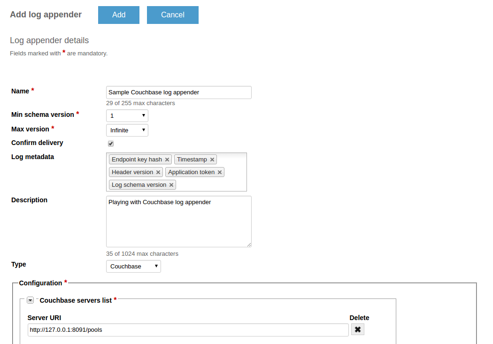
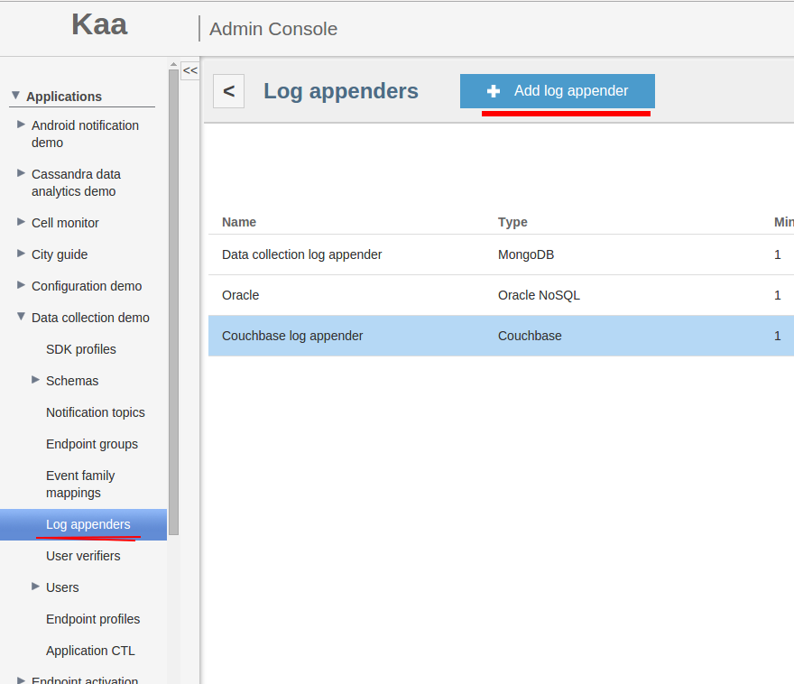


 /{{root_url[1]}}/{{root_url[2]}}/

* [Creating Couchbase log appender in Admin UI](#creating-couchbase-log-appender-in-admin-ui)
* [Creating Couchbase log appender with REST API](#creating-couchbase-log-appender-with-rest-api)
  * [Configuration](#configuration)
  * [Administration](#administration)
  * [Setup Couchbase and run sample application](#setup-couchbase-and-run-sample-application)

The Couchbase log appender is responsible for transferring logs from the Operations server to the Couchbase storage. Logs are stored in document storage.

Each log document consists of the following fields:  

where:

* <i>id</i> - randomly generated UUID string
* <i>header</i> - includes log's metainformation: <i>endpointKeyHash</i> (a key hash identifying the endpoint which produced the log record), 
<i>applicationToken</i> (matches the token of the current application), <i>headerVersion</i> (currently is 1), <i>timestamp</i> (a timestamp in milliseconds 
when logs were uploaded to the key/value storage)
* <i>event</i> - log body (log item, received from a client)

Values are stored as serialized Generic Records using record wrapper avro schema.

### Creating Couchbase log appender in Admin UI

The easiest way to create a Couchbase log appender for your application is by using Admin UI.

To create a log appender of the Couchbase storage type, do the following:

1. In the <b>Log appenders</b> window, click <b>Add log appender</b>.
2. Enter the log appender name and description, select the minimum and maximum supported schema version, select necessary log metadata fields.
3. Set the log appender type to <i>Couchbase</i>.
4. Fill in the Couchbase server list and other fields.
5. Click <b>Add</b>.



### Creating Couchbase log appender with REST API

It is also possible to create a Couchbase log appender for your application by using REST API. The following example illustrates how to provision 
the Couchbase log appender via REST API.

### Configuration

The Couchbase log appender configuration should match the to
[this](https://github.com/kaaproject/kaa/blob/master/server/appenders/couchbase-appender/src/main/avro/couchbase-appender-config.avsc) Avro schema.

The following configuration example matches the previous schema.

```json
{
    "couchbaseServerUris":[
        {
            "serverUri":"http://127.0.0.1:8091/pools"
        }
    ],
    "bucket":"default",
    "password":null
}
```

### Administration

The following REST API call example illustrates how to create a new Couchbase log appender.

```bash
curl -v -S -u devuser:devuser123 -X POST -H 'Content-Type: application/json' -d'{"pluginClassName": "org.kaaproject.kaa.server.appenders.couchbase.appender.CouchbaseLogAppender", "applicationId": 5, "applicationToken": "82635305199158071549", "jsonConfiguration": "{\"couchbaseServerUris\":[{\"serverUri\":\"http://127.0.0.1:8091/pools\"}],\"bucket\":\"default\",\"password\":null},   \"includeServerProfile\" : { \"boolean\" : false   } }", "description": "New sample Couchbase log appender", "headerStructure": ["KEYHASH", "TIMESTAMP"], "name": "New Couchbase log appender", "maxLogSchemaVersion": 2147483647, "minLogSchemaVersion": 1, "tenantId": "1"}' "http://localhost:8080/kaaAdmin/rest/api/logAppender" | python -mjson.tool
```

Example result:

```json
{
    "applicationId": "5",
    "applicationToken": "82635305199158071549",
    "confirmDelivery": true,
    "createdTime": 1465760874189,
    "createdUsername": "devuser",
    "description": "New sample Couchbase log appender",
    "headerStructure": [
        "KEYHASH",
        "TIMESTAMP"
    ],
    "id": "65539",
    "jsonConfiguration": "{\"couchbaseServerUris\":[{\"serverUri\":\"http://127.0.0.1:8091/pools\"}],\"bucket\":\"default\",\"password\":null}",
    "maxLogSchemaVersion": 2147483647,
    "minLogSchemaVersion": 1,
    "name": "New Couchbase log appender",
    "pluginClassName": "org.kaaproject.kaa.server.appenders.couchbase.appender.CouchbaseLogAppender",
    "pluginTypeName": null,
    "tenantId": "1"
}
```

### Setup Couchbase and run sample application

1. Download and install Couchbase by following [link](http://developer.couchbase.com/documentation/server/current/getting-started/installing.html#installing)
2. After successful installation open http://%your_host_name%:8091/. <br/>
You should see something like that: <br/>
 <br/>
3. Go to Admin UI and add a Couchbase log appender to Data Collection demo application. <br/>
 <br/>
4. Define a url and bucket which will be used for receiving logs. <br/>
 <br/>
5. Go to sandbox and download binary for testing appender: <br/>
 <br/>
Use instruction from sandbox to run demo application. <br/>
6. Open http://%your_host_name%:8091 and choose : Data Buckets -> default -> Documents: <br/>
 <br/>
7. If you launched Data collection demo application before it, you would be see logs from kaa server. This should seems like that: <br/>
 <br/>


