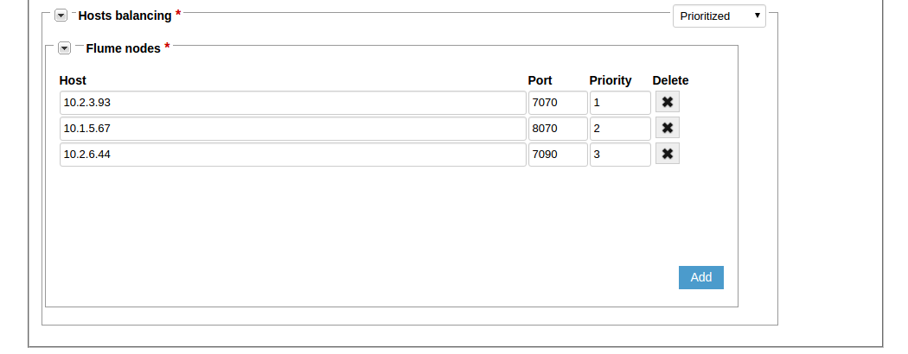
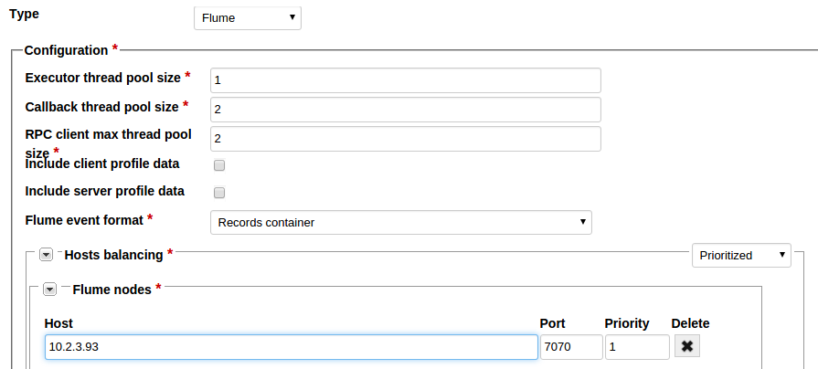
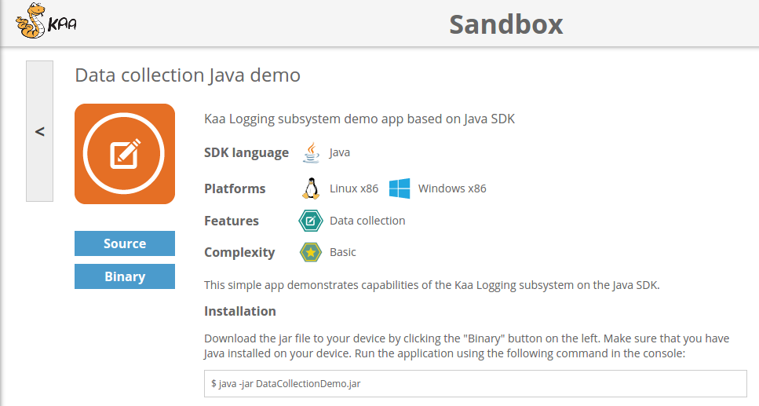



* TOC
{:toc}

The Flume log appender encapsulates received logs into Flume events and sends these events to external Flume sources via Avro RPC.

# Creating Flume log appender in Admin UI

The easiest way to create a Flume log appender for your application is by using Admin UI.

To create a log appender do the following:

1. In the **Log appenders** window, click **Add log appender**. <br/>
2. Enter the log appender name and description, select the minimum and maximum supported log schema version, and select necessary log metadata fields. <br/>
3. Set the log appender type to _Flume_. <br/>
4. Fill in the Flume log appender [configuration](#configuration) form. <br/>

5.  Configure host balancing. <br/>

    >**NOTE:**
    >Flume log appenders can have either prioritized or round robin host balancing.

    *   For the prioritized host balancing, add the number of hosts which is equal to the number of Flume nodes. For every host, enter the host address,
        port and priority. The highest priority is 1. When choosing a server to which to save logs, an endpoint will send requests to the servers starting from
        the server with the highest priority. <br/>
        
    *   For round robin host balancing, add the number of hosts which is equal to the number of Flume nodes. For every host, enter the host address and port.
        When choosing a server to which to save logs, an endpoint will send requests to the servers according to the round robin algorithm. <br/>
        

6.  Click **Add** button. Log appender is ready and operational at this point.

# Creating Flume log appender with Admin REST API

It is also possible to create a Flume log appender for your application by using
[Admin REST API]({{root_url}}Programming-guide/Server-REST-APIs/#!/Logging/editLogAppender).
The following example illustrates how to create the Flume log appender via Admin REST API.

## Formats

The Flume log appender can be configured to produce flume events using either _Records container_ or _Generic_ format.

### Records container

In case of the Records container format, log records are serialized by the following RecordData schema as a binary Avro file and stored in a Flume event raw body.

The RecordData schema has the following four fields.

* recordHeader
* schemaVersion
* applicationToken
* eventRecords

The **recordHeader** field stores a set of log metadata fields.

The **eventRecords** field stores an array of raw records. Each element of the array is a log record in the Avro binary format serialized by the log schema.

The **schemaVersion** and **applicationToken** fields should be used as parameters of a
[Admin REST API]({{root_url}}Programming-guide/Server-REST-APIs/#!/Logging/getLogSchemaByApplicationTokenAndVersion) call to Kaa in order to obtain the logs
Avro schema for **eventRecords** and enable parsing of the binary data.

```json
{
    "type":"record",
    "name":"RecordData",
    "namespace":"org.kaaproject.kaa.server.common.log.shared.avro.gen",
    "fields":[
        {
            "name":"recordHeader",
            "type":[
                {
                    "type":"record",
                    "name":"RecordHeader",
                    "namespace":"org.kaaproject.kaa.server.common.log.shared.avro.gen",
                    "fields":[
                        {
                            "name":"endpointKeyHash",
                            "type":[
                                {
                                    "type":"string"
                                },
                                "null"
                            ]
                        },
                        {
                            "name":"applicationToken",
                            "type":[
                                {
                                    "type":"string"
                                },
                                "null"
                            ]
                        },
                        {
                            "name":"headerVersion",
                            "type":[
                                {
                                    "type":"int"
                                },
                                "null"
                            ]
                        },
                        {
                            "name":"timestamp",
                            "type":[
                                {
                                    "type":"long"
                                },
                                "null"
                            ]
                        },
                        {
                            "name":"logSchemaVersion",
                            "type":[
                                {
                                    "type":"int"
                                },
                                "null"
                            ]
                        }
                    ]
                },
                "null"
            ]
        },
        {
            "name":"schemaVersion",
            "type":"int"
        },
        {
            "name":"applicationToken",
            "type":"string"
        },
        {
            "name":"eventRecords",
            "type":{
                "type":"array",
                "items":{
                    "name":"RecordEvent",
                    "namespace":"org.kaaproject.kaa.server.common.log.shared.avro.gen",
                    "type":"bytes"
                }
            }
        },
        {
            "name":"clientProfileBody",
            "type":[
                {
                    "type":"string"
                },
                "null"
            ]
        },
        {
            "name":"clientSchemaId",
            "type":[
                {
                    "type":"string"
                },
                "null"
            ]
        },
        {
            "name":"serverProfileBody",
            "type":[
                {
                    "type":"string"
                },
                "null"
            ]
        },
        {
            "name":"serverSchemaId",
            "type":[
                {
                    "type":"string"
                },
                "null"
            ]
        }
    ]
}
```

### Generic

In case of the Generic format, every log record is represented as a separate Flume event. The Flume event body contains a log record serialized by 
the log schema in the Avro binary format. The Flume event header contains the log schema definition mapped by the **flume.avro.schema.literal** key.

In addition, Kaa provides the following two extended Flume agents which can be used together with the Flume log appender.

* Kaa flume source
* Kaa flume sink

The Kaa flume source is a Flume agent with the extension to the standard Flume NG Avro Sink that includes additional features and performance improvements. 
The Kaa flume source receives data from the Flume log appender and delivers it to an external Avro Source located in a Hadoop cluster.

The Kaa flume sink is a Flume agent with the extension to the standard Flume NG HDFS Sink that includes additional features. The Kaa flume sink is aware 
of the log records data schema and stores log data into HDFS as Avro Sequence files using the following Avro schema.

```json
{
    "type":"record",
    "name":"RecordWrapper",
    "namespace":"org.kaaproject.kaa.log",
    "fields":[
        {
            "name":"recordHeader",
            "type":[
                {
                    "type":"record",
                    "name":"RecordHeader",
                    "namespace":"org.kaaproject.kaa.server.common.log.shared.avro.gen",
                    "fields":[
                        {
                            "name":"endpointKeyHash",
                            "type":[
                                {
                                    "type":"string"
                                },
                                "null"
                            ]
                        },
                        {
                            "name":"applicationToken",
                            "type":[
                                {
                                    "type":"string"
                                },
                                "null"
                            ]
                        },
                        {
                            "name":"headerVersion",
                            "type":[
                                {
                                    "type":"int"
                                },
                                "null"
                            ]
                        },
                        {
                            "name":"timestamp",
                            "type":[
                                {
                                    "type":"long"
                                },
                                "null"
                            ]
                        }
                    ]
                },
                "null"
            ]
        },
        {
            "name":"recordData",
            "type":[
                ${
                    record_data_schema
                },
                "null"
            ]
        }
    ]
}
```

```${record_data_schema}``` - is a variable which is substituted at run time by Kaa HDFS Sink with the Avro schema of the actual logs. 
This Avro schema is obtained via [Admin REST API]({{root_url}}Programming-guide/Server-REST-APIs/#!/Logging/getLogSchemaByApplicationTokenAndVersion) call
to Kaa.

## Configuration

The Flume log appender configuration must match to
[this](https://github.com/kaaproject/kaa/blob/master/server/appenders/flume-appender/src/main/avro/flume-appender-config.avsc) Avro schema.

|name                   |description                                        |
|-----------------------|---------------------------------------------------|
|executorThreadPoolSize |Executor thread pool size                          |
|callbackThreadPoolSize |Callback thread pool size                          |
|clientsThreadPoolSize  |RPC client max thread pool                         |
|includeClientProfile   |Client-side endpoint profile data (boolean value)  |
|includeServerProfile   |Server-side endpoint profile data (boolean value)  |
|flumeEventFormat       |Records container or Generic                       |
|hostsBalancing         |Prioritized or Round Robin                         |
|FlumeNodes             |Flume nodes                                        |

An example configuration that matches to previously introduced Avro schema is as below:

```json
{
    "executorThreadPoolSize":1,
    "callbackThreadPoolSize":2,
    "clientsThreadPoolSize":2,
    "includeClientProfile":{
        "boolean":true
    },
    "includeServerProfile":{
        "boolean":true
    },
    "flumeEventFormat":"RECORDS_CONTAINER",
    "hostsBalancing":{
        "org.kaaproject.kaa.server.appenders.flume.config.gen.FlumeNodes":{
            "flumeNodes":[
                {
                    "host":"localhost",
                    "port":7070
                },
                {
                    "host":"notlocalhost",
                    "port":7070
                }
            ]
        }
    }
}
```

>**NOTE:**  
> Flume log appenders can have either prioritized or round robin host balancing. <br/>
* For the prioritized host balancing, every flume node record should have a host address, port and priority. The highest priority is 1. When choosing a server
to which to save logs, an endpoint will send requests to the servers starting from the server with the highest priority. <br/>
* For the round robin host balancing, every flume node record should have a host address and port. When choosing a server to which to save logs, an endpoint
will send requests to the servers according to the round robin algorithm. <br/>
* You can include client-side and/or server-side endpoint profile data into persisted data via corresponding check-boxes.

## Administration

The following Admin REST API call example illustrates how to create a new Flume log appender.

```bash
curl -v -S -u devuser:devuser123 -X POST -H 'Content-Type: application/json' -d @flumeLogAppender.json "http://localhost:8080/kaaAdmin/rest/api/logAppender" | python -mjson.tool
```

where file ```flumeLogAppender.json``` contains following data:

```json
{
    "pluginClassName":"org.kaaproject.kaa.server.appenders.flume.appender.FlumeLogAppender",
    "pluginTypeName":"Flume",
    "applicationId":"5",
    "applicationToken":"82635305199158071549",
    "name":"Sample Flume log appender",
    "description":"Sample Flume log appender",
    "headerStructure":[
        "KEYHASH",
        "VERSION",
        "TIMESTAMP",
        "TOKEN",
        "LSVERSION"
    ],
    "maxLogSchemaVersion":2147483647,
    "minLogSchemaVersion":1,
    "tenantId":"1",
    "jsonConfiguration":"{\"executorThreadPoolSize\":1,\"callbackThreadPoolSize\":2,\"clientsThreadPoolSize\":2,\"includeClientProfile\":{\"boolean\":false},\"includeServerProfile\":{\"boolean\":false},\"flumeEventFormat\":\"RECORDS_CONTAINER\",\"hostsBalancing\":{\"org.kaaproject.kaa.server.appenders.flume.config.gen.PrioritizedFlumeNodes\":{\"flumeNodes\":[{\"host\":\"10.2.3.93\",\"port\":7070,\"priority\":1},{\"host\":\"10.1.5.67\",\"port\":8070,\"priority\":2},{\"host\":\"10.2.6.44\",\"port\":7090,\"priority\":3}]}}}"
}
```

Example result:

```json
{
    "applicationId": "5",
    "applicationToken": "82635305199158071549",
    "confirmDelivery": true,
    "createdTime": 1466496979110,
    "createdUsername": "devuser",
    "description": "Sample Flume log appender",
    "headerStructure": [
        "KEYHASH",
        "VERSION",
        "TIMESTAMP",
        "TOKEN",
        "LSVERSION"
    ],
    "id": "131074",
    "jsonConfiguration": "{\"executorThreadPoolSize\":1,\"callbackThreadPoolSize\":2,\"clientsThreadPoolSize\":2,\"includeClientProfile\":{\"boolean\":false},\"includeServerProfile\":{\"boolean\":false},\"flumeEventFormat\":\"RECORDS_CONTAINER\",\"hostsBalancing\":{\"org.kaaproject.kaa.server.appenders.flume.config.gen.PrioritizedFlumeNodes\":{\"flumeNodes\":[{\"host\":\"10.2.3.93\",\"port\":7070,\"priority\":1},{\"host\":\"10.1.5.67\",\"port\":8070,\"priority\":2},{\"host\":\"10.2.6.44\",\"port\":7090,\"priority\":3}]}}}",
    "maxLogSchemaVersion": 2147483647,
    "minLogSchemaVersion": 1,
    "name": "Sample Flume log appender",
    "pluginClassName": "org.kaaproject.kaa.server.appenders.flume.appender.FlumeLogAppender",
    "pluginTypeName": "Flume",
    "tenantId": "1"
}
```

If you want to use Flume agents together with the Flume log appender, create necessary Kaa Flume agents as described in
[Installing Kaa flume agents](#TODO Add link to Installing Kaa flume agents).

# Setting up Flume log appender

1. As a tenant admin, go to your application >> Log appenders, then click **Add log appender**.

2. In the **Add log appender** window that opens, fill in the required fields
In our example, we use _Flume_ as Name.  
In the **Type** drop-down list, select Flume.
Then, specify the fields **Flume event format** (we selected _Records container_), and **Hosts balancing** (we selected _prioritized_).
Finally, specify the cluster parameters: host, port and priority. We use localhost:7070 (in our case localhost = 10.2.3.93).


3. To finish, click **Add** at the top of the window.  
4. In case of success, you will see your new log appender in the log appenders list.

5. Go to the Data collection demos in Sandbox.

6. Use instructions from Sandbox to run Data collection demo application and verify that logs have been successfully sent to Kaa.
7. After this you should see something like below:

```bash
2016-06-16 14:09:28,483 [main] INFO  o.k.k.d.d.DataCollectionDemo - Data collection demo started
2016-06-16 14:09:29,795 [pool-2-thread-1] INFO  o.k.k.d.d.DataCollectionDemo - Kaa client started
2016-06-16 14:09:29,798 [main] INFO  o.k.k.d.d.DataCollectionDemo - Log record {"level": "KAA_INFO", "tag": "TAG", "message": "MESSAGE_0", "timeStamp": 1466075369795} sent
2016-06-16 14:09:29,807 [main] INFO  o.k.k.d.d.DataCollectionDemo - Log record {"level": "KAA_INFO", "tag": "TAG", "message": "MESSAGE_1", "timeStamp": 1466075369795} sent
2016-06-16 14:09:29,807 [main] INFO  o.k.k.d.d.DataCollectionDemo - Log record {"level": "KAA_INFO", "tag": "TAG", "message": "MESSAGE_2", "timeStamp": 1466075369795} sent
2016-06-16 14:09:29,807 [main] INFO  o.k.k.d.d.DataCollectionDemo - Log record {"level": "KAA_INFO", "tag": "TAG", "message": "MESSAGE_3", "timeStamp": 1466075369795} sent
2016-06-16 14:09:29,807 [main] INFO  o.k.k.d.d.DataCollectionDemo - Log record {"level": "KAA_INFO", "tag": "TAG", "message": "MESSAGE_4", "timeStamp": 1466075369795} sent
2016-06-16 14:09:29,999 [main] INFO  o.k.k.d.d.DataCollectionDemo - Received log record delivery info. Bucket Id [0]. Record delivery time [204 ms].
2016-06-16 14:09:30,000 [main] INFO  o.k.k.d.d.DataCollectionDemo - Received log record delivery info. Bucket Id [0]. Record delivery time [205 ms].
2016-06-16 14:09:30,000 [main] INFO  o.k.k.d.d.DataCollectionDemo - Received log record delivery info. Bucket Id [0]. Record delivery time [205 ms].
2016-06-16 14:09:30,000 [main] INFO  o.k.k.d.d.DataCollectionDemo - Received log record delivery info. Bucket Id [0]. Record delivery time [205 ms].
2016-06-16 14:09:30,000 [main] INFO  o.k.k.d.d.DataCollectionDemo - Received log record delivery info. Bucket Id [0]. Record delivery time [204 ms].
2016-06-16 14:09:30,001 [pool-2-thread-1] INFO  o.k.k.d.d.DataCollectionDemo - Kaa client stopped
2016-06-16 14:09:30,006 [main] INFO  o.k.k.d.d.DataCollectionDemo - Data collection demo stopped
```

The logs are stored within the HDFS path defined during Kaa Flume sink setup.
