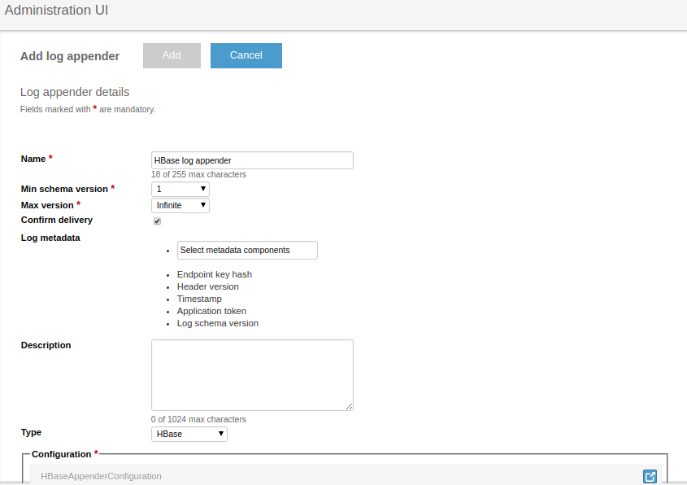
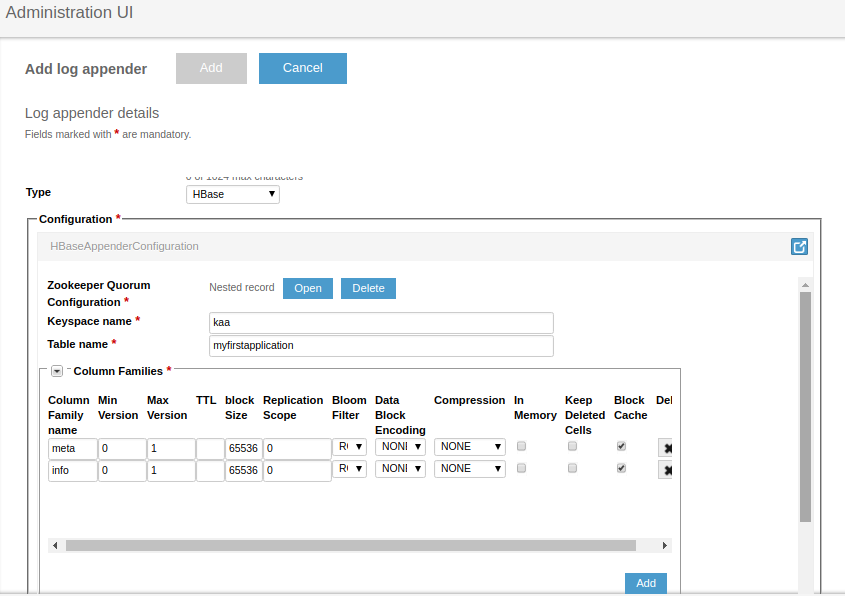
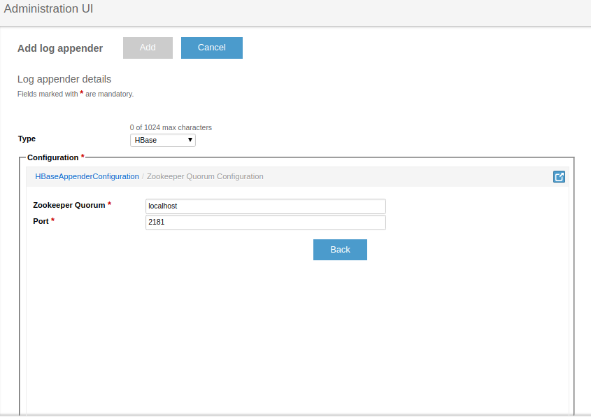
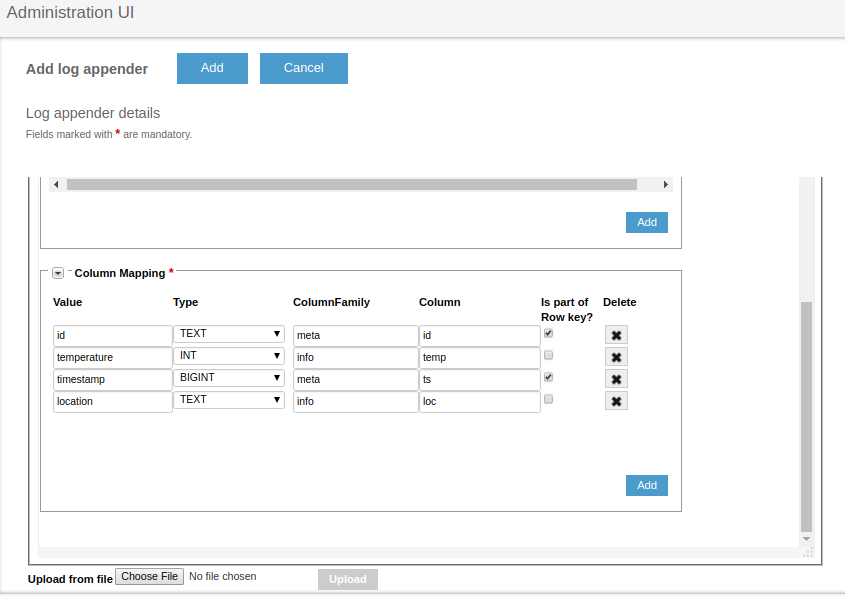

* TOC
{:toc}

The HBase log appender is used to transfer logs from the [Operations service]({{root_url}}Glossary/#operations-service) to the [HBase](https://hbase.apache.org/) database. This log appender was developed under HBase version 0.98.6.

## Create HBase Log Appender

To create an HBase log appender for your application using the [Administration UI]({{root_url}}Glossary/#administration-ui):

1. Log in to the **Administration UI** page as a [tenant developer]({{root_url}}Glossary/#tenant-developer).

2. Click **Applications** and open the **Log appenders** page of your application.
Click **Add log appender**.

3. On the **Log appender details** page, enter the necessary information and set the **Type** field to **HBase**.
>**NOTE:** The field "Log metadata" is not currently working.{:.note}

	
	

4. Fill in the **Configuration** section for your log appender and click **Add**.
See [Configure log appender](#configure-log-appender).

	
	
	

## Configure log appender

The HBase log appender configuration must match [this Avro schema](/server/appenders/hbase-appender/src/main/avro/HBaseAppenderConfiguration.avsc).

You can configure the following log appender settings:

* **Zookeeper Quorum** -- list of Zookeeper hosts responsible for HBase cluster connection. For more than one host, use commas to separate the hosts. 
* **Keyspace name** -- HBase namespace used to prefix the data table. The namespace can be previously set in HBase. If it is not, the log appender will create it.
* **Table name** -- HBase table name.
* **Column families** -- specify and configure column families for the HBase table.
* **Column mapping** -- mapping of specific log data to appropriate columns. Use the checkboxes to make any field part of the row key.
