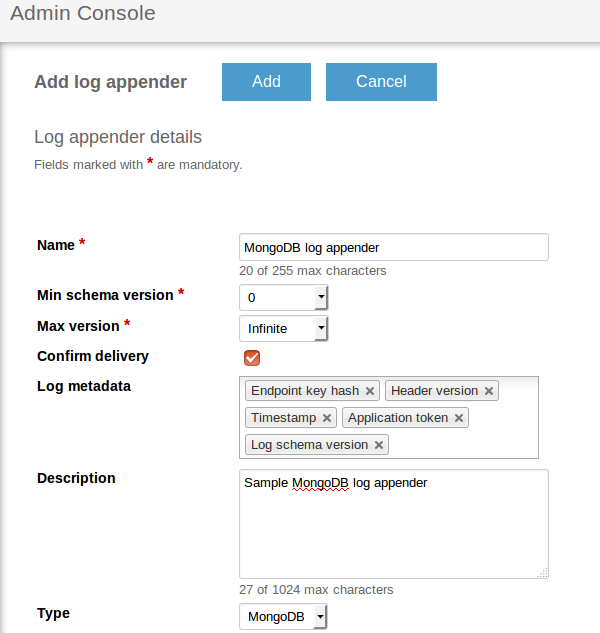
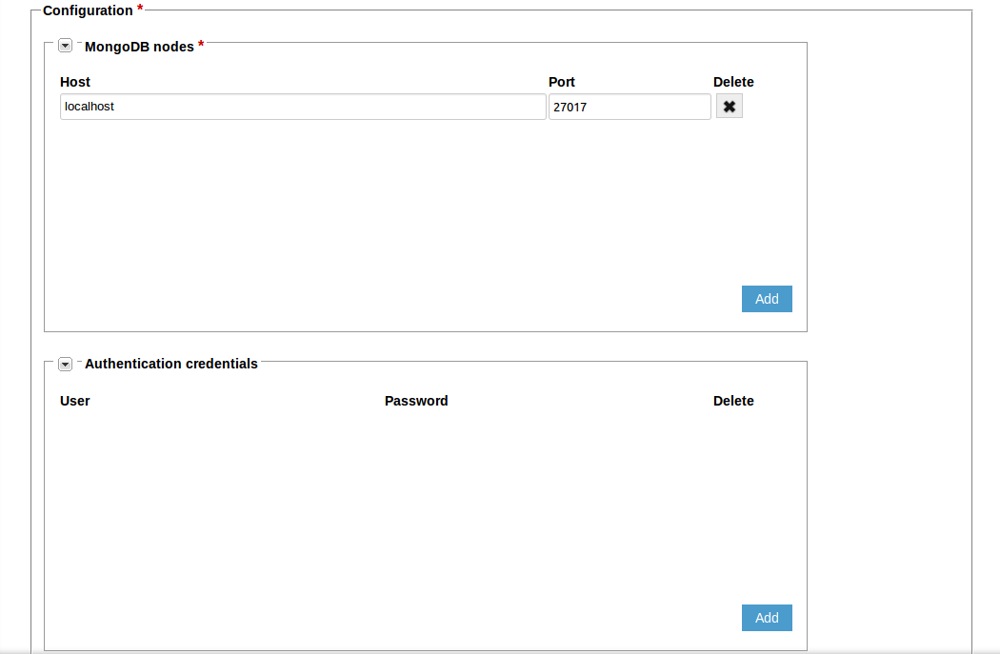
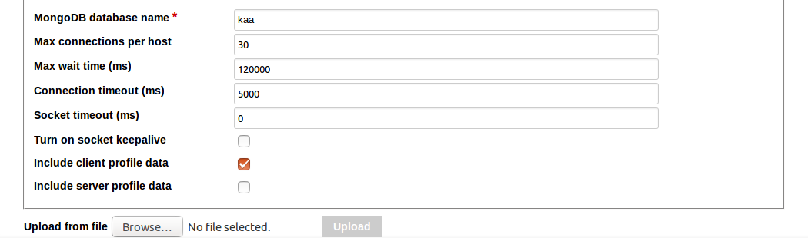



* TOC
{:toc}

The MongoDB log appender is used to transfer logs from the [Operations service]({{root_url}}Glossary/#operations-service) to the [MongoDB](https://www.mongodb.com/) database.
The logs are stored in the `logs\_$applicationToken` table, where `$applicationToken` matches the [token of the current application]({{root_url}}Glossary/#application-token).

## Create MongoDB log appender

To create a MongoDB log appender for your application using the [Administration UI]({{root_url}}Glossary/#administration-ui):

1. Log in to the **Administration UI** page as a [tenant developer]({{root_url}}Glossary/#tenant-developer).

2. Click **Applications** and open the **Log appenders** page of your application.
Click **Add log appender**.

3. On the **Log appender details** page, enter the necessary information and set the **Type** field to **MongoDB**.
	

4. Fill in the **Configuration** section for your log appender and click **Add**.
See [Configure log appender](#configure-log-appender).

	
	

Alternatively, you can use the [server REST API]({{root_url}}Programming-guide/Server-REST-APIs/#!/Logging/editLogAppender) to create or edit your MongoDB log appender.	

The following example illustrates how to create an instance of MongoDB log appender using the server REST API.

```bash
curl -v -S -u devuser:devuser123 -X POST -H 'Content-Type: application/json' -d @mongoDBLogAppender.json "http://localhost:8080/kaaAdmin/rest/api/logAppender" | python -mjson.tool
```

where file `mongoDBLogAppender.json` contains the following data.

```
{
    "pluginClassName":"org.kaaproject.kaa.server.appenders.mongo.appender.MongoDbLogAppender",
    "pluginTypeName":"MongoDB",
    "applicationId":"5",
    "applicationToken":"82635305199158071549",
    "name":"Sample MongoDB log appender",
    "description":"Sample MongoDB log appender",
    "headerStructure":[
        "KEYHASH",
        "VERSION",
        "TIMESTAMP",
        "TOKEN",
        "LSVERSION"
    ],
    "maxLogSchemaVersion":2147483647,
    "minLogSchemaVersion":1,
    "tenantId":"1",
    "jsonConfiguration":"{\"mongoServers\":[{\"host\":\"localhost\",\"port\":27017}],\"mongoCredentials\":[],\"dbName\":\"kaa\",\"connectionsPerHost\":{\"int\":30},\"maxWaitTime\":{\"int\":120000},\"connectionTimeout\":{\"int\":5000},\"socketTimeout\":{\"int\":0},\"socketKeepalive\":{\"boolean\":false},\"includeClientProfile\":{\"boolean\":false},\"includeServerProfile\":{\"boolean\":false}}"
}
```

Below is an example result.

```json
{
    "applicationId":"5",
    "applicationToken":"82635305199158071549",
    "confirmDelivery":true,
    "createdTime":1466504475844,
    "createdUsername":"devuser",
    "description":"Sample MongoDB log appender",
    "headerStructure":[
        "KEYHASH",
        "VERSION",
        "TIMESTAMP",
        "TOKEN",
        "LSVERSION"
    ],
    "id":"163840",
    "jsonConfiguration":"{\"mongoServers\":[{\"host\":\"localhost\",\"port\":27017}],\"mongoCredentials\":[],\"dbName\":\"kaa\",\"connectionsPerHost\":{\"int\":30},\"maxWaitTime\":{\"int\":120000},\"connectionTimeout\":{\"int\":5000},\"socketTimeout\":{\"int\":0},\"socketKeepalive\":{\"boolean\":false},\"includeClientProfile\":{\"boolean\":false},\"includeServerProfile\":{\"boolean\":false}}",
    "maxLogSchemaVersion":2147483647,
    "minLogSchemaVersion":1,
    "name":"Sample MngoDB log appender",
    "pluginClassName":"org.kaaproject.kaa.server.appenders.mongo.appender.MongoDbLogAppender",
    "pluginTypeName":"MongoDB",
    "tenantId":"1"
}
```

## Configure log appender

The MongoDB log appender configuration must match [this Avro schema]({{github_url}}server/appenders/mongo-appender/src/main/avro/mongodb-appender-config.avsc).

You can configure the following log appender settings:

* **MongoDB nodes** -- list of MongoDB hosts.
* **Authentication credentials** -- credentials used to authenticate on MongoDB cluster.

The rest of the connection settings are described in the table below.

|Name                   |Description                                                            |
|-----------------------|-----------------------------------------------------------------------|
|`dbName`                 |Database name.                                                  |
|`connectionsPerHost`     |Maximum number of connections per host.                                     |
|`maxWaitTime`            |Maximum wait time for connection in milliseconds.                           |
|`connectionTimeout`      |Connection timeout in milliseconds.                                     |
|`socketTimeout`          |Socket timeout in milliseconds.                                         |
|`socketKeepalive`        |Turn on socket keep alive (boolean value).                              |
|`includeClientProfile`   |Specifies whether to include client-side endpoint profile data (boolean value).   |
|`includeServerProfile`   |Whether to include server-side endpoint profile data (boolean value).   |

Below is an example configuration that matches the mentioned Avro schema.

```json
{
    "mongoServers":[
        {
            "host":"127.0.0.1",
            "port":27017
        }
    ],
    "mongoCredentials":[
        {
            "user":"user",
            "password":"password"
        }
    ],
    "dbName":"kaa",
    "connectionsPerHost":{
        "int":30
    },
    "maxWaitTime":{
        "int":120000
    },
    "connectionTimeout":{
        "int":5000
    },
    "socketTimeout":{
        "int":0
    },
    "socketKeepalive":{
        "boolean":false
    },
    "includeClientProfile":{
        "boolean":false
    },
    "includeServerProfile":{
        "boolean":false
    }
}
```

## Playing with MongoDB log appender

The example below uses the **Data collection demo** from [Kaa Sandbox]({{root_url}}Glossary/#kaa-sandbox).
The log appender will send data to Kaa and then persist it to MongoDB.
Some selection queries will be demonstrated using the persisted data.

Below is the log schema for the application.

```json
{
    "type":"record",
    "name":"Data",
    "namespace":"org.kaaproject.kaa.scheme.sample",
    "fields":[
        {
            "name":"temperature",
            "type":"int"
        },
        {
            "name":"timeStamp",
            "type":"long"
        }
    ],
    "displayName":"Logging scheme"
}
```

The following JSON example matches the above schema.

```json
{
    "temperature":"28",
    "timeStamp":"1474366798"
}

```

To play around with the MongoDB log appender:

1. Open the Data collection demo from Kaa Sandbox, follow the application installation instructions, and run the application.

2. Create a MongoDB log appender as described [above](#create-mongodb-log-appender) or use the one pre-installed in the sample application.

3. Your running Data collection demo application will display the output similar to the example below.

		Data collection demo started
		Received new sample period: 1
		Sampled temperature 28 1474622330
		Sampled temperature 31 1474622331
		Sampled temperature 32 1474622332
		Sampled temperature 30 1474622333
		Sampled temperature 28 1474622334
		...

4. To verify that your logs have been persisted to MongoDB, open the Sandbox VM and run the following command.

		mongo kaa
		db.logs_$your_application_token$.find()

5. The following output will be displayed.

		{ "_id" : ObjectId("57d916e8d55fb2073ae3cfbd"), "header" : { "endpointKeyHash" : { "string" : "H0Oclp3Wn/QS25dZCQSbV5ZkjRo=" }, "applicationToken" : { "string" : "65691512829156876532" }, "headerVersion" : { "int" : 1 }, "timestamp" : { "long" : NumberLong("1473844968489") }, "logSchemaVersion" : null }, "event" : { "temperature" : 28, "timeStamp" : 1474622330 } }
		{ "_id" : ObjectId("57d916e8d55fb2073ae3cfbe"), "header" : { "endpointKeyHash" : { "string" : "H0Oclp3Wn/QS25dZCQSbV5ZkjRo=" }, "applicationToken" : { "string" : "65691512829156876532" }, "headerVersion" : { "int" : 1 }, "timestamp" : { "long" : NumberLong("1473844968489") }, "logSchemaVersion" : null }, "event" : { "temperature" : 31, "timeStamp" : 1474622331 } }
		{ "_id" : ObjectId("57d916e8d55fb2073ae3cfbf"), "header" : { "endpointKeyHash" : { "string" : "H0Oclp3Wn/QS25dZCQSbV5ZkjRo=" }, "applicationToken" : { "string" : "65691512829156876532" }, "headerVersion" : { "int" : 1 }, "timestamp" : { "long" : NumberLong("1473844968489") }, "logSchemaVersion" : null }, "event" : { "temperature" : 32, "timeStamp" : 1474622332 } }
		{ "_id" : ObjectId("57d916e8d55fb2073ae3cfc0"), "header" : { "endpointKeyHash" : { "string" : "H0Oclp3Wn/QS25dZCQSbV5ZkjRo=" }, "applicationToken" : { "string" : "65691512829156876532" }, "headerVersion" : { "int" : 1 }, "timestamp" : { "long" : NumberLong("1473844968489") }, "logSchemaVersion" : null }, "event" : { "temperature" : 30, "timeStamp" : 1474622333 } }
		{ "_id" : ObjectId("57d916e8d55fb2073ae3cfc1"), "header" : { "endpointKeyHash" : { "string" : "H0Oclp3Wn/QS25dZCQSbV5ZkjRo=" }, "applicationToken" : { "string" : "65691512829156876532" }, "headerVersion" : { "int" : 1 }, "timestamp" : { "long" : NumberLong("1473844968489") }, "logSchemaVersion" : null }, "event" : { "temperature" : 28, "timeStamp" : 1474622334 } }
		...
		
If you don't get the desired output or experience other problems, see [Troubleshooting]({{root_url}}Administration-guide/Troubleshooting).
