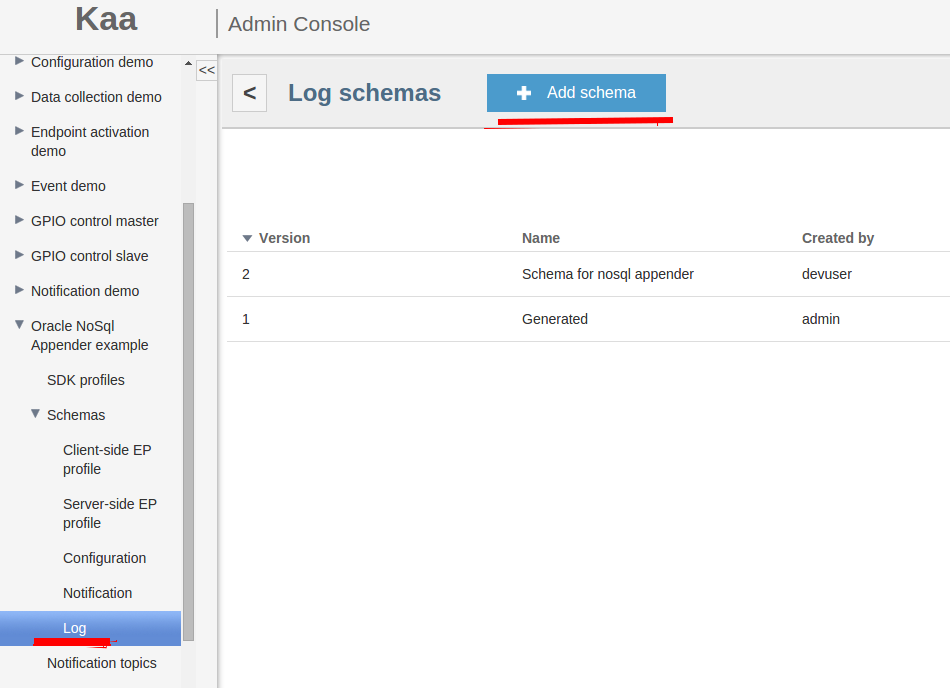
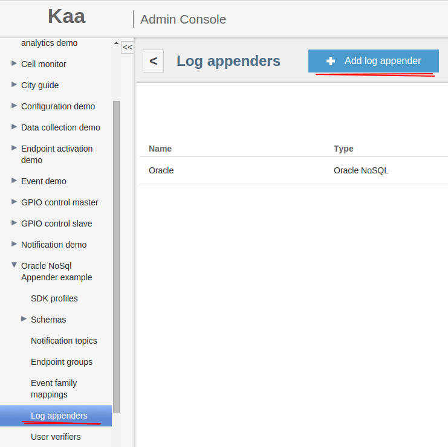



* TOC
{:toc}

The Oracle NoSQL log appender is used to transfer logs from the [Operations service]({{root_url}}Glossary/#operations-service) to the [Oracle NoSQL](https://www.oracle.com/database/nosql/index.html) key/value storage.

## Create Oracle NoSQL log appender

To create a Oracle NoSQL log appender for your application using the [Administration UI]({{root_url}}Glossary/#administration-ui):

1. Log in to the **Administration UI** page as a [tenant developer]({{root_url}}Glossary/#tenant-developer).

2. Click **Applications** and open the **Log appenders** page of your application.
Click **Add log appender**.

3. On the **Log appender details** page, enter the necessary information and set the **Type** field to **Oracle NoSQL**.

4. Fill in other fields as required and click **Add**.
See [Configure log appender](#configure-log-appender).
	

Alternatively, you can use the [server REST API]({{root_url}}Programming-guide/Server-REST-APIs/#!/Logging/editLogAppender) to create or edit your log appender.

The following example illustrates how to create an instance of the Oracle NoSQL log appender using the server REST API.

```bash
curl -v -S -u devuser:devuser123 -X POST -H 'Content-Type: application/json' -d @oracleNoSQLlogAppender.json "http://localhost:8080/kaaAdmin/rest/api/logAppender" | python -mjson.tool
```

where file `oracleNoSQLlogAppender.json` contains the following data.

```
{
    "pluginClassName":"org.kaaproject.kaa.server.appenders.oraclenosql.appender.OracleNoSqlLogAppender",
    "pluginTypeName":"Oracle NoSQL",
    "applicationId":"5",
    "applicationToken":"82635305199158071549",
    "name":"Sample Oracle NoSQL log appender",
    "description":"Sample Oracle NoSQL log appender",
    "headerStructure":[
        "KEYHASH",
        "VERSION",
        "TIMESTAMP",
        "TOKEN",
        "LSVERSION"
    ],
    "maxLogSchemaVersion":2147483647,
    "minLogSchemaVersion":1,
    "tenantId":"1",
    "jsonConfiguration":"{\"storeName\":\"kvstore\",\"kvStoreNodes\":[{\"host\":\"localhost\",\"port\":5000}],\"username\":null,\"walletDir\":null,\"pwdFile\":null,\"securityFile\":null,\"transport\":null,\"ssl\":null,\"sslCipherSuites\":null,\"sslProtocols\":null,\"sslHostnameVerifier\":null,\"sslTrustStore\":null,\"sslTrustStoreType\":null}"
}
```

Below is an example result.

```json
{
    "applicationId":"5",
    "applicationToken":"82635305199158071549",
    "confirmDelivery":true,
    "createdTime":1466506070066,
    "createdUsername":"devuser",
    "description":"Sample Oracle NoSQL log appender",
    "headerStructure":[
        "KEYHASH",
        "VERSION",
        "TIMESTAMP",
        "TOKEN",
        "LSVERSION"
    ],
    "id":"163842",
    "jsonConfiguration":"{\"storeName\":\"kvstore\",\"kvStoreNodes\":[{\"host\":\"localhost\",\"port\":5000}],\"username\":null,\"walletDir\":null,\"pwdFile\":null,\"securityFile\":null,\"transport\":null,\"ssl\":null,\"sslCipherSuites\":null,\"sslProtocols\":null,\"sslHostnameVerifier\":null,\"sslTrustStore\":null,\"sslTrustStoreType\":null}",
    "maxLogSchemaVersion":2147483647,
    "minLogSchemaVersion":1,
    "name":"Sample Oracle NoSQL log appender",
    "pluginClassName":"org.kaaproject.kaa.server.appenders.oraclenosql.appender.OracleNoSqlLogAppender",
    "pluginTypeName":"Oracle NoSQL",
    "tenantId":"1"
}
```

## Configure log appender

The Oracle NoSQL log appender configuration must match [this Avro schema]({{github_url}}server/appenders/oracle-nosql-appender/src/main/avro/oracle-nosql-appender-config.avsc).

Logs are stored using the following key path.

```bash
${applicationToken}/${logSchemaVersion}/${endpointKeyHash}/${uploadTimestamp}/${counter}
```

The path variables are described below.

|Path variable      |Description  |
|-------------------|---------------------------------------------------------------|
|`applicationToken`   |Token of the application.     |
|`logSchemaVersion`   |Version of the log schema.     |
|`endpointKeyHash`    |ID of the endpoint the log data belongs to.   |
|`uploadTimestamp`    |Timestamp of log upload to the storage (in milliseconds).|
|`count`              |Log record ID.  |

Values are stored as serialized generic records using the record wrapper Avro schema.

Below is an example configuration that matches the mentioned Avro schema.

```json
{
    "storeName":"kvstore",
    "kvStoreNodes":[
        {
            "host":"localhost",
            "port":5000
        }
    ],
    "username":null,
    "walletDir":null,
    "pwdFile":null,
    "securityFile":null,
    "transport":null,
    "ssl":null,
    "sslCipherSuites":null,
    "sslProtocols":null,
    "sslHostnameVerifier":null,
    "sslTrustStore":null,
    "sslTrustStoreType":null
}
```

## Playing with Oracle NoSQL log appender

To play around with the Oracle NoSQL log appender:

1. Download the [Oracle nosql database archive](http://www.oracle.com/technetwork/database/database-technologies/nosqldb/downloads/index.html) and install it to your [Kaa server]({{root_url}}Glossary/#kaa-server).
Use [this tutorial](https://blogs.oracle.com/charlesLamb/entry/oracle_nosql_database_in_5) for more information.

2. Create an application [using the Administration UI]({{root_url}}Programming-guide/Your-first-Kaa-application/) or [server REST API]({{root_url}}Programming-guide/Server-REST-APIs/#!/Application/editApplication).

3. Add a custom log schema for saving logs in database.
	

4. Add Oracle NoSQL log appender and set up its configuration.
	

5. Generate an [SDK for your platform]({{root_url}}Programming-guide/Using-Kaa-endpoint-SDKs/) and write some code to send logs to database.
Below is an example of the client code you can use.
		
		...
		KaaClient client = ...
		...
		Data data = new Data("your log data");
		//send logs to oracle database
		client.addLogRecord(data);
		...
		
To verify that your logs have been persisted in Oracle NoSQL storage:

1. Open console and run the following command.

		java -jar path_to_oracle_db/lib/kvstore.jar runadmin -host $your_host$ -port $your_port$

	Where `$your_host$` and `$your_port$` is your host and port addresses respectively.

2. Connect to your storage.

		connect store -name kvstore  -host $oracle_db_host$  -port $oracle_db_port$;

    Where `$oracle_db_host$` and `$oracle_db_port$` is KVStore node host and port addresses respectively.

3. Run the following command.

		get kv -start /${applicationToken} -all
		
	The following data will be recorded in your database.

		/97657068517919541825/2/519xnHqR4xVpq2MSoLSUKgmSTa4=/1456227512249/-/0
		{
			"recordHeader":{
				"org.kaaproject.kaa.server.common.log.shared.avro.gen.RecordHeader":{
					"endpointKeyHash":null,
					"applicationToken":null,
					"headerVersion":null,
					"timestamp":null,
					"logSchemaVersion":null
				}
			},
			"recordData":{
				"org.kaaproject.kaa.example.nosql.Data":{
					"logInfo":{
						"string":"your log data"
					}
				}
			}
		}

If you don't get the desired output or experience other problems, see [Troubleshooting]({{root_url}}Administration-guide/Troubleshooting).
