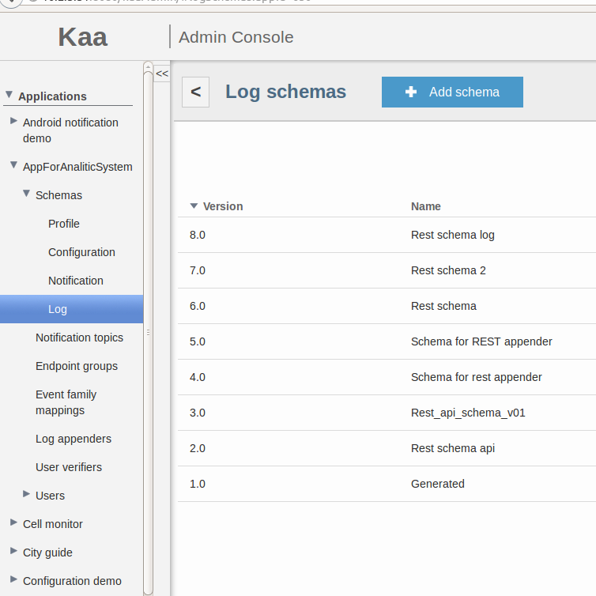



* TOC
{:toc}

The REST log appender is used to transfer logs from the [Operations service]({{root_url}}Glossary/#operations-service) to your custom service.

## Create REST log appender

To create a REST log appender for your application using the [Administration UI]({{root_url}}Glossary/#administration-ui):

1. Log in to the **Administration UI** page as a [tenant developer]({{root_url}}Glossary/#tenant-developer).

2. Click **Applications** and open the **Log appenders** page of your application.
Click **Add log appender**.

3. On the **Log appender details** page, enter the necessary information and set the **Type** field to **REST**.

4. Fill in other fields as required and click **Add**.
See [Configure log appender](#configure-log-appender).
	

Alternatively, you can use the [server REST API]({{root_url}}Programming-guide/Server-REST-APIs/#!/Logging/editLogAppender) to create or edit your log appender.

The following example illustrates how to create an instance of REST log appender using the server REST API.

```bash
curl -v -S -u devuser:devuser123 -X POST -H 'Content-Type: application/json' -d @restLogAppender.json "http://localhost:8080/kaaAdmin/rest/api/logAppender" | python -mjson.tool
```

where file `restLogAppender.json` contains the following data.

```json
{
    "pluginClassName":"org.kaaproject.kaa.server.appenders.rest.appender.RestLogAppender",
    "pluginTypeName":"REST",
    "applicationId":"5",
    "applicationToken":"82635305199158071549",
    "name":"Sample REST log appender",
    "description":"Sample REST log appender",
    "headerStructure":[
        "KEYHASH",
        "VERSION",
        "TIMESTAMP",
        "TOKEN",
        "LSVERSION"
    ],
    "maxLogSchemaVersion":2147483647,
    "minLogSchemaVersion":1,
    "tenantId":"1",
    "jsonConfiguration":"{\"host\":\"10.2.2.65\",\"port\":9000,\"ssl\":false,\"verifySslCert\":false,\"username\":null,\"password\":null,\"connectionPoolSize\":1,\"header\":false,\"path\":\"/encrypt\",\"method\":\"POST\",\"mimeType\":\"JSON\"}"
}
```

Below is an example result.

```json
{
    "applicationId": "5",
    "applicationToken": "82635305199158071549",
    "confirmDelivery": true,
    "createdTime": 1467215901277,
    "createdUsername": "devuser",
    "description": "Sample REST log appender",
    "headerStructure": [
        "KEYHASH",
        "VERSION",
        "TIMESTAMP",
        "TOKEN",
        "LSVERSION"
    ],
    "id": "196608",
    "jsonConfiguration": "{\"host\":\"10.2.2.65\",\"port\":9000,\"ssl\":false,\"verifySslCert\":false,\"username\":null,\"password\":null,\"connectionPoolSize\":1,\"header\":false,\"path\":\"/encrypt\",\"method\":\"POST\",\"mimeType\":\"JSON\"}",
    "maxLogSchemaVersion": 2147483647,
    "minLogSchemaVersion": 1,
    "name": "Sample REST log appender",
    "pluginClassName": "org.kaaproject.kaa.server.appenders.rest.appender.RestLogAppender",
    "pluginTypeName": "REST",
    "tenantId": "1"
}

```

## Configure log appender

The REST log appender configuration must match [this Avro schema]({{github_url}}server/appenders/rest-appender/src/main/avro/rest-appender-config.avsc).

You can configure the following log appender parameters.

|Parameter          |Description|
|---------------------|------------|
|`connectionPoolSize` |Number of threads that can simultaneously perform operations with your service.|
|`header`             |Boolean value that defines whether to use a Kaa header.      |
|`host`               |IP address of your custom service that will receive logs.  |
|`method`             |HTTP method for sending data (POST or PUT available).|
|`mimeType`           |Mime type the appender will use for sending data.|
|`password`           |Service user password (if authentication required).|
|`path`               |URI path that used to receive logs from REST appender.|
|`port`               |Service port.|
|`ssl`                |Boolean value that defines whether to use an SSL communication.|
|`username`           |Service user name (if authentication required).|
|`verifySslCert`      |Boolean value that defines whether to verify the SSL Certificate (this may not be applicable if ssl = false). |

Below is an example configuration that matches the mentioned Avro schema.

```json
{
    "host":"10.2.2.65",
    "port":9000,
    "ssl":false,
    "verifySslCert":false,
    "username":{
        "string":""
    },
    "password":{
        "string":""
    },
    "connectionPoolSize":1,
    "header":false,
    "path":"/encrypt",
    "method":"POST",
    "mimeType":"JSON"
}
```

Based on this configuration, you can make "POST" requests to the [http://10.2.2.65:9000/encrypt](http://10.2.2.65:9000/encrypt) service URL.

## Playing with REST log appender

To play around with the REST log appender:

1. Log in to the **Administration UI** as a tenant administrator and create an application that uses a trustful credentials service.
	

    >**NOTE:** To see the [Application token]({{root_url}}Glossary/#application-token) generated for your new application, open the **Application details** window containing the application token.<br/>
    {:.note}
    
2.  Log in to the **Administration UI** as a tenant developer and create a log schema for your new application.
To do this, select your application in the list and click **Schemas** > **Log** > **Add schema**.
	

	Upload the following configuration schema.

		{
             "type":"record",
             "name":"Data",
             "namespace":"org.kaaproject.kaa.example.mobile.log",
             "fields":[
                 {
                     "name":"timestamp",
                     "type":[
                         "long",
                         "null"
                     ]
                 },
                 {
                     "name":"data",
                     "type":[
                         "bytes",
                         "null"
                     ]
                 },
                 {
                     "name":"endpointKeyHash",
                     "type":[
                         {
                             "type":"string",
                             "avro.java.string":"String"
                         },
                         "null"
                     ]
                 },
                 {
                     "name":"hashFunction",
                     "type":[
                         {
                             "type":"string",
                             "avro.java.string":"String"
                         },
                         "null"
                     ]
                 }
             ]
         }

3. Add your custom log appender to your new application.
To do this, open the **Log appenders** page of your application and click **Add log appender**.
Set up your log appender configuration and click **Add**.
	

4. Generate an [SDK for your platform]({{root_url}}Programming-guide/Using-Kaa-endpoint-SDKs/) and add the downloaded SDK to your project directory.

The following code snippet illustrates handling POST request from Kaa server.

```
@Controller
@RequestMapping("/")
public class  SampleController {

	final static Logger LOGGER = LoggerFactory.getLogger(SampleController.class);

	@ResponseBody
	@RequestMapping(method = RequestMethod.POST, value = "encrypt")
	public void encryptFile(@RequestBody String json) throws Exception {
		LOGGER.info(json);
	}
}
```

The client code that sends logs to server looks like this.

```
...
private KaaClient client;
client = ... ;

Data data = new Data(...);
client.addLogRecord(data);
...
```

After sending logs from [Kaa client]({{root_url}}Glossary/#kaa-client), [Kaa server]({{root_url}}Glossary/#kaa-server) will use previously created REST log appender which will send data to your custom service based on above code.
You should see output similar to the one below.

```
INFO 19797 --- [nio-9000-exec-1] o.k.k.e.controller.SampleController   : {"timestamp":{"long":1456165449702},"data":{"bytes":"hello world!\n"},"endpointKeyHash":{"string":"7xVRbtqcs6EySlgzqVr34SujpeY=\n"},"hashFunction":{"string":"SHA1"}}
```

If you don't get the desired output or experience other problems, see [Troubleshooting]({{root_url}}Administration-guide/Troubleshooting).
