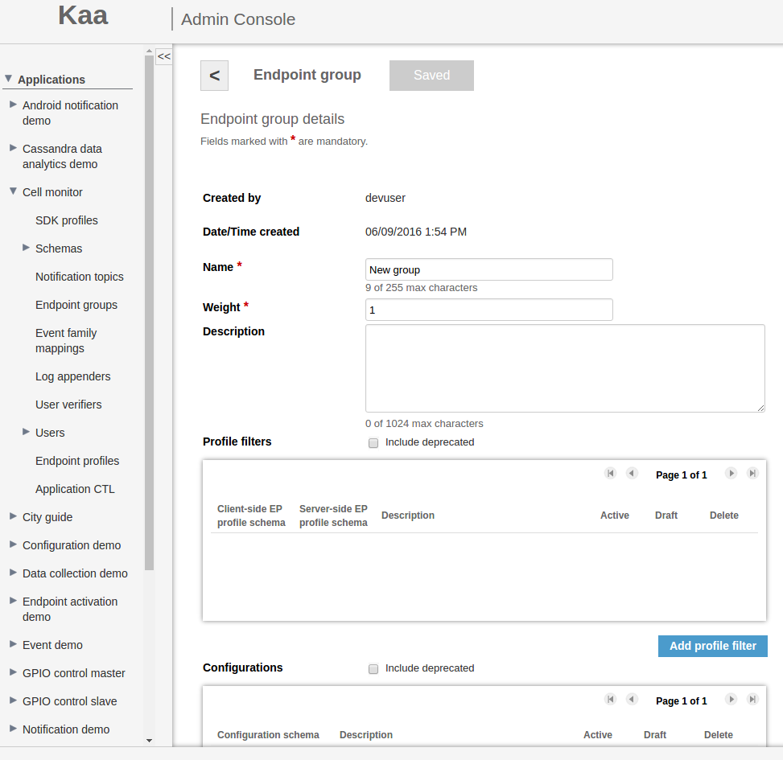
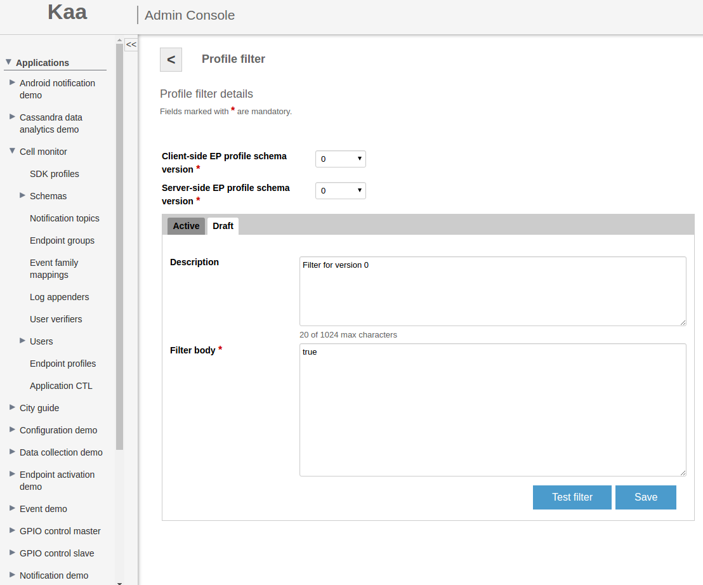
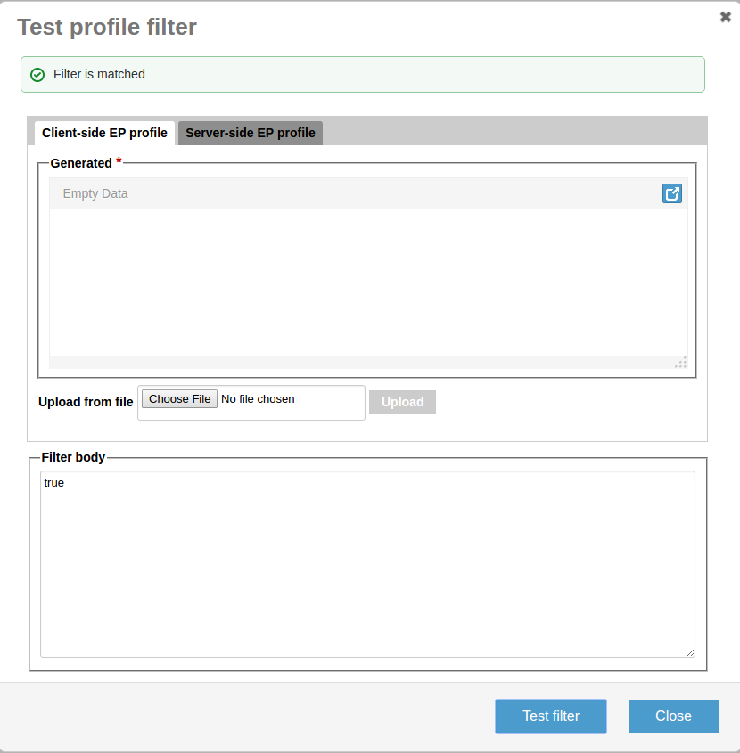



* TOC
{:toc}

Kaa provides a mechanism for endpoints aggregation within the application that is based on groups. Grouping endpoints enables you to activate specific configuration parameters, 
control access to notification topics, etc.
This guide will familiarize you with the basic concepts of designing endpoint groups. It is assumed that you have either set up a Kaa Sandbox, or a fully-blown Kaa cluster 
already and that you have created a tenant and an application in Kaa(use [Admin REST API]({{root_url}}Programming-guide/Server-REST-APIs/#TODO) or 
[Admin UI]({{root_url}}Administration-guide/Users-management/#managing-tenant-admins)). 
It is strongly recommended to get familiar with Endpoint profiles before you proceed.

[Endpoint profile]({{root_url}}Programming-guide/Key-platform-features/Endpoint-profiles/) is a virtual identity or "passport" of the endpoint. 
Kaa allows for aggregating endpoints related to the same application into endpoint groups this is achieved by filtering the data in the profiles.
The _endpoint group_ represents an independent managed entity which is defined by the profile filters assigned to the group. 
Those endpoints whose profiles match the profile filters of the specific endpoint group become automatically 
registered as members of this group. There is no restriction for endpoints on having membership in a number of groups at a time.

Endpoint group profile filters are predicate expressions which define characteristics of group members (endpoints). These filters are executed against the endpoint 
profile to figure out whether or not the endpoint belongs to the group.

**NOTE**: Different profile schema versions may require separate profile filters due to the schema structural differences. 
In case a group has no filter assigned for a specific profile schema version, the group does not apply to the endpoints that use the profile of this schema version.

## Profile filters ##

Profile filters in Kaa are based on the [Spring Expression Language](http://docs.spring.io/spring/docs/3.0.x/reference/expressions.html) (SpEL). 
All filters must be specified as predicates (statements which may be either true or false). 
Profile filters are evaluated using following context variables: 

* "cp" - Client-side endpoint profile
* "sp" - Server-side endpoint profile
* "ekh" - Endpoint key hash

### Profile filter examples ###

The following example illustrates the general idea of profile filters.

About which filters we can use, see the table below. 

1. Let's assume the following client-side profile schema.

```json
[  
   {  
      "name":"ClientSideEndpointProfileChild",
      "namespace":"org.kaaproject.kaa.common.endpoint.gen",
      "type":"record",
      "fields":[  
         {  
            "name":"otherSimpleField",
            "type":"int"
         },
         {  
            "name":"stringField",
            "type":"string"
         }
      ]
   },
   {  
      "namespace":"org.kaaproject.kaa.common.endpoint.gen",
      "type":"record",
      "name":"ClientSideEndpointProfile",
      "fields":[  
         {  
            "name":"simpleField",
            "type":"string"
         },
         {  
            "name":"recordField",
            "type":"org.kaaproject.kaa.common.endpoint.gen.ClientSideEndpointProfileChild"
         },
         {  
            "name":"arraySimpleField",
            "type":{  
               "type":"array",
               "items":"string"
            }
         },
         {  
            "name":"arrayRecordField",
            "type":{  
               "type":"array",
               "items":"org.kaaproject.kaa.common.endpoint.gen.ClientSideEndpointProfileChild"
            }
         },
         {  
            "name":"nullableRecordField",
            "type":[  
               "org.kaaproject.kaa.common.endpoint.gen.ClientSideEndpointProfileChild",
               "null"
            ]
         }
      ]
   }
]
```

2. Let's assume the following server-side profile schema. Please note that this schema is less complex only for demonstration purposes. 

```json
[  
   {  
      "namespace":"org.kaaproject.kaa.common.endpoint.gen",
      "type":"record",
      "name":"ServerSideEndpointProfile",
      "fields":[  
         {  
            "name":"simpleField",
            "type":"string"
         },
         {  
            "name":"arraySimpleField",
            "type":{  
               "type":"array",
               "items":"string"
            }
         }
      ]
   }
]
```

3. Second, let's assume the following client-side endpoint profile, which corresponds to the schema.

```json
{  
   "simpleField":"CLIENT_SIDE_SIMPLE_FIELD",
   "recordField":{  
      "otherSimpleField":123,
      "stringField":"STRING_VALUE1"
   },
   "arraySimpleField":[  
      "CLIENT_SIDE_VALUE_1",
      "CLIENT_SIDE_VALUE_2"
   ],
   "arrayRecordField":[  
      {  
         "otherSimpleField":456,
         "stringField":"STRING_VALUE2"
      },
      {  
         "otherSimpleField":789,
         "stringField":"STRING_VALUE3"
      }
   ],
   "nullableRecordField":null
}
```

4. Let's assume the following server-side endpoint profile, which corresponds to the schema.

```json
{  
   "simpleField":"SERVER_SIDE_SIMPLE_FIELD",
   "arraySimpleField":[  
      "SERVER_SIDE_VALUE_1",
      "SERVER_SIDE_VALUE_2"
   ]
}
```

At last, the following filters will yield true when applied to the given endpoint.

| Filter |Explanation| 
|-------------------------------------------------------------------------------------------------------------|
|#cp.simpleField=='CLIENT_SIDE_SIMPLE_FIELD' | The client-side endpoint profile contains simpleField with the value 'SIMPLE_FIELD'. |
|#sp.arraySimpleField[1]=='SERVER_SIDE_VALUE_2' | The server-side endpoint profile contains arraySimpleField, which is an array containing the element 'VALUE2' in the position 
|{'AAAAABBBBCCCDDD='}.contains(#ekh) | The endpoint key hash is AAAAABBBBCCCDDD= |
|#cp.arraySimpleField.size()==2 | The client-side endpoint profile contains arraySimpleField, which is a collection containing two elements. |
|#cp.recordField.otherSimpleField==123 | The client-side endpoint profile contains recordField, which is a record containing otherSimpleField set to '123'. |
|#cp.recordField.otherMapSimpleField.size()==2 | The client-side endpoint profile contains recordField, which is a record containing otherMapSimpleField, which is a collection containing two entries. |
|#cp.arrayRecordField[1].otherSimpleField==789 |The client-side endpoint profile contains arrayRecordField, which is an array. This array contains an element in the position 1, which is a record containing otherSimpleField set to '789'.|
|#cp.nullableRecordField==null |An example of how to check a field for the null value.|
|#cp.arraySimpleField[0]=='CLIENT_SIDE_VALUE_1' and # sp.arraySimpleField[0]=='SERVER_SIDE_VALUE_1'|An example of how to combine several conditions in a query.|
|!#arrayRecordField.?[otherSimpleField==456].isEmpty() |The arrayRecordField field is an array of records. It contains at least one element that contains otherSimpleField with the value.| 

## Using endpoint groups ##

Each Kaa application has a special, built-in, non-user-editable group "all" with weight 0. Weight of group responsible for her priority. Group with the biggest weight is the most priority.   
Also group has:

* Name
* Weight
* Description
* [Profile filters](#profile-filters)
* [Configurations]({{root_url}}Programming-guide/Key-platform-features/Configuration-management/#configuration-schema)
* [Notification topics]({{root_url}}Programming-guide/Using-Kaa-endpoint-SDKs/#notification-topics)

The associated profile filter is automatically set equal to 'true' for each profile 
schema version in the system. Therefore, group "all" contains every endpoint registered in the application. You can create your custom endpoint groups using the 
[Admin UI](#adding-endpoint-groups) or [Admin REST API]({{root_url}}Programming-guide/Server-REST-APIs/#TODO).

**NOTE**: Once created, an endpoint group does not contain any endpoints, so you will need to create and add custom profile filters to the group.

Each group can be associated with multiple profile filters, each specific to a separate client-side and server-side profile schema version combination. 
Only one profile filter can be defined for a profile schema version combination. However, you may also define profile filters that are agnostic to either 
client-side or server-side profile part. In this case, either client-side profile or server-side profile will not be accessible in the filter. 
This is useful in case you want to specify an endpoint group that is based on certain client-side profile property and is not affected by server-side profile updates and vice-versa. 
 
Client-side Endpoint Profile A

```json
{ 
    "id":"device1",
    "os":"Android",
    "os_version":"2.2",
    "build":"2.0.1"
}
```
Server-side Endpoint Profile A

```json
{ 
    "subscriptionPlan": "Regular",
    "activationFlag": "true"
}
```
Client-side Endpoint Profile B

```json
{ 
    "id":"device2",
    "os":"Android",
    "os_version":"4.0.1",
    "build":"3.0 RC1"
}
```
Server-side Endpoint Profile B

```json
{ 
    "subscriptionPlan": "Regular",
    "activationFlag": "false"
}
```

Client-side Endpoint Profile C 

```json
{ 
    "id":"device3",
    "os":"iOS",
    "os_version":"8.0.1",
    "build":"3.0 RC1"
}
```
Server-side Endpoint Profile C

```json
{ 
    "subscriptionPlan": "Premium",
    "activationFlag": "true"
}
```

**NOTE**: Once a profile filter is created, you need to activate it. Filters that are not activated do not impact endpoint groups and do not affect the endpoints. 

## Custom endpoint groups

The table below demonstrates the use of profile filters and results of filtering for sample profiles.

| Group name                                |Filter                                       | result for profile A   | result for profile B   | result for profile C |
|------------------------------------------------------------------------------------------------------------------------------------------------------------------|
|Android Froyo                              | endpoints	#cp.os.toString().equals("Android") and #cp.os_version.toString().startsWith("2.2")	|true    |false	|false |
| Android endpoints                         |#cp.os.toString().equals("Android")                                                            |true    |true	|false |
|iOS 8 endpoints	                        | #cp.os.toString().equals("iOS") and #cp.os_version.toString().startsWith("8")                 |false	 |false	|true  |
|iOS 8 endpoints	                        | #cp.os.toString().equals("iOS") and #cp.os_version.toString().startsWith("8")                 |false	 |false	|true  |
|3.0 RC1 QA group endpoints                 |#cp.build.toString().equals("3.0 RC1")                                                         |false	 |true	|true  |
|Deactivated devices                        | # sp.activationFlag == false                                                                  |false	 |true  |false |
|iOS devices with premium subscription plan | #cp.os.toString().equals("iOS") and #sp.subscriptionPlan.toString().equals("Premium")         |false	 |false |true  |

## Adding endpoint groups ##

Endpoint groups are created based on the profile filter.
To add a new endpoint group, do the following:

1. Open the **Endpoint groups** window by clicking **Endpoint groups** under the application menu on the navigation panel and then click **Add endpoint group**.


2. In the **Add endpoint group** window, fill in the required fields and then click **Add**.


3. In the **Endpoint group** window, add profile filters, configurations, and notifications topics to the group, 
    if necessary (see the following paragraphs for instructions).



### Add profile filter to endpoint group ###

To add a profile filter to the endpoint group, do the following:

1. In the **Endpoint group** window, click **Add profile filter**.
2. In the **Profile filter** window, select the schema version.
3. On the **Draft** tab, enter the description and [filter body](#profile-filters).

    

    **NOTE**: In order to test profile filter click Test filter. Afterwards the Test profile filter window will be displayed. 
    Complete the endpoint and/or server profile forms and then click Test filter.

    
    
4. Click **Save** to save the profile filter.
   
    **NOTE**: You can save the data on the **Draft** tab and return to update it later as many times as needed until you click **Activate**.
   
5. Click **Activate** to activate the profile filter.
   
   All the specified information will be displayed on the **Active** tab.

## REST API ##

Use [Admin REST API]({{root_url}}Programming-guide/Server-REST-APIs/#TODO) for getting more information.

## Further reading ##

* [Spring Expression Language](http://docs.spring.io/spring/docs/3.0.x/reference/expressions.html)

* [Avro](http://avro.apache.org/)


