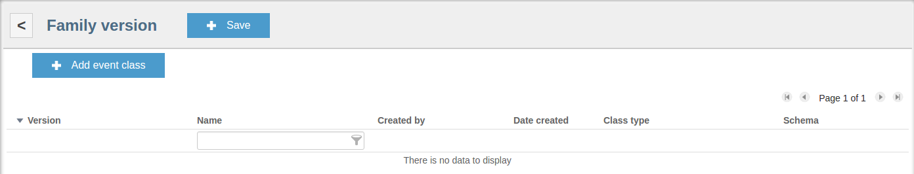



* TOC
{:toc}

The Kaa **Events subsystem** is designed to generate [endpoint]({{root_url}}Glossary/#endpoint-ep) events in real time, send them to other endpoints of the same [owner]({{root_url}}Programming-guide/Key-platform-features/Endpoint-ownership/) and to [Kaa server]({{root_url}}Glossary/#kaa-server) for processing.
The data set structure of a Kaa event is defined by the chosen [CT schema]({{root_url}}Programming-guide/Key-platform-features/Common-Type-Library/).

The Kaa Events subsystem provides the following features:

* Generation of the event object model and related API calls in the endpoint SDK.
* Enforcement of data integrity and validity.
* Efficient targeting of event recipients.
* Efficient and compact serialization.

## Event generation and handling

The following diagram shows how events are generated and processed.


To make the [Kaa client]({{root_url}}Glossary/#kaa-client) interpret the events data sent from the endpoint library, you need to set up the event class schemas.
The [Kaa administrator]({{root_url}}Glossary/#kaa-administrator) can provision the events schemas on the Kaa server and generate the corresponding endpoint SDK.

## Event class

Every event is based on a particular event class (EC) that is defined by the corresponding [CT schema]({{root_url}}Programming-guide/Key-platform-features/Common-Type-Library/) with the additional <code>classType</code> attribute that supports two values: **event** and **object**.
Kaa uses the <code>classType</code> attribute to distinguish the actual events from event class objects that are reusable parts of events.
This helps avoid redundant methods in the SDK API.

Below are some basic examples of an event class CT schema.

* This is a simple definition of an event with no data fields, where **com.company.project.SimpleEvent1** is the **Fully qualified name (FQN)** and <code>classType</code> is an event.

```json
{  
    "namespace":"com.company.project",
    "type":"record",
    "name":"SimpleEvent1",
    "fields":[  

    ]
}
```

* This is and event definition with two data fields (**field1** and **field2**), where **com.company.project.SimpleEvent2** is the FQN and <code>classType</code> is an event.

```json
{  
    "namespace":"com.company.project",
    "type":"record",
    "name":"SimpleEvent2",
    "fields":[  
        {  
            "name":"field1",
            "type":"int"
        },
        {  
            "name":"field2",
            "type":"string"
        }
    ]
}
```

* This is an event definition with two complex fields: **com.company.project.SimpleRecordObject** and **com.company.project.SimpleEnumObject**.
The <code>classType</code> of each field is an object.
The FQN of the event is **com.company.project.ComplexEvent**, the <code>classType</code> is an event.

```json
{  
    "namespace":"com.company.project",
    "type":"record",
    "name":"ComplexEvent",
    "fields":[  
        {  
            "namespace":"com.company.project",
            "type":"enum",
            "name":"SimpleEnumObject",
            "symbols":[  
                "ENUM_VALUE_1",
                "ENUM_VALUE_2",
                "ENUM_VALUE_3"
            ]
        },
        {  
            "namespace":"com.company.project",
            "type":"record",
            "name":"SimpleRecordObject",
            "fields":[  
                {  
                    "name":"field1",
                    "type":"int"
                },
                {  
                    "name":"field2",
                    "type":"string"
                }
            ]
        }
    ]
}
```

## Event class families

ECs are grouped into event class families (ECF) by subject areas.
ECFs are registered within the Kaa tenant.
Once an event class family is saved in the [Kaa application]({{root_url}}Glossary/#kaa-application), the [Control service]({{root_url}}Glossary/#control-service) automatically assigns a version number to that ECF.
The user can define new versions of the ECF that contain different ECs.
ECF versions are used for grouping ECs that belong to a certain ECF.

This means that an ECF contains the list of ECF versions, and each ECF version contains a list of ECs.
While ECFs and ECF versions are lists, the actual CT schemas are contained in the ECs.

To change the list of ECs for an ECF, you need to create a new version of that ECF (see [Managing event class families](#managing-event-class-families)).

An ECF is uniquely identified by its name and/or class name, and tenant.
There cannot be two ECFs with the same name or same class name within a single tenant.
This helps prevent naming collisions during the SDK generation.

For example, ECF with FQN **com.company.project.family1.Family1** is a list containing one element: **version 1** of that ECF.
This version contains a list of two ECs: **com.company.project.family1.ComplexEvent1** and **com.company.project.family1.ComplexEvent2** with complex field **com.company.project.family1.SimpleEnumObject** and previously saved object **com.company.project.family1.CustomField**.

Below is the **com.company.project.family1.ComplexEvent1** EC definition with complex field **com.company.project.family1.SimpleEnumObject** and previously saved CT schema **com.company.project.family1.CustomField** (pay attention to the declaration as this field is optional and could be **null**).

```json
{  
    "namespace":"com.company.project.family1",
    "name":"ComplexEvent1",
    "type":"record",
    "fields":[  
        {  
            "name":"customField",
            "type":[  
                "com.company.project.family1.CustomField",
                "null"
            ]
        },
        {  
            "namespace":"com.company.project.family1",
            "type":"enum",
            "name":"SimpleEnumObject",
            "symbols":[  
                "ENUM_VALUE_1",
                "ENUM_VALUE_2",
                "ENUM_VALUE_3"
            ]
        }
    ],
    "dependencies":[  
        {  
            "fqn":"ocom.company.project.family1.CustomField",
            "version":1
        }
    ]
}
```

This is definition of the **com.company.project.family1.ComplexEvent1** EC with complex field **com.company.project.family1.SimpleEnumObject** and two primitive fields.

```json
{  
    "namespace":"com.company.project.family1",
    "name":"ComplexEvent2",
    "type":"record",
    "fields":[  
        {  
            "namespace":"com.company.project.family1",
            "type":"enum",
            "name":"SimpleEnumObject",
            "symbols":[  
                "ENUM_VALUE_1",
                "ENUM_VALUE_2",
                "ENUM_VALUE_3"
            ]
        },
        {  
            "name":"field1",
            "type":"int"
        },
        {  
            "name":"field2",
            "type":"string"
        }
    ]
}
```

## Event family mapping

One application can use multiple ECFs, and the same ECF can be used in multiple applications.
The user can define which ECFs will be used by multiple applications.
This helps control sources and sinks of particular events.

For example, the user may want to implement the following rules:

* Application A should be able to send class E1 events but does not need to receive them.
Thus, application A is the source for E1.
* Application B should be able to receive class E1 events of but does not need to send them.
Thus, application B is the sink for E1.
* Application C should be able to both receive and send class E1 events.
Thus, application C is both the source and the sink for E1.

Once the application and ECF are created, the tenant administrator can create a mapping between these two entities by assigning a certain version of the ECF to the application.
This mapping in Kaa is called **event family mapping**.
Multiple ECFs (but not multiple versions of the same ECF) can be mapped to a single application.

By default, Kaa application is mapped to each event of the ECF as both the source and the sink.
This setting can be change by the administrator.
Once defined, the mapping cannot be changed in the future.


## Event routing

Events can be sent to a single endpoint (unicast traffic) or to all sink endpoints of the given owner (multicast traffic).

Kaa server will send the events to all endpoints registered as the corresponding EC sinks during the ECF mapping.
If the owner's endpoints are distributed over multiple Operation services, the event is sent to all these Operation services.
If an endpoint is offline while an event is being delivered to it, such event will be queued for delivery until the endpoint in question goes online.

To view the list of endpoints registered as sinks for a certain owner, use the [endpoint SDK API](#manage-events-using-SDK-API).


## Event exchange scope

Endpoints can exchange events only if they are attached to the same owner (registered with the same user).
You can use the APIs to attach/detach endpoints to/from owners.
See also [Endpoint ownership]({{root_url}}Programming-guide/Key-platform-features/Endpoint-ownership/) and [Owner verifiers]({{root_url}}Customization-guide/Owner-verifiers/).


## Event sequence number

Kaa server assigns a sequential number to every event to avoid duplication of events sent by different endpoints.
An endpoint first assigns a sequential number (incremented by one for every event sent) to the event and then synchronizes it with the Operations service.
During the synchronization request, the Operations service provides the last sequential number received from the endpoint (or number **0** if no events were received so far).

If the number provided by the Operations service differs from the number stored at the endpoint, the endpoint accepts the former and uses it as a starting number for new events.


## Event object model

During the SDK generation, the Control service generates the event object model and extends the APIs to support methods for sending events and registering event listeners.
The generated SDK can supports using multiple ECFs but does not support using multiple versions of the same ECF.


## Manage events using SDK API

To access the Kaa events functionality, you need to first get the ECF factory and then get a specific ECF object from it.

### Get ECF factory

<ul class="nav nav-tabs">
  <li class="active"><a data-toggle="tab" href="#java1">Java</a></li>
  <li><a data-toggle="tab" href="#cpp1">C++</a></li>
  <li><a data-toggle="tab" href="#objc1">Objective-C</a></li>
</ul>

<div class="tab-content">
<div id="java1" class="tab-pane fade in active" markdown="1" >

```java
import org.kaaproject.kaa.client.event.EventFamilyFactory;
 
EventFamilyFactory eventFamilyFactory = kaaClient.getEventFamilyFactory();
```

</div><div id="cpp1" class="tab-pane fade" markdown="1" >

```c++
#include <kaa/event/gen/EventFamilyFactory.hpp>
 
...

kaa::EventFamilyFactory& eventFamilyFactory = kaaClient->getEventFamilyFactory();
```

</div><div id="objc1" class="tab-pane fade" markdown="1" >

```objective-c
@import Kaa;
 
...
 
EventFamilyFactory *eventFamilyFactory = [kaaClient getEventFamilyFactory];
```

</div>
</div>

### Get ECF object

<ul class="nav nav-tabs">
  <li class="active"><a data-toggle="tab" href="#java2">Java</a></li>
  <li><a data-toggle="tab" href="#cpp2">C++</a></li>
  <li><a data-toggle="tab" href="#objc2">Objective-C</a></li>
</ul>

<div class="tab-content">
<div id="java2" class="tab-pane fade in active" markdown="1" >

```java
import org.kaaproject.kaa.demo.smarthouse.thermo.ThermoEventClassFamily;
 
ThermoEventClassFamily tecf = eventFamilyFactory.getThermoEventClassFamily();
```

</div><div id="cpp2" class="tab-pane fade" markdown="1" >

```c++
#include <kaa/event/gen/ThermoEventClassFamily.hpp>
 
...
 
kaa::ThermostatEventClassFamily& tecf = eventFamilyFactory.getThermostatEventClassFamily();
```

</div><div id="objc2" class="tab-pane fade" markdown="1" >

```objective-c
@import Kaa;
 
...
 
ThermostatEventClassFamily *tecf = [self.eventFamilyFactory getThermostatEventClassFamily];
```

</div>
</div>

### Send events

To send one or more events, follow the instruction below.

#### Get endpoint addresses

Execute the asynchronous <code>findEventListeners</code> method to request a list of the endpoints supporting all specified EC FQNs.

<ul class="nav nav-tabs">
  <li class="active"><a data-toggle="tab" href="#java3">Java</a></li>
  <li><a data-toggle="tab" href="#cpp3">C++</a></li>
  <li><a data-toggle="tab" href="#c3">C</a></li>
  <li><a data-toggle="tab" href="#objc3">Objective-C</a></li>
</ul>

<div class="tab-content">
<div id="java3" class="tab-pane fade in active" markdown="1" >

```java
import org.kaaproject.kaa.client.event.FindEventListenersCallback;
 
List<String> FQNs = new LinkedList<>();
FQNs.add(ThermostatInfoRequest.class.getName());
FQNs.add(ChangeTemperatureCommand.class.getName());
 
kaaClient.findEventListeners(FQNs, new FindEventListenersCallback() {
    @Override
    public void onEventListenersReceived(List<String> eventListeners) {
        // Some code
    }   
    @Override
    public void onRequestFailed() {
        // Some code
    }
});
```

</div><div id="cpp3" class="tab-pane fade" markdown="1" >

```c++
#include <list>
#include <memory>
#include <string>
#include <vector>
#include <kaa/event/IFetchEventListeners.hpp>
 
class SimpleFetchEventListeners : public kaa::IFetchEventListeners {
public:
    virtual void onEventListenersReceived(const std::vector<std::string>& eventListeners)
    {
        // Some code
    }
 
    virtual void onRequestFailed()
    {
        // Some code
    }
};
 
...
 
std::list<std::string> FQNs = {"org.kaaproject.kaa.schema.sample.thermo.ThermostatInfoRequest"
                              ,"org.kaaproject.kaa.schema.sample.thermo.ChangeTemperatureCommand"};
 
kaaClient->findEventListeners(FQNs, std::make_shared<SimpleFetchEventListeners>());
```

</div><div id="c3" class="tab-pane fade" markdown="1" >

```c
#include <extensions/event/kaa_event.h>
#include <kaa/platform/ext_event_listeners_callback.h>
 
const char *fqns[] = { "org.kaaproject.kaa.schema.sample.thermo.ThermostatInfoRequest"
                     , "org.kaaproject.kaa.schema.sample.thermo.ChangeTemperatureCommand" };
 
kaa_error_t event_listeners_callback(void *context, const kaa_endpoint_id listeners[], size_t listeners_count)
{
    /* Process response */
    return KAA_ERR_NONE;
}
 
kaa_error_t event_listeners_request_failed(void *context)
{
    /* Process failure */
    return KAA_ERR_NONE;
}
 
kaa_event_listeners_callback_t callback = { NULL
                                          , &event_listeners_callback
                                          , &event_listeners_request_failed };
 
kaa_error_t error_code = kaa_event_manager_find_event_listeners(kaa_client_get_context(kaa_client)->event_manager
                                                              , fqns
                                                              , 2
                                                              , &callback);
 
/* Check error code */
```

</div><div id="objc3" class="tab-pane fade" markdown="1" >

```objective-c
@import Kaa;
 
@interface ViewController () <FindEventListenersDelegate>
 
...
 
    NSArray *listenerFQNs = @[[ThermostatInfoRequest FQN], [ChangeDegreeRequest FQN]];
    [self.kaaClient findListenersForEventFQNs:listenerFQNs delegate:self];
 
- (void)onEventListenersReceived:(NSArray *)eventListeners {
    // Some code
}
 
- (void)onRequestFailed {
    // Some code
}
```

</div>
</div>

#### Send one event to all endpoints

To send an event to all endpoints that were previously located by the <code>findEventListeners</code> method, execute the <code>sendEventToAll</code> method upon the specific ECF object.

<ul class="nav nav-tabs">
  <li class="active"><a data-toggle="tab" href="#java4">Java</a></li>
  <li><a data-toggle="tab" href="#cpp4">C++</a></li>
  <li><a data-toggle="tab" href="#c4">C</a></li>
  <li><a data-toggle="tab" href="#objc4">Objective-C</a></li>
</ul>

<div class="tab-content">
<div id="java4" class="tab-pane fade in active" markdown="1" >

```java
import org.kaaproject.kaa.schema.sample.thermo.ThermostatInfoRequest;
 
tecf.sendEventToAll(new ThermostatInfoRequest());
```

</div><div id="cpp4" class="tab-pane fade" markdown="1" >

```c++
#include <kaa/event/gen/ThermostatEventClassFamilyGen.hpp>
 
...
 
nsThermostatEventClassFamily::ThermostatInfoRequest thermoRequest;
tecf.sendEventToAll(thermoRequest);


```

</div><div id="c4" class="tab-pane fade" markdown="1" >

```c
#include <kaa/gen/kaa_thermo_event_class_family.h>
 
/* Create and send an event */
kaa_thermo_event_class_family_thermostat_info_request_t* thermo_request = kaa_thermo_event_class_family_thermostat_info_request_create();
 
kaa_error_t error_code = kaa_event_manager_send_kaa_thermo_event_class_family_thermostat_info_request(kaa_client_get_context(kaa_client)->event_manager
                                                                                                    , thermo_request
                                                                                                    , NULL);
 
/* Check error code */
 
thermo_request->destroy(thermo_request);
```

</div><div id="objc4" class="tab-pane fade" markdown="1" >

```objective-c
@import Kaa;
 
...
 
ThermostatInfoRequest *request = [[ThermostatInfoRequest alloc] init];
[self.tecf sendThermostatInfoRequestToAll:request];
```

</div>
</div>

#### Send one event to one endpoint

To send an event to a single endpoint that was previously located by the <code>findEventListeners</code> method, execute the <code>sendEvent</code> method upon the specific ECF object and this endpoint.

<ul class="nav nav-tabs">
  <li class="active"><a data-toggle="tab" href="#java5">Java</a></li>
  <li><a data-toggle="tab" href="#cpp5">C++</a></li>
  <li><a data-toggle="tab" href="#c5">C</a></li>
  <li><a data-toggle="tab" href="#objc5">Objective-C</a></li>
</ul>

<div class="tab-content">
<div id="java5" class="tab-pane fade in active" markdown="1" >

```java
import org.kaaproject.kaa.schema.sample.thermo.ChangeTemperatureCommand;
 
ChangeTemperatureCommand ctc = new ChangeTemperatureCommand(-30);
// Assume the target variable is one of the received in the findEventListeners method
tecf.sendEvent(ctc, target);
```

</div><div id="cpp5" class="tab-pane fade" markdown="1" >

```c++
#include <kaa/event/gen/ThermostatEventClassFamilyGen.hpp>
 
...
 
nsThermostatEventClassFamily::ChangeTemperatureCommand ctc;
ctc.temperature = -30;
 
// Assume the target variable is one of the received in the findEventListeners method
tecf.sendEvent(ctc, target);
```

</div><div id="c5" class="tab-pane fade" markdown="1" >

```c
#include <kaa/gen/kaa_thermo_event_class_family.h>
 
/* Create and send an event */
kaa_endpoint_id target_endpoint;
kaa_thermo_event_class_family_change_temperature_command_t* change_command = kaa_thermo_event_class_family_change_temperature_command_create();
change_command->temperature = -30;
 
kaa_error_t error_code = kaa_event_manager_send_kaa_thermo_event_class_family_change_temperature_command(kaa_client_get_context(kaa_client)->event_manager
                                                                                                       , change_command
                                                                                                       , target_endpoint);
/* Check error code */
 
change_command->destroy(change_command);
```

</div><div id="objc5" class="tab-pane fade" markdown="1" >

```objective-c
@import Kaa;
 
...
 
KAAUnion *degree = [KAAUnion unionWithBranch:KAA_UNION_INT_OR_NULL_BRANCH_0 data:@(-30)];
ChangeDegreeRequest *changeDegree = [[ChangeDegreeRequest alloc] initWithDegree:degree];
 
// Assume the target variable is one of the received in the findEventListeners method
[tecf sendChangeDegreeRequest:changeDegree to:target];
```

</div>
</div>

#### Send batch of events to endpoint(s)

To send a batch of events to a single endpoint or all endpoints at once, use the code below.

<ul class="nav nav-tabs">
  <li class="active"><a data-toggle="tab" href="#java6">Java</a></li>
  <li><a data-toggle="tab" href="#cpp6">C++</a></li>
  <li><a data-toggle="tab" href="#c6">C</a></li>
  <li><a data-toggle="tab" href="#objc6">Objective-C</a></li>
</ul>

<div class="tab-content">
<div id="java6" class="tab-pane fade in active" markdown="1" >

```java
import org.kaaproject.kaa.client.event.EventFamilyFactory;
import org.kaaproject.kaa.demo.smarthouse.thermo.ThermoEventClassFamily;
import org.kaaproject.kaa.schema.sample.thermo.ThermostatInfoRequest;
import org.kaaproject.kaa.schema.sample.thermo.ChangeTemperatureCommand;
 
// Get instance of EventFamilyFactory
EventFamilyFactory eventFamilyFactory = kaaClient.getEventFamilyFactory();
ThermoEventClassFamily tecf = eventFamilyFactory.getThermoEventClassFamily();
 
// Register a new event block and get a unique block id
TransactionId trxId = eventFamilyFactory.startEventsBlock();
 
// Add events to the block
// Adding a broadcasted event to the block
tecf.addEventToBlock(trxId, new ThermostatInfoRequest());
// Adding a targeted event to the block
tecf.addEventToBlock(trxId, new ChangeTemperatureCommand(-30), "home_thermostat");
 
 
// Send an event batch
eventFamilyFactory.submitEventsBlock(trxId);
// Or cancel an event batch
eventFamilyFactory.removeEventsBlock(trxId);
```

</div><div id="cpp6" class="tab-pane fade" markdown="1" >

```c++
#include <kaa/event/gen/EventFamilyFactory.hpp>
#include <kaa/event/gen/ThermoEventClassFamily.hpp>
#include <kaa/event/gen/ThermoEventClassFamilyGen.hpp>
 
...
 
// Get an instance of EventFamilyFactory
kaa::EventFamilyFactory& eventFamilyFactory = kaaClient->getEventFamilyFactory();
kaa::ThermostatEventClassFamily& tecf = eventFamilyFactory.getThermostatEventClassFamily();
 
// Register a new event block and get a unique block id
kaa::TransactionIdPtr trxId = eventFamilyFactory.startEventsBlock();
 
// Add events to the block
// Adding a broadcasted event to the block
nsThermostatEventClassFamily::ThermostatInfoRequest thermoRequest;
tecf.addEventToBlock(trxId, thermoRequest);
// Adding a targeted event to the block
nsThermostatEventClassFamily::ChangeTemperatureCommand ctc;
ctc.temperature = -30;
tecf.addEventToBlock(trxId, ctc, "home_thermostat");
 
// Send an event batch
eventFamilyFactory.submitEventsBlock(trxId);
 
// Or cancel an event batch
eventFamilyFactory.removeEventsBlock(trxId);  
```

</div><div id="c6" class="tab-pane fade" markdown="1" >

```c
#include <extensions/event/kaa_event.h>
#include <kaa/gen/kaa_thermo_event_class_family.h>
 
kaa_event_block_id transaction_id;
 
kaa_error_t error_code = kaa_event_create_transaction(kaa_context->event_manager, &transaction_id);
/* Check error code */
 
kaa_thermo_event_class_family_thermostat_info_request_t* thermo_request = kaa_thermo_event_class_family_thermostat_info_request_create();
kaa_thermo_event_class_family_change_temperature_command_t* change_command = kaa_thermo_event_class_family_change_temperature_command_create();
change_command->temperature = 5;
 
error_code = kaa_event_manager_add_kaa_thermo_event_class_family_thermostat_info_request_event_to_block(kaa_client_get_context(kaa_client)->event_manager
                                                                                                      , thermo_request
                                                                                                      , NULL
                                                                                                      , transaction_id);
/* Check error code */
 
kaa_endpoint_id target_endpoint;
error_code = kaa_event_manager_add_kaa_thermo_event_class_family_change_temperature_command_event_to_block(kaa_client_get_context(kaa_client)->event_manager
                                                                                                         , change_command
                                                                                                         , target_endpoint
                                                                                                         , transaction_id);
/* Check error code */
 
error_code = kaa_event_finish_transaction(kaa_client_get_context(kaa_client)->event_manager, transaction_id);
/* Check error code */
 
thermo_request->destroy(thermo_request);
change_command->destroy(change_command);
```

</div><div id="objc6" class="tab-pane fade" markdown="1" >

```objective-c
@import Kaa;
 
...
// Get instance of EventFamilyFactory
EventFamilyFactory *eventFamilyFactory = [kaaClient getEventFamilyFactory];
ThermostatEventClassFamily *tecf = [eventFamilyFactory getThermostatEventClassFamily];
 
// Register a new event block and get a unique block id
TransactionId *trxId = [eventFamilyFactory startEventsBlock];
 
// Add events to the block
// Adding a broadcasted event to the block
[tecf addThermostatInfoRequestToBlock:[[ThermostatInfoRequest alloc] init] withTransactionId:trxId];
// Adding a targeted event to the block
ChangeDegreeRequest *request = [[ChangeDegreeRequest alloc] init];
request.degree = [KAAUnion unionWithBranch:KAA_UNION_INT_OR_NULL_BRANCH_0 data:@(-30)];
[tecf addChangeDegreeRequestToBlock:request withTransactionId:trxId target:@"home_thermostat"];
 
// Send an event batch
[eventFamilyFactory submitEventsBlockWithTransactionId:trxId];
// Or cancel an event batch
[eventFamilyFactory removeEventsBlock:trxId];
```

</div>
</div>

#### Receive events

To start listening to incoming events, execute the <code>addListener</code> method upon the specific ECF object.

<ul class="nav nav-tabs">
  <li class="active"><a data-toggle="tab" href="#java7">Java</a></li>
  <li><a data-toggle="tab" href="#cpp7">C++</a></li>
  <li><a data-toggle="tab" href="#c7">C</a></li>
  <li><a data-toggle="tab" href="#objc7">Objective-C</a></li>
</ul>

<div class="tab-content">
<div id="java7" class="tab-pane fade in active" markdown="1" >

```java
import org.kaaproject.kaa.demo.smarthouse.thermo.ThermoEventClassFamily;
 
tecf.addListener(new ThermoEventClassFamily.Listener() {
    @Override
    public void onEvent(ChangeTemperatureCommand event, String source) {
        // Some code
    }
    @Override
    public void onEvent(ThermostatInfoResponse event, String source) {
        // Some code
    }
    @Override
    public void onEvent(ThermostatInfoRequest event, String source) {
        // Some code
    }
});
```

</div><div id="cpp7" class="tab-pane fade" markdown="1" >

```c++
#include <kaa/event/gen/ThermostatEventClassFamilyGen.hpp>
#include <kaa/event/gen/ThermostatEventClassFamily.hpp> 
#include <kaa/event/gen/EventFamilyFactory.hpp>
 
class SimpleThermostatEventClassFamilyListener: public kaa::ThermostatEventClassFamily::ThermostatEventClassFamilyListener {
public:
    virtual void onEvent(const nsThermostatEventClassFamily :: ThermostatInfoRequest& event, const std::string& source) 
    {
        // Some code
    }
    virtual void onEvent(const nsThermostatEventClassFamily :: ThermostatInfoResponse& event, const std::string& source) 
    {
        // Some code
    }
    virtual void onEvent(const nsThermostatEventClassFamily :: ChangeTemperatureCommand& event, const std::string& source) 
    {
        // Some code
    }
};
 
...
 
SimpleThermostatEventClassFamilyListener eventsListener;
tecf.addEventFamilyListener(eventsListener);
```

</div><div id="c7" class="tab-pane fade" markdown="1" >

```c
#include <extensions/event/kaa_event.h>
#include <kaa/gen/kaa_thermo_event_class_family.h>
 
void on_thermo_event_class_family_change_temperature_command(void *context, kaa_thermo_event_class_family_change_temperature_command_t *event, kaa_endpoint_id_p source)
{
    /* Process event */
    event->destroy(event);
}
kaa_error_t error_code = kaa_event_manager_set_kaa_thermo_event_class_family_change_temperature_command_listener(kaa_client_get_context(kaa_client)->event_manager
                                                                                                               , &on_thermo_event_class_family_change_temperature_command
                                                                                                               , NULL);
/* Check error code */
```

</div><div id="objc7" class="tab-pane fade" markdown="1" >

```objective-c
@import Kaa;
 
@interface ViewController () <ThermostatEventClassFamilyDelegate>
 
...
 
[self.tecf addDelegate:self];
 
...
 
- (void)onThermostatInfoRequest:(ThermostatInfoRequest *)event fromSource:(NSString *)source {
    // Some code
}
 
- (void)onThermostatInfoResponse:(ThermostatInfoResponse *)event fromSource:(NSString *)source {
    // Some code
}
 
- (void)onChangeDegreeRequest:(ChangeDegreeRequest *)event fromSource:(NSString *)source {
    // Some code
}
```

</div>
</div>

## Manage events using REST API

See [server REST API]({{root_url}}Programming-guide/Server-REST-APIs/#resource_Events) for detailed description of the REST API, its purpose, interfaces and features supported.


## Manage events using Administration UI

### Managing event class families

To use the Kaa events feature for one or more applications, the tenant administrator must create an ECF.

To create a new ECF, log in as a tenant administrator and do the following:

1. Open the **Event class families** page and click **Add ECF**.

	
	
2. On the **Add ECF** page, fill in the required fields and click **Add**.
	
	

	>**NOTE:** The **Namespace** and **Class name** values must be unique.
	{:.note}
		
3. On the **Event class family details** page, click **Add family version** under the **Versions** section to add an ECF version (optional).
	
	
	
4. On the **Family version** page, click **Add event class** to create an ECF version.
Make the necessary changes to the ECs and click **Save**.

	
	
	>**NOTE:** You can add multiple versions of a single ECF.
	{:.note}
	
	A unique version number is assigned to every ECF after it is created.
	The family version appears as a clickable line in the **Versions** section.
		
	
	
	To review ECF version details, click the appropriate version line in the **Versions** section.
	Each family version automatically splits into event classes.
	Name, type, created by, date created and flat representation of the corresponding [CT schema]({{root_url}}Programming-guide/Key-platform-features/Common-Type-Library/) are displayed for each event class.
	
	

5. In the **Add event class** window, fill in the required fields and click **Add**.
Select an existing [CT schema]({{root_url}}Programming-guide/Key-platform-features/Common-Type-Library/) or create a new one.

	To select an existing [CT schema]({{root_url}}Programming-guide/Key-platform-features/Common-Type-Library/), click **Select fully qualified name of existing type** text field and choose one of the available CT schemas.

	To create a new [CT schema]({{root_url}}Programming-guide/Key-platform-features/Common-Type-Library/), click **Create new type** and go to step 6.

	

6. On the **Add new type** page, fill in the required fields and click **Add** or click **Choose file**.

	

	>**NOTE:** To create a new CT, you can only use the existing schemas from other event families, not from other versions of the same event family.
	{:.note}

### Adding event family mappings

Event family mappings are used by tenant developers to set event class families for the application and define the actions for each class family -- whether an application should be a source, a sink, or both.

To add an event family mapping, log in as a tenant developer and do the following:

1. Open the **Event family mappings** page of the application.

	

2. Click **Add family event mapping**.
The **Event family mapping details** page will open.

	
	
3. Select an appropriate ECF from the drop-down list and set the required actions for each class of the family.