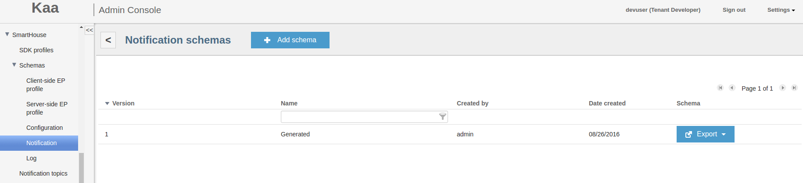
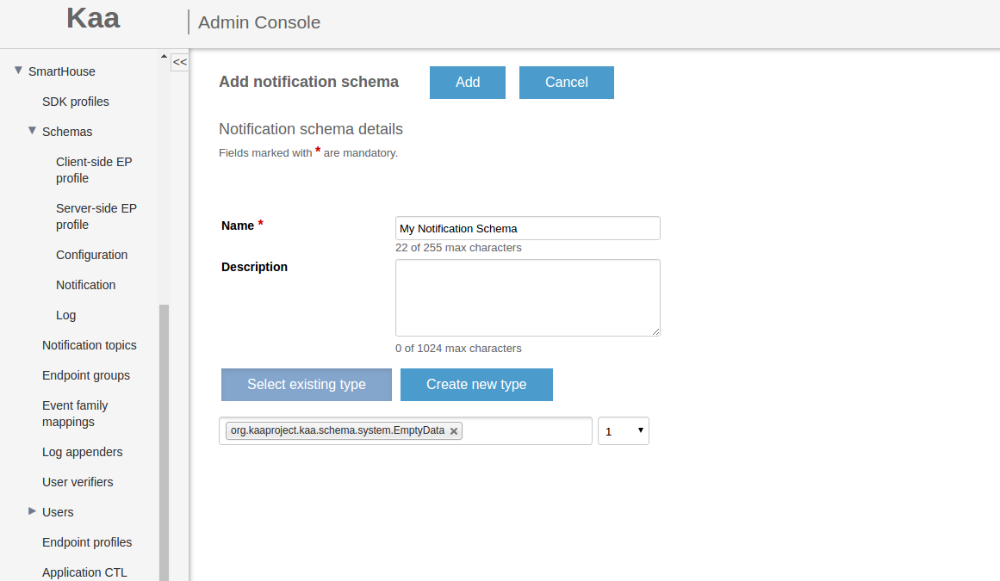



* TOC
{:toc}


The Kaa Notification subsystem enables delivery of messages from the Kaa cluster to endpoints (EP). Unlike configuration data that represents the desired EP state, notifications can be thought of as calls for a dynamic EP action. 
For example, a notification may cause a client application to display a message on the UI (a user notification).

This guide will familiarize you with the basic concepts of Kaa notifications and programming of the Kaa notification subsystem. It is assumed that you have already set up either a [Kaa Sandbox](http://www.kaaproject.org/download-kaa) or a [full-blown Kaa cluster]({{root_url}}Administration-guide/System-installation/Cluster-setup/) and that you have created at least one [tenant]({{root_url}}Administration-guide/Tenants-and-applications-management/#TODO) and one [application]({{root_url}}Administration-guide/Tenants-and-applications-management/#managing-applications) in Kaa. 
We also recommend that you review [collecting endpoint profiles guide]({{root_url}}Programming-guide/Key-platform-features/Data-collection) and [endpoint groups]({{root_url}}Programming-guide/Key-platform-features/Endpoint-groups) before you proceed with this guide.

### Basic architecture

The following diagram illustrates basic entities and data flows in scope of the notification management:

* Notifications are generated based on the [notification schema](#notification-schema) created by the developer for the application 
* The user or admin sends a notification via [REST API]({{root_url}}Programming-guide/Server-REST-APIs/#!/Notifications/sendNotification) call or using Administration UI (see [Sending notifications](#sending-notifications)). 


### Configuring Kaa
This section provides guidance on how to configure notifications in Kaa.

#### Notification schema

The Kaa notifications functionality allows transferring any data to endpoints. The structure of the data that is carried by notifications is defined by the notification schema configured on the Kaa server and built into Kaa endpoints. The notification schema is defined similarly to the endpoint profile schema. 
In addition to the user-defined schema and its version, notifications are characterized by their type that can be either system or user. System notifications are processed by the prepackaged endpoint functions, while user notifications are handed over to the client code via the endpoint API.

Since the data structure requirements may evolve throughout the Kaa-based system lifetime, the Kaa server can be configured to simultaneously handle notification schemas of multiple versions. 
In this case, a notification will have multiple schema versions associated with it, as well as multiple sets of notification data so that each schema version is covered. To deliver such a notification to an endpoint, the server chooses the schema version supported by the endpoint.

The default notification schema installed for Kaa applications is empty. For the purpose of this guide, we will use a simple notification schema shown in the following code block.

```json
{ 
    "type":"record",
    "name":"ExampleNotification",
    "namespace":"org.kaaproject.kaa.schema.sample.notification",
    "fields":[ 
        { 
            "name":"message",
            "type":"string"
        }
    ]
}
```

You can configure your own notification schema via [REST API]({{root_url}}Programming-guide/Server-REST-APIs/#!/Notifications/saveNotificationSchema) call or use Administration UI as shown below. 


The list of notification schemas created by a tenant developer for the application is shown in the **Notification schemas** window.



As a tenant developer, you can create new notification schemas for the application as follows:

1. In the **Notification schemas** window for the application, click **Add schema**.
2. In the **Add notification schema** window, create a notification schema either by using the [schema form]({{root_url}}Administration-guide/Tenants-and-applications-management/#schema-form) or by uploading a schema in the [Avro](http://avro.apache.org/docs/current/spec.html) format from a file.


3. Click **Add** to save the schema.

If you want to review the added Avro schema, open the corresponding **Notification schema** window by clicking the schema in the **Notification schemas** window.


#### Notification topics

Notifications in Kaa are organized into topics. Each topic may be associated with one or more endpoint groups. To subscribe to a specific notification, endpoints must belong to one or more endpoint groups that are associated with the corresponding notification topic.

Also, it is possible to make some of the topics configured within the application accessible only to some selected endpoint groups. For this purpose, each topic created in Kaa can be assigned to one or more endpoint groups (global by default). 
In order for an endpoint to receive notifications associated with the topic, the endpoint must belong to at least one group that supports this topic.

Topics can be mandatory or optional. Mandatory topic notifications are delivered in an enforced manner. Optional topics require subscription. It is responsibility of the client code to add notification listeners and subscribe to optional topics.

You can manage notification topics via [REST API]({{root_url}}Programming-guide/Server-REST-APIs/#!/Notifications/editTopic) call or using Administration UI as shown below.

To add a new notification topic to the application, do the following:

1. Open the **Notification topics** window by clicking **Notification topics** under the application menu on the navigation panel and then click **Add notification topic**.

    
    
2. Fill in all necessary fields and then click **Add**.

    

    The newly created topic will appear in the **Notification topics** window.

    
    
    
> **NOTE:** Once created, a notification topic does not impact any endpoints. To deliver notifications to some endpoint, at first you need to assign the topic to an endpoint group containing 
this endpoint via [REST API]({{root_url}}Programming-guide/Server-REST-APIs/#!/Notifications/editTopic) or using [Administration UI](#add-notification-topic-to-endpoint-group).


#### Add notification topic to endpoint group

To add a notification topic to the endpoint group, do the following:

1. In the **Endpoint group** window, click **Add notification topic**.
2. In the **Add topic to endpoint group** dialog, select the topic(s) and click **Add**.
Now all the endpoints belonging to the current group will be subscribed to notifications on these topics.


Assuming that you have created custom endpoint groups from the [Using endpoint groups guide]({{root_url}}Programming-guide/Key-platform-features/Endpoint-groups/#custom-endpoint-groups), it would be logical to create and assign the following topics:

<table>
    <tr>
        <th rowspan="2">Topic id</th>
        <th colspan="5"><center>Endpoint Group Name</center></th>
    </tr>
    <tr>
        <th>All</th>
        <th>Android Froyo endpoints</th>
        <th>Android endpoints</th>
        <th>iOS 8 endpoints</th>
        <th>3.0 RC1 QA group endpoints</th>
    </tr>
    <tr>
        <td>Android notifications</td>     
        <td>false</td> 
        <td>true</td>   
        <td>true</td>    
        <td>false</td>
        <td>false</td>      
    </tr>
    <tr>
        <td>iOS 8 notifications</td>      
        <td>false</td>                 
        <td>false</td>                   
        <td>false</td>                    
        <td>true</td>            
        <td>false</td>                      
    </tr>
    <tr>
        <td>All devices notifications</td> 
        <td>true</td>                 
        <td>false</td>                  
        <td>false</td>                    
        <td>false</td>           
        <td>false</td>                     
    </tr>
</table>

#### Sending notifications
To send a notification, you can issue the [REST API]({{root_url}}Programming-guide/Server-REST-APIs/#!/Notifications/sendNotification) request or Administration UI as described below.

Do the following steps to send a notification:

1. In the **Notification topics**, click the mail icon next to the appropriate notification topic.
2. In the **Send notification** window, create a notification either by using the **Notification body** [record form]({{root_url}}Administration-guide/Tenants-and-applications-management/#record-form) or by uploading the data in the JSON format from a file.

> **NOTE:** The contents of the file should match the corresponding notification schema. And if **Endpoint KeyHash** field is empty will be sent a broadcast notification.


3. Click **Send** to send the notification.

The file with the following contents will match the default sandbox notification schema.

```
{"message": "Hello from Kaa!"}
```

#### Notification pipelines

Notification pipelines manage individual notifications within a topic. A notification remains queued in the pipeline until its time-to-live (TTL) expires, after which the notification is dropped. The notification pipeline type specifies the scope of notifications delivery. 
It can be either multicast (targeted to an unbounded number of endpoints) or unicast (targeted to a single specific endpoint).
    
**Multicast pipelines** 
<br/>
Whenever a notification is sent to a topic, it gets added to the corresponding pipeline with a unique sequential index per pipeline. Endpoints independently maintain their position in every pipeline by remembering the last sequential index per pipeline that they received.
    
**Unicast pipelines** 
<br/>
Whenever a notification is sent to a topic, it gets added to the corresponding pipeline with a unique ID. Endpoints independently maintain their pipeline by reporting all received notification IDs. The server removes the notification from the pipeline once it receives a receipt confirmation from the endpoint. 
Sending a unicast notification requires specifying the endpoint and topic IDs. The endpoint must be subscribed to the specified topic, otherwise an error will be returned.

### Using Notifications SDK API
This section provides code samples which illustrate practical usage of notifications in Kaa.

#### Get available topics
To get a list of available topics, do the following:


<ul class="nav nav-tabs">
  <li class="active"><a data-toggle="tab" href="#Java-9">Java</a></li>
  <li><a data-toggle="tab" href="#C_plus_plus-9">C++</a></li>
  <li><a data-toggle="tab" href="#C-9">C</a></li>
  <li><a data-toggle="tab" href="#Objective-C-9">Objective-C</a></li>
</ul>

<div class="tab-content">
<div id="Java-9" class="tab-pane fade in active" markdown="1" >

```java
import org.kaaproject.kaa.client.KaaClient;
import org.kaaproject.kaa.client.DesktopKaaPlatformContext;
import org.kaaproject.kaa.common.endpoint.gen.Topic;
...
    KaaClient kaaClient = Kaa.newClient(new DesktopKaaPlatformContext())
    // Start Kaa client
    kaaClient.start()
...
 
    List<Topic> topics = kaaClient.getTopics();
 
    for (Topic topic : topics) {
        System.out.printf("Id: %s, name: %s, type: %s"
                , topic.getId(), topic.getName(), topic.getSubscriptionType());
    }
```

</div><div id="C_plus_plus-9" class="tab-pane fade" markdown="1" >

```c++
#include <iostream>
 
#include <kaa/Kaa.hpp>
#include <kaa/logging/LoggingUtils.hpp>
 
using namespace kaa;
 
...
// Create an endpoint instance
auto kaaClient = Kaa::newClient();
// Start an endpoint
kaaClient->start();
 
// Get available topics
const auto& topics = kaaClient->getTopics();
for (const auto& topic : topics) {
    std::cout << "Id: " << topic.id << ", name: " << topic.name
              << ", type: " << LoggingUtils::TopicSubscriptionTypeToString(topic.subscriptionType) << std::endl;
}
```

</div><div id="C-9" class="tab-pane fade" markdown="1" >

```c
#include <kaa/platform/kaa_client.h>
#include <kaa/kaa_notification_manager.h>
 
kaa_client_t *kaa_client = /* ... */;
 
void on_topic_list_uploaded(void *context, kaa_list_t *topics)
{
    kaa_list_node_t *it = kaa_list_begin(topics);
    while (it) {
         kaa_topic_t *topic = (kaa_topic_t *) kaa_list_get_data(it);
         printf("Id: %lu, name: %s, type: %s\n", topic->id, topic->name, (topic->subscription_type == OPTIONAL_SUBSCRIPTION)? "OPTIONAL":"MANDATORY");  
         it = kaa_list_next(it);
    }
}
 
kaa_list_t *topics_list = NULL;
kaa_error_t error_core = kaa_get_topics(kaa_client_get_context(kaa_client)->notification_manager, &topics_list);
on_topic_list_uploaded(NULL, topics_list);
```

</div><div id="Objective-C-9" class="tab-pane fade" markdown="1" >

```objc
#import <Kaa/Kaa.h>
...
    id<KaaClient> kaaClient = [Kaa client]
...
    // Start Kaa client
    [kaaClient start]
...
 
    NSArray *topics = [kaaClient getTopics];
 
    for (Topic *topic in topics) {
        NSLog(@"%lld %@ %u", topic.id, topic.name, topic.subscriptionType);
    }
```

</div></div>

#### Subscribe to optional topics
To receive notifications on some optional topic, at first subscribe to that topic as shown in the following code block:
<ul class="nav nav-tabs">
  <li class="active"><a data-toggle="tab" href="#Java-14">Java</a></li>
  <li><a data-toggle="tab" href="#C_plus_plus-14">C++</a></li>
  <li><a data-toggle="tab" href="#C-14">C</a></li>
  <li><a data-toggle="tab" href="#Objective-C-14">Objective-C</a></li>
</ul>

<div class="tab-content">
<div id="Java-14" class="tab-pane fade in active" markdown="1" >

```java
import org.kaaproject.kaa.client.KaaClient;
...
// Add notification listener(s) (optional)
...
// Subscribe
kaaClient.subscribeToTopic("Android notifications", true);
...
// Unsubscribe. All added listeners will be removed automatically
kaaClient.unsubscribeFromTopic("Android notifications", true);
```

</div><div id="C_plus_plus-14" class="tab-pane fade" markdown="1" >

```c++
#include <kaa/Kaa.hpp>
 
using namespace kaa;
 
...
 
// Add notification listener(s) (optional)
 
// Subscribe
kaaClient->subscribeToTopic("Android notifications");
 
// Unsubscribe
kaaClient->unsubscribeFromTopic("Android notifications");
```

</div><div id="C-14" class="tab-pane fade" markdown="1" >

```c
#include <kaa/kaa_notification_manager.h>
#include <kaa/platform/ext_notification_receiver.h>
// Assume we have some optional topic
uint64_t topic_id = 12345;
 
// Subcribe
kaa_error_t error_code = kaa_subscribe_to_topic(kaa_client_get_context(kaa_client)->notification_manager, &topic_id, true);
 
// Unsubscribe. All added listeners will be removed automatically
error_code = kaa_unsubscribe_from_topic(kaa_client_get_context(kaa_client)->notification_manager, &topic_id, true);
```

</div><div id="Objective-C-14" class="tab-pane fade" markdown="1" >

```objc
#import <Kaa/Kaa.h>
...
// Add notification listener(s) (optional)
 
// Subscribe
[kaaClient subscribeToTopicWithId:@"iOS notifications" forceSync:YES];
...
// Unsubscribe. All added listeners will be removed automatically
[kaaClient unsubscribeFromTopicWithId:@"iOS notifications" forceSync:YES];
```

</div></div>

You can work with a list of optional topics in a similar way as with a list of available topics.

<ul class="nav nav-tabs">
  <li class="active"><a data-toggle="tab" href="#Java-15">Java</a></li>
  <li><a data-toggle="tab" href="#C_plus_plus-15">C++</a></li>
  <li><a data-toggle="tab" href="#C-15">C</a></li>
  <li><a data-toggle="tab" href="#Objective-C-15">Objective-C</a></li>
</ul>

<div class="tab-content">
<div id="Java-15" class="tab-pane fade in active" markdown="1" >

```java
// Add notification listener(s) (optional)
...
// Subscribe
kaaClient.subscribeToTopics(Arrays.asList("iOS 8 notifications", "another_optional_topic_id"), true);
...
// Unsubscribe
kaaClient.unsubscribeFromTopics(Arrays.asList("iOS 8 notifications", "another_optional_topic_id"), true);
```

</div><div id="C_plus_plus-15" class="tab-pane fade" markdown="1" >

```c++
#include <kaa/Kaa.hpp>
...
// Add notification listener(s) (optional)
 
// Subscribe
kaaClient->subscribeToTopics({"iOS 8 notifications", "another_optional_topic_id"});
 
// Unsubscribe
kaaClient->unsubscribeFromTopics({"iOS 8 notifications", "another_optional_topic_id"});
```

</div><div id="C-15" class="tab-pane fade" markdown="1" >

```c
#include <kaa/kaa_notification_manager.h>
#include <kaa/platform/ext_notification_receiver.h>
 
// Assume we have some optional topics
uint64_t topic_ids[] = { 12345, 6789 };
 
// Subscribe
kaa_error_t error_code = kaa_subscribe_to_topics(kaa_client_get_context(kaa_client)->notification_manager, topic_ids, sizeof(topic_ids) / sizeof(uint64_t), true);
 
// Unsubscribe
error_code = kaa_unsubscribe_from_topics(kaa_client_get_context(kaa_client)->notification_manager, topic_ids, topics_count, true);
```

</div><div id="Objective-C-15" class="tab-pane fade" markdown="1" >

```objc
// Add notification listener(s) (optional)
...
// Subscribe
[kaaClient subscribeToTopicsWithIDs:@[@"iOS 8 notifications", @"another_optional_topic_id"] forceSync:YES];
...
// Unsubscribe
[kaaClient unsubscribeFromTopicsWithIDs:@[@"iOS 8 notifications", @"another_optional_topic_id"] forceSync:YES];
```

</div></div>


#### Subscribe to updates on available topics
To receive updates for the available topics list, add at least one listener as shown in the following code block (the number of listeners is not limited):

<ul class="nav nav-tabs">
  <li class="active"><a data-toggle="tab" href="#Java-10">Java</a></li>
  <li><a data-toggle="tab" href="#C_plus_plus-10">C++</a></li>
  <li><a data-toggle="tab" href="#C-10">C</a></li>
  <li><a data-toggle="tab" href="#Objective-C-10">Objective-C</a></li>
</ul>

<div class="tab-content">
<div id="Java-10" class="tab-pane fade in active" markdown="1" >

```java
import org.kaaproject.kaa.client.KaaClient;
import org.kaaproject.kaa.client.KaaDesktop;
import org.kaaproject.kaa.client.notification.NotificationManager;
import org.kaaproject.kaa.client.notification.NotificationTopicListListener;
import org.kaaproject.kaa.common.endpoint.gen.Topic;
...
// Add listener
kaaClient.addTopicListListener(new NotificationTopicListListener() {
    @Override
    public void onListUpdated(List<Topic> topics) {
        for (Topic topic : topics) {
            System.out.printf("Id: %s, name: %s, type: %s",
            topic.getId(), topic.getName(), topic.getSubscriptionType());
    }
}});
...
// Remove listener
kaaClient.removeTopicListListener(someOtherTopicUpdateListener);
```

</div><div id="C_plus_plus-10" class="tab-pane fade" markdown="1" >

```c++
#include <iostream>
#include <memory>
 
#include <kaa/Kaa.hpp>
#include <kaa/logging/LoggingUtils.hpp>
#include <kaa/notification/INotificationTopicListListener.hpp>
 
using namespace kaa;
class NotificationTopicListListener : public INotificationTopicListListener {
public:
    virtual void onListUpdated(const Topics& topics)
    {
        for (const auto& topic : topics) {
            std::cout << "Id: " << topic.id << ", name: " << topic.name
              << ", type: " << LoggingUtils::TopicSubscriptionTypeToString(topic.subscriptionType) << std::endl;
        }
    }
};
...
// Create a listener which receives the list of available topics.
std::unique_ptr<NotificationTopicListListener> topicListListener(new NotificationTopicListListener());
 
// Add a listener
kaaClient->addTopicListListener(*topicListListener);
// Remove a listener
kaaClient->removeTopicListListener(*topicListListener);
```

</div><div id="C-10" class="tab-pane fade" markdown="1" >

```c
#include <kaa/kaa_notification_manager.h>
#include <kaa/platform/ext_notification_receiver.h>
kaa_topic_listener_t topic_listener = { &on_topic_list_uploaded, NULL };
uint32_t topic_listener_id = 0;
 
// Add listener
kaa_error_t error_code = kaa_add_topic_list_listener(kaa_client_get_context(kaa_client)->notification_manager, &topic_listener, &topic_listener_id);
 
// Remove listener
error_code = kaa_remove_topic_list_listener(kaa_client_get_context(kaa_client)->notification_manager, &topic_listener_id);
```

</div><div id="Objective-C-10" class="tab-pane fade" markdown="1" >

```objc
#import <Kaa/Kaa.h>
 
@interface ViewController() <NotificationTopicListDelegate>
 
...
    // Add listener
    [self.kaaClient addTopicListDelegate:self];
...
 
- (void)onListUpdated:(NSArray *)list {
    for (Topic *topic in topics) {
        NSLog([NSString stringWithFormat:@"%lld %@ %u", topic.id, topic.name, topic.subscriptionType]);
    }
}
...
    // Remove listener
    [self.kaaClient removeTopicListDelegate:self];
```

</div></div>


When subscription changes simultaneously for several topics, the following approach is recommended for performance reasons:
<ul class="nav nav-tabs">
  <li class="active"><a data-toggle="tab" href="#Java-11">Java</a></li>
  <li><a data-toggle="tab" href="#C_plus_plus-11">C++</a></li>
  <li><a data-toggle="tab" href="#C-11">C</a></li>
  <li><a data-toggle="tab" href="#Objective-C-11">Objective-C</a></li>
</ul>

<div class="tab-content">
<div id="Java-11" class="tab-pane fade in active" markdown="1" >

```java
import org.kaaproject.kaa.client.notification.NotificationManager;
...
// Do subscription changes with parameter forceSync set to false
kaaClient.subscribeToTopics(Arrays.asList("iOS 8 notifications", "another_optional_topic_id"), false);
kaaClient.unsubscribeFromTopic("boring_optional_topic_id", false);
...
// Add notification listener(s) (optional)
...
// Synchronizes new topic subscriptions.
kaaClient.syncTopicsList();
```

</div><div id="C_plus_plus-11" class="tab-pane fade" markdown="1" >

```c++
#include <kaa/Kaa.hpp>
...
 
// Subscribe to the list of topics and unsubscribe from one topic.
// By setting the second parameter to false an endpoint postpones sending a subscription request till a user calls syncTopicSubscriptions().
 
kaaClient->subscribeOnTopics({"iOS 8 notifications", "another_optional_topic_id"}, false);
kaaClient->unsubscribeFromTopic("boring_optional_topic_id", false);
...
 
// Add notification listener(s) (optional)
 
...
// Sending a subscription request
kaaClient->syncTopicSubscriptions();
```

</div><div id="C-11" class="tab-pane fade" markdown="1" >

```c
#include <kaa/kaa_notification_manager.h>
#include <kaa/platform/ext_notification_receiver.h>
// Assume we have some optional topics
uint64_t topic_ids[] = { 12345, 6789 };
 
// Subscribe to the list of topics and unsubscribe from one topic.
// By setting the second parameter to false an endpoint postpones sending a subscription request till a user calls syncTopicSubscriptions().
kaa_error_t error_code = kaa_subscribe_to_topics(kaa_client_get_context(kaa_client)->notification_manager, topic_ids, sizeof(topic_ids) / sizeof(uint64_t), false);
error_code = kaa_unsubscribe_from_topic(kaa_client_get_context(kaa_client)->notification_manager, topic_ids, false);
 
// Sending a subscription request
error_code = kaa_sync_topic_subscriptions(kaa_client_get_context(kaa_client)->notification_manager);
```

</div><div id="Objective-C-11" class="tab-pane fade" markdown="1" >

```objc
#import <Kaa/Kaa.h>
 
...
 
    // Do subscription changes with parameter forceSync set to false
    NSArray *topicIds = @[@"iOS 8 notifications", @"another_optional_topic_id"];
    [kaaClient subscribeToTopicsWithIDs:topicIds forceSync:NO];
    [kaaClient unsubscribeFromTopicWithId:@"boring_optional_topic_id" forceSync:NO];
    ...
     
    // Add notification listener(s) (optional)
    ...
     
    // Synchronizes new topic subscriptions.
    [kaaClient syncTopicsList];
```

</div></div>


#### Default notification listener
There are two types of topic notification listeners: the default and topic specific. To receive notifications, add at least one default listener (the number of default listeners is not limited) as shown in the following code block. 
As a result, the listener will receive notifications from all topics (mandatory topics, as well as optional topics having been subscribed to). 

<ul class="nav nav-tabs">
  <li class="active"><a data-toggle="tab" href="#Java-12">Java</a></li>
  <li><a data-toggle="tab" href="#C_plus_plus-12">C++</a></li>
  <li><a data-toggle="tab" href="#C-12">C</a></li>
  <li><a data-toggle="tab" href="#Objective-C-12">Objective-C</a></li>
</ul>

<div class="tab-content">
<div id="Java-12" class="tab-pane fade in active" markdown="1" >

```java
import org.kaaproject.kaa.client.KaaClient;
import org.kaaproject.kaa.client.notification.NotificationListener;
import org.kaaproject.kaa.schema.sample.notification.ExampleNotification;
...
public class BasicNotificationListener implements NotificationListener {
 
    @Override
    public void onNotification(String topicId, ExampleNotification notification) {
        System.out.println("Received a notification: " + notification.toString());
    }
}
...
BasicNotificationListener listener = new BasicNotificationListener();
// Add listener
kaaClient.addNotificationListener(listener);
...
// Remove listener
kaaClient.removeNotificationListener(listener);
```

</div><div id="C_plus_plus-12" class="tab-pane fade" markdown="1" >

```c++
#include <cstdint>
#include <iostream>
#include <memory>
 
#include <kaa/notification/INotificationListener.hpp>
 
using namespace kaa;
 
class BasicNotificationListener : public INotificationListener {
public:
    virtual void onNotification(const std::int64_t topicId, const KaaNotification& notification)
    {
        std::cout << "Received notification on topic: id '"<< topicId << "', message: " << notification.message << std::endl;
    }
};
...
 
// Creates the listener which receives notifications on all available topics.
std::unique_ptr<BasicNotificationListener> listener(new BasicNotificationListener());
 
// Adds listener
kaaClient->addNotificationListener(*listener);
 
// Remove listener
kaaClient->removeNotificationListener(*listener);
```

</div><div id="C-12" class="tab-pane fade" markdown="1" >

```c
#include <kaa/kaa_notification_manager.h>
#include <kaa/platform/ext_notification_receiver.h>
void on_notification(void *context, uint64_t *topic_id, kaa_notification_t *notification)
{
    printf("Received notification on topic %llu: message='%s'\n", topic_id, notification->message);
}
 
kaa_notification_listener_t notification_listener = { &on_notification, NULL };
uint32_t notification_listener_id = 0;
 
// Add listener
kaa_error_t error_code = kaa_add_notification_listener(kaa_client_get_context(kaa_client)->notification_manager, &notification_listener, &notification_listener_id);
 
// Remove listener
error_code = kaa_remove_notification_listener(kaa_context_->notification_manager, &notification_listener_id);
```

</div><div id="Objective-C-12" class="tab-pane fade" markdown="1" >

```objc
#import <Kaa/Kaa.h>
 
@interface ViewController () <NotificationDelegate>
 
...
 
 
- (void)onNotification:(KAASampleNotification *)notification withTopicId:(NSString *)topicId {
    NSLog(@"Received a notification: %@", notification);
}
 
    // Add listener
    [kaaClient addNotificationDelegate:self];
    ...
    // Remove listener
    [kaaClient removeNotificationDelegate:self];
```

</div></div>


#### Topic specific notification listener
To receive notifications on some specific topic (either mandatory or optional), you can use topic specific listeners (the number of listeners per topic is not limited) instead of the default listener. 
To create a topic specific listener, do the following: 

<ul class="nav nav-tabs">
  <li class="active"><a data-toggle="tab" href="#Java-13">Java</a></li>
  <li><a data-toggle="tab" href="#C_plus_plus-13">C++</a></li>
  <li><a data-toggle="tab" href="#C-13">C</a></li>
  <li><a data-toggle="tab" href="#Objective-C-13">Objective-C</a></li>
</ul>

<div class="tab-content">
<div id="Java-13" class="tab-pane fade in active" markdown="1" >

```java
import org.kaaproject.kaa.client.KaaClient;
import org.kaaproject.kaa.schema.sample.notification.Notification;
...
BasicNotificationListener specificListener = new BasicNotificationListener();
// Add listener
kaaClient.addNotificationListener("All devices notifications", listener);
...
// Remove listener
kaaClient.removeNotificationListener("All devices notifications", listener);
```

</div><div id="C_plus_plus-13" class="tab-pane fade" markdown="1" >

```c++
#include <iostream>
#include <string>
#include <memory>
 
#include <kaa/Kaa.hpp>
 
...
 
// Create the listener which receives notifications on the specified optional topic.
std::unique_ptr<BasicNotificationListener> listener(new BasicNotificationListener());
 
// Add listener
kaaClient->addNotificationListener("All devices notifications", *listener);
 
// Remove listener
kaaClient->removeNotificationListener("All devices notifications", *listener);
```

</div><div id="C-13" class="tab-pane fade" markdown="1" >

```c
#include <kaa/kaa_notification_manager.h>
#include <kaa/platform/ext_notification_receiver.h>
 
// Assume we have some topic
uint64_t topic_id = 12345;
kaa_notification_listener_t notification_listener = { &on_notification, NULL };
uint32_t notification_listener_id = 0;
 
 
// Add listener
kaa_error_t error_code = kaa_add_optional_notification_listener(kaa_client_get_context(kaa_client)->notification_manager, &notification_listener, &topic_id, &notification_listener_id);
 
// Remove listener
error_code = kaa_remove_optional_notification_listener(kaa_client_get_context(kaa_client)->notification_manager, &topic_id, &notification_listener_id);
```

</div><div id="Objective-C-13" class="tab-pane fade" markdown="1" >

```objc
#import <Kaa/Kaa.h>
...
 
// Add listener
[kaaClient addNotificationDelegate:self forTopicId:@"All devices notifications"];
...
// Remove listener
[kaaClient removeNotificationDelegate:self forTopicId:@"All devices notifications"];
```

</div></div>