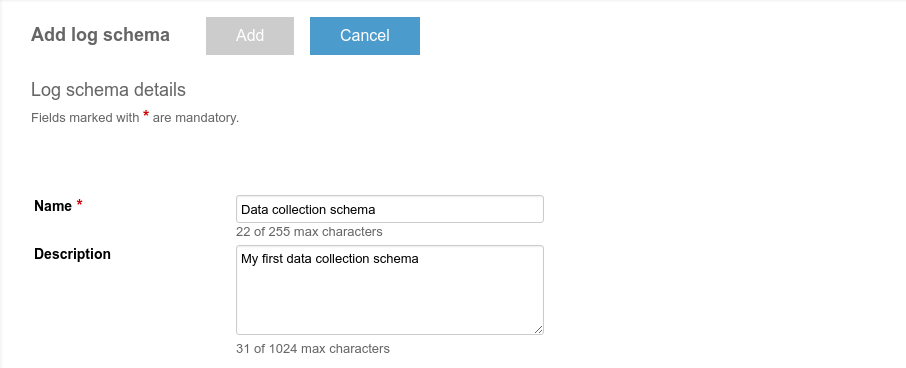
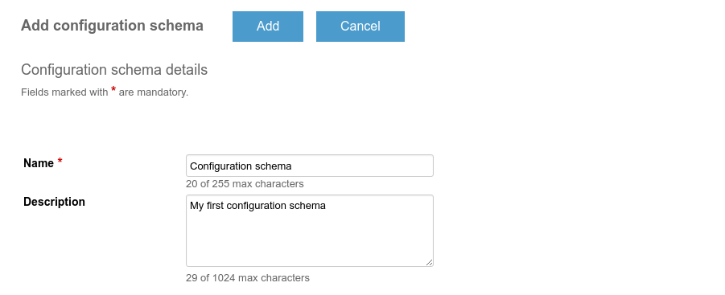


 /{{root_url[1]}}/{{root_url[2]}}/

* TOC
{:toc}

# Prerequisites

To register a new application within a fresh Kaa server installation,
you need to create users with the [tenant administrator]({{root_url}}/Administration-guide/Tenants-and-applications-management/#tenant-admin) and [tenant developer]({{root_url}}/Administration-guide/Tenants-and-applications-management/#tenant-developer) roles.

The tenant administrator is responsible for creating new applications in Kaa,
and the tenant developer configures and generates SDKs for those applications.
We suggest that you use Kaa Sandbox, which has a tenant administrator and tenant
developer users already created.

# Application description

Application created trough this guide covers the basic case of collecting
temperature data from a sensor. Usually, simple sensors stream data at constant
rate, no matter what. However, rising demand of mobility and power efficiency dictates own
rules of game. It is not viable to keep sensors streaming all the time, especially
if a data is not required at this moment. That's a point where we can save power by
configuring sample period.

To satisfy application requirements two of main Kaa features are used:

- **Data Collection** feature that allows to send data from endpoints
to the Kaa server. In this example Data Collection is used to reliably transmit
temperature samples from sensor to the Kaa.

- **Configuration** feature that allows to broadcast configuration parameters
from the Kaa server to Kaa endpoints. In this guide Configuration is used
to pass a sample period of the temperature to endpoint.

# Adding application

To add an application, proceed as follows:

1. Open the [Kaa admin UI in your browser](http://127.0.0.1:8080) and log in
as a tenant administrator (by default the user/password is admin/admin123 in sandbox;
use the correct credentials if you changed the default).
1. Select **Applications** on the navigation panel on the left side and, in the
Applications window that opens, click **Add application**.
1. In the Add application window, enter the application name and then click **Add**.
For this guide we will use **Trustful** credential service and our application will be
named "My First Kaa Application"

    

After the application has been added, you may log out. We will not be using
the tenant administrator role in this guide anymore.

# Creating schemas

The application that you have created in [the previous step](#adding-application)
already includes the default versions of the profile, configuration, notification
and log schemes ready for use. However, in this sample application, we will use a custom data
collection and configuration schemas for demonstration purposes.

To create and upload the schemas, proceed as follows:

1. Create the *data-schema.json* file on your PC with the following schema definition:

        {
            "type": "record",
            "name": "DataCollection",
            "namespace": "org.kaaproject.kaa.schema.example",
            "fields": [
                {
                    "name": "temperature",
                    "type": "int"
                }
            ]
        }
1. Create the *configuration-schema.json* file and add the following schema:

        {
            "type": "record",
            "name": "Configuration",
            "namespace": "org.kaaproject.kaa.schema.example",
            "fields": [
                {
                    "name": "samplePeriod",
                    "type": "int",
                    "by_default": "1"
                }
            ]
        }

    `by_default` field defines the default value for sampling period, which is in our example
    is set to 1 second.
1. Open the admin UI in your browser and log in as a tenant developer
(default user/password in sandbox: devuser/devuser123; use the correct credentials if
you changed the default).
1. Open the relevant **Log schemas** window (**Applications =>
My First Kaa Application => Schemas => Log**) and click **Add schema**.
1. In the **Add log schema** window, enter the name and description of
the new data collection schema.

    
1. Scroll down and use the **Upload from file** function to find the previously
    created json file with the schema. Alternatively, you can use the
    [Schema Avro UI]({{root_url}}/Administration-guide/Tenants-and-applications-management/#avro-ui-forms)
    form to create the schema.
1. Click **Upload**.
1. Click **Add** at the top of the window.
1. Repeat uploading and adding for the configuration schema
    (*configuration-schema.json*) scheme:

    

As a result of these operations you will see configuration and data collection
schemas in the list. Note that every time you adding new schema, Kaa will assign
to it new version. So if you already added your own schemas then versions you can
observe could be different from that provided on the screenshots.


In this screenshot, version 2 is log and configuraion schema version that
was just created. We will use this version for the SDK generation later.

# Log appenders setup

In order to use Data Collection feature it is required to setup **Log Appender**.
In this example we will use MongoDB log appender.
Refer to [Admin UI section describing how to setup it]({{root_url}}/Administration-guide/Tenants-and-applications-management/#mongodb-log-appender).

# Generating SDK

To generate an SDK for the new application, proceed as below:

1. Select **My First Kaa Application** application and click **Generate SDK**.

    
1. Click **Add SDK profile**.

    
1. In the **Add SDK profile** window, fill in the fields as shown.
Note that schema versions that are used in the following screenshot correspond
to versions that was previously assigned by the Kaa during [the creating schemas step](#creating-schemas).
If you are using your own additional schemas then version numbers may be different.
After picking right versions for schemas used in SDK click **Add**.

    
1. Now the SDK is configured and ready to be generated. Click **Generate SDK** for
corresponding SDK profile. In the **Generate SDK** window select the target platform for
your SDK and click Generate SDK.

    

    

After the SDK is generated, you will be presented with a window asking you to save it.
Specify the file name and location on your computer and then click **Save**.
The SDK is now downloaded to your computer.

Note that in this example we are generating the SDK based on the default profile and
notification schemas. These schemas are automatically populated during the creation of
the application.
If necessary, you can overwrite them using [Admin UI]({{root_url}}/Administration-guide/Tenants-and-applications-management/).

# Sample client application

Once you have downloaded the SDK, you can use it in your sample project. The following
code block illustrates a simple desktop application that will send virtual temperature
data from the Kaa endpoint with required configuration.

## Preparation

<ul class="nav nav-tabs">
  <li class="active"><a data-toggle="tab" href="#prep-c">C SDK</a></li>
  <li><a data-toggle="tab" href="#prep-c++">C++ SDK</a></li>
  <li><a data-toggle="tab" href="#prep-java">Java SDK</a></li>
  <li><a data-toggle="tab" href="#prep-obj-c">Objective-C</a></li>
</ul>

<div class="tab-content">

<div id="prep-c" class="tab-pane fade in active" markdown="1" >

Before you start with C application code, some preparation is required.

1. Install dependencies: CMake and OpenSSL. On Ubuntu, you can install it using following
commands.

        sudo apt-get install cmake
        sudo apt-get install libssl-dev
1. Create `kaa` directory and unpack C SDK
1. Create `CMakeLists.txt` in the application directory with following contents.

        cmake_minimum_required(VERSION 2.8.8)
        project(kaa-application C)

        find_package(OpenSSL REQUIRED)

        set(CMAKE_C_FLAGS "${CMAKE_C_FLAGS} -std=gnu99 -g -Wall -Wextra")

        add_subdirectory(kaa)

        add_executable(kaa-app main.c)
        target_link_libraries(kaa-app kaac crypto)
1. Create source file with empty main routine (for now).

        int main(void)
        {

        }
1. Validate that build system works as expected by triggering a build.

        mkdir build
        cd build
        cmake ..
        make
1. Check that demo application executable is present in build directory.

        $ ls -l kaa-app
        -rwxr-xr-x 1 user 53944 Jun 10 12:36 kaa-app

</div>

<div id="prep-c++" class="tab-pane fade" markdown="1" >

</div>

<div id="prep-java" class="tab-pane fade" markdown="1" >

</div>

<div id="prep-obj-c" class="tab-pane fade" markdown="1" >

</div>


</div>


## Application code

Now it is time to write application code that will send temperature data with the
configured sampling period.

<ul class="nav nav-tabs">
  <li class="active"><a data-toggle="tab" href="#app-c">C SDK</a></li>
  <li><a data-toggle="tab" href="#app-c++">C++ SDK</a></li>
  <li><a data-toggle="tab" href="#app-java">Java SDK</a></li>
  <li><a data-toggle="tab" href="#app-obj-c">Objective-C</a></li>
</ul>

<div class="tab-content">
<div id="app-c" class="tab-pane fade in active" markdown="1" >

```c
#include <stdio.h>
#include <stdlib.h>
#include <stdint.h>
#include <time.h>

#include <kaa/kaa.h>
#include <kaa/platform/kaa_client.h>
#include <kaa/kaa_error.h>
#include <kaa/kaa_configuration_manager.h>
#include <kaa/kaa_logging.h>
#include <kaa/gen/kaa_logging_gen.h>
#include <kaa/platform/kaa_client.h>
#include <utilities/kaa_log.h>
#include <kaa/platform-impl/common/ext_log_upload_strategies.h>

static int32_t sample_period;
static time_t  last_sample_time;

extern kaa_error_t ext_unlimited_log_storage_create(void **log_storage_context_p, kaa_logger_t *logger);

/* Retrieves current temperature. */
static int32_t get_temperature_sample(void)
{
    /* For sake of example random data is used */
    return rand() % 10 + 25;
}

/* Periodically called by Kaa SDK. */
static void example_callback(void *context)
{
    time_t current_time = time(NULL);

    /* Respect sample period */
    if (difftime(current_time, last_sample_time) >= sample_period) {
        int32_t temperature = get_temperature_sample();

        printf("Sampled temperature: %i\n", temperature);
        last_sample_time = current_time;

        kaa_user_log_record_t *log_record = kaa_logging_data_collection_create();
        log_record->temperature = temperature;

        kaa_logging_add_record(kaa_client_get_context(context)->log_collector, log_record, NULL);
    }
}

/* Receives new configuration data. */
static kaa_error_t on_configuration_updated(void *context, const kaa_root_configuration_t *conf)
{
    (void) context;

    printf("Received configuration data. New sample period: %i seconds\n", conf->sample_period);
    sample_period = conf->sample_period;

    return KAA_ERR_NONE;
}

int main(void)
{
    /* Init random generator used to generate temperature */
    srand(time(NULL));

    /* Prepare Kaa client. */

    kaa_client_t *kaa_client = NULL;
    kaa_error_t error = kaa_client_create(&kaa_client, NULL);
    if (error) {
        return EXIT_FAILURE;
    }

    /* Configure notification manager. */

    kaa_configuration_root_receiver_t receiver = {
        .context = NULL,
        .on_configuration_updated = on_configuration_updated
    };

    error = kaa_configuration_manager_set_root_receiver(
        kaa_client_get_context(kaa_client)->configuration_manager,
        &receiver);

    if (error) {
        return EXIT_FAILURE;
    }

    /* Obtain default configuration, shipped within SDK. */

    const kaa_root_configuration_t *dflt = kaa_configuration_manager_get_configuration(
        kaa_client_get_context(kaa_client)->configuration_manager);

    printf("Default sample period: %i seconds\n", dflt->sample_period);

    /* Configure data collection. */

    void *log_storage_context         = NULL;
    void *log_upload_strategy_context = NULL;

    /* The internal memory log storage distributed with Kaa SDK. */
    error = ext_unlimited_log_storage_create(&log_storage_context,
        kaa_client_get_context(kaa_client)->logger);

    if (error) {
        return EXIT_FAILURE;
    }

    /* Create a strategy based on timeout. */
    error = ext_log_upload_strategy_create(
        kaa_client_get_context(kaa_client), &log_upload_strategy_context,
        KAA_LOG_UPLOAD_BY_TIMEOUT_STRATEGY);

    if (error) {
        return EXIT_FAILURE;
    }

    /* Strategy will upload logs every 5 seconds. */
    error = ext_log_upload_strategy_set_upload_timeout(log_upload_strategy_context, 5);

    if (error) {
        return EXIT_FAILURE;
    }

    /* Specify log bucket size constraints. */
    kaa_log_bucket_constraints_t bucket_sizes = {
         .max_bucket_size       = 32,   /* Bucket size in bytes. */
         .max_bucket_log_count  = 2,    /* Maximum log count in one bucket. */
    };

    /* Initialize the log storage and strategy (by default it is not set). */
    error = kaa_logging_init(kaa_client_get_context(kaa_client)->log_collector,
        log_storage_context, log_upload_strategy_context, &bucket_sizes);

    if (error) {
        return EXIT_FAILURE;
    }

    /* Start Kaa SDK's main loop. example_callback will be called 1 time per second. */

    error = kaa_client_start(kaa_client, example_callback, kaa_client, 1);

    /* Should get here only after Kaa stop. */

    kaa_client_destroy(kaa_client);

    if (error) {
        return EXIT_FAILURE;
    }

    return EXIT_SUCCESS;
}

```

</div>

<div id="app-c++" class="tab-pane fade" markdown="1" >

</div>

<div id="app-java" class="tab-pane fade" markdown="1" >

</div>

<div id="app-obj-c" class="tab-pane fade" markdown="1" >

</div>

</div>

## Launching application

<ul class="nav nav-tabs">
  <li class="active"><a data-toggle="tab" href="#run-c">C SDK</a></li>
  <li><a data-toggle="tab" href="#run-c++">C++ SDK</a></li>
  <li><a data-toggle="tab" href="#run-java">Java SDK</a></li>
  <li><a data-toggle="tab" href="#run-obj-c">Objective-C</a></li>
</ul>

<div class="tab-content">
<div id="run-c" class="tab-pane fade in active" markdown="1" >

In order to launch C appliation next steps should be performed.
1. Rebuild application with decreased log level. This will decrease a mess that can
appear when debug logs are enabled.

        cd build
        cmake -DKAA_MAX_LOG_LEVEL=3 ..
        make

2. Launch the executable file.

        ./kaa_app

</div>

<div id="run-c++" class="tab-pane fade" markdown="1" >

</div>

<div id="run-java" class="tab-pane fade" markdown="1" >

</div>

<div id="run-obj-c" class="tab-pane fade" markdown="1" >

</div>

</div>


## Expected output

After application start following logs will appear on the console.

```
Default sample period: 1 seconds
Sampled temperature: 32
Sampled temperature: 26
Sampled temperature: 26
Sampled temperature: 31
Sampled temperature: 28
Sampled temperature: 28
```
Note that temperature value must be sampled 1 time per second as stated in the
configuration scheme.
Refer to the [Troubleshooting](#troubleshooting) section if something goes wrong.

## Retrieving collected data

In order to obtain temperature data stored on the server, following steps should be
performed.

1. Grab application token. It is a token that you can copy from the main window
    of the application the Administration UI.

    
1. Login to your machine running Kaa server (in case you are using sandbox
    default username and password are *kaa / kaa*).
1. Start MongoDB shell

        mongo kaa
1. Retrieve data using application token retrieved at first step within this sectino.

        db.logs_$your_application_token$.find()

## Changing sample period

Let's check how to tune sampling period on a server and see what happens on the
endpoint.

1. Make sure your client application is running and sampling temperature
1. Login to the **Admin UI** as a Tenant Developer and proceed to the **Endpoint Groups**
    section of your application.

    
1. Click on the endpoint group **All** and select configuration schema from
    **Configurations** section.

    
1. Click on the latest **Configuration schema** and activate **Draft** tab. Change
    sample period to, say, 5 seconds and hit **Save** button.

    
1. Now, activate a draft by clicking **Activate** button and see client output.

        Sampled temperature: 32
        Sampled temperature: 26
        Sampled temperature: 29
        Sampled temperature: 33
        Sampled temperature: 26
        Received configuration data. New sample period: 5
        Sampled temperature: 33
        Sampled temperature: 30
        Sampled temperature: 34
        Sampled temperature: 25

    You notice that sampling period is  equal to the new
    sample period we set in **Admin UI**


# Next steps

To create a real-world IoT solution, you will most likely need to implement more
features into your application.

Kaa provides you with practically everything you might need.
Links in [following section](#further-reading) will help you grasp the scope of Kaa capabilities
as well as get familiar with the essential documentation, such as Programming guide and
Administration UI guide.

# Further reading

Use the following guides and references to make the most of Kaa.

 - [Key Kaa features]({{root_url}}/Programming-guide/Key-platform-features/)

    Use this reference to learn about features and capabilities of Kaa.

 - [Using endpoint SDKs]({{root_url}}/Programming-guide/Using-Kaa-endpoint-SDKs/)

    Use this guide to create advanced applications with Kaa using SDKs.

 - [Administration UI guide]({{root_url}}/Administration-guide/)

    Use this guide to learn how to install, configure and manage Kaa platform in details.

 - [Contribute to Kaa]({{root_url}}/Customization-guide/How-to-contribute/)

    Use this guide to learn how to contribute to Kaa project and which code/documentation style conventions we adhere to.
