


* TOC
{:toc}

In this tutorial, we will look at how to connect an [Arduino MKR-1010][MKR-1010] board with [MKR-ENV][MKR-ENV-Shield] shield to the Kaa platform using the default, MQTT-based protocol.
You will learn how to create a digital twin of your device, connect it, submit some telemetry, and view it in the Kaa web interface.

Here is what we will have in the result:

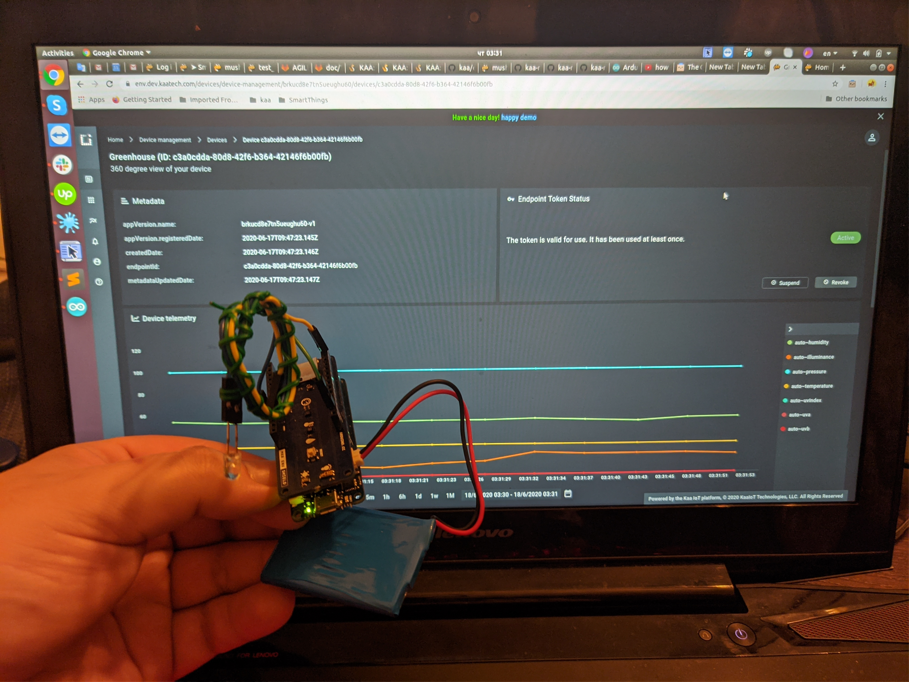


## Overview

We will simulate a greenhouse scenario where need to monitor temperature, humidity and lights.
Our MKR-1010 will represent an [endpoint][endpoint] in the Kaa platform and report all sensors data.
Also, we will interact with the Kaa [Web Dashboard][dashboard] to create a digital twin of the [Arduino MKR-1010][MKR-1010] and view telemetry data.

> NOTE: [MKR-ENV][MKR-ENV-Shield] shield has more than temperature, humidity and lights, additionally it has ultraviolet(A and B wavelengths) and atmosphere pressure sensors. so this sensors data will be reported too.
{:.note}


## Playbook

### Create Kaa Cloud account

For tutorial completion, we will need an account in Kaa Cloud.
To obtain it register on [kaaproject.org][kaaproject.org].

Then go to the [free trial page][Kaa cloud free trial] and click on the "Go to cloud" button. Kaa Clout account will be automatically created for you.


### Create Application

Before creating any device, you need to create at least one "Application" 

**1**. Go to the "Applications" dashboard in your [Kaa Cloud account][Kaa cloud].


**2**. Click on "Add Application" button.

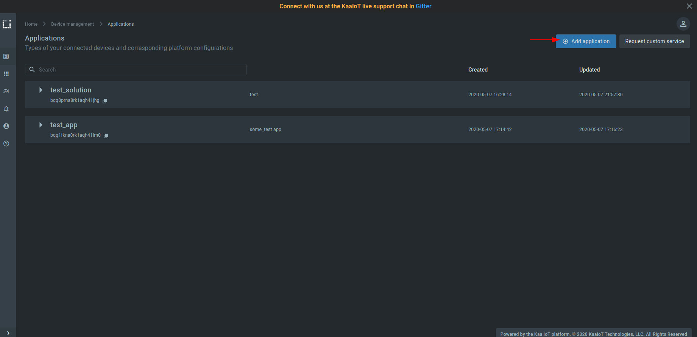

**3**. Fill "Display name" and "Description" fields and click on "Create" button.


**5**. Create at least one version of your application. 
For that expand the created application, click on "Add version" button, fill fields and click on "Create" button.

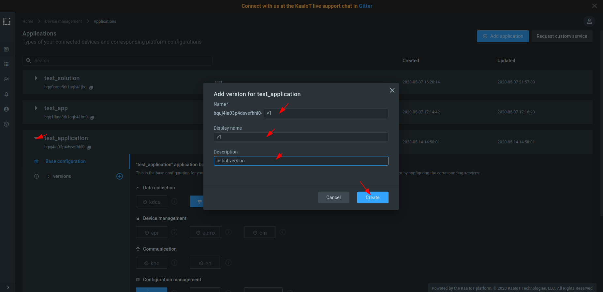


### Connect your device

**1**. Go to the "Device management" dashboard and click on "Add device" button to register a device digital twin 
It's called an "[endpoint][endpoint]" in Kaa.

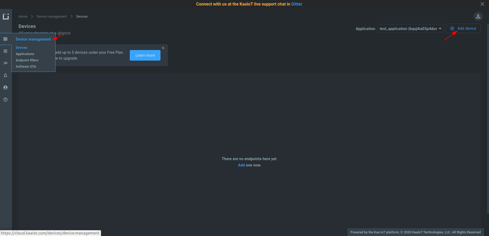

**2**. Choose the [application version][application] from the drop-down menu.
You can bump application versions in the application administration page as your devices evolve.
Enter the desired [endpoint token][endpoint-token].

> NOTE: Tokens are used for device identification in communication with the Kaa platform.
They are non-empty strings that do not contain the following reserved characters: `+`, `#`, `/`, and `.`.
A token will be autogenerated if you leave this field blank.
{:.note}

> NOTE: Metadata is simply key-value attributes that provide certain information about a device, e.g. its location, owner, customer, model, etc.
{:.note}

Click the `Create` button.

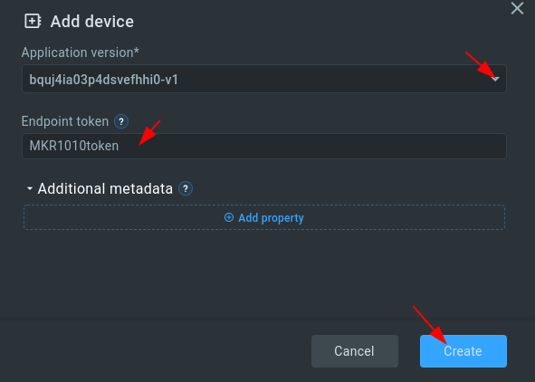

**3**. Copy and save the endpoint token in some file because **you won't be able to see it again in the future**.
We will use the token in a bit to connect [Arduino MKR-1010][MKR-1010].


**4**. Open the [sketch_MKR_1010_KAA_integration_tutorial.ino][code-url] file with the Arduino IDE and fill out the connection parameters:

```
const char* ssid = "";          // your WiFi network SSID
const char* password = "";      // your WiFi network password
const String TOKEN = "";        // the endpoint token from the previous step
const String APP_VERSION = "";  // the application version name you are working with
```

**5**. Upload the `sketch_MKR_1010_KAA_integration_tutorial.ino` file to your MKR-1010 board.

Now the device can send telemetry data with the temperature, humidity, pressure, illuminance, ultraviolet type A and ultraviolet type B values.
The data payload is a UTF-8 encoded JSON array as below.

```json
[
  {
    "temperature":26.86638,
    "humidity":47.11707,
    "pressure":99.8,
    "illuminance":17.74194,
    "uva":3,
    "uvb":2
  }
]
```

More details about payload format are [here][data collection].


### Visualize data from the device

Before visualizing the data, you should edit application configuration for the [Endpoint Time Series service (EPTS)][EPTS].
EPTS is a Kaa platform component that is responsible for transforming raw [data samples][data-sample] into well-structured time series.
It also stores the time series data and provides access API for other services, including the [Web Dashboard][dashboard].

**1**. Go to the "Applications" dashboard


**2**. Expand your application and click on [EPTS][EPTS] 

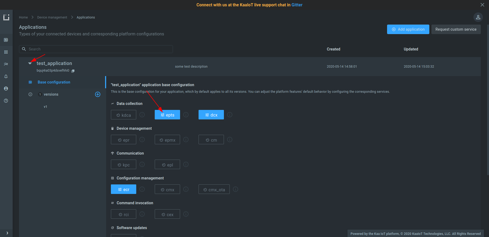

**3**. Enable the [time series auto-extraction][EPTS time series auto extraction] from data samples.

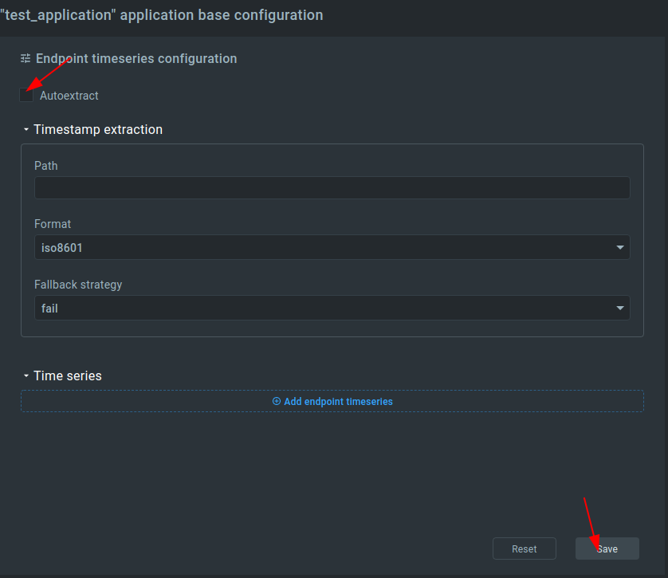


That's it, now we can visualize the data.

Each device has built-in visualization (telemetry chart) widget and we can use it to check incoming data from the MKR-1010 board. 

Go to the device details page of the recently created endpoint (by clicking on the corresponding row in the device table).
See the data from your MKR-1010 board on the `DEVICE TELEMETRY` widget.

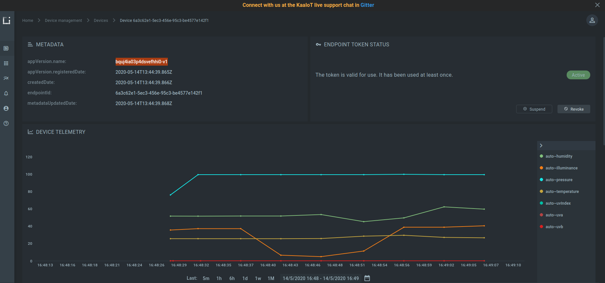


### Customize vizualizations

Kaa platform has many widgets to visualize the data and user can organize own dashboard with customized widgets.

Let's create a dashboard for "mushroom greenhouse". This type of greenhouse requires tracking of temperature and humidity data.

**1**. Go to "Solutions" section and select created application solution

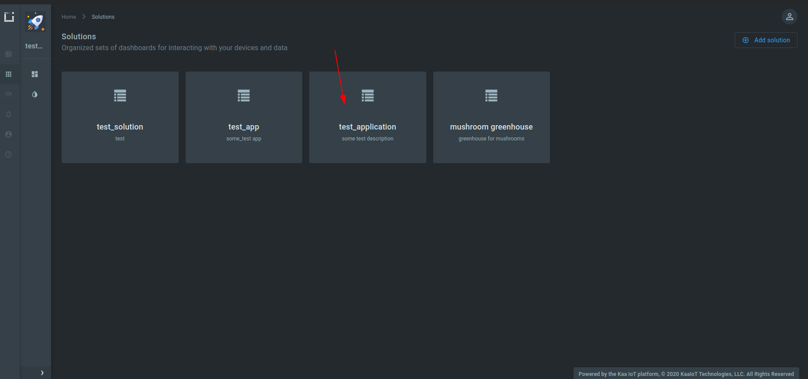

**2**. Click on "Edit" button

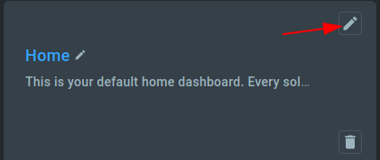

**3**. Set "mushroom greenhouse" for "Title" field and click on "Update" button. 


**4**. Select "mushroom greenhouse" dashboard.

**5**. Click on the "Add widget" button.

**6**. Select "Gauges" -> "Radial 180" widget.

**7**. Click on the "edit" button on just added widget (RADIAL 180 GAUGE).

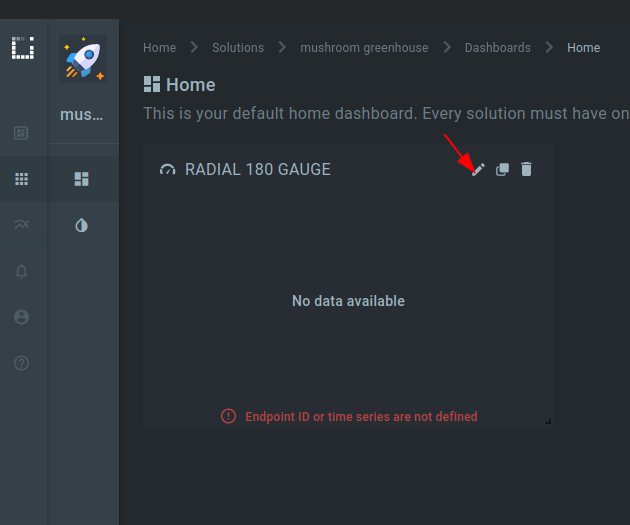

**8**. Fill header form 


**9**. Fill "data source" form 


**10**. Fill the "Value ranges" form.


**11**. Select endpoint ID. 


**12**. Click on the "Save" button to save changes. 

**13**. Click on the "Publish changes" button to save and publish changes.


Widget for temperature is ready.

> NOTE: Widget for humidity can be created in a similar way like a temperature widget, so it will be skipped in this tutorial.
{:.note}

Custom visualization for "mushroom" greenhouse is done.


Congratulations, you have connected and visualized data from your [Arduino MKR-1010][MKR-1010] board with [MKR-ENV][MKR-ENV-Shield] shield in Kaa Cloud!

Here is a short video of how this setup works

<div align="center">
  <iframe width="640" height="385" src="https://www.youtube.com/embed/q2Y0r4AC5f4?rel=0" frameborder="0"
          allow="accelerometer; autoplay; encrypted-media; gyroscope; picture-in-picture" allowfullscreen></iframe>
</div>


## Resources

* All tutorial resources are located on [GitHub][code-url].


## Next steps

- Join the discussion at our [community chat][Kaa user chat] and share feedback!
- Now that you have some Kaa experience under your belt, check out the [Kaa IoT Cloud and Kaa 1.1 webinar][webinar Kaa IoT Cloud and Kaa 1.1] to implement something more complicated.
- [Data Analytics and Notifications webinar][webinar Data Analytics and Notifications] based on Arduino compatible(ESP8266) smart socket.
- [Device management][identity] - find out more about the device management feature.
- Review the [telemetry data collection tutorial][data collection tutorial] that is based on a Python simulator.


[code-url]:                 https://github.com/kaaproject/kaa/tree/master/doc/Tutorials/connect-arduino-mkr-1010-to-kaa-platform/attach/code
[arduino-ide]:              https://www.arduino.cc/en/Main/Software
[MKR-1010]:                 https://www.arduino.cc/en/Guide/MKRWiFi1010
[MKR-ENV-Shield]:           https://www.arduino.cc/en/Guide/MKRENVShield
[Kaa cloud free trial]:     https://www.kaaproject.org/free-trial
[kaaproject.org]:      https://www.kaaproject.org

