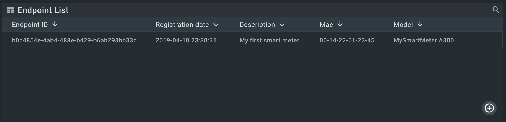





* TOC
{:toc}

In this tutorial we will look at how to connect a simulated device to the Kaa platform using the default, MQTT-based protocol.
You will learn how to create a digital twin of your device, connect it, submit some metadata attributes, and view them in the Kaa web interface.


# Overview

We will simulate a smart energy scenario.
Our [endpoint][endpoint] will act as a smart meter and report its model and MAC address to the Kaa platform.
Also, we will configure an [Endpoint List widget]({{docs_url}}WD/docs/current/Widgets/Ep-list/) on the [Web Dashboard]({{docs_url}}WD) to display newly connected endpoint with its reported metadata.


# Prerequisites

1. You understand the Kaa platform [device management basics][identity].
2. The Kaa platform is up and running with the following microservices included:
* [Kaa Protocol Communication (KPC)]({{docs_url}}KPC);
* [Credential Management (CM)]({{docs_url}}CM);
* [Endpoint Metadata Extension (EPMX)]({{docs_url}}EPMX);
* [Endpoint Register (EPR)]({{docs_url}}EPR);
* [Web Dashboard (WD)]({{docs_url}}WD).
3. [Python 2.7](https://www.python.org/download/releases/2.7/) is installed on your machine.


# Background information

Kaa platform by default uses an **MQTT-based transport**: the [Kaa Protocol (1/KP)]({{rfc_url}}0001/README.md).
1/KP acts as a multiplexing protocol and allows running higher level (extension) protocols on top of it.
Extension protocols enable data exchange between endpoints and extensions: microservices that implement different aspects of the server-side functionality, such as **metadata synchronization** ([EPMX]({{docs_url}}EPMX)), **data collection** ([DCX]({{docs_url}}DCX)), **configuration management** ([CMX]({{docs_url}}CMX)), etc.

Managed devices are represented as [endpoints][endpoint] in the Kaa platform.
1/KP uses endpoint tokens (alphanumeric strings) to identify connected endpoints.
Every managed device must have a **separate endpoint token** for communicating with the platform.

Every extension defines its own **MQTT path and payload** structure to be used by endpoints.
In this tutorial we will use only one **extension**, [EPMX]({{docs_url}}EPMX), that serves for endpoint metadata synchronization.
Check its extension protocol [10/EPMP]({{rfc_url}}0010/README.md) for more information.

Now let's get to the action.


# Playbook

**1**. Go to the Web Dashboard and configure (if it is not already configured) an [Endpoint List widget]({{docs_url}}WD/docs/current/Widgets/Ep-list/).
Add `meterDescription` field to the endpoint creation form. We will fill it out during the endpoint record creation.

<div align="center">
  <iframe width="640" height="385" src="https://www.youtube.com/embed/qMeLZa0emws?rel=0" frameborder="0" 
    allow="accelerometer; autoplay; encrypted-media; gyroscope; picture-in-picture" allowfullscreen></iframe>
</div>

**2**. Create an endpoint record and obtain an endpoint token:

<div align="center">
  <iframe width="640" height="385" src="https://www.youtube.com/embed/du7tBJY72xM?rel=0" frameborder="0" 
    allow="accelerometer; autoplay; encrypted-media; gyroscope; picture-in-picture" allowfullscreen></iframe>
</div>

**3**. Run from your machine [client.py]({{code_url}}/client.py), passing the endpoint token, platform host and port as arguments:

```
python -t myToken -h {host} -p {port} client.py

INFO: Using EP token myToken, server at {host}
DEBUG: Composed metadata topic: kp1/demo_application_v1/epmx/myToken/update/keys
INFO: Connecting to KPC instance at {host}:{port}...
INFO: Successfully connected
INFO: Sent metadata: {"model": "MySmartMeter A300", "mac": "00-14-22-01-23-45"}

INFO: Disconnecting from server at {host}:{port}.
INFO: Successfully disconnected
```

**4**. Go to the Web Dashboard and configure the Endpoint List widget with new metadata columns:

<div align="center">
  <iframe width="640" height="385" src="https://www.youtube.com/embed/ozMnDBzknHQ?rel=0" frameborder="0" 
    allow="accelerometer; autoplay; encrypted-media; gyroscope; picture-in-picture" allowfullscreen></iframe>
</div>

Now our device is listed in the Endpoint List widget along with its metadata:




# Resources

All tutorial resources are located on [GitHub]({{code_url}}).

# Next steps

- [Device management][identity] - find out more about device management feature.
- [Data collection tutorial][data collection tutorial] - learn how to collect telemetry from your device into the platform.
