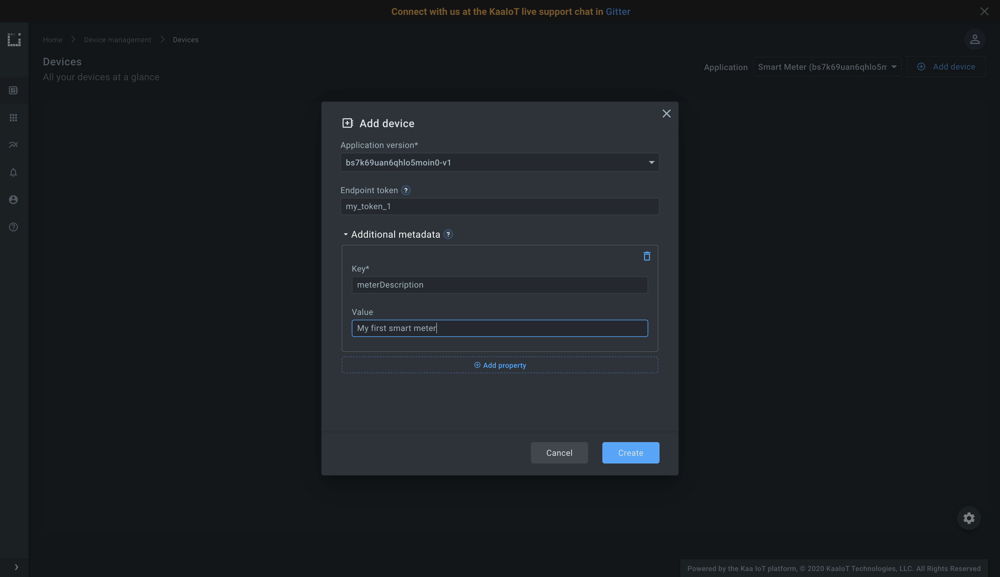
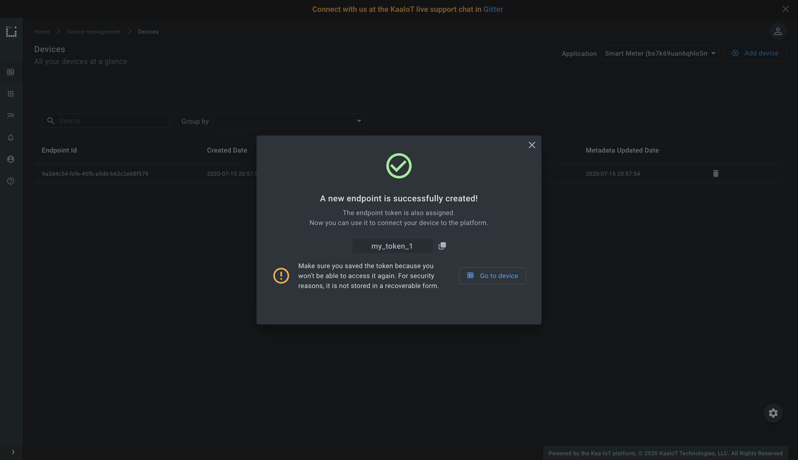
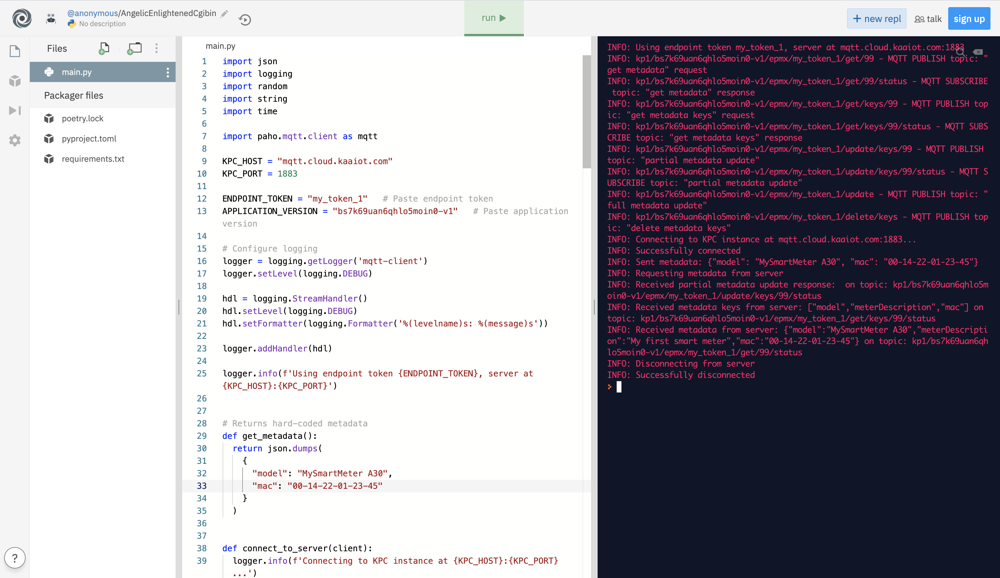
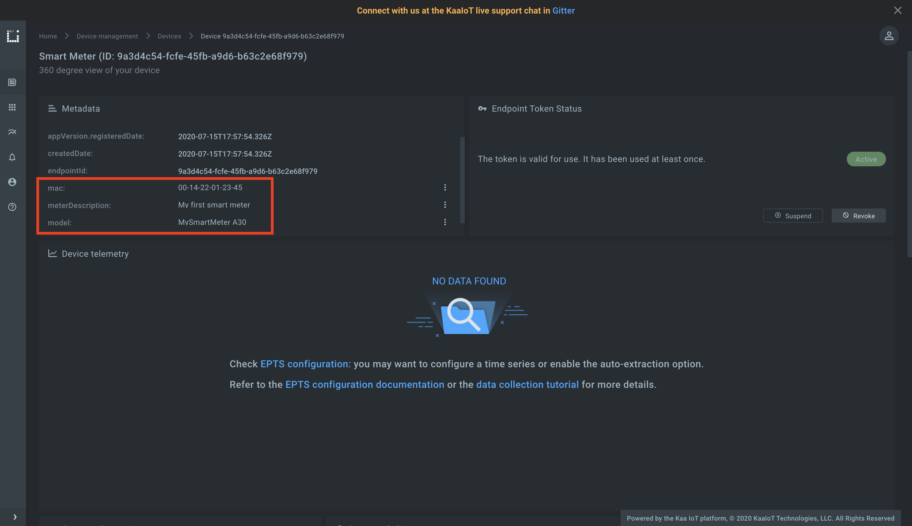




* TOC
{:toc}

In this tutorial, we will look at the Identity management feature in the Kaa platform.
You will learn how to create a digital twin of your device, connect it, submit arbitrary metadata attributes in JSON format into the platform, and view them in the Kaa web interface.
Also, we will give a definition of "endpoint", "endpoint ID", "endpoint token" and "endpoint metadata" terms.


Tutorial video.

<div align="center">
  <iframe width="640" height="385" src="https://www.youtube.com/embed/QpyW5gEJKe0?rel=0" frameborder="0"
          allow="accelerometer; autoplay; encrypted-media; gyroscope; picture-in-picture" allowfullscreen></iframe>
</div>


## Overview

Our device simulator will request all metadata attributes from the Kaa platform and report back its model and MAC address.
Also, we will define one metadata attribute directly from the Kaa web interface. 


## Prerequisites

1. You have a [free Kaa Cloud account][Kaa cloud free trial].


## Terms definition

Working with identity management you will be constantly facing the bellow terms.  

**What is an endpoint?**

**An endpoint is any terminal device that you want to manage with the Kaa platform.** 
An endpoint can either be a physical device or a software emulation thereof.
All data coming to the platform is associated with endpoints.

**What is endpoint ID?**

**Endpoint ID is used to uniquely identify an endpoint within the Kaa platform.** 
An endpoint ID is usually a UUID that is automatically generated by the Kaa at the moment of creating a new endpoint (e.g. `b1857120-9e72-4886-b3c2-b1bddccbf475`). 
Endpoint ID cannot be changed once created.

All endpoint data, such as metadata attributes, collected time series data points, commands, etc., is associated with a specific endpoint ID. 
Whenever you retrieve or manage endpoint-related data in Kaa (mainly via REST API or [NATS][nats]), you will see endpoint IDs.

**What is endpoint token?**

**Endpoint tokens are used for endpoint identification during the endpoint communication with the Kaa platform.** 
Tokens are unique in scope of [Kaa application][application] and assigned to exactly one endpoint. 
When a message arrives at the Kaa platform, an endpoint token is resolved into an endpoint ID.

Each message sent to the platform must have an endpoint token so that the platform could identify the endpoint, on behalf of which the message was sent. 
In the case of the Kaa Protocol over MQTT, endpoint token goes inside the MQTT topic (e.g. `kp1/<appversion_name>/epmx/<endpoint_token>/get`).

Typically, tokens are pseudo-random strings automatically generated by Kaa (e.g. `JTjdbENzHh`), but for convenience, you can also provision your endpoint tokens (e.g. device serial number, MAC address, etc.).

**Decoupling of endpoint tokens and endpoint IDs allows you to suspend, revoke, reactivate, and re-issue endpoint tokens without impacting the endpoint ID.** 
To communicate with the Kaa platform, your devices or gateways do not need to know endpoint IDs, ——— just tokens.

**What is endpoint metadata?**

**Endpoint metadata are key-value attributes associated with an endpoint.** 
It can be endpoint's location, description, serial number, hardware version, etc. 
Metadata is stored on [Endpoint Registered service][EPR] and can be read or updated in two ways: either via the [communication layer][communication] or [EPR REST API][EPR REST API].

Simply put, endpoint metadata is a JSON document of a free structure that is associated with a specific endpoint.


## Playbook

Let's connect a simulator and report its metadata attributes to the Kaa platform.

**1**. Go to the ["Devices" dashboard][devices dashboard], add a device with the optional metadata attribute `description`, and remember an endpoint token.







**2**. Open the [client.py](https://repl.it/@KaaIoT/ConnectDeviceToIotPlatform) simulator script, specify an endpoint token from the previous step, application version from the device page and run the script.



The following log message should appear in the sandbox console:

```text
...
Sent metadata: {"model": "MySmartMeter A300", "mac": "00-14-22-01-23-45"}
...
```

In this case the endpoint reported JSON object with key-value pairs where values are JSON strings.

**3**. Go to the device page and view submitted metadata attributes - it is `model` and `mac` in our case.




## Other operations on endpoint metadata

Many IoT functions require request/response style communication, which is not natively supported by MQTT. 
For that reason, [1/KP][1/KP] introduces the **request ID** in the request MQTT topic.
Request ID can be any random number.
Whenever endpoint wants to use request/response pattern, it must append request ID to the end of the MQTT topic.

**Successful responses** to requests with the request ID arrive back to your client on the requested topic with the `/status` suffix in the end. 
**Error responses** arrive on the requested topic with the `/error` suffix.

To perform other operations on endpoint metadata use the next MQTT topics and message payloads:

1. To request all endpoint metadata from the platform use:

MQTT Publish topic to send a request message:

```text
kp1/<appversion_name>/epmx/<token>/get/<request_id>
```

with UTF-8 encoded JSON payload:

```json
{}
```

MQTT Subscribe topic to get a response with the metadata:

```text
kp1/<appversion_name>/epmx/<token>/get/<request_id>/status
```

2. To request all endpoint metadata keys from the platform use:

MQTT Publish topic to send a request message:

```text
kp1/<appversion_name>/epmx/<token>/get/keys/<request_id>
```

with UTF-8 encoded JSON payload:

```json
[]
```

MQTT Subscribe topic to get a response with the metadata keys:

```text
kp1/<appversion_name>/epmx/<token>/get/keys/<request_id>/status
```

3. To fully update metadata on the platform without confirmation from the platform (without request ID in the end) use:

MQTT Publish topic to send a request message:

```text
kp1/<appversion_name>/epmx/<token>/update
``` 

with UTF-8 encoded JSON payload:

```json
{"key":"value"}
```

4. To update only specific metadata keys on the platform without confirmation from the platform (without request ID in the end) use:

MQTT Publish topic to send a request message:

```text
kp1/<appversion_name>/epmx/<token>/update/keys
```

with UTF-8 encoded JSON payload:

```json
{"key_to_update":"new_value"}
```

5. To delete specific metadata keys on the platform without confirmation from the platform (without request ID in the end) use:

MQTT Publish topic to send a request message:

```text
kp1/<appversion_name>/epmx/<token>/delete/keys
```
 
with UTF-8 encoded JSON payload:

```json
["key1_to_delete","key2_to_delete"]
```


Request topic examples (publish topics):

```text
kp1/bqf1uai03p4cop6jr3u0-v8/epmx/JTjdbENzHh/get/28          - "get metadata"
kp1/bqf1uai03p4cop6jr3u0-v8/epmx/JTjdbENzHh/get/keys/28     - "get metadata keys"
kp1/bqf1uai03p4cop6jr3u0-v8/epmx/JTjdbENzHh/update/keys/28  - "partial metadata update"
kp1/bqf1uai03p4cop6jr3u0-v8/epmx/JTjdbENzHh/update/28       - "full metadata update"
kp1/bqf1uai03p4cop6jr3u0-v8/epmx/JTjdbENzHh/delete/keys/28  - "delete metadata keys"
```

Successful response topic examples (subscribe topics):

```text
kp1/bqf1uai03p4cop6jr3u0-v8/epmx/JTjdbENzHh/get/28/status          - "get metadata" successful response
kp1/bqf1uai03p4cop6jr3u0-v8/epmx/JTjdbENzHh/get/keys/28/status     - "get metadata keys" successful response
kp1/bqf1uai03p4cop6jr3u0-v8/epmx/JTjdbENzHh/update/keys/28/status  - "partial metadata update" successful response
kp1/bqf1uai03p4cop6jr3u0-v8/epmx/JTjdbENzHh/update/28/status       - "full metadata update" successful response
kp1/bqf1uai03p4cop6jr3u0-v8/epmx/JTjdbENzHh/delete/keys/28/status  - "delete metadata keys" successful response
```

Error response topic examples (subscribe topics):

```text
kp1/bqf1uai03p4cop6jr3u0-v8/epmx/JTjdbENzHh/get/28/error          - "get metadata" error response
kp1/bqf1uai03p4cop6jr3u0-v8/epmx/JTjdbENzHh/get/keys/28/error     - "get metadata keys" error response
kp1/bqf1uai03p4cop6jr3u0-v8/epmx/JTjdbENzHh/update/keys/28/error  - "partial metadata update" error response
kp1/bqf1uai03p4cop6jr3u0-v8/epmx/JTjdbENzHh/update/28/error       - "full metadata update" error response
kp1/bqf1uai03p4cop6jr3u0-v8/epmx/JTjdbENzHh/delete/keys/28/error  - "delete metadata keys" error response
```

- `bqf1uai03p4cop6jr3u0-v8` - is application version
- `epmx` - is [Endpoint Metadata Extension][EPMX] service instance name
- `JTjdbENzHh` - is endpoint token
- `28` - is request ID. It can be any positive integer number


Check [10/EPMP][10/EPMP] protocol for more information.

## Resources

All tutorial resources are located on [GitHub][code url].


## Next steps

- [Device management][identity] - find out more about device management feature.
- [Data collection tutorial][data collection tutorial] - learn how to collect telemetry from your device into the platform.


[code url]:           https://github.com/kaaproject/kaa/tree/rel_1.2.0/doc/Tutorials/connect-device-to-iot-platform/attach/code
[devices dashboard]:  https://cloud.kaaiot.com/devices/device-management
