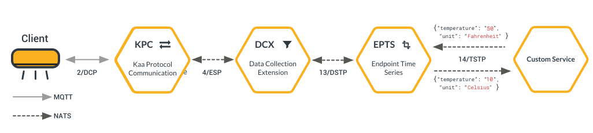




* TOC
{:toc}

This page will help you add your custom microservice to the Kaa IoT Platform.
You will be able to process data from endpoints in your own way and then send the processed data back to the platform.


# Guide overview

Kaa IoT Platform microservices provide NATS and REST API interfaces for inter-service comunication. Read more about [Kaa IoT Platform architecture]({{docs_url}}DOC/docs/current/Architecture-overview/).
We'll use the example of NATS subscriber and publisher that can consume data from [endpoints]({{rfc_url}}0001/README.md#language) and write to [EPTS]({{docs_url}}EPTS).
The example is written in JavaScript for Node.JS.

# Prerequisites
1. The next Kaa platform services are up and running: [KPC]({{docs_url}}KPC), [CM]({{docs_url}}CM), [EPR]({{docs_url}}EPR), [DCX]({{docs_url}}DCX), [EPTS]({{docs_url}}EPTS).
2. EPTS is configured with the `Temperature` time series as [bellow](#epts-time-series-configuration).
3. [Node.js](https://nodejs.org/en/download/package-manager/) and [npm](https://www.npmjs.com) are installed.
4. Download sample code used in this tutorial [here](https://github.com/kaaproject/tutorials).
5. In terminal go to the directory `custom-microservice` where code located by executing this commands from the folder with the downloaded materials:
```bash
unzip tutorials
cd tutorials/custom-microservice/
```

# Steps
1. Initialize npm:
```bash
npm init
```
2. Install needed dependencies:
```bash
npm install -D nats avsc
```
3. Don't forget to forward a NATS port if you're running this example locally:
```bash
kubectl port-forward {nats-pod-name} 4222:4222
```
You can get {nats-pod-name} from output of command:
```bash
kubectl get pods
```
4. To run the example, execute the following command:
```bash
node Nats-example.js
```

# What's going on in the code?
[Avro schema]({{rfc_url}}0014/README.md) for TSTP protocol:
This schema is from [schema.js](https://github.com/kaaproject/tutorials/blob/master/doc/custom-microservice/attach/code/schema.js) in the sample.
```javascript
const schema = avroSchema;
```
Connecting to NATS:
```javascript
const nats = NATS.connect({'url': 'nats://localhost:4222', 'preserveBuffers': true});
```
Avro schema will be used for parsing message:
```javascript
const type = avro.parse(JSON.stringify(schema), {wrapUnions: true});
```
## Subscribe
Subscribe to NATS subject where [EPTS]({{docs_url}}EPTS) sends data to:
```javascript
let subjectForSubscription = `kaa.v1.events.epts.endpoint.data-collection.data-points-received.Temperature`;
```
Listen for messages from EPTS:
```javascript
nats.subscribe(subjectForSubscription, function(msg) {
    console.log('Message received: ', type.toString(type.fromBuffer(msg)));
});
```
## Publish
`temperature-transformer` part from the publish subject bellow stands for the name of the [TSTP transmitter instance]({{docs_url}}EPTS/docs/current/Configuration/#time-series-transmitters).
Refer to the [bellow](#epts-time-series-configuration) EPTS configuration. 
```javascript
let subjectForPublish = `kaa.v1.events.temperature-transformer.endpoint.data-collection.data-points-received.Temperature`;
```
Massage fields corresponds to [avro schema](https://github.com/kaaproject/tutorials/blob/master/doc/custom-microservice/attach/code/schema.js):
```javascript
const message = {
    correlationId: Math.random().toString(36).substring(7),
    timestamp: 0,
    appVersionName: 'demo_application_v1',
    endpointId: 'qwerty12345678',
    timeSeriesName: 'Temperature',
    dataPoints: [{
        timestamp: 1875943753,
        values: new Map([['value','1']]),
    }]
};
```
Publish the message to EPTS:
```javascript
const buf = type.toBuffer(message);
nats.publish(subjectForPublish, buf);
```
## EPTS time series configuration

For tutorial completion, EPTS must have the next [time series configuration]({{docs_url}}EPTS/docs/current/Configuration/#service-configuration-structure): 

```yaml
kaa:
  applications:
    smart_kettle:
      versions:
        smart_kettle_v1:

  tstp.receiver:
    from:
      temperature-transformer:
        time-series:
        - Temperature
        - Logs
```
