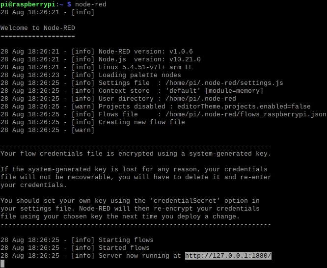
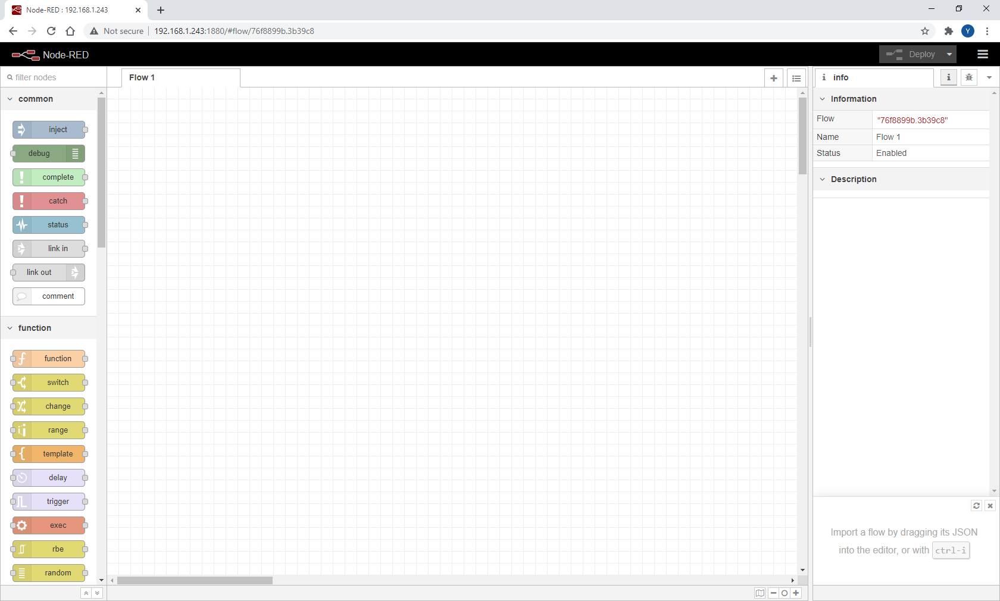
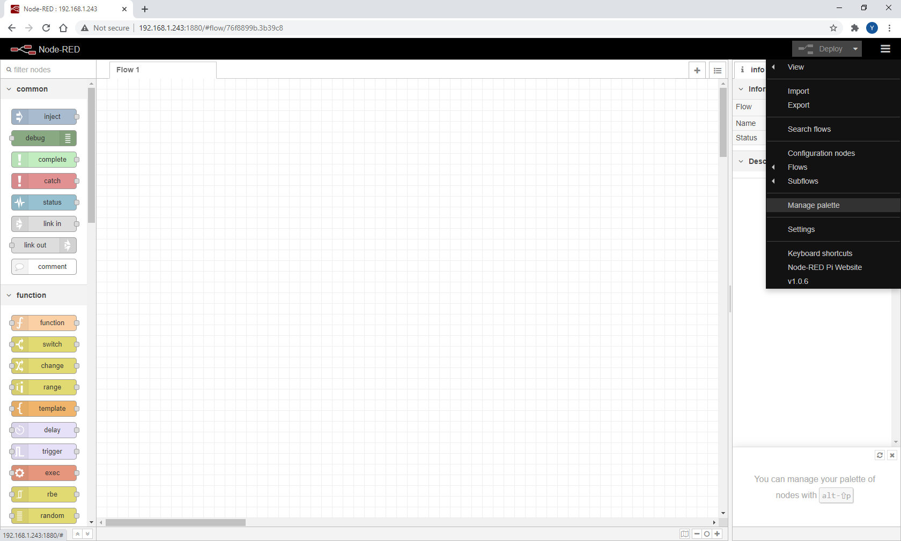
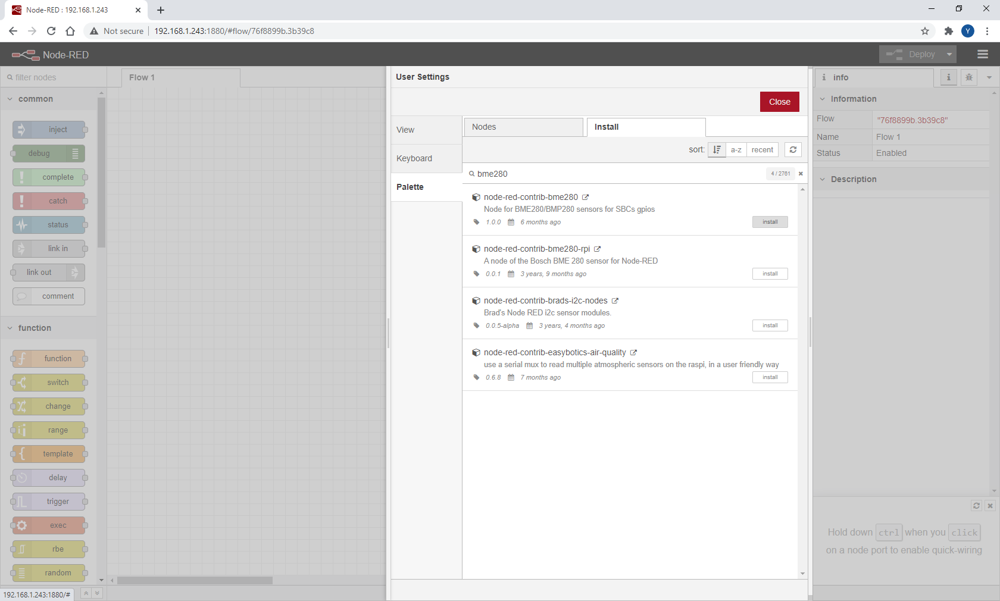
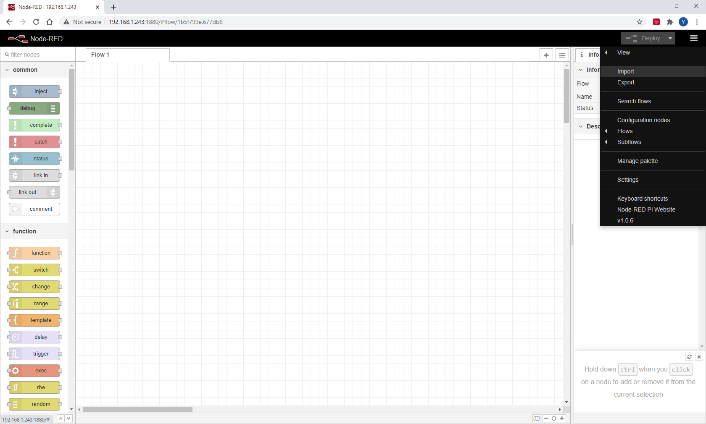
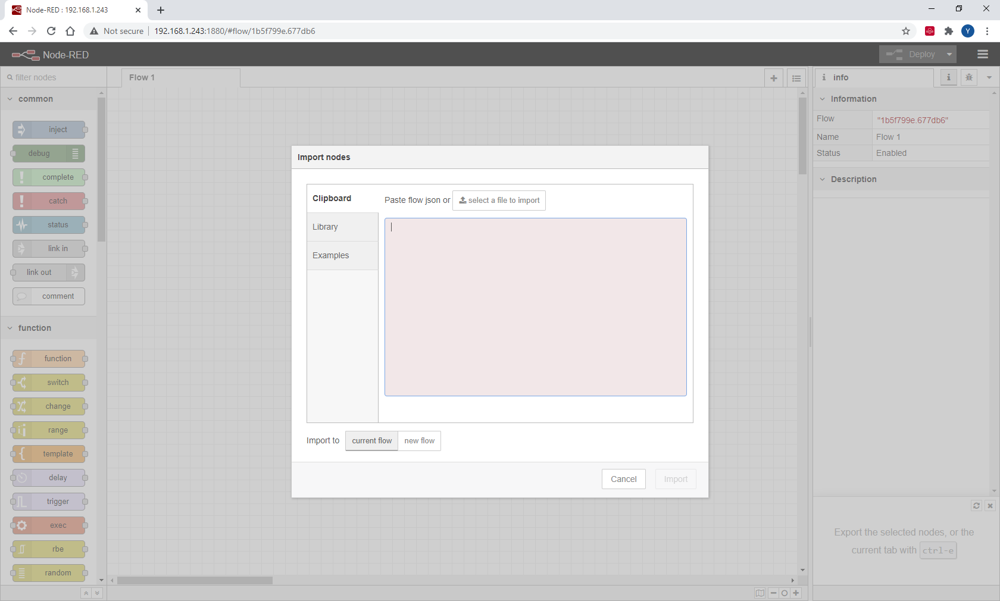
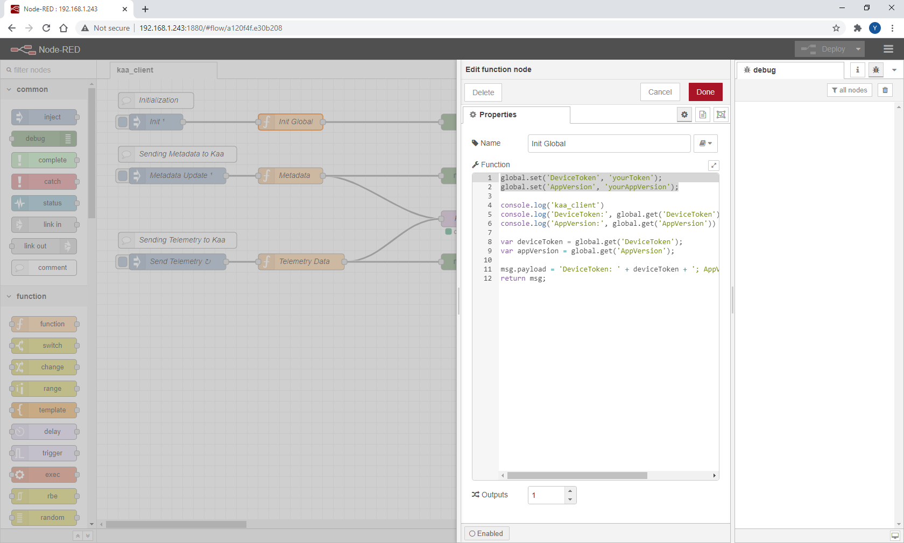
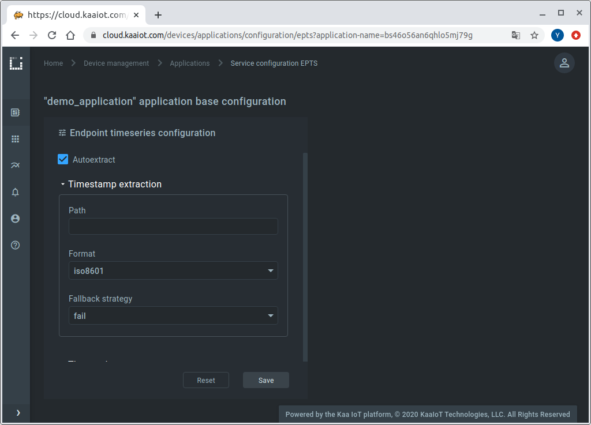
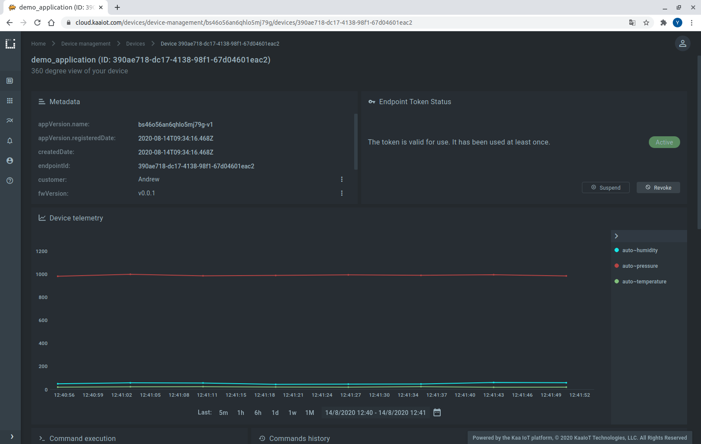




* TOC
{:toc}

In this tutorial, we will look at how to send data to the Kaa platform using Node-RED (a flow-based development tool for visual programming).
You will learn how to create a digital twin of your Node-RED device, connect it, submit some telemetry and view it in the Kaa web interface.


## Overview

We will be using [Node-RED][Node-RED] installed on a Raspberry Pi.
However, in your case Node-RED can be installed **anywhere** - on a local machine, on other than Raspberry Pi device, in the cloud, etc.
Our device will represent an [endpoint][endpoint] in the Kaa platform and report temperature, humidity, and air pressure.
Also, we will interact with the Kaa [Web Dashboard][WD] to create a digital twin of the Raspberry Pi and view telemetry data.


## Prerequisites

1. You have a [Kaa Cloud account][Kaa cloud registration].
2. You have a [BME280][BME280] sensor (optional).


## Playbook


### Connect your device

Go to the "Device Management" dashboard in your account


and add a new device specifying a token that we will use later to identify a Raspberry Pi in the Kaa Cloud.


 
Also, go to the added device page from the "Device Management" dashboard and copy the application version name. 


We will need both the application version and token to connect a Raspberry Pi to the Kaa Cloud.

Now that we have a device’s digital twin created in Kaa together with its token and application version, let's work with the Raspberry Pi.


Connect the BME280 sensor to the Raspberry Pi by referring to the following table:  

|MODULE PCB|DESC   |GPIO HEADER PINS|
|----------|-------|----------------|
|VCC       |3.3V   |P1-01           |
|GND       |Ground |P1-06           |
|SCL       |I2C SCL|P1-05           |
|SDA       |I2C SDA|P1-03           |

Here’s the diagram of a breadboard setup.  


If you don't have the BME280 sensor, then skip the above step and move on.

You may use cable Ethernet connection or connect the Raspberry Pi to the WiFi
[using command line](https://raspberrypihq.com/how-to-connect-your-raspberry-pi-to-wifi/) or [graphical desktop user interface](https://maker.pro/raspberry-pi/tutorial/ways-to-connect-raspberry-pi-to-a-wi-fi-network).

Once the Raspberry Pi is connected to the network, install the Node-RED:  
> NOTE: Node-RED is pre-installed in the "Raspberry Pi OS (32-bit) with desktop and recommended software", so you may skip installation step if you have this OS distribution.
{:.note}

```bash
$ sudo apt install nodejs
$ sudo apt install npm
$ sudo npm install -g --unsafe-perm node-red
```

After successful installation start Node-RED:

```bash
$ node-red
```



After Node-RED reports in a console that it is running, open a browser on the Raspberry Pi and go to `127.0.0.1:1880` or if you are using the browser on another computer, you will need to use your network Raspberry Pi IP address: `your_raspberry_ip_address:1880`.




### Sending data over MQTT

Install a BME280 node, for that click on a menu button in the right top corner and open **Manage palette**:



then click on **Install** tab and search for **bme280**.



Install `node-red-contrib-bme280` node.

OK, now let's import Kaa Node-RED client flow description into Node-RED. 

Click **menu** -> **Import**:
 


If you have BME280 use this flow description:

```json

```

If **not** use this flow description:

```json

```

Copy the corresponding code then paste it into the red field and click **Import**.



Open the `Init Global` node and change token and app version:



At this point, the nodes only exist in the editor and must be deployed to the server.
Click **Deploy**.
Node-Red will start executing the flow on the server (Raspberry Pi) pushing collected data from BME280 into the Kaa platform.


### Visualize data from the device


#### Enable time series auto extract

Edit the application configuration for the [Endpoint Time Series service (EPTS)][EPTS].
EPTS is a Kaa platform component that is responsible for transforming raw [data samples][data-sample] into well-structured time series.
It also stores the time series data and provides access API for other services, including the [Web Dashboard][WD].


Enable the [time series auto-extraction][EPTS time series auto extraction] from data samples.



With this function enabled, Kaa will automatically create a time series for each numeric field it encounters at the root of data samples your endpoints submit.
You will then be able to view these time series in Kaa UI, no extra configuration is required.


#### Visualize data

Go to the device details page of the recently created endpoint (by clicking on the corresponding row in the device table on the "Devices" dashboard).
See the data from your Raspberry Pi on the "Device telemetry" widget.



Congratulations, you have send data from your Raspberry Pi with Node-RED and visualized it in Kaa UI!


## Resources

* All tutorial resources are located on [GitHub][code-url].


## Next steps

- Complete the [**Getting Started tutorials cycle**][getting started tutorials] with short tutorials about the main Kaa features.
- Join the discussion at our [community chat][Kaa user chat] and share feedback!


[code-url]:                 https://github.com/kaaproject/kaa/tree/master/doc/Tutorials/device-integration/node-red-raspberry/attach/code
[Node-RED]:                 https://nodered.org/
[Raspberry Pi]:             https://en.wikipedia.org/wiki/Raspberry_Pi
[BME280]:                   https://www.bosch-sensortec.com/products/environmental-sensors/humidity-sensors-bme280/
