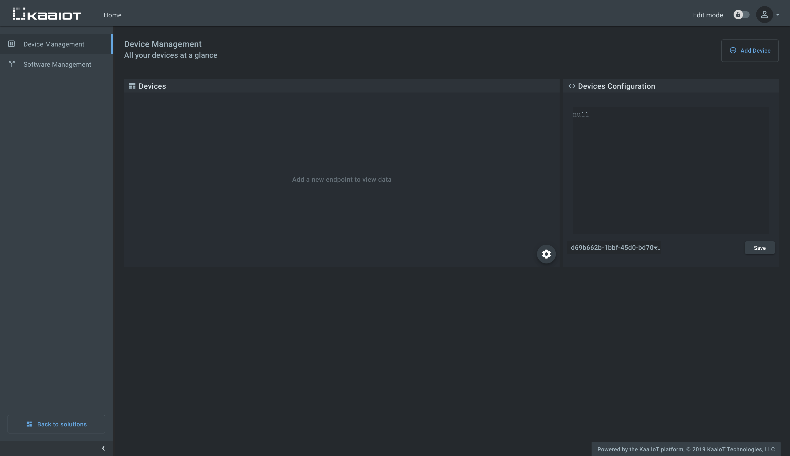
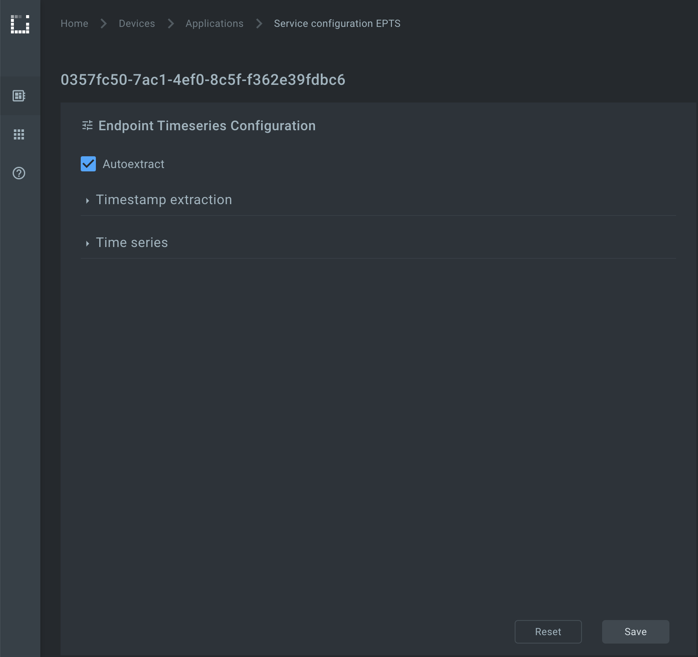
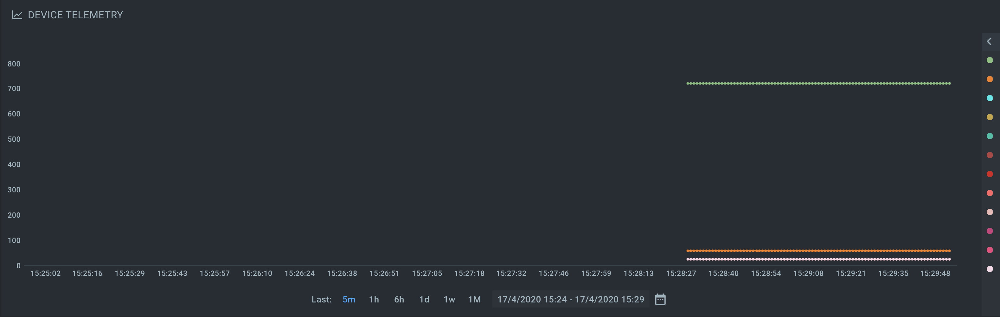




* TOC
{:toc}

In this tutorial, we will look at how to connect an [ESP8266][ESP8266] board to the Kaa platform using the default, MQTT-based protocol.
You will learn how to create a digital twin of your device, connect it, submit some telemetry, and view it in the Kaa web interface.


## Overview

We will simulate a weather station scenario.
Our ESP8266 will represent an [endpoint][endpoint] in the Kaa platform and report temperature, humidity, and CO2 level.
Also, we will interact with the Kaa [Web Dashboard][Web Dashboard] to create a digital twin of the ESP8266 and view telemetry data.

Note that for simplicity the reported values are simulated, but you are welcome to extend the functionality by connecting sensors to your board and reporting real data.


## Prerequisites

 1. You have installed the [Arduino IDE][arduino-ide].
 2. You have an ESP8266 board.
 3. You have a [Kaa Cloud account][Kaa cloud free trial].


## Playbook


### Connect your device

**1**. Go to the "Device management" dashboard in your [Kaa Cloud account][Kaa cloud].



As you can see there are no connected devices yet.
Let's connect one.

**2**. Register a device digital twin by clicking the "Add Device" button.
It's called an "[endpoint][endpoint]" in Kaa.

**3**. Choose the [application version][application] from the drop-down menu.
You can bump application versions in the application administration page as your devices evolve.
Enter the desired [endpoint token][endpoint token].

Tokens are used for device identification in communication with the Kaa platform.
They are non-empty strings that do not contain the following reserved characters: `+`, `#`, `/`, and `.`.
A token will be autogenerated if you leave this field blank.

Enter endpoint metadata and click the `Save` button.
Metadata is simply key-value attributes that provide certain information about a device, e.g. its location, owner, customer, model, etc.


**4**. Copy and save the endpoint token in some file because **you won't be able to see it again in the future**.
We will use the token in a bit to connect the simulator.


**5**. Open the [esp8266.ino][code-url] file with the Arduino IDE and fill out the connection parameters:

```
const char* ssid = "";          // your WiFi network SSID
const char* password = "";      // your WiFi network password
const String TOKEN = "";        // the endpoint token from the previous step
const String APP_VERSION = "";  // the application version name you are working with
```

**6**. Upload the `esp8266.ino` file to your ESP8266.

Now the device can send telemetry data with the temperature, humidity, and CO2 values.
The data payload is a UTF-8 encoded JSON array as below.

```json
[
  {
    "temperature":23,
    "humidity":57,
    "co2":720
  }
]
```

See [Data Collection Protocol][2/DCP] RFC for more details on the payload format.


### Visualize data from the device

**1**. Edit the application configuration for the [Endpoint Time Series service (EPTS)][EPTS].
EPTS is a Kaa platform component that is responsible for transforming raw [data samples][data-sample] into well-structured time series.
It also stores the timeseries data and provides access API for other services, including the [Web Dashboard][Web Dashboard].


Enable the [time series auto-extraction][EPTS time series auto extraction] from data samples.



**2**. Go to the device details page of the recently created endpoint (by clicking on the corresponding row in the device table).
See the data from your ESP on the `DEVICE TELEMETRY` widget.



Congratulations, you have connected and visualized data from your ESP8266!


## Resources

* All tutorial resources are located on [GitHub][code-url].


## Next steps

- Join the discussion at our [community chat][Kaa user chat] and share feedback!
- Outfit your ESP8266 with sensors to collect real data.
- Now that you have some Kaa experience under your belt, check out the [Kaa IoT Cloud and Kaa 1.1 webinar][webinar Kaa IoT Cloud and Kaa 1.1] to implement something more complicated.
- [Data Analytics and Notifications webinar][webinar Data Analytics and Notifications] is also based on an ESP8266-powered smart socket.
- [Device management][identity] - find out more about the device management feature.
- Review the [telemetry data collection tutorial][data collection tutorial] that is based on a Python simulator.


[code-url]:                 https://github.com/kaaproject/kaa/tree/master/doc/Tutorials/connect-esp8266-to-kaa-platform/attach/code
[arduino-ide]:              https://www.arduino.cc/en/Main/Software
[ESP8266]:                  https://en.wikipedia.org/wiki/ESP8266
[Kaa cloud free trial]:     https://www.kaaproject.org/free-trial
