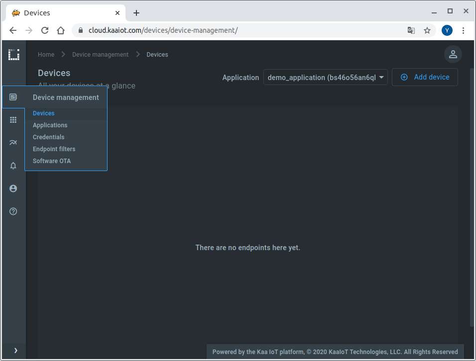
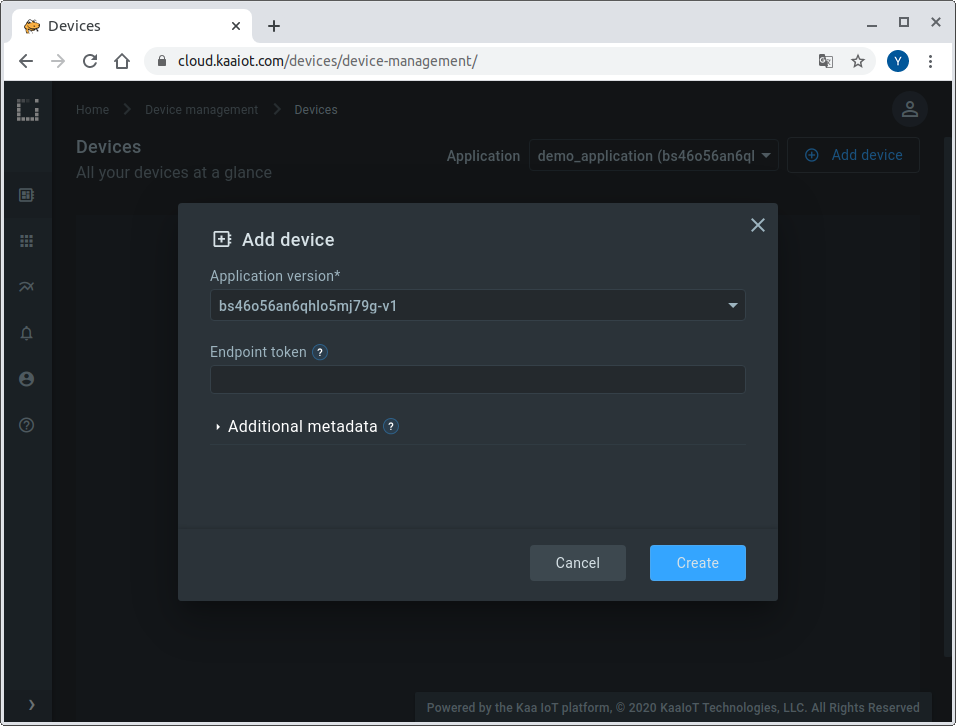
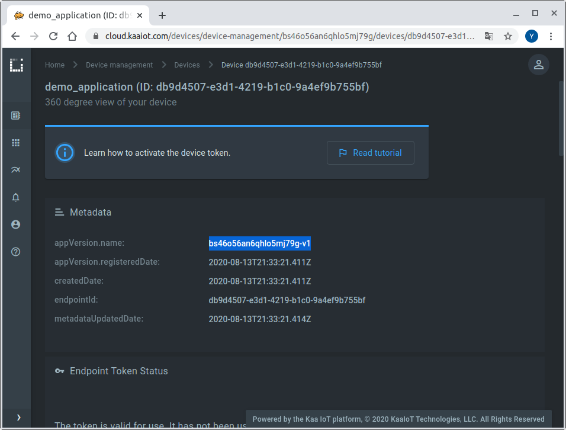
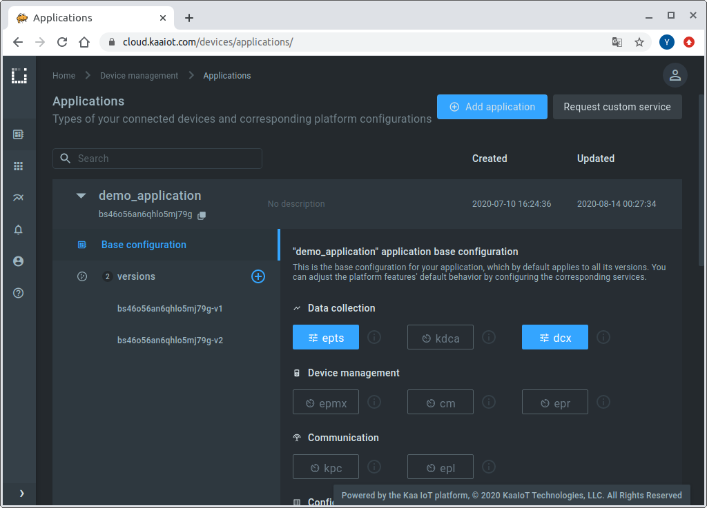




* TOC
{:toc}

In this tutorial, we will look at how to connect a [Raspberry Pi][Raspberry Pi] to the Kaa platform.
You will learn how to create a digital twin of your device, connect it, submit some telemetry, and view it in the Kaa web interface.


## Overview

Our Raspberry Pi will represent an [endpoint][endpoint] in the Kaa platform and report temperature, humidity, and air pressure.
Also, we will interact with the Kaa [Web Dashboard][WD] to create a digital twin of the Raspberry Pi and view telemetry data.


## Prerequisites

1. You have a Raspberry Pi board.
2. You have a [Kaa Cloud account][Kaa cloud registration].
3. You have a [BME280][BME280] sensor (optional).


## Playbook


### Connect your device

Go to the "Device Management" dashboard in your account



and add a new device specifying a token that we will use later to identify a Raspberry Pi in the Kaa Cloud.


 
Also, go to the added device page from the "Device Management" dashboard and copy the application version name. 



We will need both the application version and token to connect a Raspberry Pi to the Kaa Cloud.

Now that we have a device’s digital twin created in Kaa together with its token and application version, let's work with the Raspberry Pi.


Connect the BME280 sensor to the Raspberry Pi by referring to the following table:  

|MODULE PCB|DESC   |GPIO HEADER PINS|
|----------|-------|----------------|
|VCC       |3.3V   |P1-01           |
|GND       |Ground |P1-06           |
|SCL       |I2C SCL|P1-05           |
|SDA       |I2C SDA|P1-03           |

Here’s the diagram of a breadboard setup.  


If you don't have the BME280 sensor, then skip the above step and move on.

[Connect the Raspberry Pi to the WiFi.](https://raspberrypihq.com/how-to-connect-your-raspberry-pi-to-wifi/)

Once the Raspberry Pi is connected to the WiFi, install the BME Python library:

```
$ pip install bme280
```


### Sending Data Over MQTT

Install Eclipse Paho MQTT Python client library:

```
$ pip install paho-mqtt
```

Create somewhere on the Raspberry Pi filesystem a file called "client.py" and open it.

If you have BME280 use this Python code:

```python

```

If **not** use this Python code:

```python

```

Copy the corresponding code then paste it into the "client.py" file.  
Edit endpoint token and application version in your newly created "client.py" file.

```
ENDPOINT_TOKEN = "your_token"             # Paste endpoint token
APPLICATION_VERSION = "your_app_version"  # Paste application version
```

Save and close the "client.py" file and run it:

```
$ python client.py
```


### Visualize data from the device

**1**. Edit the application configuration for the [Endpoint Time Series service (EPTS)][EPTS].
EPTS is a Kaa platform component that is responsible for transforming raw [data samples][data-sample] into well-structured time series.
It also stores the time series data and provides access API for other services, including the [Web Dashboard][WD].



Enable the [time series auto-extraction][EPTS time series auto extraction] from data samples.


With this function enabled, Kaa will automatically create a time series for each numeric field it encounters at the root of data samples your endpoints submit.
You will then be able to view these time series in Kaa UI, no extra configuration is required.

**2**. Go to the device details page of the recently created endpoint (by clicking on the corresponding row in the device table on the "Devices" dashboard).
See the data from your Raspberry Pi on the "Device telemetry" widget.


Congratulations, you have connected and visualized data from your Raspberry Pi!


## Resources

* All tutorial resources are located on [GitHub][code-url].


## Next steps

- Complete the [**Getting Started tutorials cycle**][getting started tutorials] with short tutorials about the main Kaa features.
- Join the discussion at our [community chat][Kaa user chat] and share feedback!
- Check out the webinar where we explained how to connect a Raspberry Pi with BME280 and Senseair S08 CO2 sensors to the Kaa Cloud in more details: [Kaa IoT Cloud and Kaa 1.1 webinar][webinar Kaa IoT Cloud and Kaa 1.1]


[code-url]:                 https://github.com/kaaproject/kaa/tree/master/doc/Tutorials/connect-raspberry-to-kaa-platform/attach/code
[Raspberry Pi]:             https://en.wikipedia.org/wiki/Raspberry_Pi
[BME280]:                   https://www.bosch-sensortec.com/products/environmental-sensors/humidity-sensors-bme280/
