


* TOC
{:toc}

In this tutorial, we will look at how to connect an [STM32][STM32] board to the Kaa platform using [Kaa IoT Platform Arduino library][Kaa IoT Platform Arduino library]. 
You will learn how to create a digital twin of your device, connect it, send telemetry and receive commands.


## Overview

Our STM32 board will represent an endpoint in the Kaa platform, report its built-in LED state and allow to control it from the Kaa UI.


## Prerequisites

1. You have installed the [Arduino IDE][arduino-ide].
2. You have a [STM32 Nucleo board](https://www.st.com/en/evaluation-tools/stm32-nucleo-boards.html) and [Ai-Thinker ESP8266 ESP-01](http://wiki.ai-thinker.com/_media/esp8266/esp8266_series_modules_user_manual_v1.1.pdf) module with [Ai-Thinker AT firmware](https://github.com/Edragon/esp_firmware/tree/master/Firmware/AT-other/AI-THINKER/At_firmware_bin1.54).
3. You have a [Kaa Cloud account][Kaa cloud registration].


## Playbook


### Connect your device

**1**. Go to the "Device management" dashboard in your [Kaa Cloud account][Kaa cloud].


**2**. Choose the [application version][application] from the drop-down menu and register a device digital twin by clicking the "Add Device" button.
It's called an "[endpoint][endpoint]" in Kaa.

**3**. Enter the desired [endpoint token][endpoint-token] and click "Create".
Tokens are used for device identification in communication with the Kaa platform.
They are non-empty strings that do not contain the following reserved characters: `+`, `#`, `/`, and `.`.
A token will be autogenerated if you leave this field blank.

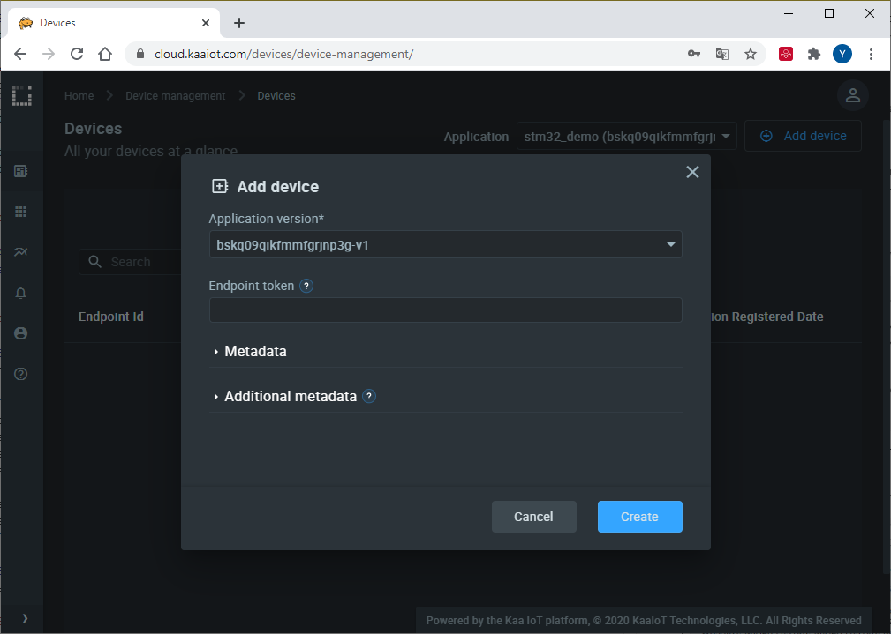

**4**. Copy and save the endpoint token in some file because **you won't be able to see it again in the future**.
We will use the token in a bit to connect the simulator.

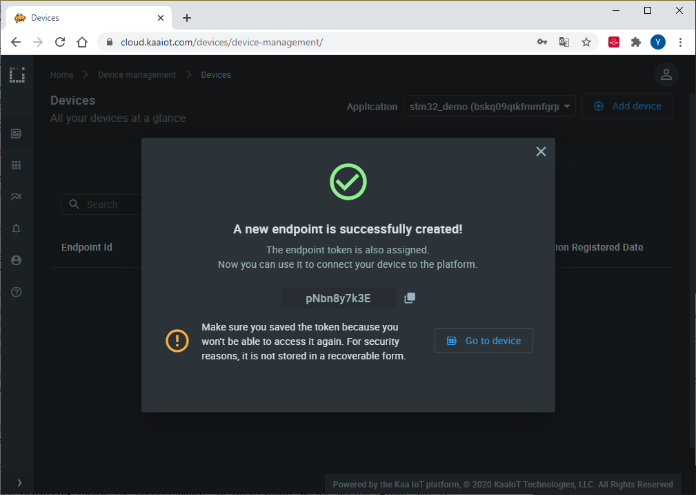

**5**. Open the below sketch in the Arduino IDE and fill out the connection parameters:

```c++

```

**6**. Install STM32duino Arduino_Core_STM32.
You may do it via Arduino Boards manager (search for “STM32 Cores”)

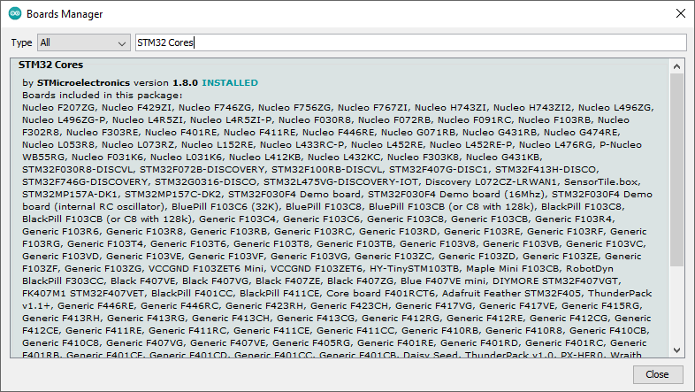

After installing choose the correct board.
In this example we use Nucleo L476RG, but it should work with other boards too.


Also install [Kaa IoT Platform Arduino library](https://github.com/kaaproject/kaa-arduino-sdk), [TinyGSM](https://github.com/vshymanskyy/TinyGSM) and [ArduinoJSON](https://github.com/bblanchon/ArduinoJson) libraries using Arduino library manager.

**7**. Connect ESP8266 to STM32 as shown in the below diagram.

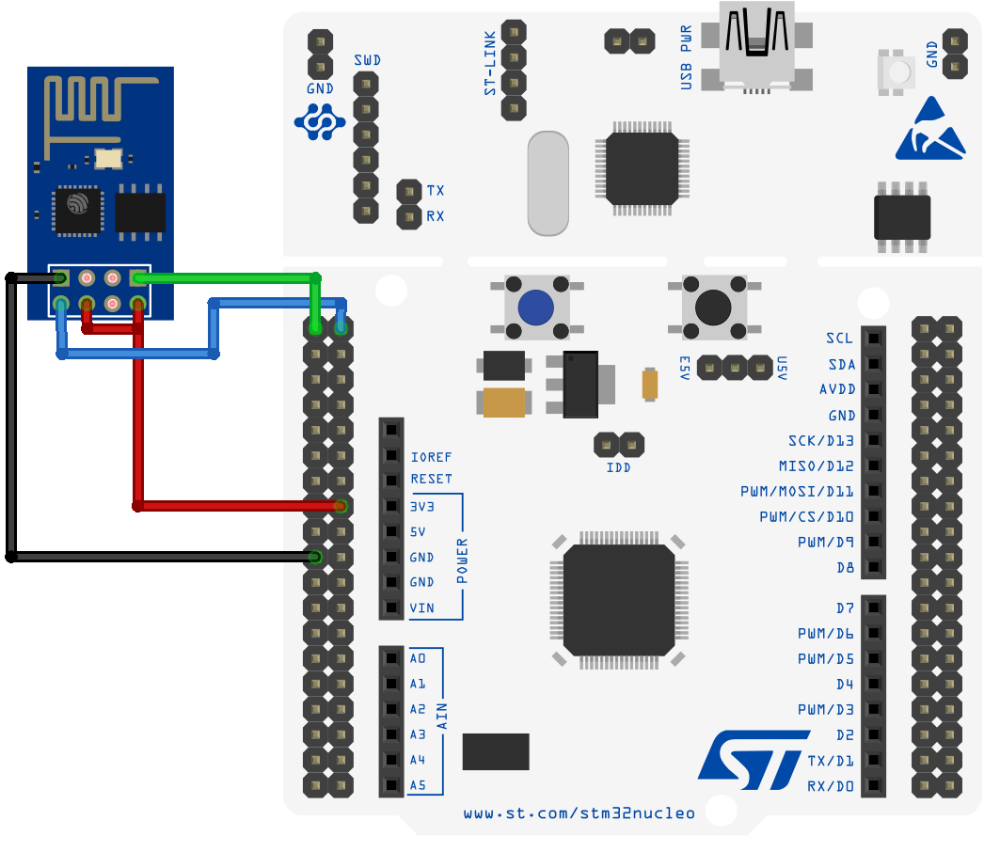

The resulting set-up must look like that.

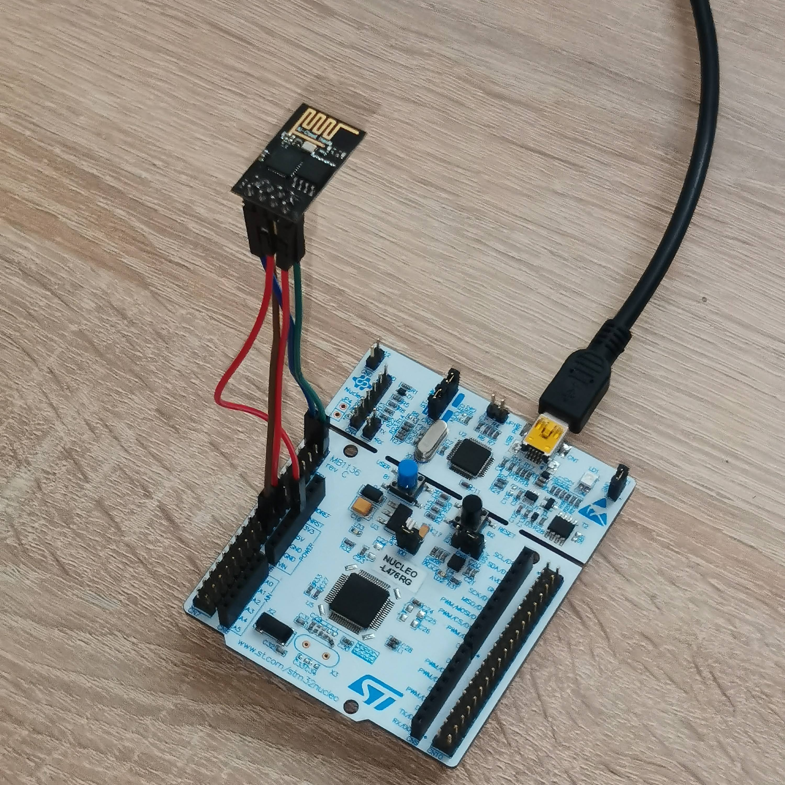

**8**. Upload the sketch file to your STM32.

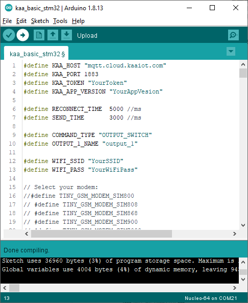

After uploading open serial monitor.
If everything is ok, you will see the following output:

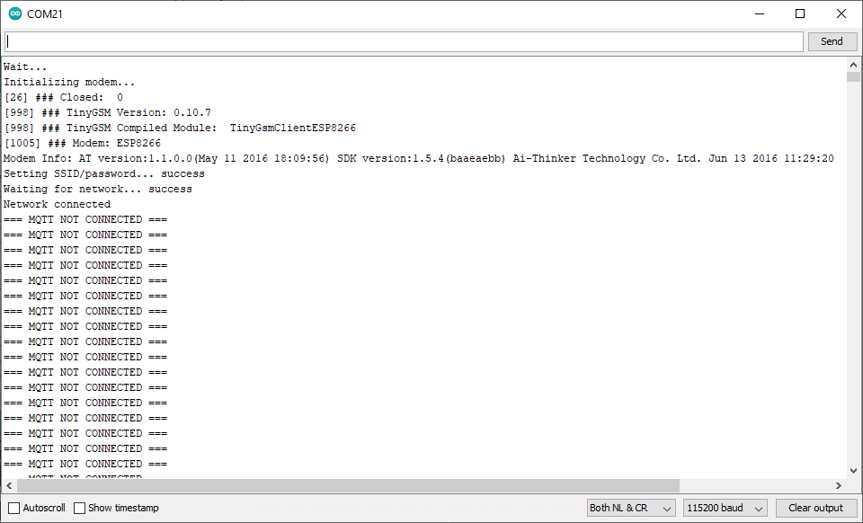

After a few seconds device connects to Kaa Cloud and starts sending data.
 
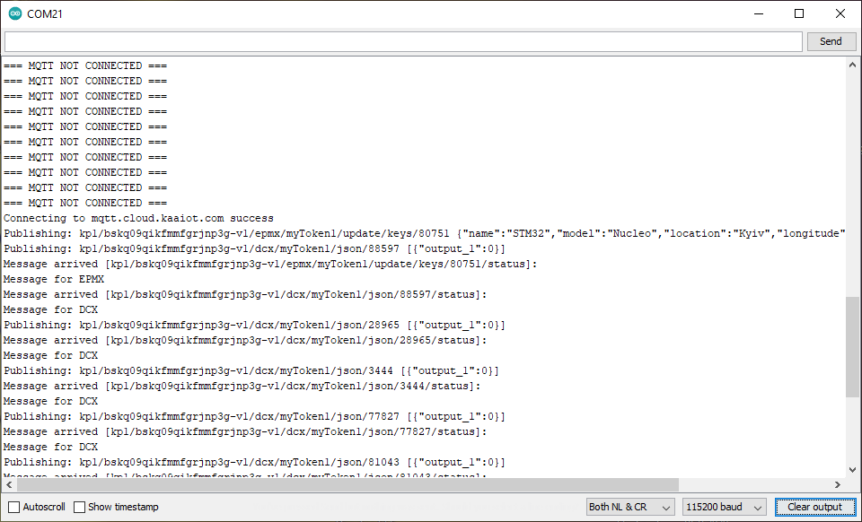


### Visualize data from the device

**1**. Now we want to transform raw telemetry into time series to be able to visualize it. 
For that navigate to the "Device management" -> "Applications" and edit the application configuration for the [Endpoint Time Series service (EPTS)][EPTS].
EPTS is a Kaa platform component that is responsible for transforming raw [data samples][data-sample] from endpoints into well-structured time series.
It also stores the time series data and provides access API for other services, including the [Web Dashboard][Web Dashboard].

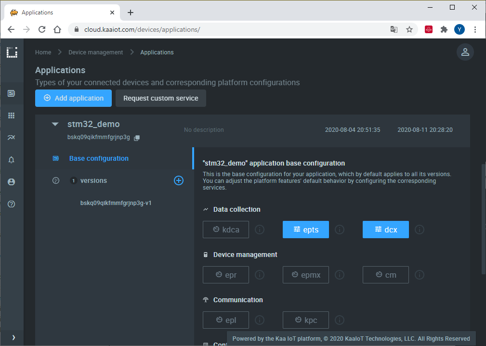

Enable the [time series auto-extraction][EPTS time series auto extraction] from data samples.

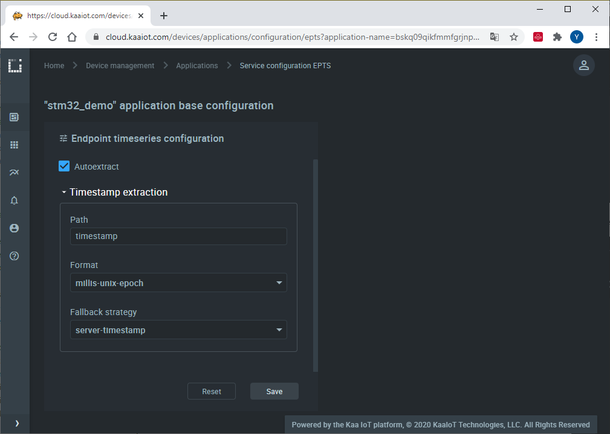

With this function enabled, Kaa will automatically create a time series for each numeric field it encounters at the root of data samples your endpoints submits.
You will then be able to view these time series in Kaa UI, no extra configuration is required.

**2**. Go to the "Device management" page and open device details of the recently created endpoint (by clicking on the corresponding row in the device table).
Here you can see all the device telemetry and metadata. 
Our board is sending one value `output_1` that represents a state of an onboard LED.
The platform prefixed its time series name with the `auto~` meaning it was auto-extracted.

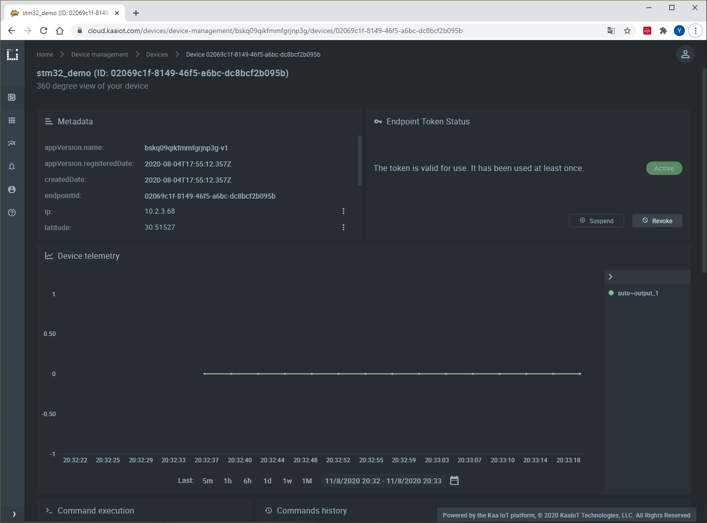

You can control the LED directly from this page.
Scroll below and find the **Command execution** widget. 
Fill **Command type** field with `OUTPUT_SWITCH` and **Command body in JSON** field with `{ "number": "1", "state": "1" }` to turn on the LED.

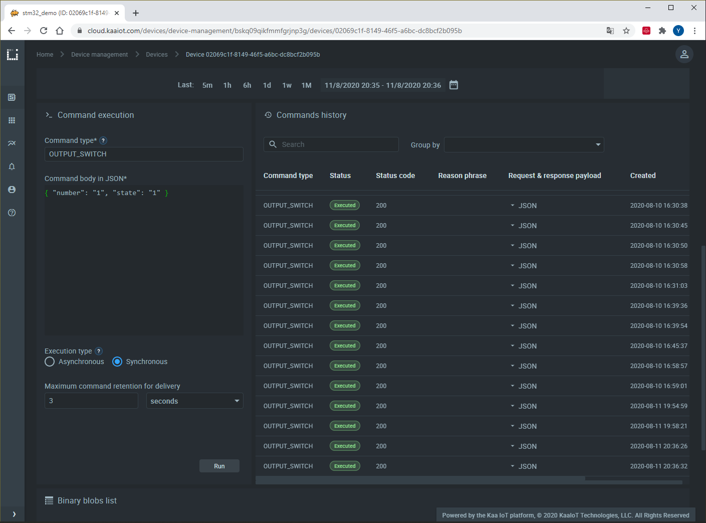

`"number"` is an output number and `"state"` is LED state. 
We have one output pin with LED connected to it so we named it **first** output or output **number 1** in device firmware.
If we have more outputs we may refer to them in the same manner. 
To turn off the LED change `"state"` to zero: `{ "number": "1", "state": "0" }`.

Further, you may configure your dashboard with a [command execution widget]({{wd_url}}Widgets/#command-execution) to do this in one click.


## Resources

* All tutorial resources are located on [GitHub][code-url].


## Next steps

- Join the discussion at our [community chat][Kaa user chat] and share feedback!
- Outfit your STM32 with sensors to collect more data.
- Complete the [Getting Started tutorials cycle][getting started tutorials].


[code-url]: https://github.com/kaaproject/kaa/tree/master/doc/Tutorials/device-integration/hardware-guides/connect-stm32-to-kaa-platform/attach/code
[Kaa IoT Platform Arduino library]: https://github.com/kaaproject/kaa-arduino-sdk
[arduino-ide]: https://www.arduino.cc/en/Main/Software
[STM32]: https://en.wikipedia.org/wiki/STM32
[Web Dashboard]: https://docs.kaaiot.io/KAA/docs/current/Features/Visualization/WD/
